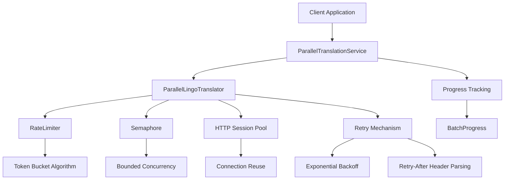
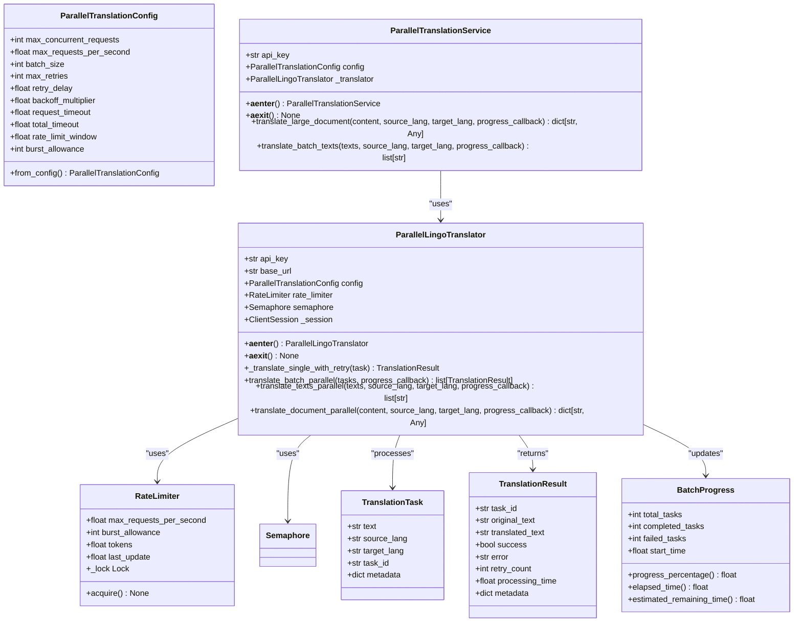
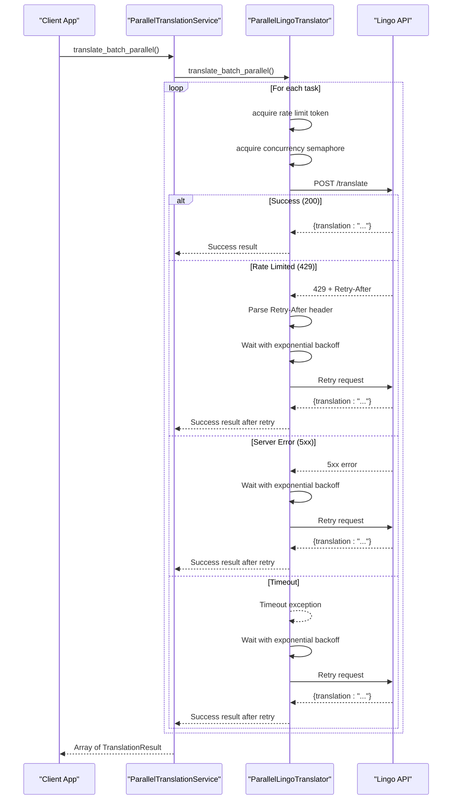
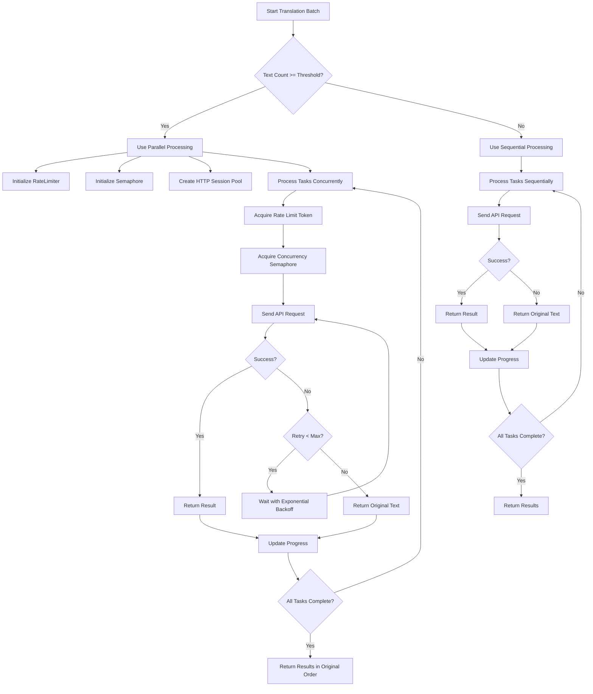

# Parallel Translation Processing

<cite>
**Referenced Files in This Document**  
- [parallel_translation_service.py](file://services/parallel_translation_service.py)
- [enhanced_translation_service.py](file://services/enhanced_translation_service.py)
- [parallel_translation_demo.py](file://examples/parallel_translation_demo.py)
- [settings.py](file://config/settings.py)
- [translation_service.py](file://services/translation_service.py)
</cite>

## Table of Contents
1. [Introduction](#introduction)
2. [Architecture Overview](#architecture-overview)
3. [Core Components](#core-components)
4. [Configuration Options](#configuration-options)
5. [Retry Mechanisms and Resilience](#retry-mechanisms-and-resilience)
6. [Performance Analysis](#performance-analysis)
7. [Use Cases](#use-cases)
8. [Parameter Tuning Guidance](#parameter-tuning-guidance)
9. [Conclusion](#conclusion)

## Introduction
The Parallel Translation Processing system is designed to maximize throughput for document translation workloads by leveraging concurrent processing. This document details the implementation of the ParallelTranslationService, which enables concurrent translation requests using asyncio and connection pooling. The system is optimized for both large document processing and high-volume translation workloads, providing significant performance improvements over sequential processing. The architecture combines bounded concurrency control with rate limiting to ensure efficient resource utilization while respecting API constraints.

**Section sources**
- [parallel_translation_service.py](file://services/parallel_translation_service.py#L1-L50)

## Architecture Overview

**Diagram sources**
- [parallel_translation_service.py](file://services/parallel_translation_service.py#L1-L708)

**Section sources**
- [parallel_translation_service.py](file://services/parallel_translation_service.py#L1-L708)

## Core Components

The parallel translation system consists of several key components that work together to enable high-throughput translation processing. The ParallelTranslationService serves as the high-level interface, orchestrating the translation process and managing the lifecycle of the underlying translator. The ParallelLingoTranslator implements the core translation logic with support for parallel execution, while the RateLimiter ensures compliance with API rate limits. The system uses asyncio for concurrency, allowing multiple translation requests to be processed simultaneously without blocking.

The implementation preserves the order of translation results, ensuring that the output corresponds to the input sequence. This is achieved through the use of task metadata that tracks the original position of each text segment. The system also provides comprehensive progress tracking through the BatchProgress class, which monitors completion rates and estimates remaining processing time.

**Section sources**
- [parallel_translation_service.py](file://services/parallel_translation_service.py#L150-L708)
- [enhanced_translation_service.py](file://services/enhanced_translation_service.py#L1-L242)

## Configuration Options

The parallel translation system offers several configurable parameters that control its behavior and performance characteristics. These options can be set either through environment variables or programmatically when initializing the service.

### Concurrency Settings
The system provides three key parameters for controlling concurrency:

- **max_concurrent_requests**: Controls the maximum number of simultaneous translation requests using an asyncio.Semaphore. Default: 10
- **max_requests_per_second**: Enforces a rate limit using a token-bucket algorithm. Default: 5.0
- **batch_size**: Determines the number of texts processed in each batch. Default: 50

These parameters work together to balance throughput with API rate limit compliance. The max_concurrent_requests parameter limits the number of simultaneous connections, while max_requests_per_second smooths request bursts over time.

### Retry Settings
The system includes configurable retry behavior for handling transient failures:

- **max_retries**: Maximum number of retry attempts for failed requests. Default: 3
- **retry_delay**: Initial delay between retries (in seconds). Default: 1.0
- **backoff_multiplier**: Factor by which the retry delay increases after each attempt. Default: 2.0

### Timeout Settings
Two timeout parameters control request duration:

- **request_timeout**: Individual request timeout. Default: 30.0 seconds
- **total_timeout**: Overall operation timeout. Default: 300.0 seconds

**Diagram sources**
- [parallel_translation_service.py](file://services/parallel_translation_service.py#L100-L708)

**Section sources**
- [parallel_translation_service.py](file://services/parallel_translation_service.py#L100-L200)
- [settings.py](file://config/settings.py#L1-L549)

## Retry Mechanisms and Resilience

The parallel translation system implements robust retry mechanisms to handle transient failures and ensure reliable operation. The retry logic is implemented in the _translate_single_with_retry method of the ParallelLingoTranslator class, which handles various error conditions with appropriate recovery strategies.

When a translation request fails, the system automatically retries the request with exponential backoff. The initial retry delay is determined by the retry_delay configuration parameter, and each subsequent retry increases the delay by multiplying it with the backoff_multiplier. This approach prevents overwhelming the API server with repeated requests during periods of high load or temporary unavailability.

The system specifically handles rate limiting (HTTP 429 responses) by parsing the Retry-After header from the response. The _parse_retry_after method processes both numeric seconds and HTTP-date formatted values, ensuring compatibility with different server implementations. The calculated wait time is capped at MAX_RETRY_AFTER_SECONDS (60.0) to prevent pathologically long sleeps from unreasonable server responses.

For other HTTP errors, the system distinguishes between client errors (4xx) and server errors (5xx). Client errors, except for 429, are not retried as they typically indicate permanent issues with the request. Server errors and network-related exceptions trigger the retry mechanism, allowing the system to recover from temporary infrastructure problems.

**Diagram sources**
- [parallel_translation_service.py](file://services/parallel_translation_service.py#L350-L550)

**Section sources**
- [parallel_translation_service.py](file://services/parallel_translation_service.py#L300-L600)

## Performance Analysis

The parallel translation system provides significant performance improvements over sequential processing, particularly for large documents and high-volume workloads. The performance gains are achieved through concurrent execution of translation requests, which reduces the overall processing time by overlapping network I/O operations.

The system's performance characteristics can be analyzed through several metrics:

- **Requests per second (RPS)**: The actual throughput achieved, which depends on the max_requests_per_second configuration and API response times
- **Total processing time**: The end-to-end time to complete a batch of translations
- **Concurrency efficiency**: The ratio of actual throughput to theoretical maximum based on concurrency settings
- **Resource utilization**: CPU and memory usage during parallel processing

The EnhancedTranslationService class includes built-in performance tracking that collects metrics such as total requests, parallel vs sequential usage, and average request time. This allows for monitoring and optimization of the translation workflow.

For large documents, the performance improvement can be substantial. A document with hundreds of text blocks that might take several minutes to process sequentially can be completed in a fraction of the time using parallel processing. The exact improvement depends on the concurrency settings, API response times, and network conditions.

The system automatically selects between parallel and sequential processing based on the workload size. The _should_use_parallel_processing method in EnhancedTranslationService determines this by comparing the number of text blocks against a threshold calculated from the batch_size configuration. This ensures that the overhead of parallel processing is only incurred when it provides a meaningful benefit.

**Diagram sources**
- [enhanced_translation_service.py](file://services/enhanced_translation_service.py#L1-L242)
- [parallel_translation_service.py](file://services/parallel_translation_service.py#L1-L708)

**Section sources**
- [enhanced_translation_service.py](file://services/enhanced_translation_service.py#L1-L242)
- [parallel_translation_demo.py](file://examples/parallel_translation_demo.py#L1-L330)

## Use Cases

The parallel translation system is designed for several key use cases that benefit from high-throughput processing:

### Large Document Processing
For documents with hundreds or thousands of pages, the parallel system provides dramatic time savings. The system can process multiple pages simultaneously, reducing the end-to-end processing time from hours to minutes. This is particularly valuable for academic papers, technical manuals, and legal documents that require translation while preserving the original layout.

### High-Volume Translation Workloads
Applications that need to translate large volumes of text, such as content management systems or document processing pipelines, benefit from the system's ability to handle multiple translation requests concurrently. The rate limiting and connection pooling ensure efficient resource utilization while maintaining API compliance.

### Real-Time Translation Systems
The progress tracking capabilities make the system suitable for real-time applications where users need feedback on translation progress. The BatchProgress class provides detailed metrics that can be used to display progress bars and estimated completion times in user interfaces.

### Batch Processing Pipelines
The system integrates well with batch processing workflows, where large numbers of documents need to be translated automatically. The error handling and retry mechanisms ensure reliable operation even when processing thousands of documents.

## Parameter Tuning Guidance

Optimal performance requires tuning the concurrency parameters based on API rate limits and system resources. The following guidelines can help configure the system for different scenarios:

### API Rate Limit Considerations
When configuring max_requests_per_second, set it slightly below the API's documented rate limit to account for bursts and avoid being throttled. For example, if the API allows 10 requests per second, set max_requests_per_second to 8-9 to provide a safety margin.

The burst_allowance parameter should be set based on the API's burst capacity. Some APIs allow short bursts above the sustained rate limit. Setting burst_allowance to 2-3 enables the system to take advantage of this capability for improved throughput.

### System Resource Considerations
The max_concurrent_requests parameter should be tuned based on available system resources. Each concurrent request consumes memory and file descriptors. As a general guideline:

- For systems with limited resources: Set max_concurrent_requests to 5-10
- For systems with moderate resources: Set max_concurrent_requests to 10-20
- For systems with abundant resources: Set max_concurrent_requests up to 50

The batch_size parameter affects memory usage and processing efficiency. Larger batches reduce the overhead of batch management but increase memory consumption. A batch_size of 50-100 is typically optimal for most workloads.

### Network Conditions
In environments with high network latency, increasing the retry_delay and backoff_multiplier can improve success rates by allowing more time for requests to complete. Conversely, in low-latency environments, these values can be reduced to minimize wait times during retries.

### Monitoring and Optimization
The system should be monitored to identify bottlenecks and optimize configuration. Key metrics to monitor include:

- Request success rate
- Average response time
- Rate limit hits
- Retry frequency
- Memory and CPU usage

Based on these metrics, the configuration can be adjusted to balance throughput, reliability, and resource utilization.

**Section sources**
- [parallel_translation_service.py](file://services/parallel_translation_service.py#L100-L200)
- [settings.py](file://config/settings.py#L1-L549)
- [enhanced_translation_service.py](file://services/enhanced_translation_service.py#L1-L242)

## Conclusion
The Parallel Translation Processing system provides a robust and efficient solution for high-throughput document translation. By leveraging asyncio and connection pooling, the system maximizes throughput while maintaining order preservation and comprehensive error handling. The configurable concurrency parameters allow the system to be tuned for different API rate limits and system resources, making it suitable for a wide range of use cases from large document processing to high-volume translation workloads. The built-in retry mechanisms with exponential backoff ensure resilience in the face of transient failures, while the progress tracking capabilities enable real-time monitoring of translation operations. When properly configured, the system can achieve performance improvements of 5-10x over sequential processing, significantly reducing processing times for large-scale translation tasks.
