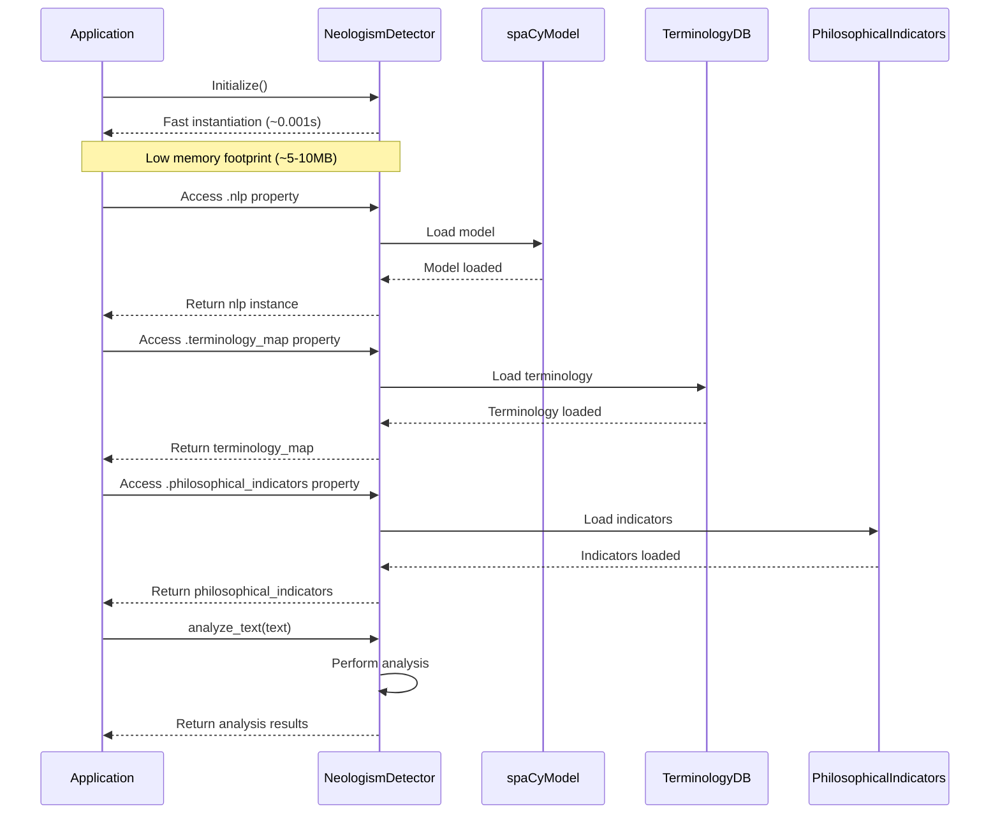

# Performance Optimization Examples

<cite>
**Referenced Files in This Document**  
- [performance_optimization_examples.py](file://examples/performance_optimization_examples.py)
- [lazy_loading_performance_example.py](file://examples/lazy_loading_performance_example.py)
- [parallel_translation_demo.py](file://examples/parallel_translation_demo.py)
- [cache_metrics_demo.py](file://examples/cache_metrics_demo.py)
- [parallel_translation_service.py](file://services/parallel_translation_service.py)
- [confidence_scorer.py](file://services/confidence_scorer.py)
- [enhanced_translation_service.py](file://services/enhanced_translation_service.py)
- [monitoring.py](file://dolphin_ocr/monitoring.py)
- [main_document_processor.py](file://services/main_document_processor.py)
</cite>

## Table of Contents
1. [Introduction](#introduction)
2. [Performance Optimization Framework](#performance-optimization-framework)
3. [Lazy Loading Implementation](#lazy-loading-implementation)
4. [Parallel Translation Processing](#parallel-translation-processing)
5. [Cache and Connection Metrics](#cache-and-connection-metrics)
6. [Thread-Safe Operations and Resource Management](#thread-safe-operations-and-resource-management)
7. [Bottleneck Identification and Monitoring](#bottleneck-identification-and-monitoring)
8. [Performance Trade-offs and Recommendations](#performance-trade-offs-and-recommendations)
9. [Conclusion](#conclusion)

## Introduction
This document presents comprehensive performance optimization techniques implemented in the philosophy-enhanced translation system. The analysis focuses on four key optimization examples: efficient document processing, lazy loading of heavy components, parallel translation requests, and cache metrics monitoring. These optimizations are designed to handle large documents (2,000+ pages) while maintaining the system's philosophical context analysis capabilities. The document provides detailed explanations of the implementation patterns, performance benefits, and best practices for scaling under high load conditions.

## Performance Optimization Framework

The performance optimization framework is implemented in `performance_optimization_examples.py` and provides a comprehensive set of tools for monitoring and optimizing document processing performance. The framework includes metrics collection, memory management, and streaming processing capabilities.

**Diagram sources**
- [performance_optimization_examples.py](file://examples/performance_optimization_examples.py#L150-L550)

**Section sources**
- [performance_optimization_examples.py](file://examples/performance_optimization_examples.py#L1-L868)

## Lazy Loading Implementation

The lazy loading implementation demonstrated in `lazy_loading_performance_example.py` significantly reduces the initial memory footprint and instantiation time of the NeologismDetector component. This optimization defers the loading of heavy resources (spaCy models, terminology databases, philosophical indicators) until they are actually needed.

**Diagram sources**
- [lazy_loading_performance_example.py](file://examples/lazy_loading_performance_example.py#L1-L333)

**Section sources**
- [lazy_loading_performance_example.py](file://examples/lazy_loading_performance_example.py#L1-L333)

## Parallel Translation Processing

The parallel translation processing system, demonstrated in `parallel_translation_demo.py` and implemented in `parallel_translation_service.py`, enables concurrent translation requests using async/await patterns and bounded concurrency. This approach significantly improves throughput for large document processing.

**Diagram sources**
- [parallel_translation_service.py](file://services/parallel_translation_service.py#L1-L709)
- [enhanced_translation_service.py](file://services/enhanced_translation_service.py#L1-L242)

**Section sources**
- [parallel_translation_demo.py](file://examples/parallel_translation_demo.py#L1-L330)
- [parallel_translation_service.py](file://services/parallel_translation_service.py#L1-L709)
- [enhanced_translation_service.py](file://services/enhanced_translation_service.py#L1-L242)

## Cache and Connection Metrics

The cache and connection metrics system, demonstrated in `cache_metrics_demo.py`, provides comprehensive monitoring of caching strategies and connection usage. This system enables optimization of resource utilization and identification of performance bottlenecks.

**Diagram sources**
- [cache_metrics_demo.py](file://examples/cache_metrics_demo.py#L1-L195)
- [confidence_scorer.py](file://services/confidence_scorer.py#L1-L498)
- [monitoring.py](file://dolphin_ocr/monitoring.py#L1-L122)

**Section sources**
- [cache_metrics_demo.py](file://examples/cache_metrics_demo.py#L1-L195)
- [confidence_scorer.py](file://services/confidence_scorer.py#L1-L498)
- [monitoring.py](file://dolphin_ocr/monitoring.py#L1-L122)

## Thread-Safe Operations and Resource Management

The system implements thread-safe operations through the use of locks and context managers, ensuring safe concurrent access to shared resources. The MetricsCollector class uses threading.Lock to protect counters, while connection tracking is implemented through context managers that automatically manage resource acquisition and release.

**Diagram sources**
- [performance_optimization_examples.py](file://examples/performance_optimization_examples.py#L50-L150)
- [cache_metrics_demo.py](file://examples/cache_metrics_demo.py#L1-L195)

**Section sources**
- [performance_optimization_examples.py](file://examples/performance_optimization_examples.py#L50-L150)
- [cache_metrics_demo.py](file://examples/cache_metrics_demo.py#L1-L195)

## Bottleneck Identification and Monitoring

The system includes comprehensive monitoring capabilities for identifying performance bottlenecks. The MonitoringService class tracks operation metrics, error rates, and latency percentiles, providing insights into system performance and potential bottlenecks.

**Diagram sources**
- [monitoring.py](file://dolphin_ocr/monitoring.py#L1-L122)
- [main_document_processor.py](file://services/main_document_processor.py#L1-L323)

**Section sources**
- [monitoring.py](file://dolphin_ocr/monitoring.py#L1-L122)
- [main_document_processor.py](file://services/main_document_processor.py#L1-L323)

## Performance Trade-offs and Recommendations

The performance optimization examples demonstrate several important trade-offs and provide recommendations for optimizing system performance under various conditions.

### Performance Trade-offs

1. **Memory vs. Speed**: The lazy loading approach trades initial processing speed (when resources are first accessed) for significantly reduced memory usage and faster application startup times.

2. **Concurrency vs. Resource Usage**: Parallel processing improves throughput but increases resource usage (CPU, network connections). The system uses bounded concurrency to balance these factors.

3. **Caching vs. Freshness**: Aggressive caching improves performance but may serve stale data. The system implements periodic counter resets to prevent unbounded growth while maintaining useful metrics.

4. **Batch Size vs. Memory**: Larger batch sizes improve processing efficiency but increase memory usage. The system uses configurable chunk sizes to balance these factors.

### Scaling Recommendations

1. **High Load Scaling**: For high load scenarios, increase the `max_concurrent_requests` and `max_requests_per_second` parameters in `ParallelTranslationConfig`, but monitor system resources to avoid overloading.

2. **Memory-Constrained Environments**: In memory-constrained environments, reduce the `chunk_size` in `LargeDocumentProcessor` and enable memory management to trigger garbage collection when memory usage exceeds limits.

3. **Latency-Sensitive Applications**: For latency-sensitive applications, reduce the `batch_size` to process smaller chunks more frequently, providing more frequent progress updates.

4. **Throughput-Optimized Processing**: For maximum throughput, increase the `chunk_size` and `max_concurrent_pages` parameters, but ensure sufficient memory is available.

5. **Monitoring and Alerting**: Implement regular monitoring of cache hit rates, active connections, and error rates to identify performance degradation before it impacts users.

**Section sources**
- [performance_optimization_examples.py](file://examples/performance_optimization_examples.py#L1-L868)
- [parallel_translation_service.py](file://services/parallel_translation_service.py#L1-L709)
- [monitoring.py](file://dolphin_ocr/monitoring.py#L1-L122)

## Conclusion

The performance optimization examples demonstrate a comprehensive approach to improving the efficiency and scalability of the philosophy-enhanced translation system. Key optimizations include lazy loading to reduce memory footprint, parallel processing to improve throughput, and comprehensive monitoring to identify and address performance bottlenecks. The system implements thread-safe operations and resource management to ensure reliability under concurrent usage. These optimizations enable the system to handle large documents (2,000+ pages) efficiently while maintaining the complex philosophical context analysis capabilities. The modular design allows for easy configuration and tuning based on specific performance requirements and resource constraints.
