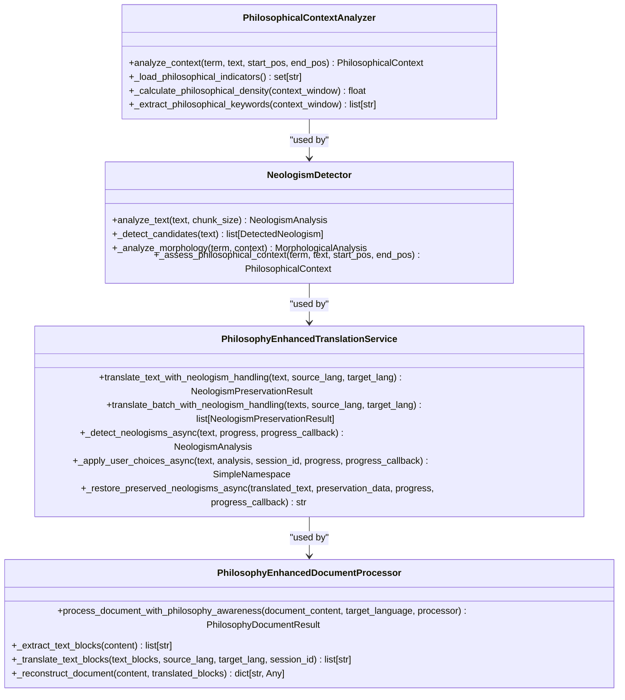
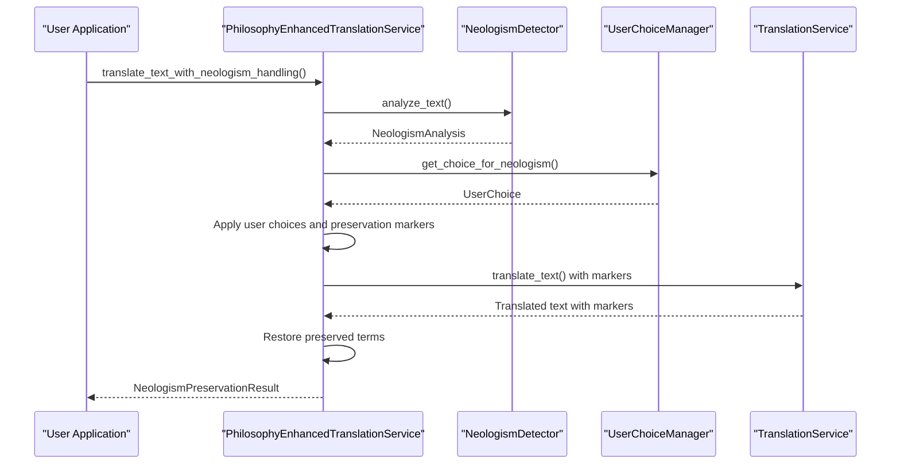
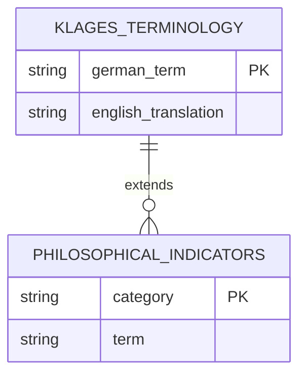
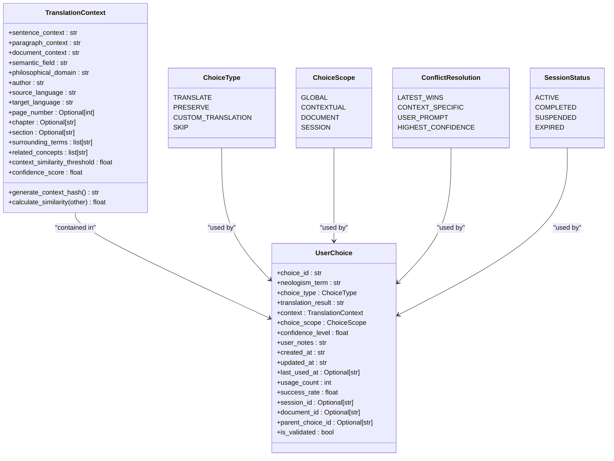
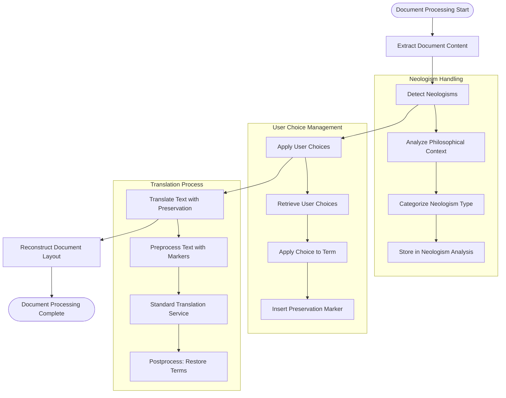
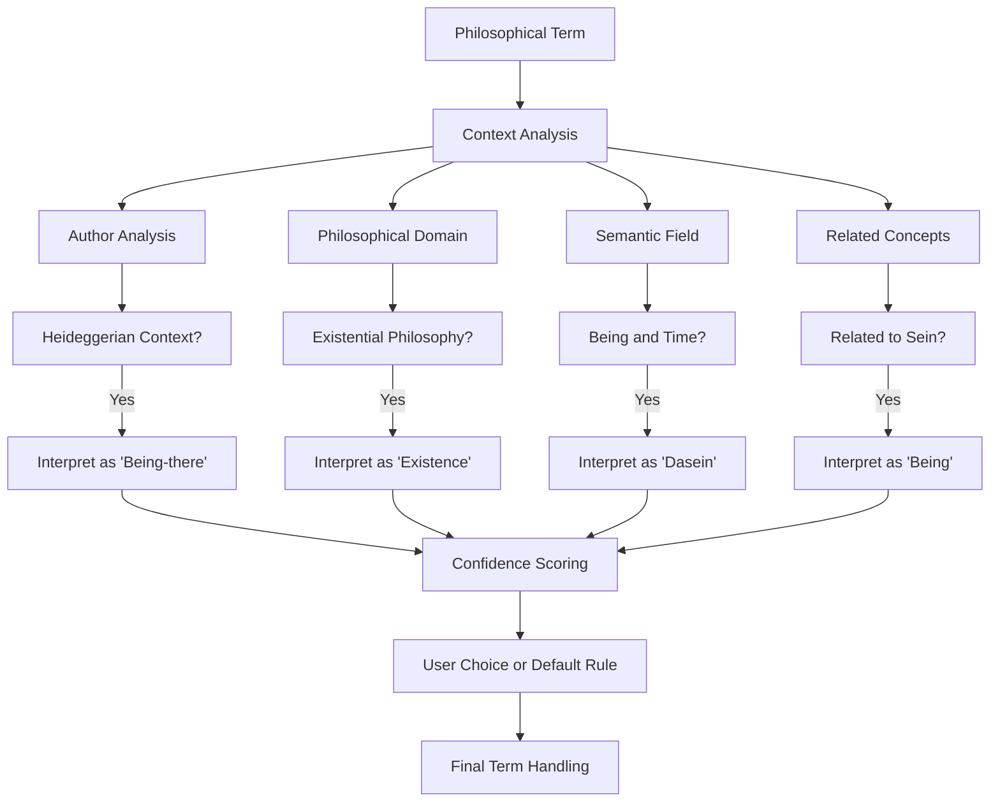
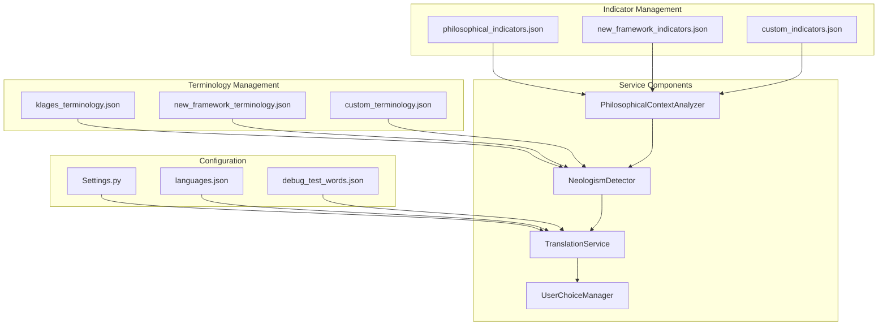
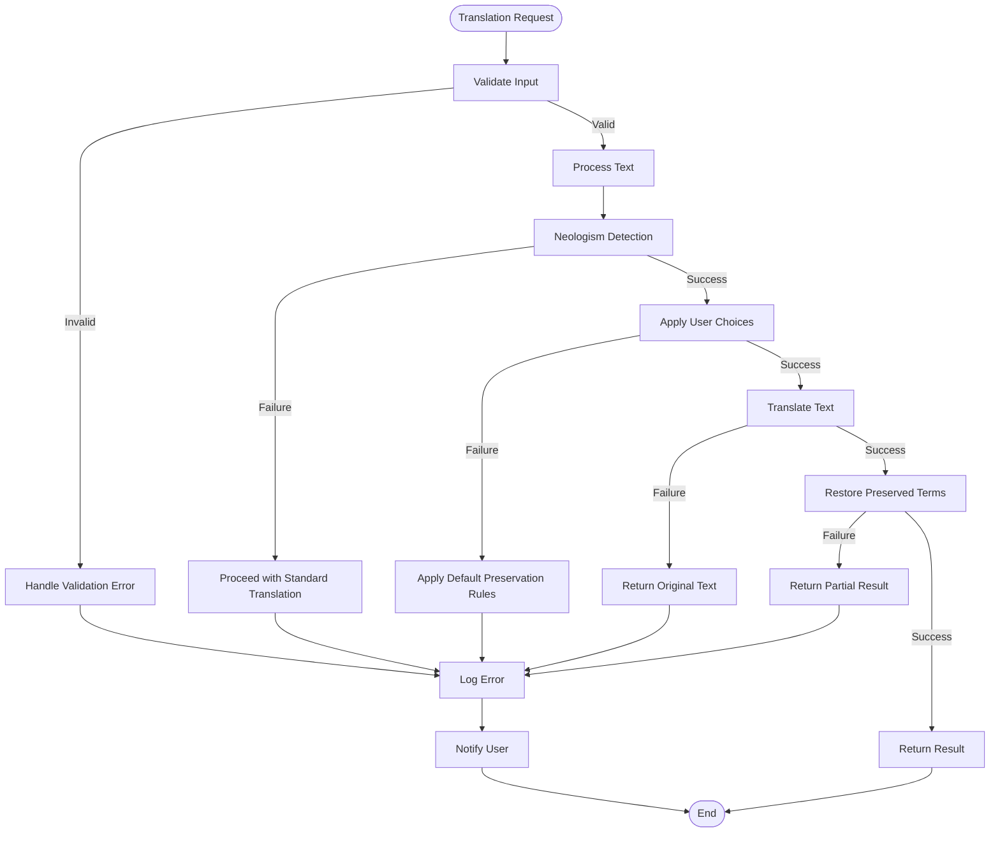

# Philosophy-Enhanced Usage Examples

<cite>
**Referenced Files in This Document**  
- [philosophy_enhanced_usage_examples.py](file://examples/philosophy_enhanced_usage_examples.py)
- [philosophy_enhanced_translation_service.py](file://services/philosophy_enhanced_translation_service.py)
- [philosophical_context_analyzer.py](file://services/philosophical_context_analyzer.py)
- [philosophy_enhanced_document_processor.py](file://services/philosophy_enhanced_document_processor.py)
- [neologism_detector.py](file://services/neologism_detector.py)
- [klages_terminology.json](file://config/klages_terminology.json)
- [philosophical_indicators.json](file://config/philosophical_indicators.json)
- [user_choice_models.py](file://models/user_choice_models.py)
</cite>

## Table of Contents
1. [Introduction](#introduction)
2. [Core Components](#core-components)
3. [Philosophy-Enhanced Translation Workflow](#philosophy-enhanced-translation-workflow)
4. [Terminology Configuration and Management](#terminology-configuration-and-management)
5. [User Choice Integration](#user-choice-integration)
6. [Document Processing with Philosophical Awareness](#document-processing-with-philosophical-awareness)
7. [Handling Ambiguous Philosophical Terms](#handling-ambiguous-philical-terms)
8. [System Configuration and Extension](#system-configuration-and-extension)
9. [Performance and Error Handling](#performance-and-error-handling)
10. [Conclusion](#conclusion)

## Introduction

This document provides comprehensive examples and explanations for using the philosophy-enhanced translation system. The system integrates philosophical context analysis into translation workflows, enabling accurate handling of neologisms and domain-specific terminology in philosophical texts. By combining linguistic analysis with user choice management, the system preserves philosophical nuance while maintaining readability in translated texts.

The philosophy-enhanced system is particularly valuable for translating works by philosophers like Ludwig Klages, Martin Heidegger, and other thinkers who employ specialized terminology and conceptual frameworks. The system detects philosophical terms, analyzes their context, and allows users to specify how these terms should be handled during translation.

**Section sources**
- [philosophy_enhanced_usage_examples.py](file://examples/philosophy_enhanced_usage_examples.py#L1-L50)

## Core Components

The philosophy-enhanced translation system consists of several interconnected components that work together to provide sophisticated translation capabilities for philosophical texts.

The **PhilosophicalContextAnalyzer** identifies philosophical terms and analyzes their semantic context within a text. It uses a combination of lexical analysis and domain-specific knowledge to detect philosophical indicators and determine the appropriate handling for specialized terminology.

The **PhilosophyEnhancedTranslationService** extends the standard translation pipeline by integrating neologism detection and user choice management. It processes text in chunks, detects philosophical terms, applies user preferences, and ensures these terms are preserved or translated according to specified rules.

The **PhilosophyEnhancedDocumentProcessor** handles complete documents, preserving layout and formatting while applying philosophy-aware translation to the content. It coordinates the extraction, translation, and reconstruction of documents with attention to both textual and structural elements.

**Diagram sources**
- [philosophical_context_analyzer.py](file://services/philosophical_context_analyzer.py#L1-L50)
- [philosophy_enhanced_translation_service.py](file://services/philosophy_enhanced_translation_service.py#L1-L100)
- [philosophy_enhanced_document_processor.py](file://services/philosophy_enhanced_document_processor.py#L1-L100)
- [neologism_detector.py](file://services/neologism_detector.py#L1-L50)

**Section sources**
- [philosophy_enhanced_translation_service.py](file://services/philosophy_enhanced_translation_service.py#L1-L200)
- [philosophical_context_analyzer.py](file://services/philosophical_context_analyzer.py#L1-L200)
- [philosophy_enhanced_document_processor.py](file://services/philosophy_enhanced_document_processor.py#L1-L200)

## Philosophy-Enhanced Translation Workflow

The philosophy-enhanced translation workflow follows a multi-stage process that integrates context analysis, user preferences, and standard translation services.

The workflow begins with text preprocessing, where the input text is analyzed for potential neologisms and philosophical terms. The **NeologismDetector** scans the text, identifying terms that may require special handling based on their morphological structure and contextual usage.

Next, the system applies user choices to the detected terms. The **UserChoiceManager** retrieves any previously specified preferences for how particular terms should be handled (preserved, translated, or replaced with custom translations). If no user choice exists, the system applies default preservation rules for philosophical terms.

The modified text, with preservation markers for special terms, is then passed to the standard translation service. These markers ensure that philosophical terms are not altered during translation. After translation, the system restores the original terms or their custom translations, maintaining philosophical accuracy in the final output.

**Diagram sources**
- [philosophy_enhanced_translation_service.py](file://services/philosophy_enhanced_translation_service.py#L200-L500)
- [neologism_detector.py](file://services/neologism_detector.py#L100-L200)
- [user_choice_models.py](file://models/user_choice_models.py#L1-L50)

**Section sources**
- [philosophy_enhanced_translation_service.py](file://services/philosophy_enhanced_translation_service.py#L100-L400)
- [neologism_detector.py](file://services/neologism_detector.py#L50-L150)

## Terminology Configuration and Management

The system uses two key configuration files to manage philosophical terminology: **klages_terminology.json** and **philosophical_indicators.json**.

The **klages_terminology.json** file contains mappings for specific philosophical terms, particularly those used by Ludwig Klages and related thinkers. Each entry maps a German philosophical term to its preferred English translation, ensuring consistency across translations. For example, "Geist" maps to "Spirit", "Seele" to "Soul", and "Dasein" to "Being-there".

The **philosophical_indicators.json** file defines categories of philosophical terms that help the system identify when a text requires special handling. These categories include core philosophical terms, conceptual terms, existence and being, consciousness and mind, value and meaning, temporal and spatial concepts, abstract relations, and philosophical movements.

**Diagram sources**
- [klages_terminology.json](file://config/klages_terminology.json#L1-L47)
- [philosophical_indicators.json](file://config/philosophical_indicators.json#L1-L35)

**Section sources**
- [klages_terminology.json](file://config/klages_terminology.json#L1-L47)
- [philosophical_indicators.json](file://config/philosophical_indicators.json#L1-L35)
- [neologism_detector.py](file://services/neologism_detector.py#L150-L200)

## User Choice Integration

The system provides sophisticated user choice management through the **UserChoiceManager** and associated models. Users can specify how individual philosophical terms should be handled during translation, with options to preserve the original term, use a custom translation, or allow standard translation.

The **ChoiceType** enum defines the available options: TRANSLATE, PRESERVE, CUSTOM_TRANSLATION, and SKIP. The **ChoiceScope** enum determines the application scope of a choice: GLOBAL (all occurrences), CONTEXTUAL (similar contexts), DOCUMENT (current document), or SESSION (current session only).

User choices are stored with rich context information, including sentence context, paragraph context, document context, semantic field, philosophical domain, author, languages, positional information, surrounding terms, related concepts, and quality metrics. This context enables intelligent application of choices to similar situations in future translations.

**Diagram sources**
- [user_choice_models.py](file://models/user_choice_models.py#L1-L200)

**Section sources**
- [user_choice_models.py](file://models/user_choice_models.py#L1-L300)
- [philosophy_enhanced_usage_examples.py](file://examples/philosophy_enhanced_usage_examples.py#L150-L250)

## Document Processing with Philosophical Awareness

The **PhilosophyEnhancedDocumentProcessor** extends document processing capabilities to handle philosophical texts with awareness of specialized terminology and conceptual frameworks.

The processor follows a multi-stage workflow: document extraction, neologism detection, user choice application, translation, and document reconstruction. During extraction, the processor analyzes the document structure and extracts text content while preserving layout information.

Neologism detection occurs at both the document and page levels, allowing the system to identify philosophical terms throughout the text. The processor then applies user choices to the detected terms, using preservation markers to protect them during translation.

After translation, the processor reconstructs the document, ensuring that translated text fits within the original layout constraints. The system maintains metadata about the processing, including neologism analysis, user choices applied, and performance metrics.

**Diagram sources**
- [philosophy_enhanced_document_processor.py](file://services/philosophy_enhanced_document_processor.py#L1-L200)

**Section sources**
- [philosophy_enhanced_document_processor.py](file://services/philosophy_enhanced_document_processor.py#L1-L300)
- [philosophy_enhanced_usage_examples.py](file://examples/philosophy_enhanced_usage_examples.py#L300-L400)

## Handling Ambiguous Philosophical Terms

The system provides sophisticated mechanisms for handling ambiguous philosophical terms that may have multiple interpretations depending on context.

When a term like "Dasein" appears in a text, the **PhilosophicalContextAnalyzer** examines its surrounding context to determine the most appropriate handling. The analyzer considers factors such as the author, philosophical domain, semantic field, and related concepts to disambiguate the term's meaning.

For terms with multiple valid interpretations, the system can present options to the user through the **UserChoiceManager**. The user can then specify whether to preserve the original term, use a particular translation, or apply a context-dependent rule.

The system also supports confidence scoring for term interpretations, allowing users to understand the certainty level of different interpretations. Terms with low confidence scores can be flagged for manual review.

**Diagram sources**
- [philosophical_context_analyzer.py](file://services/philosophical_context_analyzer.py#L50-L200)
- [philosophy_enhanced_translation_service.py](file://services/philosophy_enhanced_translation_service.py#L400-L500)

**Section sources**
- [philosophical_context_analyzer.py](file://services/philosophical_context_analyzer.py#L1-L300)
- [philosophy_enhanced_translation_service.py](file://services/philosophy_enhanced_translation_service.py#L500-L700)

## System Configuration and Extension

The philosophy-enhanced translation system is designed to be configurable and extensible for different philosophical frameworks and terminology sets.

Configuration options allow users to specify terminology files, philosophical indicators, confidence thresholds, and default preservation behavior. The system can be configured to prioritize certain philosophical traditions or authors by adjusting the terminology mappings and indicator weights.

To extend the system for new philosophical frameworks, users can create additional terminology files and indicator sets. These can be loaded at runtime through the configuration system, allowing the translation service to adapt to different philosophical domains.

The modular architecture supports the addition of new analysis components, such as specialized context analyzers for particular philosophical movements or historical periods. These components can be integrated through dependency injection, allowing them to replace or augment the default analyzers.

**Diagram sources**
- [philosophy_enhanced_translation_service.py](file://services/philosophy_enhanced_translation_service.py#L700-L800)
- [neologism_detector.py](file://services/neologism_detector.py#L200-L300)
- [config/settings.py](file://config/settings.py#L1-L50)

**Section sources**
- [philosophy_enhanced_translation_service.py](file://services/philosophy_enhanced_translation_service.py#L700-L900)
- [neologism_detector.py](file://services/neologism_detector.py#L200-L400)
- [config/main.py](file://config/main.py#L1-L50)

## Performance and Error Handling

The system includes comprehensive performance monitoring and error handling mechanisms to ensure reliable operation during philosophy-enhanced translation.

Performance is optimized through asynchronous processing, batch operations, and caching of frequently accessed data. The system uses progress tracking to provide real-time feedback on translation status, with detailed metrics for each stage of the process.

Error handling follows a layered approach, with fallback strategies for different types of failures. If neologism detection fails, the system can proceed with standard translation. If user choice management is unavailable, the system applies default preservation rules. These fallbacks ensure that translation can continue even when some components experience issues.

The system also includes comprehensive logging and monitoring, with detailed records of processing times, error rates, and success metrics. This information can be used to identify performance bottlenecks and improve system reliability.

**Diagram sources**
- [philosophy_enhanced_translation_service.py](file://services/philosophy_enhanced_translation_service.py#L800-L1053)
- [philosophy_enhanced_usage_examples.py](file://examples/philosophy_enhanced_usage_examples.py#L350-L400)

**Section sources**
- [philosophy_enhanced_translation_service.py](file://services/philosophy_enhanced_translation_service.py#L800-L1053)
- [philosophy_enhanced_usage_examples.py](file://examples/philosophy_enhanced_usage_examples.py#L350-L415)

## Conclusion

The philosophy-enhanced translation system provides a sophisticated framework for translating philosophical texts while preserving their conceptual integrity and specialized terminology. By integrating context analysis, user choice management, and standard translation services, the system enables accurate and nuanced translation of complex philosophical works.

Key features of the system include:
- Detection and preservation of philosophical neologisms
- Configurable terminology management through JSON files
- User-controlled handling of specialized terms
- Context-aware analysis of philosophical concepts
- Comprehensive document processing with layout preservation
- Extensible architecture for new philosophical frameworks

The system successfully balances the need for accurate philosophical translation with practical usability, allowing users to maintain control over how specialized terms are handled while automating much of the translation process. This approach ensures that philosophical nuance is preserved without sacrificing readability in the translated text.

**Section sources**
- [philosophy_enhanced_usage_examples.py](file://examples/philosophy_enhanced_usage_examples.py#L1-L415)
- [philosophy_enhanced_translation_service.py](file://services/philosophy_enhanced_translation_service.py#L1-L1053)
