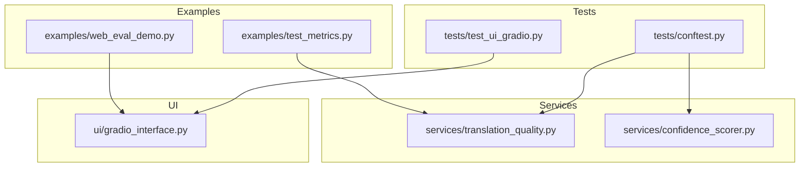
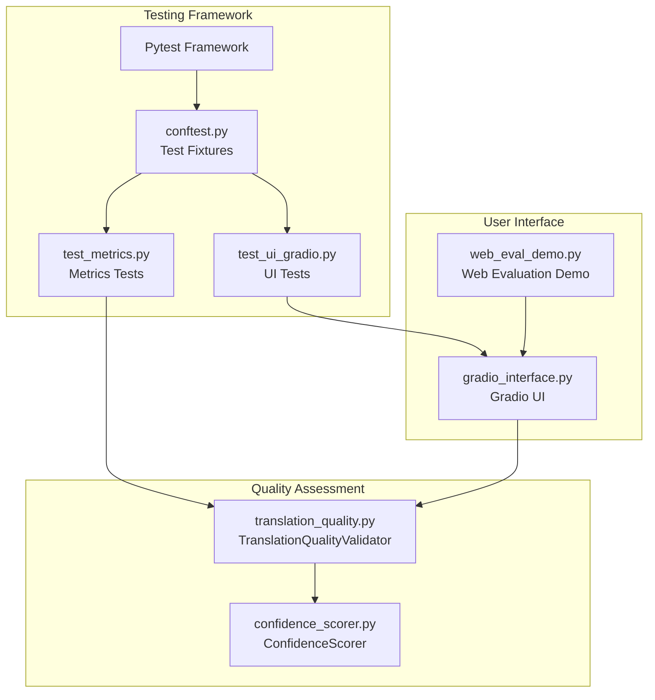
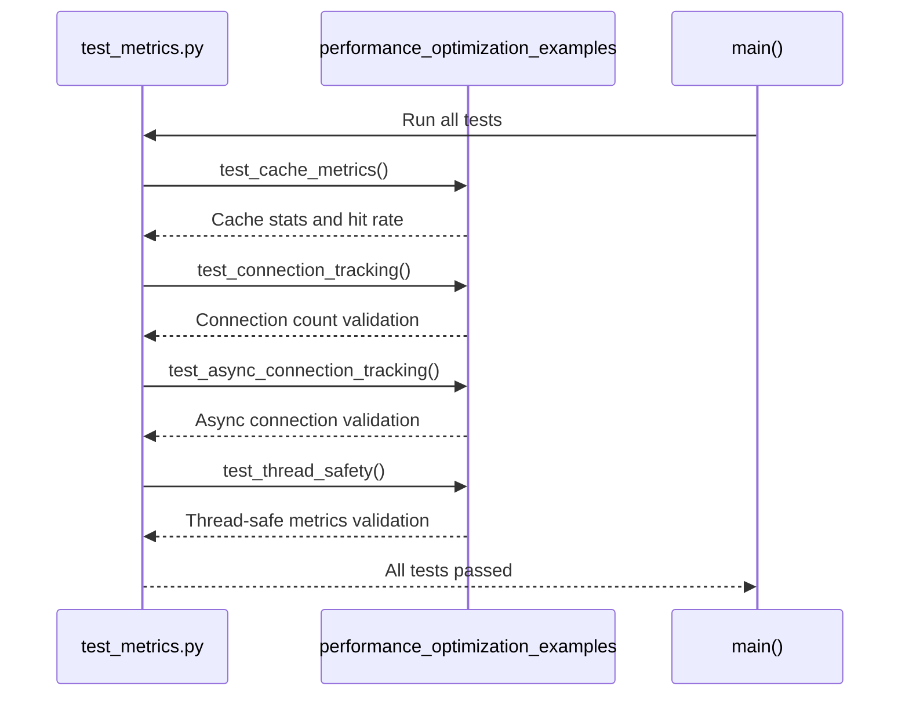
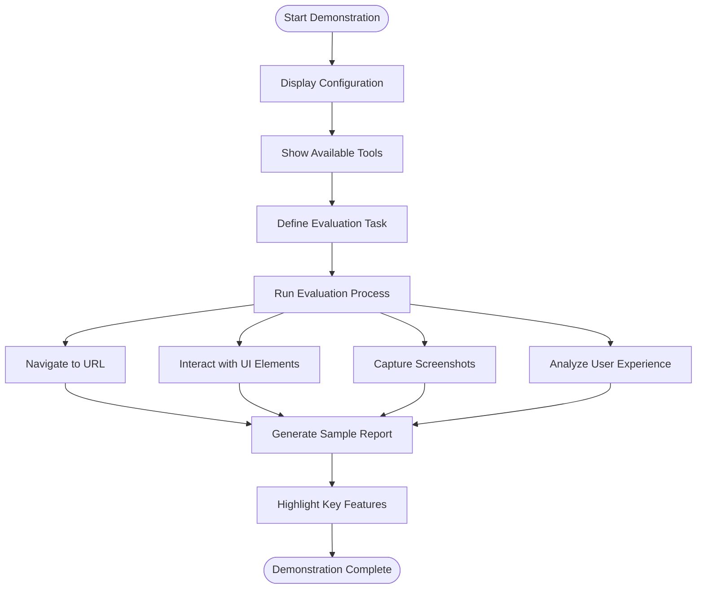
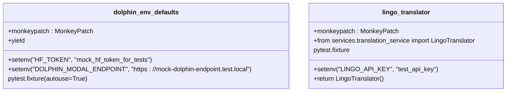
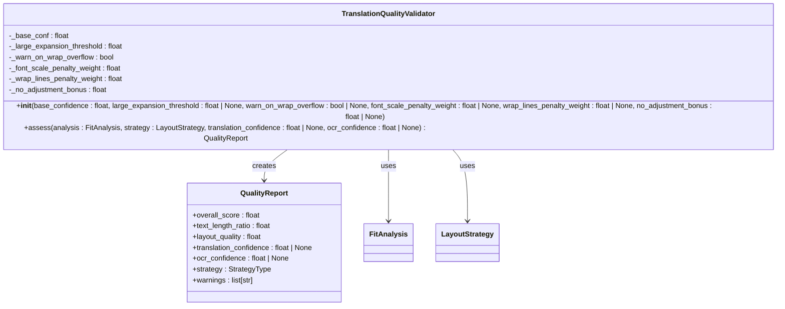
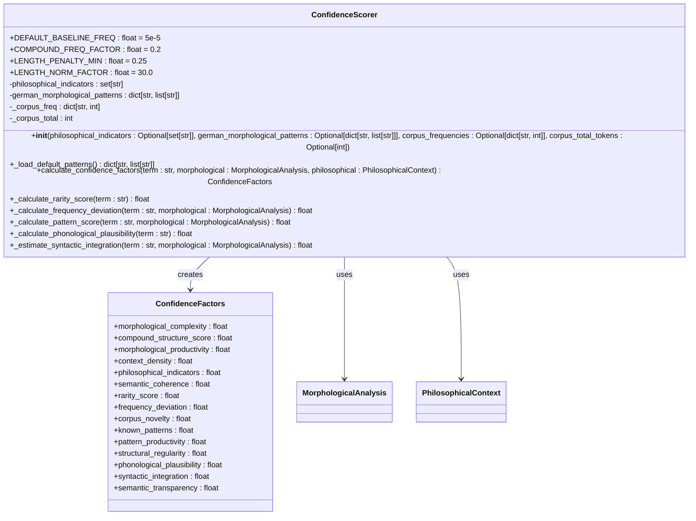
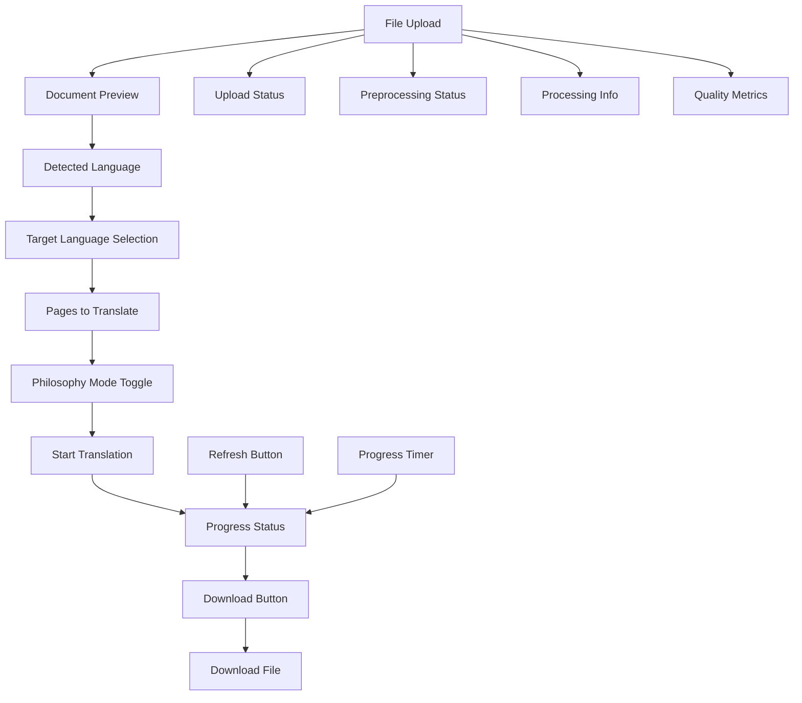
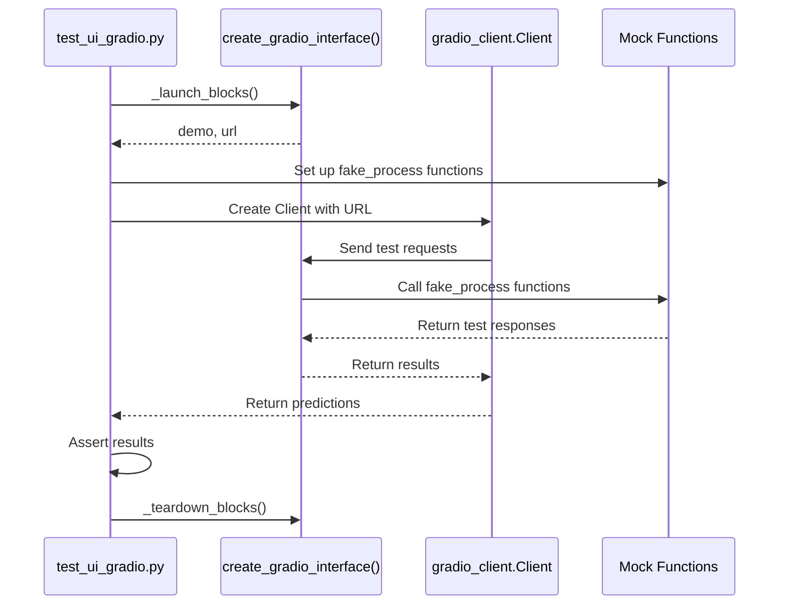
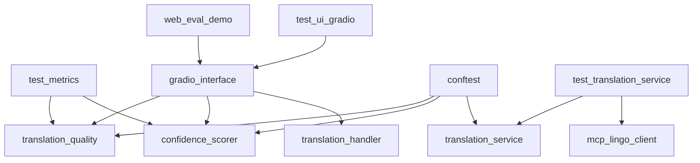

# Testing and Evaluation Examples

<cite>
**Referenced Files in This Document**  
- [test_metrics.py](file://examples/test_metrics.py)
- [web_eval_demo.py](file://examples/web_eval_demo.py)
- [conftest.py](file://tests/conftest.py)
- [translation_quality.py](file://services/translation_quality.py)
- [confidence_scorer.py](file://services/confidence_scorer.py)
- [gradio_interface.py](file://ui/gradio_interface.py)
- [test_ui_gradio.py](file://tests/test_ui_gradio.py)
</cite>

## Table of Contents
1. [Introduction](#introduction)
2. [Project Structure](#project-structure)
3. [Core Components](#core-components)
4. [Architecture Overview](#architecture-overview)
5. [Detailed Component Analysis](#detailed-component-analysis)
6. [Dependency Analysis](#dependency-analysis)
7. [Performance Considerations](#performance-considerations)
8. [Troubleshooting Guide](#troubleshooting-guide)
9. [Conclusion](#conclusion)

## Introduction
This document provides comprehensive documentation for testing and evaluation examples within the PhenomenalLayout project. It covers unit and integration testing patterns using pytest, evaluation of translation quality through web interfaces, metric calculation and visualization, test coverage reporting, assertion strategies, edge case validation, and integration with Gradio for manual evaluation workflows. The analysis includes best practices for writing effective tests and interpreting evaluation results, addressing common challenges such as OCR result variability and asynchronous processing validation.

## Project Structure
The project follows a modular structure with clear separation of concerns across different directories. Testing-related files are organized in dedicated locations, with example tests in the `examples/` directory and comprehensive test suites in the `tests/` directory. The core services related to translation quality assessment and confidence scoring are located in the `services/` directory, while user interface components are found in the `ui/` directory.

**Diagram sources**
- [test_metrics.py](file://examples/test_metrics.py)
- [web_eval_demo.py](file://examples/web_eval_demo.py)
- [conftest.py](file://tests/conftest.py)
- [translation_quality.py](file://services/translation_quality.py)
- [confidence_scorer.py](file://services/confidence_scorer.py)
- [gradio_interface.py](file://ui/gradio_interface.py)
- [test_ui_gradio.py](file://tests/test_ui_gradio.py)

**Section sources**
- [test_metrics.py](file://examples/test_metrics.py)
- [web_eval_demo.py](file://examples/web_eval_demo.py)
- [conftest.py](file://tests/conftest.py)
- [translation_quality.py](file://services/translation_quality.py)
- [confidence_scorer.py](file://services/confidence_scorer.py)
- [gradio_interface.py](file://ui/gradio_interface.py)
- [test_ui_gradio.py](file://tests/test_ui_gradio.py)

## Core Components
The core components for testing and evaluation include the metrics system demonstrated in `test_metrics.py`, the web evaluation demonstration in `web_eval_demo.py`, the test configuration fixtures in `conftest.py`, the translation quality assessment service, the confidence scoring engine, and the Gradio interface for manual evaluation. These components work together to provide a comprehensive testing and evaluation framework that supports both automated and manual assessment of translation quality.

**Section sources**
- [test_metrics.py](file://examples/test_metrics.py#L1-L146)
- [web_eval_demo.py](file://examples/web_eval_demo.py#L1-L131)
- [conftest.py](file://tests/conftest.py#L1-L29)
- [translation_quality.py](file://services/translation_quality.py#L1-L144)
- [confidence_scorer.py](file://services/confidence_scorer.py#L1-L199)
- [gradio_interface.py](file://ui/gradio_interface.py#L1-L463)

## Architecture Overview
The testing and evaluation architecture is built around a modular design that separates concerns between test execution, quality assessment, and user interface components. The system uses pytest as the primary testing framework, with fixtures defined in `conftest.py` to provide consistent test environments. The translation quality assessment is handled by the `TranslationQualityValidator` class, which computes quality scores based on layout impact and translation confidence. The confidence scoring engine evaluates neologism detection confidence using morphological and contextual factors. The Gradio interface provides a web-based UI for manual evaluation and monitoring of translation processes.

**Diagram sources**
- [conftest.py](file://tests/conftest.py#L1-L29)
- [test_metrics.py](file://examples/test_metrics.py#L1-L146)
- [test_ui_gradio.py](file://tests/test_ui_gradio.py#L1-L181)
- [translation_quality.py](file://services/translation_quality.py#L1-L144)
- [confidence_scorer.py](file://services/confidence_scorer.py#L1-L199)
- [gradio_interface.py](file://ui/gradio_interface.py#L1-L463)
- [web_eval_demo.py](file://examples/web_eval_demo.py#L1-L131)

## Detailed Component Analysis

### Metrics Testing System
The metrics testing system in `test_metrics.py` demonstrates comprehensive unit testing patterns for monitoring and metrics functionality. It includes tests for cache metrics, connection tracking, async connection tracking, and thread safety. The system verifies that metrics are accurately tracked and updated across different execution contexts, including synchronous, asynchronous, and multi-threaded scenarios.

**Diagram sources**
- [test_metrics.py](file://examples/test_metrics.py#L1-L146)

**Section sources**
- [test_metrics.py](file://examples/test_metrics.py#L1-L146)

### Web Evaluation Demonstration
The web evaluation demonstration in `web_eval_demo.py` showcases the capabilities of the web-eval-agent MCP server for automated web evaluation. It simulates a complete evaluation workflow, including configuration setup, tool availability, task execution, and results reporting. The demonstration includes a sample report structure that captures URL, task description, agent steps, console logs, network requests, and conclusion.

**Diagram sources**
- [web_eval_demo.py](file://examples/web_eval_demo.py#L1-L131)

**Section sources**
- [web_eval_demo.py](file://examples/web_eval_demo.py#L1-L131)

### Test Configuration and Fixtures
The test configuration in `conftest.py` provides essential fixtures for creating consistent test environments. It includes fixtures for setting default environment variables for Dolphin configuration and providing a LingoTranslator instance with a test API key. These fixtures ensure that tests run in a controlled environment with predictable configurations, preventing test failures due to missing or incorrect environment settings.

**Diagram sources**
- [conftest.py](file://tests/conftest.py#L1-L29)

**Section sources**
- [conftest.py](file://tests/conftest.py#L1-L29)

### Translation Quality Assessment
The translation quality assessment system in `translation_quality.py` implements a comprehensive validator for evaluating translation quality with layout impact assessment. The `TranslationQualityValidator` class computes a layout-aware overall score by combining translation confidence with layout quality derived from FitAnalysis and LayoutStrategy. It provides configurable warning thresholds and generates detailed quality reports with multiple metrics and warnings.

**Diagram sources**
- [translation_quality.py](file://services/translation_quality.py#L1-L144)

**Section sources**
- [translation_quality.py](file://services/translation_quality.py#L1-L144)

### Confidence Scoring Engine
The confidence scoring engine in `confidence_scorer.py` handles confidence scoring for neologism detection using a comprehensive set of factors. The `ConfidenceScorer` class calculates confidence based on morphological complexity, compound structure, context density, philosophical indicators, frequency deviation, pattern recognition, and linguistic plausibility. It uses configurable baseline constants and provides methods for calculating individual confidence factors.

**Diagram sources**
- [confidence_scorer.py](file://services/confidence_scorer.py#L1-L199)

**Section sources**
- [confidence_scorer.py](file://services/confidence_scorer.py#L1-L199)

### Gradio Interface for Evaluation
The Gradio interface in `gradio_interface.py` provides a web-based UI for manual evaluation of PDF translation processes. It includes components for file upload, document preview, language selection, translation controls, progress monitoring, and download functionality. The interface integrates with the core translation handler to provide real-time feedback on processing status and quality metrics.

**Diagram sources**
- [gradio_interface.py](file://ui/gradio_interface.py#L1-L463)

**Section sources**
- [gradio_interface.py](file://ui/gradio_interface.py#L1-L463)

### UI Testing Framework
The UI testing framework in `test_ui_gradio.py` demonstrates comprehensive testing of the Gradio interface using the gradio_client library. It includes tests for valid PDF upload, non-PDF validation, encrypted PDF validation, and translation progress monitoring. The tests use mocking to simulate different server responses and verify that the UI components handle various scenarios correctly.

**Diagram sources**
- [test_ui_gradio.py](file://tests/test_ui_gradio.py#L1-L181)

**Section sources**
- [test_ui_gradio.py](file://tests/test_ui_gradio.py#L1-L181)

## Dependency Analysis
The testing and evaluation components have a well-defined dependency structure that ensures modularity and testability. The core dependencies flow from the test files to the implementation files, with fixtures in `conftest.py` providing shared configuration across tests. The translation quality and confidence scoring services are used by both the metrics tests and the UI components, creating a cohesive evaluation framework.

**Diagram sources**
- [test_metrics.py](file://examples/test_metrics.py)
- [web_eval_demo.py](file://examples/web_eval_demo.py)
- [conftest.py](file://tests/conftest.py)
- [translation_quality.py](file://services/translation_quality.py)
- [confidence_scorer.py](file://services/confidence_scorer.py)
- [gradio_interface.py](file://ui/gradio_interface.py)
- [test_ui_gradio.py](file://tests/test_ui_gradio.py)
- [test_translation_service.py](file://tests/test_translation_service.py)

**Section sources**
- [test_metrics.py](file://examples/test_metrics.py)
- [web_eval_demo.py](file://examples/web_eval_demo.py)
- [conftest.py](file://tests/conftest.py)
- [translation_quality.py](file://services/translation_quality.py)
- [confidence_scorer.py](file://services/confidence_scorer.py)
- [gradio_interface.py](file://ui/gradio_interface.py)
- [test_ui_gradio.py](file://tests/test_ui_gradio.py)
- [test_translation_service.py](file://tests/test_translation_service.py)

## Performance Considerations
The testing and evaluation system has been designed with performance considerations in mind. The metrics system includes tests for thread safety, ensuring that metrics can be safely updated from multiple threads. The translation quality assessment uses efficient algorithms for computing quality scores, and the confidence scoring engine uses pre-configured constants to avoid expensive calculations during runtime. The Gradio interface implements progress tracking and auto-refresh functionality to provide real-time feedback without overwhelming the server with requests.

**Section sources**
- [test_metrics.py](file://examples/test_metrics.py#L1-L146)
- [translation_quality.py](file://services/translation_quality.py#L1-L144)
- [confidence_scorer.py](file://services/confidence_scorer.py#L1-L199)
- [gradio_interface.py](file://ui/gradio_interface.py#L1-L463)

## Troubleshooting Guide
When encountering issues with the testing and evaluation system, consider the following common problems and solutions:

1. **Test failures due to missing environment variables**: Ensure that all required environment variables are set, or use the fixtures in `conftest.py` to provide default values.

2. **UI test failures in CI environments**: Set the `GRADIO_SHARE` environment variable to "true" to ensure the Gradio interface is accessible in headless environments.

3. **Translation quality score discrepancies**: Verify that the layout analysis and strategy are correctly configured, as these significantly impact the overall quality score.

4. **Confidence scoring inconsistencies**: Check that the corpus frequencies and philosophical indicators are properly loaded and configured.

5. **Performance issues with large documents**: Adjust the page limit slider in the Gradio interface or implement pagination in the translation process.

**Section sources**
- [conftest.py](file://tests/conftest.py#L1-L29)
- [test_ui_gradio.py](file://tests/test_ui_gradio.py#L1-L181)
- [translation_quality.py](file://services/translation_quality.py#L1-L144)
- [confidence_scorer.py](file://services/confidence_scorer.py#L1-L199)
- [gradio_interface.py](file://ui/gradio_interface.py#L1-L463)

## Conclusion
The testing and evaluation framework in the PhenomenalLayout project provides a comprehensive set of tools for assessing translation quality and system performance. The combination of unit tests, integration tests, and manual evaluation interfaces ensures that both automated and human evaluation can be performed effectively. The modular design allows for easy extension and customization of the evaluation process, while the use of standardized testing frameworks and UI components ensures consistency and reliability across different evaluation scenarios.
