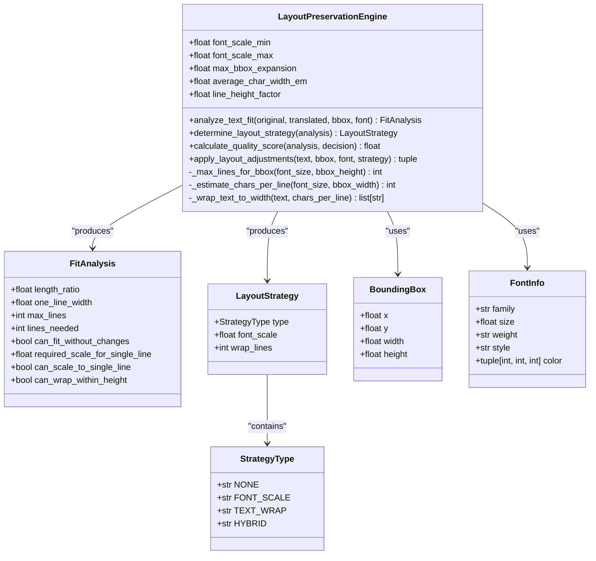
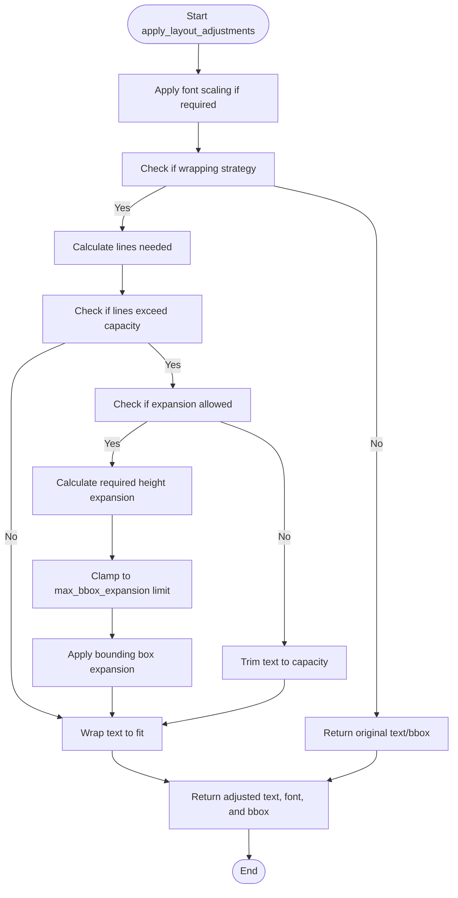
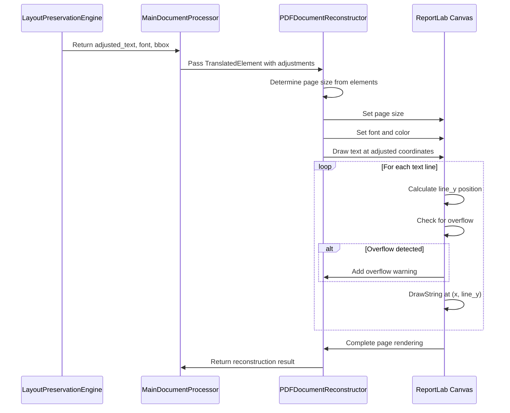

# Bounding Box Adjustment

<cite>
**Referenced Files in This Document**  
- [layout.py](file://dolphin_ocr/layout.py)
- [pdf_document_reconstructor.py](file://services/pdf_document_reconstructor.py)
- [test_layout_adjustments.py](file://tests/test_layout_adjustments.py)
- [test_layout_preservation_engine.py](file://tests/test_layout_preservation_engine.py)
- [main_document_processor.py](file://services/main_document_processor.py)
</cite>

## Table of Contents
1. [Introduction](#introduction)
2. [Layout Preservation Engine Overview](#layout-preservation-engine-overview)
3. [Bounding Box Adjustment Strategy](#bounding-box-adjustment-strategy)
4. [max_bbox_expansion Parameter](#max_bbox_expansion-parameter)
5. [apply_layout_adjustments Method](#apply_layout_adjustments-method)
6. [Interaction Between Layout and PDF Reconstruction](#interaction-between-layout-and-pdf-reconstruction)
7. [Coordinate System and Page Size Alignment](#coordinate-system-and-page-size-alignment)
8. [Visual Hierarchy Preservation](#visual-hierarchy-preservation)
9. [Proportional Expansion and Clamping](#proportional-expansion-and-clamping)
10. [Common Issues and Solutions](#common-issues-and-solutions)
11. [Trade-offs in Layout Preservation](#trade-offs-in-layout-preservation)
12. [Conclusion](#conclusion)

## Introduction
The layout preservation engine in the document processing pipeline ensures that translated text maintains the original document's spatial relationships and visual hierarchy. This document details the bounding box adjustment mechanism that allows controlled expansion of text containers when translation causes text overflow. The system intelligently balances layout fidelity with content visibility through a sophisticated strategy selection process and proportional bounding box adjustments.

## Layout Preservation Engine Overview

**Diagram sources**
- [layout.py](file://dolphin_ocr/layout.py#L199-L408)

**Section sources**
- [layout.py](file://dolphin_ocr/layout.py#L97-L408)

## Bounding Box Adjustment Strategy
The LayoutPreservationEngine implements a hierarchical strategy for handling text overflow during translation. The engine first attempts to preserve the original layout without modifications, then progressively applies more invasive adjustments only when necessary. The strategy selection follows a priority order: NONE (no change), FONT_SCALE (modest font scaling), TEXT_WRAP (line wrapping), and HYBRID (combined scaling and wrapping). This approach minimizes visual disruption while ensuring text remains readable.

The engine analyzes text fit by estimating the single-line width of translated text using a character width heuristic, then determines the number of lines needed when wrapped to the bounding box width. It evaluates whether the text can fit within the height constraints of the bounding box, considering the line height factor. Based on this analysis, the engine selects the most appropriate strategy that preserves layout integrity while accommodating the translated text length.

**Section sources**
- [layout.py](file://dolphin_ocr/layout.py#L250-L300)

## max_bbox_expansion Parameter
The `max_bbox_expansion` parameter in LayoutPreservationEngine controls the maximum proportional growth allowed for bounding box height during layout adjustments. This parameter, initialized to 0.3 (30% expansion), serves as a safety limit to prevent excessive vertical growth that could disrupt the document's overall layout. When text wrapping would otherwise cause overflow, the engine calculates the required height based on the number of lines needed and the line height factor, then expands the bounding box up to the maximum allowed by this parameter.

The parameter is implemented as a floating-point value representing the maximum proportional increase (e.g., 0.3 allows up to 30% height increase). This controlled expansion enables the system to accommodate longer translated text while maintaining spatial relationships with surrounding elements. The expansion is only applied when necessary and is clamped to prevent exceeding the specified limit, ensuring that layout adjustments remain within acceptable bounds.

**Section sources**
- [layout.py](file://dolphin_ocr/layout.py#L115-L120)

## apply_layout_adjustments Method
The `apply_layout_adjustments` method calculates and applies the necessary changes to text, font, and bounding box based on the selected layout strategy. When a wrapping strategy is required, the method first estimates the number of characters per line using the font size and bounding box width. It then wraps the text to fit within the width constraints while respecting word boundaries.

For vertical expansion, the method calculates the required height based on the number of lines needed and the line height factor. If the required height exceeds the current bounding box capacity and the `max_bbox_expansion` parameter allows it, the method expands the bounding box height proportionally. The expansion is clamped to the maximum allowed growth, ensuring that adjustments remain within the specified limits. If the text still exceeds the expanded capacity, it is trimmed as a last resort to prevent overflow.

**Diagram sources**
- [layout.py](file://dolphin_ocr/layout.py#L302-L350)

**Section sources**
- [layout.py](file://dolphin_ocr/layout.py#L302-L350)

## Interaction Between Layout and PDF Reconstruction
The bounding box adjustments made by the layout preservation engine directly inform the PDF reconstruction process in pdf_document_reconstructor.py. The adjusted bounding boxes, along with modified text and font information, are passed to the PDFDocumentReconstructor which renders the translated content while respecting the layout modifications. This tight integration ensures that the visual representation matches the layout analysis performed earlier in the pipeline.

The TranslatedElement data structure serves as the bridge between these components, carrying the adjusted_text, bbox, and font_info from the layout engine to the reconstructor. During rendering, the PDFDocumentReconstructor uses the expanded bounding box dimensions to position text elements correctly on the page. The coordinate system alignment between components ensures that spatial relationships are preserved across the entire processing pipeline.

**Diagram sources**
- [layout.py](file://dolphin_ocr/layout.py#L97-L408)
- [pdf_document_reconstructor.py](file://services/pdf_document_reconstructor.py#L200-L486)

**Section sources**
- [layout.py](file://dolphin_ocr/layout.py#L97-L408)
- [pdf_document_reconstructor.py](file://services/pdf_document_reconstructor.py#L200-L486)

## Coordinate System and Page Size Alignment
The system maintains consistent coordinate system alignment between the layout preservation engine and PDF reconstruction components. The bounding box coordinates use a PDF-like coordinate space where (x, y) represents the origin of the box, with width and height in points (same units as font sizes). This consistency ensures that layout adjustments are accurately reflected in the final rendered document.

Page size determination occurs during reconstruction by analyzing the bounding boxes of all elements on each page. The PDFDocumentReconstructor calculates the maximum x and y coordinates across all elements, adding the respective width and height to determine the required page dimensions. This dynamic sizing approach preserves the spatial relationships between elements while ensuring all content fits within the page boundaries. For pages with no elements, a default size (Letter: 612×792 points) is used.

**Section sources**
- [pdf_document_reconstructor.py](file://services/pdf_document_reconstructor.py#L250-L280)

## Visual Hierarchy Preservation
The bounding box adjustment system is designed to preserve the original document's visual hierarchy while accommodating longer translated text. By prioritizing minimal changes (NONE strategy) and progressively applying more significant adjustments only when necessary, the system maintains the relative positioning and prominence of text elements. The quality scoring mechanism further supports hierarchy preservation by favoring strategies that require fewer modifications to font size and line structure.

The engine considers both horizontal and vertical spatial relationships when making adjustment decisions. Horizontal fit is evaluated first through single-line width estimation, while vertical fit considers line height and available bounding box height. This two-dimensional analysis ensures that text elements maintain their intended spatial context within the document layout, preserving the visual flow and reading order established in the original document.

**Section sources**
- [layout.py](file://dolphin_ocr/layout.py#L350-L370)

## Proportional Expansion and Clamping
The system implements proportional bounding box expansion based on the number of lines required and the line height factor. When expansion is necessary, the engine calculates the required height as the product of the number of lines and the line height (font size × line_height_factor). This ensures that the expanded bounding box provides adequate vertical space for all text lines with proper spacing.

The expansion is clamped to prevent exceeding the maximum allowed growth defined by the `max_bbox_expansion` parameter. The maximum allowable height is calculated as the original bounding box height multiplied by (1.0 + max_bbox_expansion). The final expanded height is the minimum of the required height and the maximum allowable height, ensuring that adjustments remain within the specified limits. This clamping mechanism prevents excessive expansion that could disrupt the overall document layout.

**Section sources**
- [layout.py](file://dolphin_ocr/layout.py#L330-L340)

## Common Issues and Solutions
The system addresses several common issues related to bounding box adjustments and text overflow. Overlapping elements are prevented through the controlled expansion limits and quality scoring that favors minimal layout changes. When text exceeds even the expanded bounding box capacity, the system implements truncation as a last resort, accompanied by overflow warnings to alert users of potential content loss.

Overflow warnings are generated during the PDF reconstruction phase when text lines would be positioned outside the bounding box boundaries. These warnings are collected and included in the reconstruction result, providing feedback on layout preservation quality. The system also handles font availability issues by implementing font fallback mechanisms, ensuring that text remains visible even when the original font is not available.

The quality scoring system provides a quantitative measure of layout preservation, allowing downstream components to assess the impact of translation on document appearance. This score, ranging from 0 to 1, considers penalties for font scaling and text wrapping, enabling comparison of different layout strategies and identification of potential issues.

**Section sources**
- [pdf_document_reconstructor.py](file://services/pdf_document_reconstructor.py#L380-L400)
- [layout.py](file://dolphin_ocr/layout.py#L150-L180)

## Trade-offs in Layout Preservation
The bounding box adjustment system navigates several key trade-offs between preserving the original layout and ensuring complete text visibility. The primary trade-off involves the extent of bounding box expansion: while larger expansions accommodate more text, they risk disrupting the document's visual hierarchy and spatial relationships. The `max_bbox_expansion` parameter explicitly defines this compromise, allowing configuration of the acceptable level of layout modification.

Another trade-off exists between font scaling and text wrapping. Modest font scaling preserves the single-line appearance but reduces text size, while wrapping maintains font size but changes the text block's vertical footprint. The quality scoring system quantifies these trade-offs, with penalties assigned based on the degree of scaling and number of lines. This enables the system to select the strategy that best balances layout fidelity with content completeness.

The system also balances automated adjustment with user awareness. While it attempts to preserve layout automatically, it generates warnings when content is truncated or significant modifications are required. This approach ensures that documents remain readable while providing transparency about the compromises made during translation.

**Section sources**
- [layout.py](file://dolphin_ocr/layout.py#L150-L180)
- [pdf_document_reconstructor.py](file://services/pdf_document_reconstructor.py#L420-L450)
