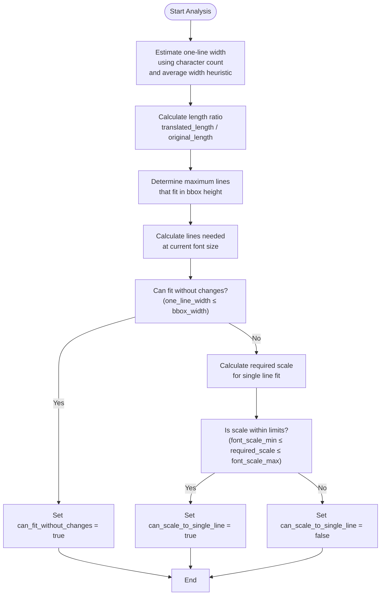
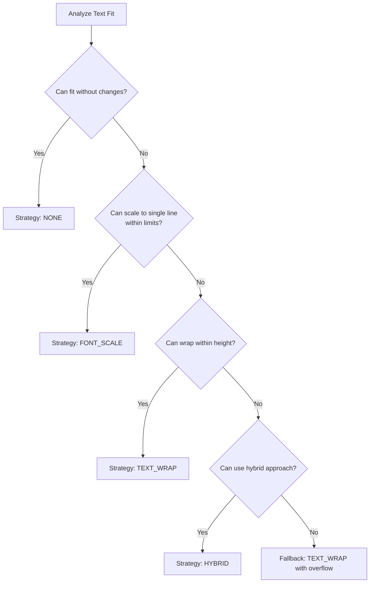
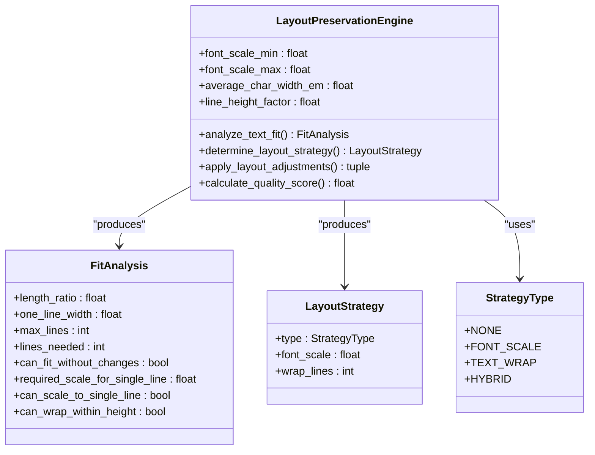
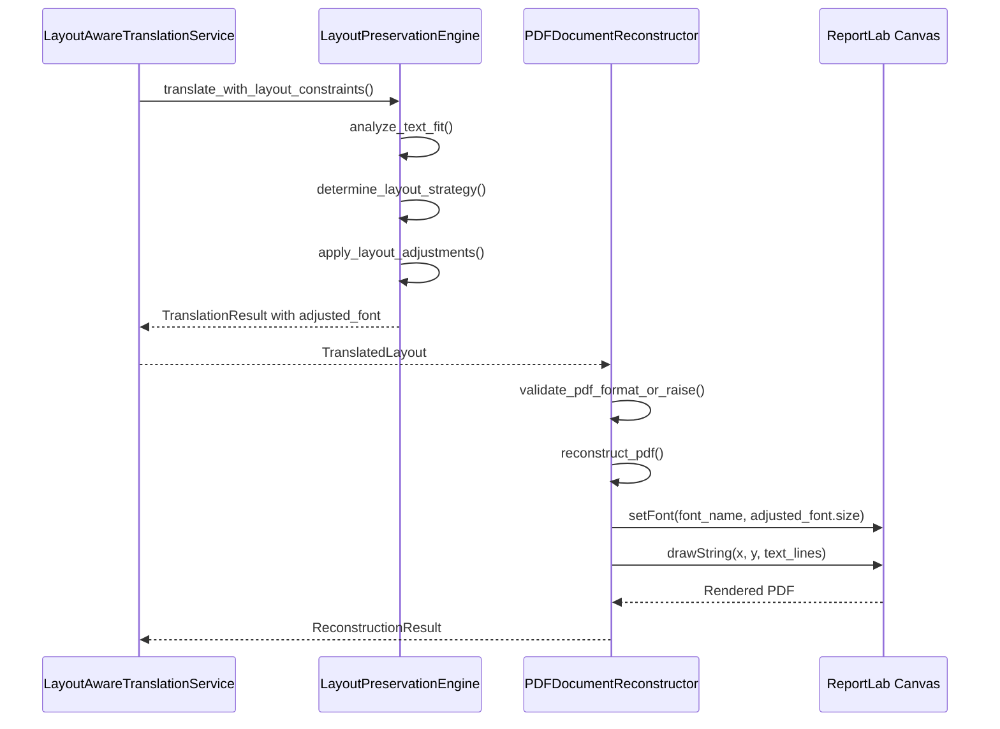

# Font Scaling Strategies

<cite>
**Referenced Files in This Document**  
- [layout.py](file://dolphin_ocr/layout.py)
- [pdf_document_reconstructor.py](file://services/pdf_document_reconstructor.py)
- [layout_aware_translation_service.py](file://services/layout_aware_translation_service.py)
- [test_layout_adjustments.py](file://tests/test_layout_adjustments.py)
- [test_layout_aware_translation_service.py](file://tests/test_layout_aware_translation_service.py)
</cite>

## Table of Contents
1. [Introduction](#introduction)
2. [Font Scale Factor Calculation](#font-scale-factor-calculation)
3. [FONT_SCALE Strategy Selection](#font_scale-strategy-selection)
4. [Layout Adjustment Implementation](#layout-adjustment-implementation)
5. [PDF Reconstruction Process](#pdf-reconstruction-process)
6. [Scaling Constraints and Clamping](#scaling-constraints-and-clamping)
7. [Common Issues and Solutions](#common-issues-and-solutions)
8. [Performance and Quality Considerations](#performance-and-quality-considerations)

## Introduction
The LayoutPreservationEngine in the Dolphin OCR system implements sophisticated font scaling strategies to maintain document layout integrity during translation. When text length changes after translation, the engine calculates optimal scaling factors to fit content within original bounding boxes while preserving readability. This document details the font scaling mechanisms, from initial analysis to final PDF reconstruction, covering the FONT_SCALE strategy, constraint enforcement, and quality implications.

## Font Scale Factor Calculation

The LayoutPreservationEngine calculates font scale factors using average character width heuristics to estimate text dimensions. The engine's `analyze_text_fit` method determines the required scale factor by comparing the estimated width of translated text against the available bounding box width.

The calculation uses a simple linear model based on average character width:
- Single-line width ≈ font_size × average_char_width_em × character_count
- The default average_char_width_em is 0.5, representing a reasonable approximation for many fonts
- Required scale factor = min(1.0, bbox_width / one_line_width)

This heuristic provides deterministic results for testing while avoiding dependencies on external font metrics. The engine considers both horizontal and vertical constraints, calculating maximum lines that can fit within the bounding box height based on line_height_factor (default 1.2).

**Diagram sources**
- [layout.py](file://dolphin_ocr/layout.py#L140-L200)

**Section sources**
- [layout.py](file://dolphin_ocr/layout.py#L140-L200)

## FONT_SCALE Strategy Selection

The FONT_SCALE strategy is selected when translated text can fit on a single line with modest scaling within configured limits. The strategy determination follows a preference hierarchy that prioritizes minimal visual changes:

1. NONE: No change if text already fits
2. FONT_SCALE: Modest scaling to maintain single-line presentation
3. TEXT_WRAP: Wrapping without scaling if height permits
4. HYBRID: Combined scaling and wrapping as last resort

The FONT_SCALE strategy is specifically chosen when:
- Text cannot fit at original size (one_line_width > bbox_width)
- Required scale factor falls within font_scale_limits (default 0.6-1.2)
- Single-line presentation can be preserved

This approach maintains the original document's visual rhythm when possible, avoiding the more disruptive text wrapping. The strategy selection is implemented in the `determine_layout_strategy` method, which evaluates the FitAnalysis results to make deterministic decisions.

**Diagram sources**
- [layout.py](file://dolphin_ocr/layout.py#L205-L250)

**Section sources**
- [layout.py](file://dolphin_ocr/layout.py#L205-L250)

## Layout Adjustment Implementation

The `apply_layout_adjustments` method implements the selected layout strategy, with specific logic for font scaling. When the FONT_SCALE strategy is applied, the method:

1. Applies the scale factor to the font size while respecting configured limits
2. Maintains original text content without wrapping
3. Preserves the original bounding box dimensions

The implementation includes clamping logic to ensure the scale factor stays within the configured font_scale_min and font_scale_max bounds. The scaled font size is calculated as max(1.0, original_size × scale_factor), preventing text from becoming too small to read.

For hybrid strategies that combine scaling with wrapping, the engine first applies the scale factor, then wraps text to fit the adjusted character width. The wrapping algorithm respects word boundaries while handling exceptionally long words through character-level breaking.

**Diagram sources**
- [layout.py](file://dolphin_ocr/layout.py#L100-L350)

**Section sources**
- [layout.py](file://dolphin_ocr/layout.py#L290-L350)
- [test_layout_adjustments.py](file://tests/test_layout_adjustments.py#L10-L40)

## PDF Reconstruction Process

During PDF reconstruction in pdf_document_reconstructor.py, scaled font sizes are applied through ReportLab's canvas operations. The PDFDocumentReconstructor processes TranslatedElement objects that contain the adjusted_font information from the layout engine.

The reconstruction process:
1. Creates a ReportLab canvas with appropriate page dimensions
2. For each translated element, sets the font using adjusted_font.size
3. Applies color preservation from the original font_info
4. Renders text using the adjusted_text content
5. Handles potential overflow by truncating content that exceeds bounding box height

The _select_font_name method maps font family, weight, and style to ReportLab's font registry, with fallback to Helvetica when specific fonts are unavailable. This ensures consistent rendering while preserving typographic intent.

**Diagram sources**
- [pdf_document_reconstructor.py](file://services/pdf_document_reconstructor.py#L300-L400)
- [layout_aware_translation_service.py](file://services/layout_aware_translation_service.py#L100-L150)

**Section sources**
- [pdf_document_reconstructor.py](file://services/pdf_document_reconstructor.py#L300-L400)
- [layout_aware_translation_service.py](file://services/layout_aware_translation_service.py#L100-L150)

## Scaling Constraints and Clamping

The layout engine enforces strict constraints on font scaling through configurable limits and clamping logic. The font_scale_limits parameter (default 0.6-1.2) defines the allowable range for multiplicative scale factors, preventing extreme scaling that would compromise readability.

Key constraint enforcement mechanisms:
- Constructor validation ensures font_scale_min ≤ font_scale_max and both values are positive
- During strategy determination, can_scale_to_single_line is only true if required_scale falls within limits
- In apply_layout_adjustments, the final scale factor is clamped: max(font_scale_min, min(font_scale_max, strategy.font_scale))
- Minimum font size of 1.0 point prevents text from becoming invisible

These constraints balance layout preservation with readability, ensuring that scaled text remains legible while fitting within design constraints. The clamping logic is applied consistently across both FONT_SCALE and HYBRID strategies.

**Section sources**
- [layout.py](file://dolphin_ocr/layout.py#L120-L130)
- [layout.py](file://dolphin_ocr/layout.py#L300-L310)

## Common Issues and Solutions

Font scaling presents several common challenges that the layout engine addresses through specific design choices:

**Text becoming too small to read**: Solved by enforcing a minimum font size of 1.0 point and setting a reasonable font_scale_min (default 0.6). This prevents text from becoming illegible while allowing significant reduction when necessary.

**Inaccurate width estimation**: Addressed by using a conservative average_char_width_em value (0.5) that works across various fonts. The heuristic is intentionally simple to ensure deterministic behavior and avoid external dependencies.

**Overflow despite scaling**: Handled through fallback strategies. If scaling alone cannot fit the text, the engine progresses to wrapping or hybrid approaches. The quality scoring system penalizes these more disruptive changes.

**Font availability issues**: Managed during PDF reconstruction by implementing font fallback to Helvetica when requested fonts are unavailable in ReportLab's registry.

**Configuration flexibility**: Enabled through the engine's constructor parameters, allowing adjustment of scaling limits, character width estimates, and line height factors to suit different document types and requirements.

**Section sources**
- [layout.py](file://dolphin_ocr/layout.py#L300-L350)
- [pdf_document_reconstructor.py](file://services/pdf_document_reconstructor.py#L200-L250)

## Performance and Quality Considerations

Font scaling decisions impact both processing performance and output quality. The layout engine optimizes for efficiency through:

- Lightweight, dependency-free implementation using simple heuristics
- Deterministic calculations that enable caching and parallel processing
- Minimal memory footprint with immutable dataclasses

Quality is assessed through a scoring system that penalizes layout modifications:
- SCALE_PENALTY_WEIGHT (0.35): Proportional penalty based on |1 - scale|
- WRAP_PENALTY_WEIGHT (0.25): Penalty based on additional lines needed
- NONE_BONUS (0.05): Small preference for unchanged text

The quality score ranges from 0 to 1, with higher scores indicating better layout preservation. FONT_SCALE strategies typically achieve higher scores than wrapping approaches, reflecting their less disruptive nature. This scoring informs downstream processing and quality assurance, helping identify documents that may require manual review.

The engine's design prioritizes speed and reliability over pixel-perfect accuracy, making it suitable for high-volume document processing where consistent, predictable results are more valuable than perfect layout matching.

**Section sources**
- [layout.py](file://dolphin_ocr/layout.py#L250-L280)
- [test_layout_aware_translation_service.py](file://tests/test_layout_aware_translation_service.py#L50-L70)
