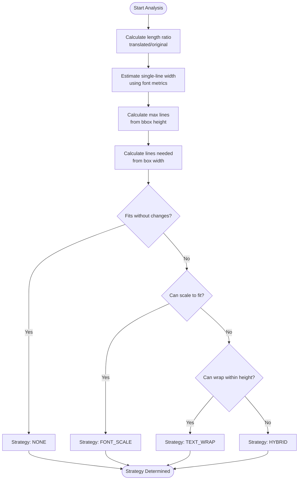
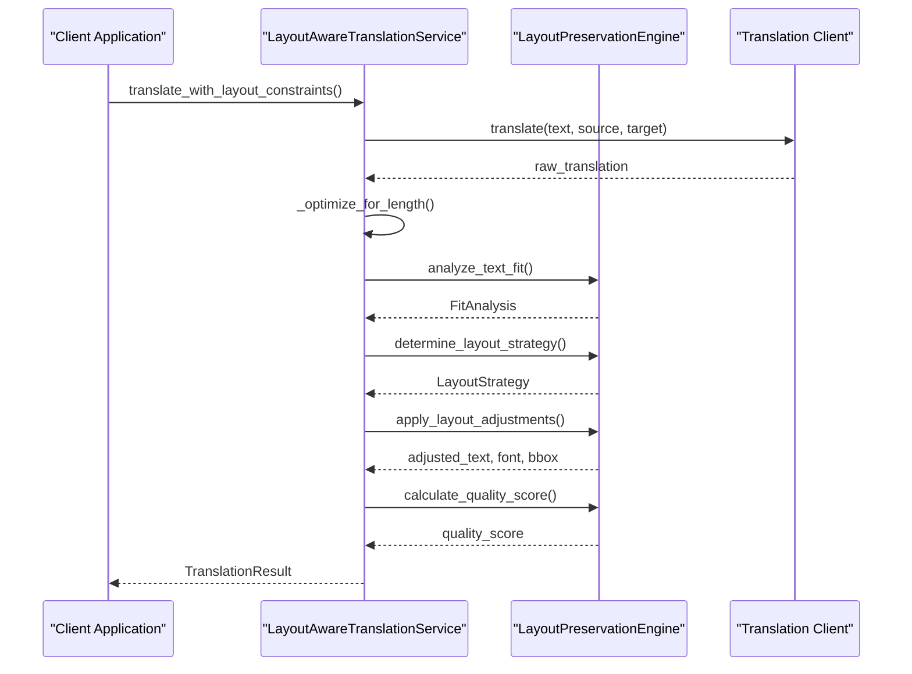
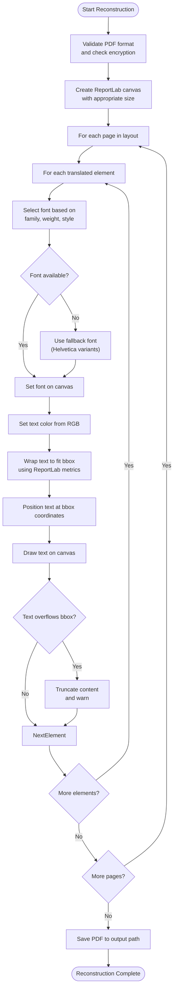
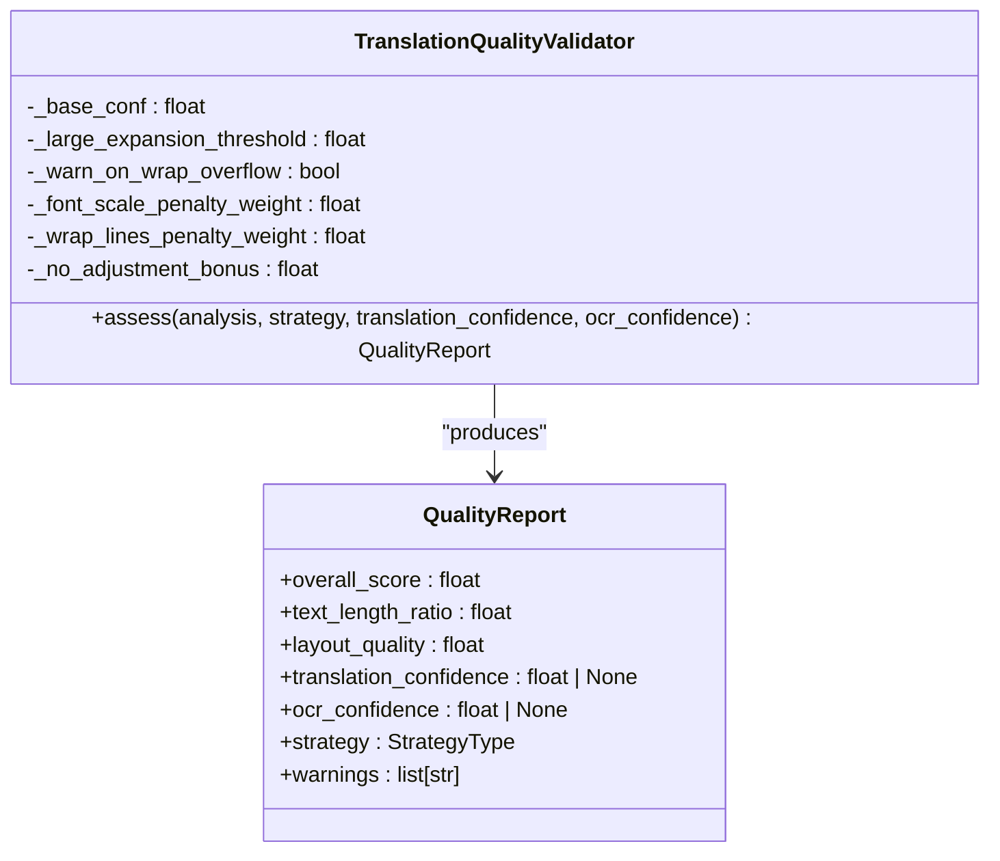
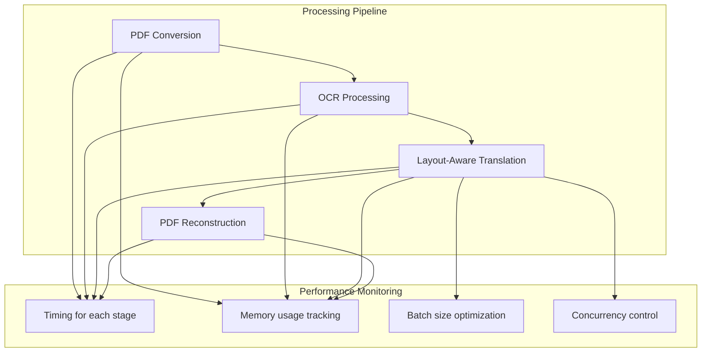

# Layout Preservation Engine

<cite>
**Referenced Files in This Document**  
- [dolphin_ocr/layout.py](file://dolphin_ocr/layout.py)
- [services/layout_aware_translation_service.py](file://services/layout_aware_translation_service.py)
- [services/pdf_document_reconstructor.py](file://services/pdf_document_reconstructor.py)
- [services/translation_quality.py](file://services/translation_quality.py)
- [services/main_document_processor.py](file://services/main_document_processor.py)
</cite>

## Table of Contents
1. [Introduction](#introduction)
2. [Layout Analysis and Strategy Determination](#layout-analysis-and-strategy-determination)
3. [Layout-Aware Translation Process](#layout-aware-translation-process)
4. [PDF Reconstruction with Text Overlay](#pdf-reconstruction-with-text-overlay)
5. [Layout Fidelity Quality Scoring](#layout-fidelity-quality-scoring)
6. [Trade-offs Between Layout Preservation and Readability](#trade-offs-between-layout-preservation-and-readability)
7. [Edge Case Handling](#edge-case-handling)
8. [Performance Metrics and Optimization](#performance-metrics-and-optimization)

## Introduction
The Layout Preservation Engine is a core component of the document translation system designed to maintain the original formatting and spatial relationships of text elements during translation. This system analyzes text block dimensions, font metrics, and spatial constraints to ensure translated content fits within the original document layout. The engine employs a multi-stage process involving layout analysis, strategy selection, text adjustment, and quality assessment to achieve high-fidelity document reconstruction. By preserving the visual structure of documents, the system ensures that translated outputs maintain professional appearance and readability while respecting the original design.

## Layout Analysis and Strategy Determination

The layout preservation process begins with comprehensive analysis of text fit within bounding boxes using the `LayoutPreservationEngine` class in `dolphin_ocr/layout.py`. This engine evaluates whether translated text can fit within the original spatial constraints by analyzing text dimensions, font metrics, and available space.

The analysis process follows these steps:
1. Calculate the length ratio between translated and original text
2. Estimate the single-line width of translated text using font size and average character width
3. Determine the maximum number of lines that can fit within the bounding box height
4. Calculate the number of lines needed when wrapping text to the box width

Based on this analysis, the engine determines the optimal preservation strategy from four options:
- **NONE**: No changes needed when text fits without adjustments
- **FONT_SCALE**: Scale font size to fit text on a single line
- **TEXT_WRAP**: Wrap text across multiple lines within the height constraint
- **HYBRID**: Combine font scaling with text wrapping for optimal fit

The strategy selection algorithm prioritizes minimal visual changes, preferring no adjustments when possible, followed by font scaling, text wrapping, and finally hybrid approaches when necessary.

**Diagram sources**
- [dolphin_ocr/layout.py](file://dolphin_ocr/layout.py#L150-L300)

**Section sources**
- [dolphin_ocr/layout.py](file://dolphin_ocr/layout.py#L1-L410)

## Layout-Aware Translation Process

The `LayoutAwareTranslationService` in `services/layout_aware_translation_service.py` coordinates the translation process with layout preservation requirements. This service integrates with the translation client and layout engine to ensure translated text is adjusted to fit within original bounding boxes.

The translation workflow consists of:
1. Translating the source text using the configured translation client
2. Optimizing the translated text by compacting whitespace
3. Analyzing layout fit using the `LayoutPreservationEngine`
4. Determining the appropriate layout strategy
5. Applying adjustments to text, font, and bounding box
6. Calculating quality scores for layout preservation

The service provides both single-item and batch translation APIs, maintaining layout context for each text element. For batch operations, it attempts to use the translation client's batch capabilities when available, falling back to individual calls if necessary.

**Diagram sources**
- [services/layout_aware_translation_service.py](file://services/layout_aware_translation_service.py#L1-L311)

**Section sources**
- [services/layout_aware_translation_service.py](file://services/layout_aware_translation_service.py#L1-L311)

## PDF Reconstruction with Text Overlay

The `PDFDocumentReconstructor` in `services/pdf_document_reconstructor.py` generates the final PDF by overlaying translated text on original background images. This process preserves the document's visual structure while incorporating the translated content.

The reconstruction workflow includes:
1. Validating the original PDF format and checking for encryption
2. Creating a ReportLab canvas for the output document
3. Processing each page and its translated elements
4. Setting appropriate fonts, sizes, and colors for each text element
5. Rendering text with proper positioning and line wrapping
6. Handling font fallbacks when specified fonts are unavailable
7. Managing text overflow and truncation when necessary

The reconstructor uses the adjusted text, font information, and bounding box coordinates from the translation process to position text accurately. It also preserves text color by converting RGB values to ReportLab's color space.

**Diagram sources**
- [services/pdf_document_reconstructor.py](file://services/pdf_document_reconstructor.py#L1-L487)

**Section sources**
- [services/pdf_document_reconstructor.py](file://services/pdf_document_reconstructor.py#L1-L487)

## Layout Fidelity Quality Scoring

The `TranslationQualityValidator` in `services/translation_quality.py` evaluates layout preservation quality using a heuristic scoring system. This quality assessment combines translation confidence with layout fidelity metrics to provide an overall quality score.

The quality scoring algorithm:
1. Starts with translation confidence (default 0.8 if not provided)
2. Applies penalties for layout adjustments:
   - Font scaling penalty proportional to |1 - scale|
   - Wrapping penalty based on normalized number of lines
3. Adds a small bonus for no adjustments (NONE strategy)
4. Combines translation and layout quality into an overall score

The validator also generates warnings for potential quality issues:
- Large text expansion without adjustments
- Wrapping that exceeds capacity (potential truncation)
- Font fallback usage
- Text overflow on pages

**Diagram sources**
- [services/translation_quality.py](file://services/translation_quality.py#L1-L145)

**Section sources**
- [services/translation_quality.py](file://services/translation_quality.py#L1-L145)

## Trade-offs Between Layout Preservation and Readability

The layout preservation system balances competing requirements between maintaining original document formatting and ensuring readable translated content. Several trade-offs are managed through configurable parameters and algorithmic decisions.

Key trade-offs include:

**Font Size vs. Readability**: The system allows font scaling between 0.6x and 1.2x the original size. While smaller fonts preserve layout, they may reduce readability. The engine prioritizes minimal scaling and only reduces font size when necessary to prevent text overflow.

**Text Wrapping vs. Flow**: Text wrapping maintains content within bounding boxes but can disrupt reading flow. The system uses intelligent wrapping that respects word boundaries and only hard-wraps very long words that exceed line width.

**Content Truncation vs. Layout Integrity**: When text cannot fit even with adjustments, the system may truncate content to preserve layout. This is considered a last resort, with warnings generated to alert users of potential information loss.

**Performance vs. Accuracy**: The layout engine uses average character width heuristics rather than precise font metrics to maintain performance. This approximation is sufficient for most cases while avoiding the computational overhead of detailed font analysis.

These trade-offs are configurable through environment variables and settings, allowing users to adjust the balance based on their specific requirements.

**Section sources**
- [dolphin_ocr/layout.py](file://dolphin_ocr/layout.py#L1-L410)
- [services/translation_quality.py](file://services/translation_quality.py#L1-L145)

## Edge Case Handling

The layout preservation system includes robust handling of various edge cases that commonly occur during document translation.

**Very Long Words**: When words exceed the available line width, the system implements hard-wrapping at character boundaries. This ensures that extremely long technical terms, URLs, or compound words in languages like German can be accommodated within layout constraints.

**Significant Text Expansion**: Some languages expand considerably during translation (e.g., German to English). The system handles this through:
- Aggressive whitespace optimization
- Font size reduction within acceptable limits
- Multi-line wrapping when height permits
- Bounding box expansion up to 30% when configured

**Font Availability**: When specified fonts are unavailable in ReportLab, the system implements a fallback strategy:
1. Try exact font family with appropriate weight and style
2. Fall back to Helvetica variants with matching weight/style
3. Default to standard Helvetica if no suitable match found

**Small Bounding Boxes**: For text elements with very limited space, the system prioritizes content preservation over perfect layout matching, potentially allowing slight overflow while maintaining readability.

**Mixed Content Types**: The system handles various text formats including:
- Headings with different font weights
- Lists with bullet points
- Tables with aligned columns
- Footnotes with smaller font sizes

Each content type is processed according to its specific layout requirements while maintaining overall document consistency.

**Section sources**
- [dolphin_ocr/layout.py](file://dolphin_ocr/layout.py#L350-L410)
- [services/pdf_document_reconstructor.py](file://services/pdf_document_reconstructor.py#L300-L487)

## Performance Metrics and Optimization

The layout preservation system includes comprehensive performance monitoring and optimization techniques for processing large documents efficiently.

**Processing Pipeline**: The main document processor in `services/main_document_processor.py` orchestrates the complete workflow:
1. PDF to image conversion
2. OCR processing
3. Layout-aware translation
4. PDF reconstruction

Each stage is timed and monitored, with performance metrics collected for analysis.

**Batch Processing**: To optimize translation performance, the system processes text elements in batches (default 100 items). This reduces API call overhead and improves throughput, especially for documents with many small text elements.

**Memory Management**: The system includes memory threshold settings to prevent excessive resource consumption when processing large documents. Temporary files are managed in designated cache directories with automatic cleanup.

**Parallel Processing**: While the core layout engine is synchronous for determinism, the overall system supports parallel processing of multiple documents. The translation concurrency limit (default 8) prevents overwhelming the translation service.

**Performance Metrics Collected**:
- Pages processed
- Time spent in each processing stage (conversion, OCR, translation, reconstruction)
- Number of translation elements
- Font fallback rate
- Text overflow rate
- Overall processing time

These metrics are used for system monitoring, performance optimization, and quality assurance.

**Diagram sources**
- [services/main_document_processor.py](file://services/main_document_processor.py#L1-L323)

**Section sources**
- [services/main_document_processor.py](file://services/main_document_processor.py#L1-L323)
