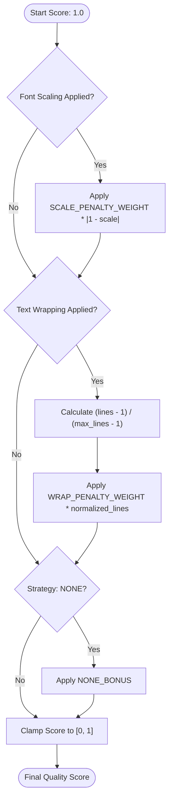
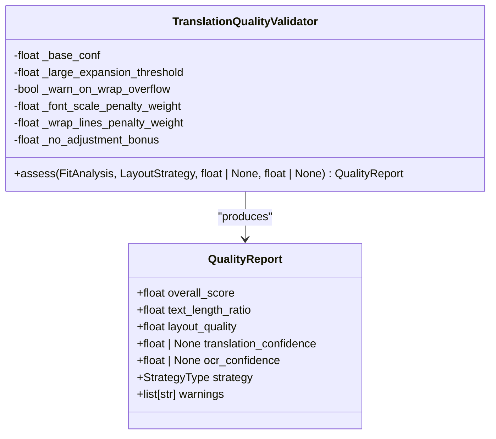
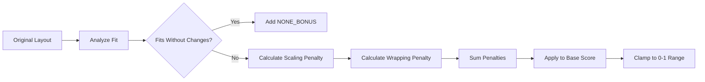
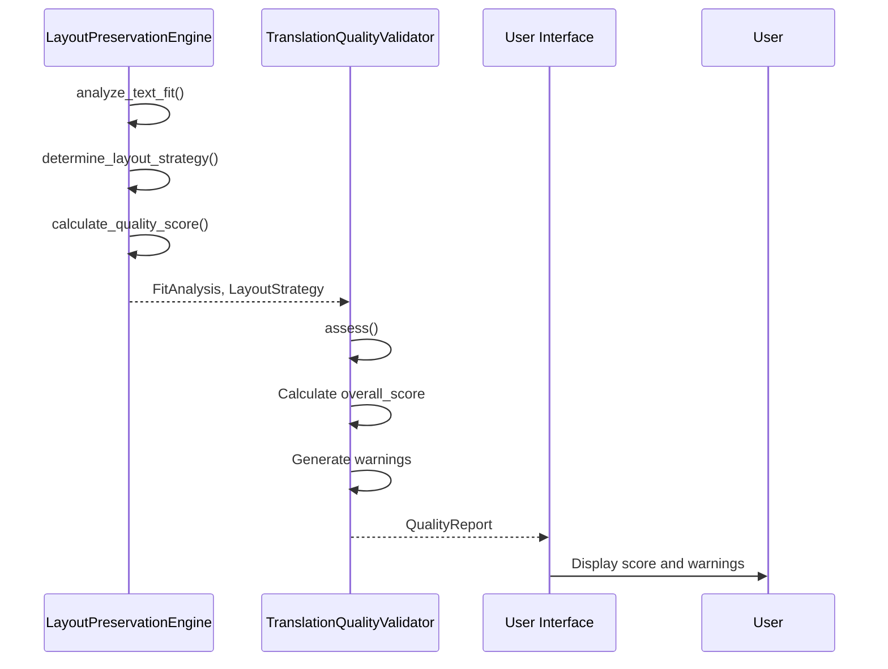
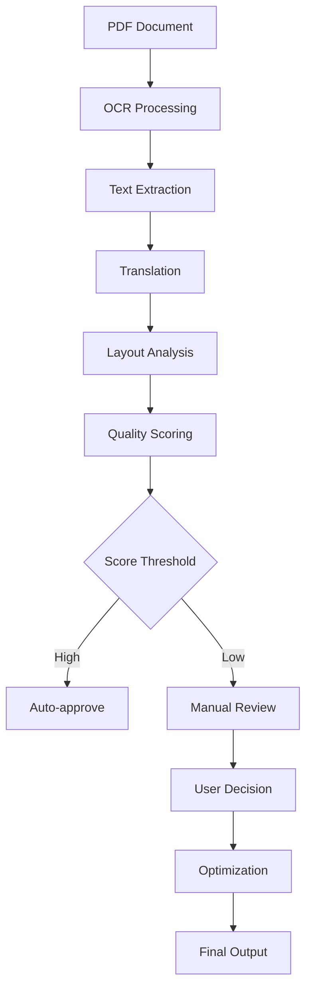

# Quality Scoring System

<cite>
**Referenced Files in This Document**  
- [dolphin_ocr/layout.py](file://dolphin_ocr/layout.py)
- [services/translation_quality.py](file://services/translation_quality.py)
- [ui/gradio_interface.py](file://ui/gradio_interface.py)
- [config/settings.py](file://config/settings.py)
</cite>

## Table of Contents
1. [Introduction](#introduction)
2. [Layout Preservation Quality Scoring](#layout-preservation-quality-scoring)
3. [Translation Quality Validation](#translation-quality-validation)
4. [Scoring Components and Heuristics](#scoring-components-and-heuristics)
5. [Quality Score Usage and Warnings](#quality-score-usage-and-warnings)
6. [Configuration and Customization](#configuration-and-customization)
7. [Integration with User Interface](#integration-with-user-interface)
8. [Conclusion](#conclusion)

## Introduction
The Quality Scoring System evaluates the fidelity of translated text within its original layout context. It combines layout preservation metrics with translation confidence to produce an overall quality assessment. This system ensures that translations maintain visual integrity while providing actionable feedback for optimization. The core components include the `LayoutPreservationEngine` for layout analysis and the `TranslationQualityValidator` for comprehensive quality reporting.

## Layout Preservation Quality Scoring

The `calculate_quality_score` method in `layout.py` computes a fidelity score between 0 and 1 based on layout preservation heuristics. This score reflects how well the translated text maintains the original document's visual structure through strategic adjustments.

The scoring system evaluates three primary factors:
- Penalties for font scaling, weighted by `SCALE_PENALTY_WEIGHT`
- Penalties for text wrapping, weighted by `WRAP_PENALTY_WEIGHT`
- A small bonus for no adjustments, defined by `NONE_BONUS`

The engine starts with a perfect score of 1.0 and applies penalties based on the chosen layout strategy. Font scaling incurs a penalty proportional to the absolute difference between the applied scale factor and 1.0. Text wrapping is penalized based on the number of lines used relative to the available space, normalized by the maximum allowed lines.

**Diagram sources**
- [dolphin_ocr/layout.py](file://dolphin_ocr/layout.py#L256-L284)

**Section sources**
- [dolphin_ocr/layout.py](file://dolphin_ocr/layout.py#L256-L284)

## Translation Quality Validation

The `TranslationQualityValidator` in `translation_quality.py` extends the layout quality score with translation confidence metrics to produce a comprehensive `QualityReport`. This validator combines multiple quality dimensions into a single overall score.

The validation process begins with a base confidence level (default 0.8) when translation confidence is unavailable. It then multiplies this by the layout quality score to produce an overall quality assessment. The system generates warnings for problematic scenarios, such as large text expansions without layout adjustments.

**Diagram sources**
- [services/translation_quality.py](file://services/translation_quality.py#L19-L143)

**Section sources**
- [services/translation_quality.py](file://services/translation_quality.py#L19-L143)

## Scoring Components and Heuristics

### Layout Quality Calculation
The layout quality score is calculated using normalized penalties that account for the degree of adjustment required:

- **Font Scaling Penalty**: Applied when font scaling is used (either alone or in hybrid mode). The penalty is proportional to the absolute difference between the scale factor and 1.0, multiplied by `SCALE_PENALTY_WEIGHT` (0.35).

- **Text Wrapping Penalty**: Applied when multiple lines are used. The penalty normalizes the number of additional lines by the available line capacity: `(lines - 1) / (max_lines - 1)`, then multiplies by `WRAP_PENALTY_WEIGHT` (0.25).

- **No Adjustment Bonus**: A small bonus (`NONE_BONUS` = 0.05) is added when no layout adjustments are needed, slightly favoring preservation of the original layout.

### Normalized Penalty Calculation
The system uses normalized penalties to ensure consistent scoring across different layout constraints:

**Section sources**
- [dolphin_ocr/layout.py](file://dolphin_ocr/layout.py#L256-L284)
- [services/translation_quality.py](file://services/translation_quality.py#L19-L143)

## Quality Score Usage and Warnings

The quality scoring system generates warnings for specific scenarios that may impact translation quality:

- **Large Expansion Without Adjustments**: When the text length ratio exceeds the threshold (default 1.6) and no layout adjustments are applied, the system warns "Large expansion without adjustments".

- **Wrapping Overflow**: When wrapped text exceeds the available space, potentially causing truncation, the system warns "Wrapping exceeds capacity; potential truncation".

These warnings help identify problematic translations that may require manual review or alternative strategies. The thresholds are configurable through environment variables, allowing adaptation to different document types and quality requirements.

**Diagram sources**
- [dolphin_ocr/layout.py](file://dolphin_ocr/layout.py#L256-L284)
- [services/translation_quality.py](file://services/translation_quality.py#L19-L143)

**Section sources**
- [services/translation_quality.py](file://services/translation_quality.py#L19-L143)

## Configuration and Customization

The quality scoring system supports extensive configuration through both code parameters and environment variables:

### Configurable Parameters
- `base_confidence`: Default translation confidence when none is provided
- `large_expansion_threshold`: Threshold for triggering large expansion warnings
- `warn_on_wrap_overflow`: Enable/disable warnings for wrapping overflow
- `font_scale_penalty_weight`: Weight for font scaling penalties
- `wrap_lines_penalty_weight`: Weight for text wrapping penalties
- `no_adjustment_bonus`: Bonus for no layout adjustments

### Environment Variable Overrides
The system respects the following environment variables:
- `QUALITY_LARGE_EXPANSION_THRESHOLD`: Overrides the large expansion threshold
- `QUALITY_WARN_WRAP_OVERFLOW`: Controls wrapping overflow warning behavior

These configuration options address common issues like score inflation by allowing fine-tuning of penalty weights and thresholds based on specific use cases and document characteristics.

**Section sources**
- [services/translation_quality.py](file://services/translation_quality.py#L49-L67)
- [config/settings.py](file://config/settings.py#L1-L548)

## Integration with User Interface

The quality scoring system integrates with the user interface to inform decision-making in the philosophy interface. Quality scores are displayed alongside translations, helping users evaluate the trade-offs between linguistic accuracy and layout preservation.

In the Gradio interface, quality metrics are rendered in a human-readable format, showing layout scores, OCR confidence, and text accuracy. This information guides optimization efforts by highlighting areas where layout adjustments may be necessary.

The system also supports philosophy-focused translation workflows, where quality scores help determine whether to preserve neologisms or apply standard translations based on layout impact.

**Diagram sources**
- [ui/gradio_interface.py](file://ui/gradio_interface.py#L1-L199)

**Section sources**
- [ui/gradio_interface.py](file://ui/gradio_interface.py#L1-L199)

## Conclusion
The Quality Scoring System provides a comprehensive framework for evaluating translation quality with a focus on layout preservation. By combining layout fidelity metrics with translation confidence, it delivers actionable insights for optimizing document translation workflows. The system's configurable nature allows adaptation to various document types and quality requirements, while its integration with the user interface supports informed decision-making in complex translation scenarios.
