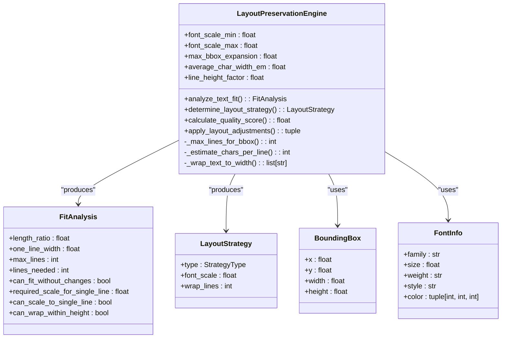
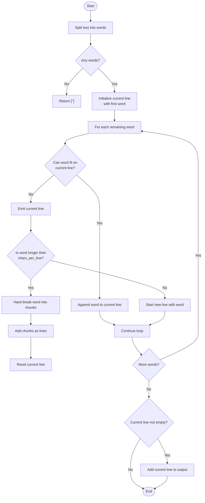
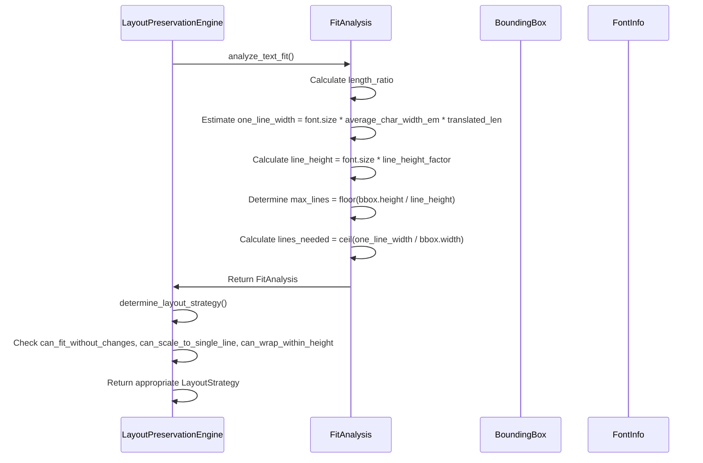
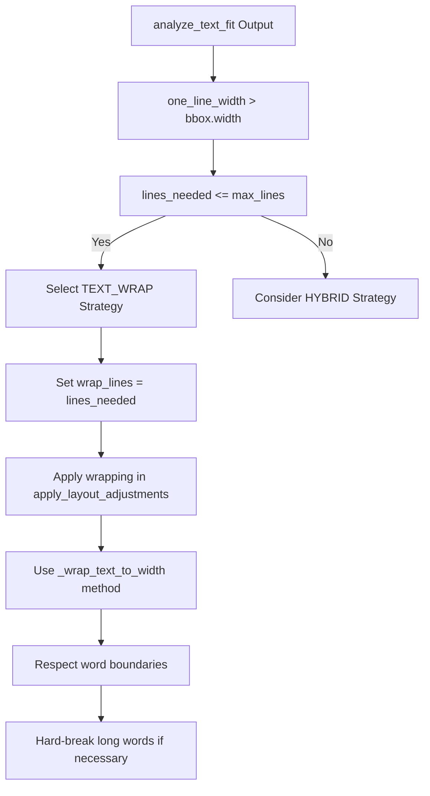
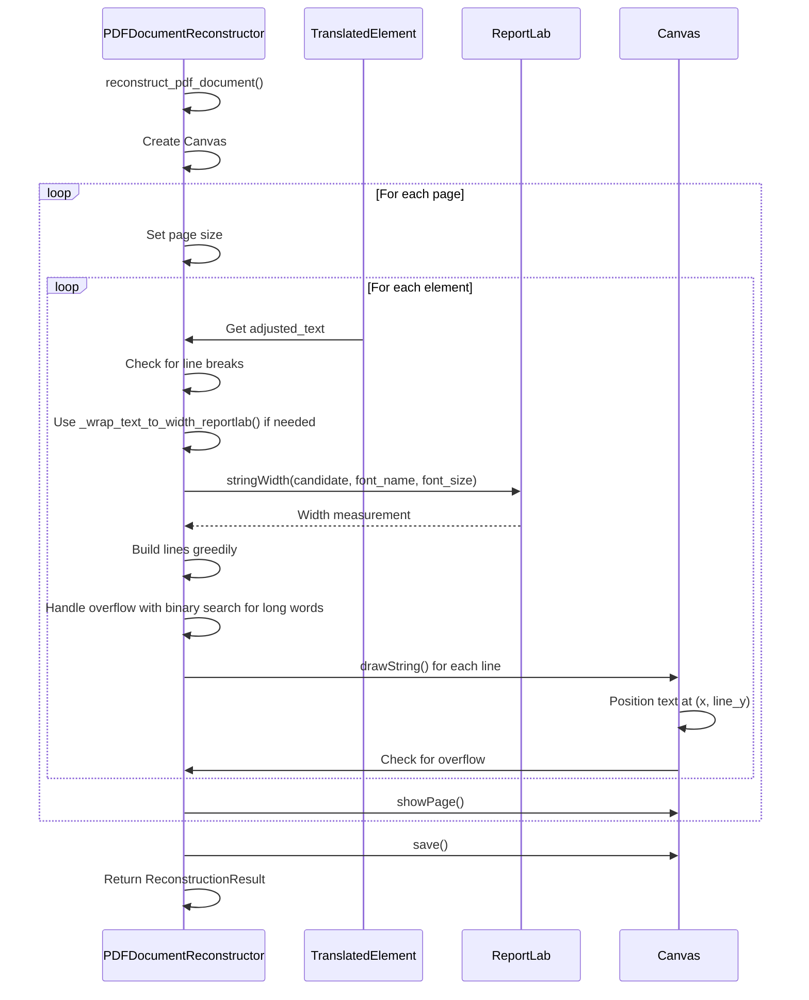

# Text Wrapping Algorithms

<cite>
**Referenced Files in This Document**  
- [dolphin_ocr/layout.py](file://dolphin_ocr/layout.py)
- [services/pdf_document_reconstructor.py](file://services/pdf_document_reconstructor.py)
- [tests/test_layout_preservation_engine.py](file://tests/test_layout_preservation_engine.py)
- [tests/test_pdf_document_reconstructor.py](file://tests/test_pdf_document_reconstructor.py)
</cite>

## Table of Contents
1. [Introduction](#introduction)
2. [Layout Preservation Engine Overview](#layout-preservation-engine-overview)
3. [Text Wrapping Decision Logic](#text-wrapping-decision-logic)
4. [Greedy Text Wrapping Algorithm](#greedy-text-wrapping-algorithm)
5. [Line Calculation and Bounding Box Constraints](#line-calculation-and-bounding-box-constraints)
6. [TEXT_WRAP Strategy Selection](#text_wrap-strategy-selection)
7. [ReportLab-Based Text Wrapping in Reconstruction](#reportlab-based-text-wrapping-in-reconstruction)
8. [Comparison of Wrapping Methods](#comparison-of-wrapping-methods)
9. [Handling Text Overflow and Layout Issues](#handling-text-overflow-and-layout-issues)
10. [Performance Considerations](#performance-considerations)

## Introduction
The layout preservation system in the PhenomenalLayout project employs sophisticated text wrapping algorithms to maintain document fidelity during translation. When translated text exceeds the original dimensions, the system must intelligently decide whether to scale fonts, wrap text, or use a hybrid approach. This document details the text wrapping algorithms used in the LayoutPreservationEngine and PDF reconstruction pipeline, focusing on how text wrapping decisions are made, implemented, and rendered while preserving the original document layout as much as possible.

## Layout Preservation Engine Overview
The LayoutPreservationEngine in layout.py is responsible for analyzing text fit and determining appropriate layout strategies when translating content. It uses heuristic-based width estimation to predict how translated text will fit within existing bounding boxes without relying on external font metrics, ensuring deterministic behavior for testing purposes.



**Diagram sources**
- [dolphin_ocr/layout.py](file://dolphin_ocr/layout.py#L97-L408)

**Section sources**
- [dolphin_ocr/layout.py](file://dolphin_ocr/layout.py#L97-L408)

## Text Wrapping Decision Logic
The LayoutPreservationEngine determines when text wrapping is necessary through a systematic analysis of available space and text dimensions. The decision process follows a priority hierarchy that aims to preserve the original appearance as much as possible.

```mermaid
flowchart TD
A[Start] --> B{Can text fit<br/>without changes?}
B --> |Yes| C[Strategy: NONE]
B --> |No| D{Can scale to fit<br/>on single line?}
D --> |Yes| E[Strategy: FONT_SCALE]
D --> |No| F{Can wrap within<br/>height constraints?}
F --> |Yes| G[Strategy: TEXT_WRAP]
F --> |No| H{Can use hybrid<br/>approach?}
H --> |Yes| I[Strategy: HYBRID]
H --> |No| J[Strategy: TEXT_WRAP<br/>(with overflow)]
```

**Diagram sources**
- [dolphin_ocr/layout.py](file://dolphin_ocr/layout.py#L221-L275)

**Section sources**
- [dolphin_ocr/layout.py](file://dolphin_ocr/layout.py#L221-L275)

## Greedy Text Wrapping Algorithm
The `_wrap_text_to_width` method implements a greedy wrapping algorithm that respects word boundaries while handling edge cases like excessively long words. This algorithm is designed to be simple and deterministic for testing purposes.



**Diagram sources**
- [dolphin_ocr/layout.py](file://dolphin_ocr/layout.py#L387-L408)

**Section sources**
- [dolphin_ocr/layout.py](file://dolphin_ocr/layout.py#L387-L408)

## Line Calculation and Bounding Box Constraints
The engine calculates the number of lines needed for text wrapping based on character width estimates and bounding box dimensions. This calculation uses a simple linear model that approximates text width based on font size and average character width.



**Diagram sources**
- [dolphin_ocr/layout.py](file://dolphin_ocr/layout.py#L147-L219)

**Section sources**
- [dolphin_ocr/layout.py](file://dolphin_ocr/layout.py#L147-L219)

## TEXT_WRAP Strategy Selection
The TEXT_WRAP strategy is selected when the calculated lines_needed can fit within the maximum allowed lines based on the bounding box height. This decision is made in the determine_layout_strategy method, which follows a priority order to preserve layout appearance.



**Diagram sources**
- [dolphin_ocr/layout.py](file://dolphin_ocr/layout.py#L248-L255)

**Section sources**
- [dolphin_ocr/layout.py](file://dolphin_ocr/layout.py#L248-L255)

## ReportLab-Based Text Wrapping in Reconstruction
During PDF reconstruction, the system uses ReportLab's stringWidth metrics for accurate width measurement, providing more precise text wrapping than the heuristic-based approach used in the layout analysis phase.



**Diagram sources**
- [services/pdf_document_reconstructor.py](file://services/pdf_document_reconstructor.py#L368-L408)

**Section sources**
- [services/pdf_document_reconstructor.py](file://services/pdf_document_reconstructor.py#L368-L408)

## Comparison of Wrapping Methods
The system employs two different text wrapping approaches: a simple heuristic-based method in the layout engine and a precise metrics-based method in the PDF reconstructor. This comparison highlights the differences between these approaches.

```mermaid
erDiagram
WRAPPING_METHODS {
string name PK
string purpose
string accuracy
string performance
string dependency
string use_case
}
WRAPPING_METHODS ||--o{ LAYOUT_ENGINE : "uses"
WRAPPING_METHODS ||--o{ PDF_RECONSTRUCTOR : "uses"
LAYOUT_ENGINE {
string method_name PK
string algorithm
string char_width_model
string line_breaking
string long_word_handling
}
PDF_RECONSTRUCTOR {
string method_name PK
string measurement_tool
string precision_level
string optimization
string fallback_strategy
}
LAYOUT_ENGINE {
"_wrap_text_to_width"
"Greedy with word boundaries"
"average_char_width_em heuristic"
"Space-based splitting"
"Hard-break by character count"
}
PDF_RECONSTRUCTOR {
"_wrap_text_to_width_reportlab"
"ReportLab stringWidth"
"High (actual font metrics)"
"Binary search for optimal break"
"Character-level hard wrapping"
}
WRAPPING_METHODS {
"Heuristic-Based"
"Layout analysis and strategy"
"Medium"
"Fast"
"None"
"Deterministic testing"
}
WRAPPING_METHODS {
"Metrics-Based"
"Final PDF rendering"
"High"
"Slower"
"ReportLab"
"Production output"
}
```

**Diagram sources**
- [dolphin_ocr/layout.py](file://dolphin_ocr/layout.py#L387-L408)
- [services/pdf_document_reconstructor.py](file://services/pdf_document_reconstructor.py#L368-L408)

**Section sources**
- [dolphin_ocr/layout.py](file://dolphin_ocr/layout.py#L387-L408)
- [services/pdf_document_reconstructor.py](file://services/pdf_document_reconstructor.py#L368-L408)

## Handling Text Overflow and Layout Issues
The system addresses common text overflow issues through several mechanisms, including line height factors, bounding box expansion, and overflow detection during rendering.

```mermaid
flowchart TD
A[Text Overflow Scenarios] --> B[Single Line Exceeds Width]
A --> C[Wrapped Text Exceeds Height]
A --> D[Font Scaling Insufficient]
B --> E[Apply TEXT_WRAP Strategy]
C --> F[Check can_wrap_within_height]
C --> G[Consider bbox expansion if max_bbox_expansion > 0]
D --> H[Use HYBRID Strategy]
F --> |No| I[Trim to max_lines]
G --> J[Calculate required_height]
J --> K[Expand bbox up to max_bbox_expansion]
K --> L[Re-evaluate line capacity]
M[During Rendering] --> N[Track line_y position]
N --> O{line_y < (y_top - box_height)?}
O --> |Yes| P[Stop rendering, log overflow]
O --> |No| Q[Continue to next line]
R[Solutions] --> S[Adjust line_height_factor]
R --> T[Increase max_bbox_expansion]
R --> U[Optimize average_char_width_em]
R --> V[Use quality metrics to identify issues]
```

**Diagram sources**
- [dolphin_ocr/layout.py](file://dolphin_ocr/layout.py#L318-L367)
- [services/pdf_document_reconstructor.py](file://services/pdf_document_reconstructor.py#L348-L355)

**Section sources**
- [dolphin_ocr/layout.py](file://dolphin_ocr/layout.py#L318-L367)
- [services/pdf_document_reconstructor.py](file://services/pdf_document_reconstructor.py#L348-L355)

## Performance Considerations
Processing large documents with extensive text wrapping requires careful performance optimization. The system balances accuracy with efficiency through several design choices.

```mermaid
graph TB
A[Performance Factors] --> B[Heuristic vs. Metrics]
A --> C[Algorithm Complexity]
A --> D[Memory Usage]
A --> E[Dependency Overhead]
B --> F[Layout Engine: O(n) with simple heuristics]
B --> G[PDF Reconstructor: O(n log n) with ReportLab metrics]
C --> H[Greedy wrapping: linear time]
C --> I[Binary search for long words: O(log n)]
D --> J[Store only essential text data]
D --> K[Process one page at a time]
E --> L[Layout Engine: no external dependencies]
E --> M[PDF Reconstructor: requires ReportLab]
N[Optimization Strategies] --> O[Use heuristics for analysis]
N --> P[Reserve precise metrics for final rendering]
N --> Q[Batch processing of elements]
N --> R[Quality metrics for monitoring]
O --> F
P --> G
```

**Diagram sources**
- [dolphin_ocr/layout.py](file://dolphin_ocr/layout.py#L97-L408)
- [services/pdf_document_reconstructor.py](file://services/pdf_document_reconstructor.py#L288-L486)

**Section sources**
- [dolphin_ocr/layout.py](file://dolphin_ocr/layout.py#L97-L408)
- [services/pdf_document_reconstructor.py](file://services/pdf_document_reconstructor.py#L288-L486)
