# Neologism Detection

<cite>
**Referenced Files in This Document**  
- [neologism_detector.py](file://services/neologism_detector.py)
- [neologism_models.py](file://models/neologism_models.py)
- [klages_terminology.json](file://config/klages_terminology.json)
- [philosophical_indicators.json](file://config/philosophical_indicators.json)
- [morphological_analyzer.py](file://services/morphological_analyzer.py)
- [philosophical_context_analyzer.py](file://services/philosophical_context_analyzer.py)
- [confidence_scorer.py](file://services/confidence_scorer.py)
- [philosophy_interface.html](file://templates/philosophy_interface.html)
- [neologism_integration_example.py](file://examples/neologism_integration_example.py)
</cite>

## Table of Contents
1. [Introduction](#introduction)
2. [Core Components](#core-components)
3. [Detection Algorithm](#detection-algorithm)
4. [Confidence Scoring System](#confidence-scoring-system)
5. [Integration with Neologism Models](#integration-with-neologism-models)
6. [Philosophical Context Analysis](#philosophical-context-analysis)
7. [User Interface Presentation](#user-interface-presentation)
8. [Configuration and Sensitivity Tuning](#configuration-and-sensitivity-tuning)
9. [Translation Workflow Integration](#translation-workflow-integration)
10. [Troubleshooting Guide](#troubleshooting-guide)
11. [Performance Considerations](#performance-considerations)

## Introduction
The Neologism Detection system is designed to identify novel or domain-specific terminology in philosophical texts, with a particular focus on German philosophical works. The service analyzes lexical patterns and contextual anomalies to detect neologisms that may require special handling during translation. This documentation provides a comprehensive overview of the detection mechanism, integration with data models, confidence scoring, and user interaction workflows.

**Section sources**
- [neologism_detector.py](file://services/neologism_detector.py#L1-L50)

## Core Components
The neologism detection system comprises several interconnected components that work together to identify and analyze novel terminology. The core components include the NeologismDetector class, data models for representing detected terms, and specialized analyzers for morphological and contextual analysis.

**Diagram sources**
- [neologism_detector.py](file://services/neologism_detector.py#L150-L200)
- [morphological_analyzer.py](file://services/morphological_analyzer.py#L15-L30)
- [philosophical_context_analyzer.py](file://services/philosophical_context_analyzer.py#L15-L30)
- [confidence_scorer.py](file://services/confidence_scorer.py#L15-L30)

**Section sources**
- [neologism_detector.py](file://services/neologism_detector.py#L1-L1090)
- [morphological_analyzer.py](file://services/morphological_analyzer.py#L1-L300)
- [philosophical_context_analyzer.py](file://services/philosophical_context_analyzer.py#L1-L388)
- [confidence_scorer.py](file://services/confidence_scorer.py#L1-L498)

## Detection Algorithm
The neologism detection algorithm follows a multi-stage process to identify potential neologisms in philosophical texts. The algorithm begins by extracting candidate terms from the input text, then analyzes each candidate using morphological and contextual analysis before calculating a confidence score.

The detection process starts with candidate extraction, which identifies potential neologisms based on specific lexical patterns. The system uses spaCy for linguistic analysis when available, falling back to regex-based pattern matching when spaCy is not installed. Candidate terms are selected based on criteria such as length, part of speech, and compound structure.

```mermaid
flowchart TD
Start([Start Analysis]) --> ExtractCandidates["Extract Candidate Terms"]
ExtractCandidates --> IsKnown["Check Against Known Terminology"]
IsKnown --> |Known| Skip["Skip Term"]
IsKnown --> |Unknown| MorphologicalAnalysis["Analyze Morphology"]
MorphologicalAnalysis --> ContextAnalysis["Analyze Philosophical Context"]
ContextAnalysis --> ConfidenceCalculation["Calculate Confidence Factors"]
ConfidenceCalculation --> ThresholdCheck{"Confidence ≥ Threshold?"}
ThresholdCheck --> |Yes| AddDetection["Add to Detected Neologisms"]
ThresholdCheck --> |No| Discard["Discard Candidate"]
AddDetection --> NextCandidate["Process Next Candidate"]
Discard --> NextCandidate
NextCandidate --> MoreCandidates{"More Candidates?"}
MoreCandidates --> |Yes| IsKnown
MoreCandidates --> |No| ReturnResults["Return Neologism Analysis"]
Skip --> NextCandidate
ReturnResults --> End([End])
```

**Diagram sources**
- [neologism_detector.py](file://services/neologism_detector.py#L500-L700)

**Section sources**
- [neologism_detector.py](file://services/neologism_detector.py#L400-L800)

## Confidence Scoring System
The confidence scoring system evaluates multiple factors to determine the likelihood that a candidate term is a genuine neologism. The system uses a weighted scoring approach that considers morphological, contextual, frequency, pattern, and linguistic factors.

The confidence scoring process begins with the calculation of individual confidence factors, which are then combined using weighted averages to produce a final confidence score. The weights are distributed as follows: context (30%), morphological (25%), frequency (20%), pattern (15%), and linguistic (10%) factors.

**Diagram sources**
- [confidence_scorer.py](file://services/confidence_scorer.py#L150-L300)

**Section sources**
- [confidence_scorer.py](file://services/confidence_scorer.py#L1-L498)
- [neologism_models.py](file://models/neologism_models.py#L100-L200)

## Integration with Neologism Models
The neologism detection system integrates with a comprehensive data model structure defined in neologism_models.py. This model hierarchy captures detailed information about detected neologisms, including their morphological structure, philosophical context, and confidence factors.

The primary data model is DetectedNeologism, which contains comprehensive information about each identified neologism. This includes the term itself, confidence score, type classification, positional information, and references to detailed analysis results. The model also includes metadata such as detection timestamp and source text identifier.

**Diagram sources**
- [neologism_models.py](file://models/neologism_models.py#L1-L558)

**Section sources**
- [neologism_models.py](file://models/neologism_models.py#L1-L558)

## Philosophical Context Analysis
The philosophical context analysis component evaluates the surrounding text to determine the philosophical relevance and significance of candidate terms. This analysis helps distinguish genuine philosophical neologisms from ordinary compound words or technical terms.

The context analyzer examines several factors, including philosophical density, semantic field, and conceptual clustering. Philosophical density is calculated by measuring the proportion of philosophical indicator words in the context window surrounding the candidate term. The semantic field identifies the dominant philosophical domain (e.g., consciousness, existence, knowledge), while conceptual clustering detects associations with specific philosophical movements or thinkers.

**Diagram sources**
- [philosophical_context_analyzer.py](file://services/philosophical_context_analyzer.py#L150-L300)

**Section sources**
- [philosophical_context_analyzer.py](file://services/philosophical_context_analyzer.py#L1-L388)

## User Interface Presentation
The philosophy interface presents detected neologisms to users for review and decision-making. The interface is implemented in philosophy_interface.html and provides a comprehensive environment for managing neologism detection results.

The interface features a tabbed navigation system with sections for neologism review, terminology management, philosophy settings, and session analytics. The neologism review tab displays a list of detected terms with filtering options by confidence level and search functionality. Users can select individual neologisms or use batch operations to preserve, translate, or customize translations for multiple terms.

**Diagram sources**
- [philosophy_interface.html](file://templates/philosophy_interface.html#L1-L393)

**Section sources**
- [philosophy_interface.html](file://templates/philosophy_interface.html#L1-L393)

## Configuration and Sensitivity Tuning
The neologism detection system provides several configuration options for sensitivity tuning and adaptation to different philosophical texts and authors. These settings allow users to adjust the detection threshold and contextual parameters to optimize performance for specific use cases.

The primary configuration parameter is the philosophical_threshold, which determines the minimum confidence score required for a term to be classified as a neologism. This threshold can be adjusted based on the desired sensitivity, with lower values detecting more potential neologisms (including more false positives) and higher values being more conservative.

Additional configuration options include the ability to specify custom terminology files, select philosophical author contexts, and adjust morphological analysis depth. The system also supports real-time detection and enhanced context analysis as configurable features.

**Diagram sources**
- [philosophy_interface.html](file://templates/philosophy_interface.html#L200-L300)

**Section sources**
- [neologism_detector.py](file://services/neologism_detector.py#L100-L150)
- [philosophy_interface.html](file://templates/philosophy_interface.html#L200-L300)

## Translation Workflow Integration
The neologism detection system integrates with translation workflows to ensure that detected neologisms are properly handled during the translation process. This integration is demonstrated in the neologism_integration_example.py file, which shows how the detection engine works with the translation service.

The integration follows a multi-step process: first, neologisms are detected in the source text; then, the text is prepared for translation by marking neologisms for preservation; next, the prepared text is translated; and finally, the translation is post-processed to handle the preserved neologisms appropriately.

**Diagram sources**
- [neologism_integration_example.py](file://examples/neologism_integration_example.py#L100-L200)

**Section sources**
- [neologism_integration_example.py](file://examples/neologism_integration_example.py#L1-L439)

## Troubleshooting Guide
This section addresses common issues that may arise when using the neologism detection system and provides guidance for resolving them.

**Issue: No neologisms detected in philosophical text**
- **Cause**: The spaCy German model may not be installed, limiting morphological analysis.
- **Solution**: Install the spaCy German model using `python -m spacy download de_core_news_sm` or ensure the model is available in the environment.

**Issue: High number of false positives**
- **Cause**: The philosophical threshold may be set too low for the specific text.
- **Solution**: Increase the philosophical_threshold parameter in the NeologismDetector initialization or adjust the sensitivity slider in the interface.

**Issue: Slow processing of large texts**
- **Cause**: The system processes text in chunks, but large documents may still require significant processing time.
- **Solution**: Ensure spaCy is properly installed for faster linguistic analysis, or consider processing documents in smaller sections.

**Issue: Missing philosophical indicators**
- **Cause**: The philosophical_indicators.json file may be missing or incomplete.
- **Solution**: Verify the config/philosophical_indicators.json file exists and contains the expected indicators, or the system will fall back to hardcoded indicators.

**Issue: Compound words not being detected**
- **Cause**: The morphological analyzer may not recognize certain compound patterns.
- **Solution**: Check the german_morphological_patterns configuration and consider adding custom patterns through the update_patterns method.

**Section sources**
- [neologism_detector.py](file://services/neologism_detector.py#L200-L400)
- [morphological_analyzer.py](file://services/morphological_analyzer.py#L100-L200)
- [philosophical_context_analyzer.py](file://services/philosophical_context_analyzer.py#L100-L200)

## Performance Considerations
The neologism detection system includes several performance optimizations to handle large philosophical texts efficiently. The primary optimization is text chunking, which divides large texts into smaller segments for processing, reducing memory usage and enabling parallel processing.

The system also implements caching for morphological analysis through the LRU (Least Recently Used) cache mechanism. This cache stores the results of previous morphological analyses, significantly improving performance when the same terms appear multiple times in a text or across multiple texts.

Additional performance considerations include lazy loading of resources such as the spaCy model and terminology maps, which are only loaded when first accessed. This reduces startup time and memory usage for applications that may not always require neologism detection.

For optimal performance, it is recommended to:
- Install and use the spaCy German model for faster linguistic analysis
- Process texts in appropriate chunk sizes (default 2000 characters)
- Reuse NeologismDetector instances to benefit from caching
- Monitor cache hit rates through the get_statistics method
- Consider the trade-off between detection sensitivity and processing time

**Section sources**
- [neologism_detector.py](file://services/neologism_detector.py#L300-L400)
- [morphological_analyzer.py](file://services/morphological_analyzer.py#L250-L300)
