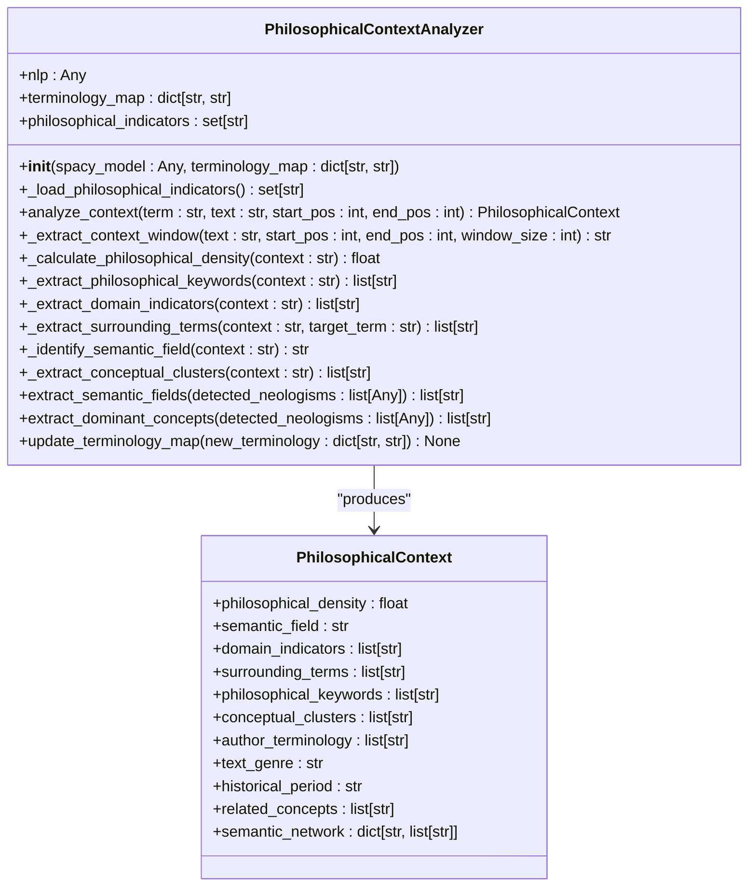
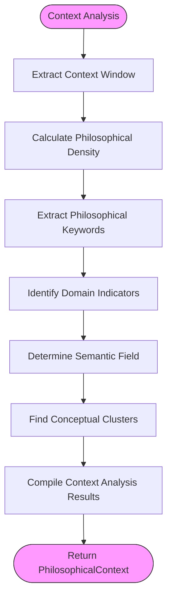
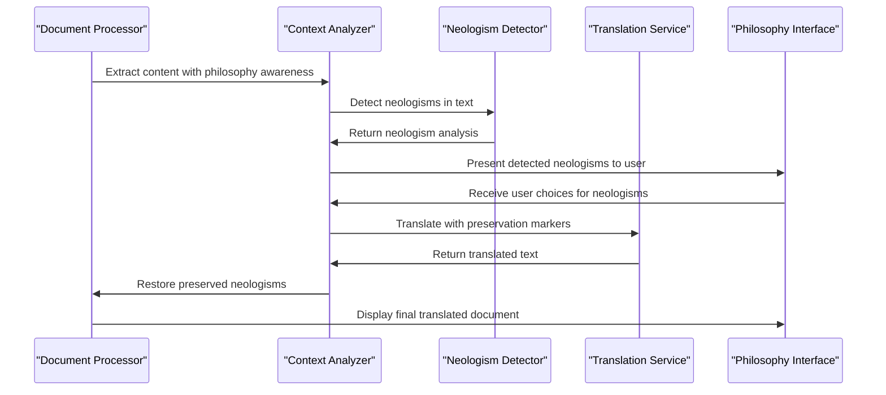
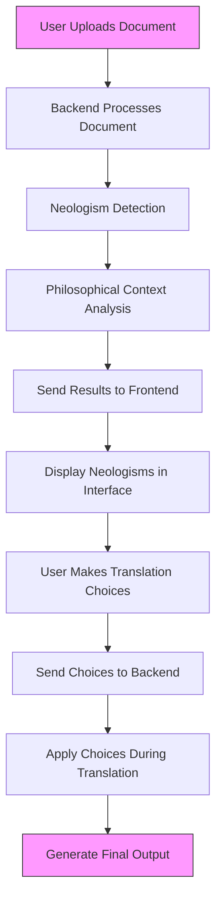
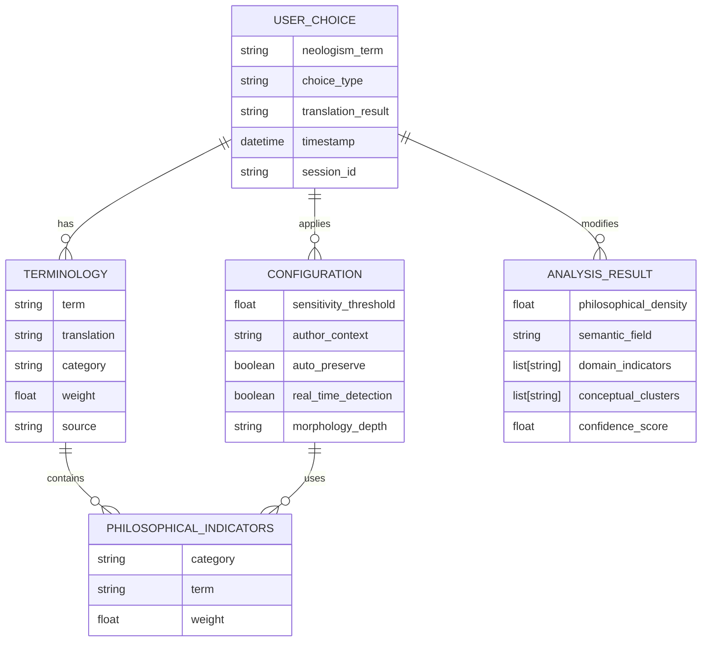
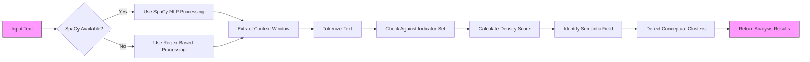

# Philosophical Context Analysis

<cite>
**Referenced Files in This Document**  
- [philosophical_context_analyzer.py](file://services/philosophical_context_analyzer.py)
- [philosophical_indicators.json](file://config/philosophical_indicators.json)
- [neologism_models.py](file://models/neologism_models.py)
- [philosophy_enhanced_translation_service.py](file://services/philosophy_enhanced_translation_service.py)
- [philosophy_enhanced_document_processor.py](file://services/philosophy_enhanced_document_processor.py)
- [philosophy_interface.html](file://templates/philosophy_interface.html)
- [philosophy_interface.js](file://static/philosophy_interface.js)
</cite>

## Table of Contents
1. [Introduction](#introduction)
2. [Core Analysis Mechanism](#core-analysis-mechanism)
3. [Indicator Database Structure](#indicator-database-structure)
4. [Context Scoring System](#context-scoring-system)
5. [Integration with Translation Services](#integration-with-translation-services)
6. [Philosophy Interface Integration](#philosophy-interface-integration)
7. [Configuration and Customization](#configuration-and-customization)
8. [Performance Considerations](#performance-considerations)
9. [Troubleshooting and Validation](#troubleshooting-and-validation)
10. [Conclusion](#conclusion)

## Introduction

The Philosophical Context Analyzer is a core component of the philosophy-enhanced translation system, designed to detect and analyze philosophical content in source texts. This system identifies philosophical genres, schools of thought, and thematic elements through keyword matching and pattern recognition against a comprehensive database of philosophical indicators. The analyzer plays a crucial role in determining translation strategies by assessing the philosophical relevance of text segments and influencing downstream processing decisions.

The analyzer operates by scanning text for specific philosophical terms and concepts, calculating context scores that inform translation decisions, and integrating with user choice systems to provide enhanced control over the translation of philosophical content. This documentation details the architecture, functionality, and integration points of the philosophical context analysis system.

**Section sources**
- [philosophical_context_analyzer.py](file://services/philosophical_context_analyzer.py#L1-L50)
- [philosophy_enhanced_translation_service.py](file://services/philosophy_enhanced_translation_service.py#L1-L50)

## Core Analysis Mechanism

The Philosophical Context Analyzer employs a multi-layered approach to detect philosophical content through keyword matching and pattern recognition. At its core, the system uses the `PhilosophicalContextAnalyzer` class to process text and extract philosophical context information.

The analysis process begins with the `_load_philosophical_indicators` method, which loads philosophical terms from the configuration file `philosophical_indicators.json`. If the configuration file is unavailable, the system falls back to a hardcoded set of philosophical terms. This dual approach ensures robustness while allowing for customization.



**Diagram sources**
- [philosophical_context_analyzer.py](file://services/philosophical_context_analyzer.py#L25-L390)
- [neologism_models.py](file://models/neologism_models.py#L150-L200)

The `analyze_context` method serves as the primary entry point for context analysis, extracting various contextual elements from a specified window around a target term. This method coordinates several specialized analysis functions that identify different aspects of philosophical content.

**Section sources**
- [philosophical_context_analyzer.py](file://services/philosophical_context_analyzer.py#L50-L100)

## Indicator Database Structure

The philosophical indicator database is structured as a JSON file that organizes philosophical terms into hierarchical categories. Each category contains a list of terms relevant to that philosophical domain, allowing for systematic classification of content.

```json
{
  "core_philosophical_terms": [
    "philosophie", "metaphysik", "ontologie", "epistemologie", "ethik",
    "ästhetik", "logik", "dialektik", "hermeneutik", "phänomenologie"
  ],
  "conceptual_terms": [
    "begriff", "konzept", "idee", "prinzip", "kategorie", "struktur",
    "system", "methode", "theorie", "hypothese", "thesis", "antithesis"
  ],
  "existence_and_being": [
    "sein", "dasein", "existenz", "wesen", "substanz", "realität",
    "wirklichkeit", "erscheinung", "phänomen", "noumen"
  ],
  "consciousness_and_mind": [
    "bewusstsein", "geist", "seele", "psyche", "verstand", "vernunft",
    "intellekt", "intuition", "erkenntnis", "wahrnehmung", "anschauung"
  ],
  "value_and_meaning": [
    "wert", "bedeutung", "sinn", "zweck", "ziel", "ideal", "norm",
    "gut", "böse", "schön", "hässlich", "wahr", "falsch"
  ],
  "temporal_and_spatial": [
    "zeit", "raum", "ewigkeit", "unendlichkeit", "endlichkeit",
    "temporal", "spatial", "chronos", "kairos"
  ],
  "abstract_relations": [
    "relation", "verhältnis", "beziehung", "zusammenhang", "einheit",
    "vielheit", "identität", "differenz", "ähnlichkeit", "verschiedenheit"
  ],
  "philosophical_movements": [
    "idealismus", "materialismus", "empirismus", "rationalismus",
    "kritizismus", "positivismus", "existentialismus", "nihilismus"
  ]
}
```

The database structure follows a clear categorization scheme that reflects major philosophical domains and subfields. This hierarchical organization enables the system to not only detect the presence of philosophical content but also classify it according to specific philosophical traditions and conceptual areas.

The analyzer loads these indicators during initialization and converts them to lowercase for case-insensitive matching. Additionally, terms from the terminology map are incorporated into the indicator set, allowing for domain-specific extensions to the philosophical vocabulary.

**Section sources**
- [philosophical_indicators.json](file://config/philosophical_indicators.json#L1-L35)
- [philosophical_context_analyzer.py](file://services/philosophical_context_analyzer.py#L100-L150)

## Context Scoring System

The philosophical context analyzer implements a sophisticated scoring mechanism that quantifies the philosophical relevance of text segments. This scoring system combines multiple metrics to provide a comprehensive assessment of philosophical content density and thematic focus.

The primary scoring component is the philosophical density calculation, implemented in the `_calculate_philosophical_density` method. This function computes the ratio of philosophical terms to total words in a context window, then scales the result to enhance differentiation between texts with varying levels of philosophical content.



**Diagram sources**
- [philosophical_context_analyzer.py](file://services/philosophical_context_analyzer.py#L200-L300)

The scoring system also identifies domain-specific indicators through pattern matching against predefined domain patterns. These patterns cover major philosophical disciplines such as metaphysics, epistemology, ethics, aesthetics, and logic. The presence of multiple indicators within a domain strengthens the classification confidence.

Semantic field identification is performed by the `_identify_semantic_field` method, which evaluates the context against a set of semantic field indicators. Each field is assigned a score based on the number of matching indicators, with the highest-scoring field designated as the dominant semantic field.

Conceptual clustering is achieved through the `_extract_conceptual_clusters` method, which detects patterns associated with specific philosophical movements and schools of thought. This includes clusters for German Idealism, phenomenology, existentialism, philosophy of mind, and metaphysics.

The results of these analyses are compiled into a `PhilosophicalContext` object that contains comprehensive information about the philosophical nature of the analyzed text segment. This object is then used by downstream services to inform translation strategies and user interface decisions.

**Section sources**
- [philosophical_context_analyzer.py](file://services/philosophical_context_analyzer.py#L200-L350)
- [neologism_models.py](file://models/neologism_models.py#L150-L200)

## Integration with Translation Services

The philosophical context analyzer integrates seamlessly with the philosophy-enhanced translation services to influence translation strategies based on detected philosophical content. This integration occurs primarily through the `PhilosophyEnhancedTranslationService` and `PhilosophyEnhancedDocumentProcessor` classes.



**Diagram sources**
- [philosophy_enhanced_document_processor.py](file://services/philosophy_enhanced_document_processor.py#L100-L200)
- [philosophy_enhanced_translation_service.py](file://services/philosophy_enhanced_translation_service.py#L100-L200)

The integration process begins when the `PhilosophyEnhancedDocumentProcessor` extracts content from a document. During this process, the system detects neologisms and analyzes their philosophical context using the `PhilosophicalContextAnalyzer`. The results of this analysis inform decisions about how to handle these terms during translation.

The `PhilosophyEnhancedTranslationService` uses the context analysis results to implement preservation strategies for philosophical terms. When a term is identified as having significant philosophical context, the service can preserve it in the original form, translate it according to user preferences, or apply a custom translation.

The translation service employs a marker-based approach to preserve neologisms during translation. Terms to be preserved are replaced with unique markers before translation, and then restored to their original form (or user-specified translation) afterward. This ensures that philosophically significant terms are not altered by automated translation processes.

**Section sources**
- [philosophy_enhanced_translation_service.py](file://services/philosophy_enhanced_translation_service.py#L100-L500)
- [philosophy_enhanced_document_processor.py](file://services/philosophy_enhanced_document_processor.py#L100-L500)

## Philosophy Interface Integration

The philosophical context analyzer is tightly integrated with the user-facing philosophy interface, providing a seamless experience for managing philosophical content during translation. The interface, implemented in `philosophy_interface.html` and `philosophy_interface.js`, allows users to review detected neologisms, make choices about their translation, and configure system settings.



**Diagram sources**
- [philosophy_interface.html](file://templates/philosophy_interface.html#L1-L50)
- [philosophy_interface.js](file://static/philosophy_interface.js#L1-L50)

The interface presents detected neologisms in a dedicated tab, allowing users to filter by confidence level and search for specific terms. For each neologism, the interface displays its philosophical context, including the semantic field, domain indicators, and conceptual clusters identified by the analyzer.

Users can make individual choices for each neologism, selecting to preserve the original term, translate it normally, or provide a custom translation. Batch operations allow users to apply the same choice to multiple selected terms, improving efficiency when dealing with documents containing numerous philosophical terms.

The settings tab in the interface provides controls for configuring the philosophical analysis system. Users can adjust the neologism detection sensitivity, select a specific philosophical author context (such as Klages, Heidegger, or Nietzsche), and enable or disable various analysis features like real-time detection and enhanced context analysis.

The analytics tab offers insights into the session's processing statistics, including the total number of detected neologisms, their confidence distribution, and the user's choice patterns. This information helps users understand the philosophical content of their documents and evaluate their translation decisions.

**Section sources**
- [philosophy_interface.html](file://templates/philosophy_interface.html#L1-L393)
- [philosophy_interface.js](file://static/philosophy_interface.js#L1-L50)

## Configuration and Customization

The philosophical context analyzer supports extensive configuration and customization options, allowing users to adapt the system to specific philosophical traditions, authors, or domains. These customization features enhance the system's flexibility and applicability across diverse philosophical texts.

The primary customization mechanism is the `philosophical_indicators.json` file, which can be modified to add or remove philosophical terms and categories. Users can extend the indicator database to include specialized terminology relevant to particular philosophical schools or individual thinkers.

The system also supports custom terminology files through the interface settings. Users can upload JSON, CSV, or TXT files containing specialized philosophical terms and their preferred translations. These custom terms are incorporated into the analysis process, expanding the system's vocabulary for specific domains.



**Diagram sources**
- [philosophical_indicators.json](file://config/philosophical_indicators.json#L1-L35)
- [philosophy_interface.html](file://templates/philosophy_interface.html#L1-L393)

The analyzer provides programmatic access to customization through the `update_terminology_map` method, which allows external components to dynamically add new terminology during runtime. This feature enables integration with external knowledge bases or dynamic terminology systems.

Configuration options exposed through the interface include:
- **Neologism Detection Sensitivity**: A slider control that adjusts the confidence threshold for neologism detection
- **Philosophical Author Context**: A dropdown menu for selecting specific philosophical traditions or authors
- **Auto-preserve Settings**: A checkbox to enable automatic preservation of high-confidence neologisms
- **Real-time Detection**: A toggle for enabling continuous neologism detection during text input
- **Morphological Analysis Depth**: A selector for choosing the level of morphological analysis

These configuration options allow users to fine-tune the system's behavior according to their specific needs, whether they are working with dense philosophical treatises requiring careful term preservation or more general texts where automated translation is preferred.

**Section sources**
- [philosophical_context_analyzer.py](file://services/philosophical_context_analyzer.py#L350-L390)
- [philosophy_interface.html](file://templates/philosophy_interface.html#L1-L393)

## Performance Considerations

The philosophical context analyzer is designed with performance optimization in mind, balancing thorough analysis with efficient processing. The system employs several strategies to manage the computational demands of deep text scanning and philosophical content detection.

The analyzer uses a context window approach, examining a fixed-size window around each target term rather than processing entire documents at once. This localized analysis reduces memory usage and allows for parallel processing of different text segments. The default window size of 200 characters provides sufficient context for accurate analysis while maintaining performance.

For text processing, the system can utilize spaCy models when available, leveraging their efficient tokenization and linguistic analysis capabilities. When spaCy is not available, the analyzer falls back to regular expression-based text processing, ensuring functionality while sacrificing some linguistic sophistication.

The indicator matching process is optimized through the use of a set data structure for storing philosophical terms. This allows for O(1) average-case lookup time when checking if a word is a philosophical indicator, significantly improving performance compared to list-based searches.



**Diagram sources**
- [philosophical_context_analyzer.py](file://services/philosophical_context_analyzer.py#L100-L300)

The system also implements caching mechanisms through the terminology map and indicator set, loading these resources once during initialization rather than reloading them for each analysis. This reduces I/O operations and improves response times for repeated analyses.

For large documents, the philosophy-enhanced document processor implements batch processing with configurable concurrency limits. The `max_concurrent_pages` parameter allows users to balance processing speed with system resource usage, preventing excessive memory consumption during large-scale document processing.

Despite these optimizations, deep text scanning for philosophical content remains computationally intensive. Users should be aware that documents with high philosophical density may require longer processing times, particularly when enhanced context analysis and morphological analysis are enabled.

**Section sources**
- [philosophical_context_analyzer.py](file://services/philosophical_context_analyzer.py#L100-L300)
- [philosophy_enhanced_document_processor.py](file://services/philosophy_enhanced_document_processor.py#L100-L200)

## Troubleshooting and Validation

Effective troubleshooting and validation are essential for ensuring the accuracy and reliability of the philosophical context analysis system. This section provides guidance on identifying and resolving common issues, as well as methods for validating analysis accuracy.

Common misclassification issues typically stem from ambiguous terms that have both philosophical and non-philosophical meanings. For example, words like "system," "concept," or "theory" may be flagged as philosophical indicators even in non-philosophical contexts. To address this, the system uses context window analysis and semantic field identification to reduce false positives.

When encountering misclassification issues, users should:
1. Review the context window size and adjust if necessary
2. Examine the terminology map for conflicting entries
3. Verify the philosophical indicators database for overly broad terms
4. Check the confidence threshold settings in the interface

Validation of analysis accuracy can be performed through several methods:
- **Manual Review**: Compare the system's detected neologisms and context analysis with human assessment of the same text
- **Consistency Testing**: Process the same document multiple times to ensure consistent results
- **Boundary Case Testing**: Use texts with clear philosophical content and texts with no philosophical content to verify the system's discrimination ability
- **Incremental Testing**: Gradually increase text complexity to identify performance or accuracy thresholds

The system provides several diagnostic tools to aid in troubleshooting:
- The analytics tab in the philosophy interface displays processing statistics and choice distributions
- Detailed logging is available through the system's logging framework
- The terminology management interface allows inspection and modification of the indicator database
- Confidence scores provide a quantitative measure of analysis certainty

For persistent issues, users can:
1. Reset to default configuration settings
2. Rebuild the terminology database from known good sources
3. Adjust the sensitivity threshold to reduce false positives
4. Disable specific analysis features to isolate problems
5. Consult the system logs for error messages and warnings

Regular validation and calibration of the system are recommended, especially when working with new philosophical traditions or specialized domains. This ensures that the context analyzer continues to provide accurate and reliable analysis results.

**Section sources**
- [philosophical_context_analyzer.py](file://services/philosophical_context_analyzer.py#L1-L390)
- [philosophy_interface.html](file://templates/philosophy_interface.html#L1-L393)

## Conclusion

The Philosophical Context Analyzer represents a sophisticated system for detecting and analyzing philosophical content in source texts. By combining keyword matching, pattern recognition, and context scoring, the analyzer provides valuable insights into the philosophical nature of texts, informing translation strategies and user interface decisions.

The system's modular architecture, with its separation of indicator database, analysis engine, and integration components, allows for flexible configuration and extension. The hierarchical organization of philosophical indicators enables precise classification of content according to philosophical domains and traditions.

Integration with the translation pipeline ensures that philosophically significant terms receive appropriate treatment during translation, preserving their meaning and context. The user interface provides intuitive controls for managing neologisms and configuring analysis parameters, making the system accessible to users with varying levels of technical expertise.

Performance optimizations, including efficient data structures and batch processing capabilities, enable the system to handle large documents while maintaining responsiveness. Comprehensive troubleshooting and validation guidance helps ensure accurate and reliable analysis results.

As philosophical texts continue to present unique challenges for automated translation, the Philosophical Context Analyzer provides a robust solution that respects the nuances and complexities of philosophical language and thought.

**Section sources**
- [philosophical_context_analyzer.py](file://services/philosophical_context_analyzer.py#L1-L390)
- [philosophical_indicators.json](file://config/philosophical_indicators.json#L1-L35)
- [philosophy_enhanced_translation_service.py](file://services/philosophy_enhanced_translation_service.py#L1-L1053)
- [philosophy_enhanced_document_processor.py](file://services/philosophy_enhanced_document_processor.py#L1-L730)
- [philosophy_interface.html](file://templates/philosophy_interface.html#L1-L393)
