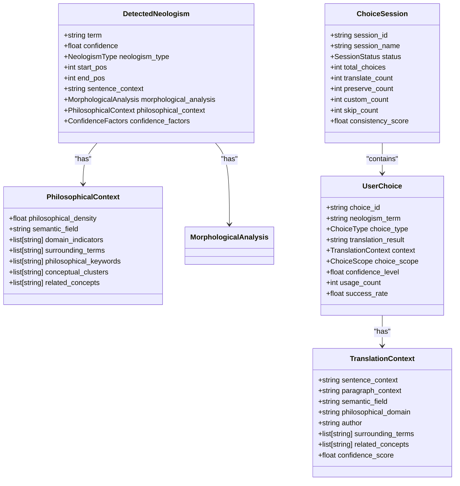
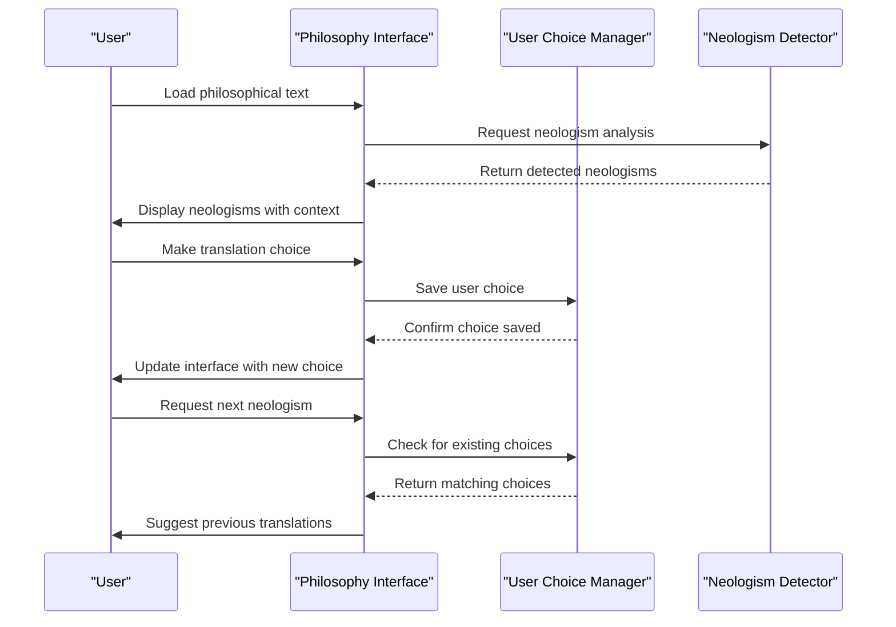
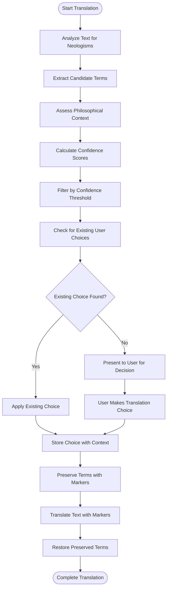

# Philosophy-Enhanced Features

<cite>
**Referenced Files in This Document**  
- [philosophical_context_analyzer.py](file://services/philosophical_context_analyzer.py)
- [neologism_detector.py](file://services/neologism_detector.py)
- [user_choice_manager.py](file://services/user_choice_manager.py)
- [neologism_models.py](file://models/neologism_models.py)
- [user_choice_models.py](file://models/user_choice_models.py)
- [klages_terminology.json](file://config/klages_terminology.json)
- [philosophical_indicators.json](file://config/philosophical_indicators.json)
- [philosophy_interface.html](file://templates/philosophy_interface.html)
- [philosophy_interface.css](file://static/philosophy_interface.css)
- [philosophy_interface.js](file://static/philosophy_interface.js)
</cite>

## Table of Contents
1. [Philosophical Context Analysis](#philosophical-context-analysis)
2. [Neologism Detection in Philosophical Texts](#neologism-detection-in-philosophical-texts)
3. [User Choice Management System](#user-choice-management-system)
4. [Data Models for Philosophical Translation](#data-models-for-philosophical-translation)
5. [Terminology Integration from Klages Database](#terminology-integration-from-klages-database)
6. [Interactive Philosophy Interface](#interactive-philosophy-interface)
7. [Translation Workflow with User Choices](#translation-workflow-with-user-choices)
8. [Case Studies: Heidegger and Derrida Translations](#case-studies-heidegger-and-derrida-translations)
9. [Enhancing Academic Translation Accuracy](#enhancing-academic-translation-accuracy)

## Philosophical Context Analysis

The philosophical context analyzer identifies philosophical texts by detecting key indicators and conceptual clusters within the text. The system uses a comprehensive set of philosophical indicators loaded from both configuration files and hardcoded defaults. These indicators include core philosophical terms like "philosophie", "metaphysik", and "ontologie", as well as conceptual terms such as "begriff", "konzept", and "idee". The analyzer also recognizes existence and being terms like "sein", "dasein", and "existenz", along with consciousness and mind concepts including "bewusstsein", "geist", and "psyche".

The analyzer calculates philosophical density by measuring the proportion of philosophical keywords within a text context window. This density is scaled to provide better differentiation between texts with varying philosophical content. The system identifies semantic fields such as consciousness, existence, knowledge, value, beauty, language, time, and space by analyzing the prevalence of specific indicator terms. For example, a text with frequent occurrences of "bewusstsein" and "geist" would be classified under the "consciousness" semantic field.

Additionally, the analyzer detects conceptual clusters associated with specific philosophical movements or schools of thought. These include German idealism (identified by terms like "hegel" and "kant"), phenomenology (indicated by "husserl" and "phänomenologie"), and existentialism (signaled by "kierkegaard" and "existenz"). The system extracts surrounding terms and philosophical keywords from the context window around detected neologisms, providing a rich contextual understanding that informs subsequent translation decisions.

**Section sources**
- [philosophical_context_analyzer.py](file://services/philosophical_context_analyzer.py#L1-L389)

## Neologism Detection in Philosophical Texts

The neologism detector identifies new or specialized terminology in philosophical works through a multi-layered analysis approach. The system first extracts candidate terms from the text, focusing on nouns, proper nouns, and complex words that exhibit characteristics of German compounds. Candidates are identified using both spaCy linguistic analysis when available and regex pattern matching as a fallback.

The detector applies several filters to identify potential neologisms. It checks for compound word structures common in German philosophical terminology, such as words with linking elements like "s", "n", or "es", or those ending with abstract suffixes like "heit", "keit", or "ung". The system specifically targets philosophical compounds that combine prefixes like "vor", "nach", or "über" with philosophical concepts.

For each candidate term, the system performs morphological analysis to decompose the word into its constituent parts, identifying prefixes, suffixes, and root words. This analysis is combined with philosophical context assessment to determine if the term appears in a philosophically dense environment. The confidence scoring system evaluates multiple factors including morphological complexity, context density, philosophical indicators, and structural regularity to assign a confidence score to each potential neologism.

The detector classifies neologisms into types such as compounds, philosophical terms, technical terms, or derived words based on their morphological structure and contextual indicators. This classification helps inform appropriate translation strategies and user interaction patterns.

**Section sources**
- [neologism_detector.py](file://services/neologism_detector.py#L1-L1090)

## User Choice Management System

The user choice manager enables users to define preferred translations for ambiguous philosophical terms through a comprehensive session-based system. Users can create choice sessions that track their translation decisions throughout a document or project. Each session maintains statistics on the number of choices made, including translations, preservations, custom translations, and skipped terms.

When a neologism is detected, the system presents users with options to translate, preserve, or provide a custom translation for the term. Users can specify the scope of their choice, which determines how widely the decision is applied. The available scopes include global (all occurrences), contextual (similar contexts), document (current document), and session (current session only).

The system stores user choices with rich contextual metadata, including sentence context, paragraph context, semantic field, philosophical domain, author, and surrounding terms. This context enables the system to intelligently apply previous choices to similar situations in future translations. Each choice is assigned a confidence level and can include user notes explaining the rationale behind the translation decision.

The choice manager includes conflict detection and resolution capabilities. When conflicting choices are detected for the same term, the system can automatically resolve them based on strategies such as latest wins, highest confidence, or context-specific application. Users can also manually resolve conflicts through the interface.

**Section sources**
- [user_choice_manager.py](file://services/user_choice_manager.py#L1-L1048)

## Data Models for Philosophical Translation

The system employs sophisticated data models to track term variants and user preferences. The `DetectedNeologism` model captures comprehensive information about each identified neologism, including its term, confidence score, type, position in the text, and surrounding context. It also stores detailed morphological analysis, philosophical context, and confidence factors that contributed to the detection.

The `PhilosophicalContext` model tracks semantic fields, domain indicators, surrounding terms, philosophical keywords, and conceptual clusters associated with each neologism. This context information is crucial for determining appropriate translation strategies and identifying similar contexts for applying user choices.

The `UserChoice` model stores user decisions with metadata including choice type, translation result, context, scope, confidence level, and usage statistics. The `TranslationContext` model captures the linguistic and philosophical environment in which a choice was made, enabling context-aware application of translation decisions. The `ChoiceSession` model organizes user choices into coherent workflows, tracking statistics and consistency across multiple translation decisions.

These models work together to create a persistent knowledge base of translation decisions that can be reapplied across documents and projects, ensuring consistency in the translation of specialized philosophical terminology.

**Diagram sources **
- [neologism_models.py](file://models/neologism_models.py#L1-L558)
- [user_choice_models.py](file://models/user_choice_models.py#L1-L685)

**Section sources**
- [neologism_models.py](file://models/neologism_models.py#L1-L558)
- [user_choice_models.py](file://models/user_choice_models.py#L1-L685)

## Terminology Integration from Klages Database

The system leverages terminology from the klages_terminology.json database to inform translation decisions. This comprehensive terminology database contains mappings between German philosophical terms and their preferred English translations, curated from authoritative sources in philosophical scholarship.

During initialization, the neologism detector loads terminology entries from the klages_terminology.json file and incorporates them into its analysis process. These known terms are excluded from neologism detection, preventing false positives for established philosophical vocabulary. The terminology entries also serve as additional philosophical indicators, enhancing the system's ability to identify philosophical texts.

The terminology database informs the confidence scoring system by providing baseline expectations for how certain terms should be translated. When a user encounters a term that exists in the Klages database, the system can suggest the established translation as a starting point, while still allowing the user to override it with a custom choice if desired.

The integration of the Klages terminology ensures that translations adhere to established academic conventions while still accommodating the need for context-specific interpretations that often arise in philosophical scholarship.

**Section sources**
- [klages_terminology.json](file://config/klages_terminology.json)
- [neologism_detector.py](file://services/neologism_detector.py#L1-L1090)

## Interactive Philosophy Interface

The philosophy interface provides users with an interactive environment for making translation choices. The interface is implemented through HTML, CSS, and JavaScript files that create a user-friendly experience for managing philosophical translation decisions.

The interface displays detected neologisms in their contextual environment, showing the sentence and paragraph in which they appear. For each term, users can select from translation options including standard translation, preservation of the original term, or entry of a custom translation. The interface shows the semantic field and conceptual clusters associated with each term, helping users understand the philosophical context.

Users can manage their choice sessions through the interface, viewing statistics on their translation consistency and the number of decisions made. The interface also displays potential conflicts between choices and provides tools for resolving them. Historical choices are presented with their success rates and usage statistics, helping users make informed decisions about which translations to apply in new contexts.

The interface supports batch processing of neologisms, allowing users to efficiently work through multiple terms in sequence. It also provides search and filtering capabilities for finding specific terms or reviewing previous choices.

**Diagram sources **
- [philosophy_interface.html](file://templates/philosophy_interface.html)
- [philosophy_interface.css](file://static/philosophy_interface.css)
- [philosophy_interface.js](file://static/philosophy_interface.js)
- [user_choice_manager.py](file://services/user_choice_manager.py#L1-L1048)
- [neologism_detector.py](file://services/neologism_detector.py#L1-L1090)

**Section sources**
- [philosophy_interface.html](file://templates/philosophy_interface.html)
- [philosophy_interface.css](file://static/philosophy_interface.css)
- [philosophy_interface.js](file://static/philosophy_interface.js)

## Translation Workflow with User Choices

The translation workflow integrates user choices through a systematic process that begins with text analysis and ends with final translation. When a user initiates translation, the system first analyzes the text for neologisms using the philosophical context analyzer and neologism detector. Detected terms are evaluated for their philosophical density and contextual relevance.

For each detected neologism, the system queries the user choice manager to find existing translation decisions that match the current context. The matching algorithm considers semantic field, philosophical domain, author, surrounding terms, and related concepts to find the most appropriate previous choice. When multiple choices exist, the system ranks them by context similarity and usage success rate.

Users are presented with suggested translations based on their previous choices, along with the option to make a new decision. When a choice is made, it is stored with full contextual metadata and becomes available for future use. The system applies preservation markers to terms that should be kept in their original form, ensuring they pass through the translation engine unchanged.

During the translation phase, the system temporarily replaces neologisms with unique markers, translates the modified text, and then restores the original terms or their custom translations. This process ensures that specialized philosophical terminology is handled according to user preferences while the rest of the text receives standard translation.

The workflow is designed to be iterative, with each translation session building a richer knowledge base of user preferences that improves the accuracy and consistency of future translations.

**Diagram sources **
- [philosophy_enhanced_translation_service.py](file://services/philosophy_enhanced_translation_service.py#L1-L1053)
- [user_choice_manager.py](file://services/user_choice_manager.py#L1-L1048)
- [neologism_detector.py](file://services/neologism_detector.py#L1-L1090)

**Section sources**
- [philosophy_enhanced_translation_service.py](file://services/philosophy_enhanced_translation_service.py#L1-L1053)

## Case Studies: Heidegger and Derrida Translations

The system demonstrates its capabilities through the translation of complex philosophical works by Heidegger and Derrida. For Heidegger's texts, the system identifies key terms like "Dasein", "Sein", and "Ereignis" as neologisms requiring special handling. When "Dasein" is encountered, the system presents the user with options for translation, such as "being-there", "existence", or "presence".

Based on the philosophical context analysis, the system recognizes that "Dasein" appears in discussions of existential phenomenology and is surrounded by terms like "existenzial", "ontologisch", and "hermeneutisch". This context informs the suggested translations and helps the user understand the term's conceptual framework. The user can choose to preserve "Dasein" in its original form, particularly in academic contexts where the German term is conventionally retained.

For Derrida's works, the system identifies "différance" as a key neologism. The morphological analysis reveals its construction from "différer" with the altered suffix "-ance" instead of "-ence", highlighting Derrida's deliberate linguistic innovation. The philosophical context analysis shows its appearance in discussions of language, meaning, and deconstruction.

The user choice system allows translators to establish consistent approaches to these terms across multiple texts. For example, a user might decide to translate "Dasein" as "being-there" in introductory texts but preserve it as "Dasein" in advanced scholarly works. These choices are stored with their contextual parameters and can be automatically applied to similar situations in future translations.

The system's ability to track and apply user preferences ensures terminological consistency across an entire corpus of philosophical works, while still allowing for nuanced, context-sensitive decisions.

**Section sources**
- [philosophical_context_analyzer.py](file://services/philosophical_context_analyzer.py#L1-L389)
- [neologism_detector.py](file://services/neologism_detector.py#L1-L1090)
- [user_choice_manager.py](file://services/user_choice_manager.py#L1-L1048)

## Enhancing Academic Translation Accuracy

These features collectively enhance accuracy in academic philosophical translation by addressing the unique challenges of translating specialized terminology. The system's ability to identify philosophical texts and key concepts ensures that appropriate translation strategies are applied from the outset. By recognizing the distinctive characteristics of philosophical language, the system avoids treating specialized terms as simple vocabulary that can be translated with standard dictionaries.

The neologism detection system prevents the loss of nuanced meaning that can occur when innovative philosophical terms are translated inconsistently or inappropriately. By flagging these terms for special attention, the system ensures that translators consider the full conceptual weight of each term rather than applying mechanical translation rules.

The user choice management system creates a persistent knowledge base of translation decisions that grows more sophisticated with use. This collective intelligence helps maintain consistency across multiple translations and prevents the repetition of decision-making for commonly encountered terms. The context-aware application of choices ensures that translations are appropriate to the specific philosophical framework in which terms appear.

By integrating established terminology from authoritative sources like the Klages database while still allowing for user customization, the system balances adherence to academic conventions with the need for interpretive flexibility. This hybrid approach supports both fidelity to original texts and the creative insights that characterize high-quality philosophical scholarship.

The interactive interface lowers the barrier to sophisticated translation practices, making advanced features accessible to scholars who may not have extensive training in computational linguistics. This democratization of translation technology empowers a wider range of researchers to produce accurate, consistent philosophical translations.

**Section sources**
- [philosophical_context_analyzer.py](file://services/philosophical_context_analyzer.py#L1-L389)
- [neologism_detector.py](file://services/neologism_detector.py#L1-L1090)
- [user_choice_manager.py](file://services/user_choice_manager.py#L1-L1048)
- [neologism_models.py](file://models/neologism_models.py#L1-L558)
- [user_choice_models.py](file://models/user_choice_models.py#L1-L685)
- [klages_terminology.json](file://config/klages_terminology.json)
