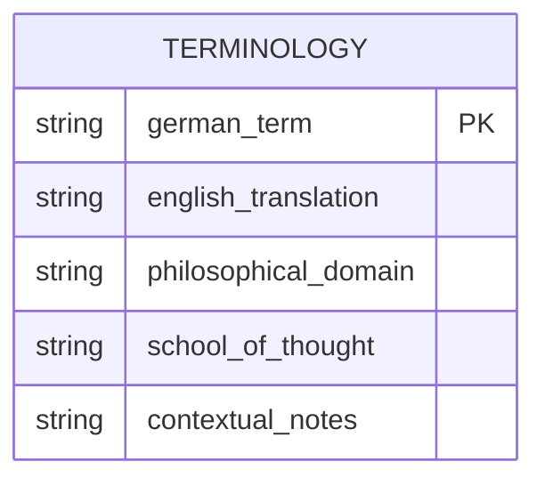
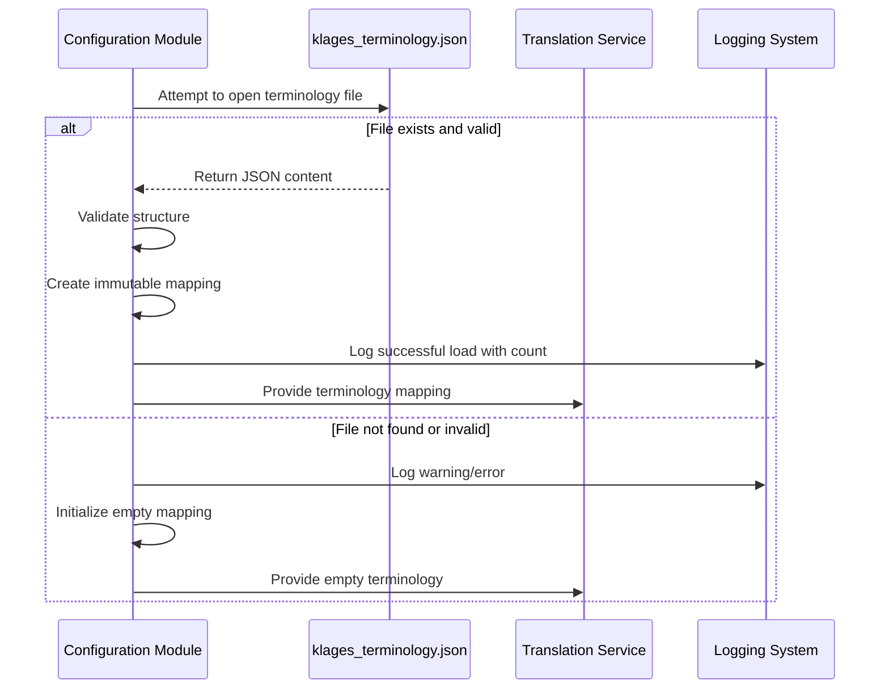
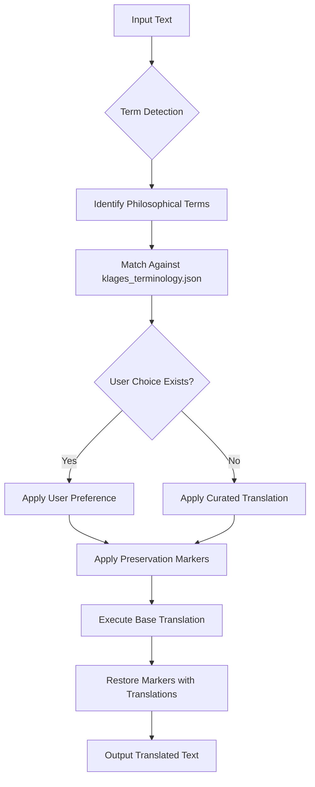
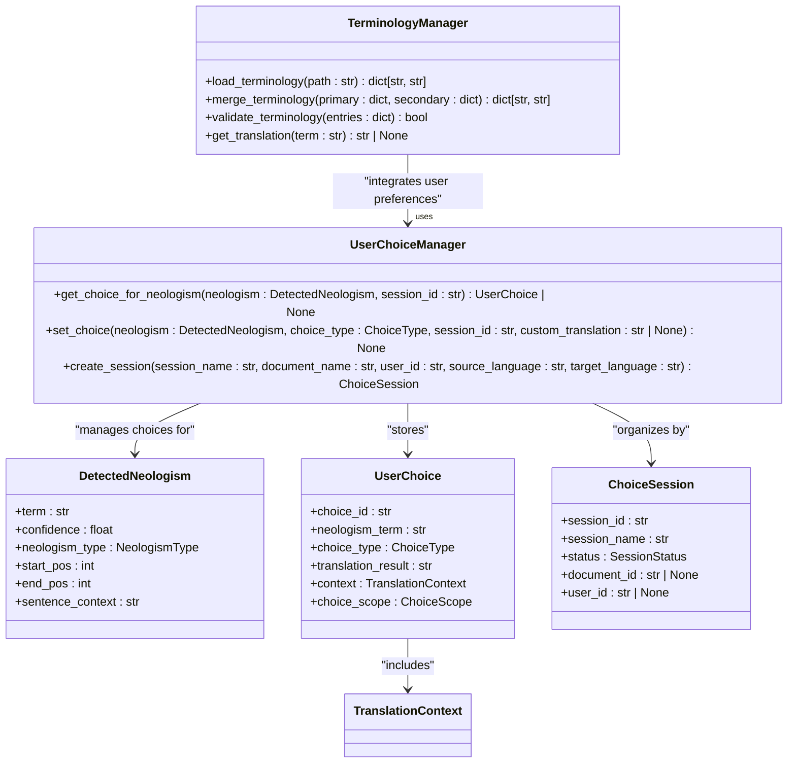

# Terminology Handling

<cite>
**Referenced Files in This Document**  
- [klages_terminology.json](file://config/klages_terminology.json)
- [philosophy_enhanced_translation_service.py](file://services/philosophy_enhanced_translation_service.py)
- [main.py](file://config/main.py)
- [philosophical_indicators.json](file://config/philosophical_indicators.json)
- [neologism_models.py](file://models/neologism_models.py)
- [user_choice_models.py](file://models/user_choice_models.py)
</cite>

## Table of Contents
1. [Introduction](#introduction)
2. [Terminology Database Structure](#terminology-database-structure)
3. [Terminology Loading and Configuration](#terminology-loading-and-configuration)
4. [Translation Processing with Terminology Guidance](#translation-processing-with-terminology-guidance)
5. [Term Processing Examples](#term-processing-examples)
6. [Custom Terminology Management](#custom-terminology-management)
7. [Performance and Versioning Considerations](#performance-and-versioning-considerations)
8. [Troubleshooting and Extension](#troubleshooting-and-extension)

## Introduction
This document details the terminology handling system within the philosophy-enhanced translation framework, focusing on the `klages_terminology.json` database. The system is designed to ensure scholarly accuracy and consistency when translating philosophically significant texts, particularly those containing historically important terms and school-specific interpretations. By leveraging curated terminology mappings, the system maintains the integrity of specialized philosophical vocabulary during translation processes. The documentation covers the structure of the terminology database, its integration with the translation service, configuration options, and practical considerations for maintaining translation quality across diverse philosophical domains.

**Section sources**
- [klages_terminology.json](file://config/klages_terminology.json)
- [philosophy_enhanced_translation_service.py](file://services/philosophy_enhanced_translation_service.py)

## Terminology Database Structure
The `klages_terminology.json` file serves as the primary terminology database, containing curated mappings of German philosophical terms to their English equivalents. The structure follows a simple key-value format where German terms serve as keys and their English translations as values. This design enables efficient lookups during translation processing.

The terminology database includes terms from various philosophical domains, including existential concepts (e.g., "Dasein", "Existenz"), consciousness and mind (e.g., "Bewußtsein", "Geist"), and metaphysical constructs (e.g., "Wirklichkeit", "Erscheinung"). Each entry represents a carefully considered translation that accounts for the specific philosophical context in which the term is used, rather than providing literal or general dictionary definitions.

The database also includes compound terms and specialized philosophical constructs that require particular attention during translation. For example, terms like "Lebensfeindlichkeit" (Life-hostility) and "Weltanschauung" (Worldview) maintain their conceptual integrity through precise translations that preserve their philosophical meaning. The terminology extends to fundamental concepts in metaphysics, epistemology, and anthropology, ensuring comprehensive coverage of key philosophical vocabulary.

**Diagram sources**
- [klages_terminology.json](file://config/klages_terminology.json)

**Section sources**
- [klages_terminology.json](file://config/klages_terminology.json)
- [philosophical_indicators.json](file://config/philosophical_indicators.json)

## Terminology Loading and Configuration
The terminology system is initialized through the configuration module (`main.py`), which loads the `klages_terminology.json` file during application startup. The loading process employs robust error handling to manage potential issues such as missing files or invalid JSON formatting. When the terminology file is successfully loaded, it is converted into an immutable mapping proxy to ensure thread safety and prevent unintended modifications during runtime.

The configuration system provides multiple pathways for specifying the terminology file location, including direct file path references and environment variable configurations. This flexibility allows for different deployment scenarios while maintaining consistent terminology handling. The default configuration points to `config/klages_terminology.json` relative to the application root, ensuring predictable behavior across different environments.

Terminology loading occurs as part of the application's initialization sequence, with appropriate logging to indicate success or failure. When the file is not found or contains invalid data, the system continues operation with an empty terminology mapping, allowing translation to proceed while logging the issue for administrative attention. This fail-safe approach ensures that terminology issues do not prevent the core translation functionality from operating.

**Diagram sources**
- [main.py](file://config/main.py#L172-L210)
- [philosophy_enhanced_translation_service.py](file://services/philosophy_enhanced_translation_service.py#L100-L110)

**Section sources**
- [main.py](file://config/main.py#L172-L210)
- [philosophy_enhanced_translation_service.py](file://services/philosophy_enhanced_translation_service.py#L100-L110)

## Translation Processing with Terminology Guidance
The philosophy-enhanced translation service integrates terminology guidance through a multi-stage processing pipeline. When a translation request is initiated, the system first detects potential neologisms and philosophical terms in the source text. This detection leverages both the curated terminology database and contextual analysis to identify terms that require special handling.

During the translation phase, detected terms are processed according to user preferences and the terminology database. The system supports multiple handling strategies, including term preservation, custom translation, and standard translation. When a term from the `klages_terminology.json` database is encountered, the system applies the predefined translation unless overridden by user choices or context-specific requirements.

The processing flow maintains the integrity of philosophical terminology by temporarily replacing identified terms with unique markers before translation. After the base translation is complete, the markers are replaced with either the curated translation from the terminology database or a user-specified alternative. This marker-based approach ensures that complex philosophical terms are not fragmented or mistranslated by the underlying translation engine.

**Diagram sources**
- [philosophy_enhanced_translation_service.py](file://services/philosophy_enhanced_translation_service.py#L300-L500)
- [neologism_models.py](file://models/neologism_models.py#L100-L200)

**Section sources**
- [philosophy_enhanced_translation_service.py](file://services/philosophy_enhanced_translation_service.py#L300-L500)
- [neologism_models.py](file://models/neologism_models.py#L100-L200)

## Term Processing Examples
The terminology system demonstrates its effectiveness through consistent handling of key philosophical terms. For example, when processing the term "Dasein", the system recognizes it as a fundamental Heideggerian concept and applies the translation "Being-there" as specified in the `klages_terminology.json` database. This preserves the specialized philosophical meaning rather than using a more general translation like "existence" or "being".

Similarly, terms like "epoché" from phenomenological tradition are processed with attention to their specific philosophical context. The system recognizes "epoché" as a technical term requiring preservation of its Greek origin and philosophical significance, ensuring it is not translated literally or normalized to common vocabulary. The terminology database guides this decision, maintaining consistency across different texts and translation sessions.

For complex compound terms like "Lebensfeindlichkeit" (Life-hostility), the system applies the curated translation that captures both the literal meaning and philosophical connotation. This approach prevents the term from being broken down into separate components during translation, which could lose the specific conceptual meaning intended by the original author. The system also handles terms with multiple valid translations by providing context-aware selection based on surrounding philosophical concepts.

The processing of terms like "différance" demonstrates the system's ability to handle neologisms created by philosophers. While not explicitly listed in the terminology database, such terms are identified through contextual analysis and morphological patterns typical of philosophical neologisms. The system then applies preservation strategies to maintain these innovative terms in their original form, recognizing their importance to the author's philosophical project.

**Section sources**
- [klages_terminology.json](file://config/klages_terminology.json)
- [philosophy_enhanced_translation_service.py](file://services/philosophy_enhanced_translation_service.py#L400-L450)

## Custom Terminology Management
The system supports flexible management of custom terminology through configurable loading options and user choice mechanisms. Users can specify alternative terminology files through configuration parameters, allowing for domain-specific or author-specific terminology databases to be loaded alongside or instead of the default `klages_terminology.json`. This enables adaptation to different philosophical traditions or scholarly preferences.

The user choice system complements the static terminology database by allowing dynamic overrides and additions. When a term is encountered that is not in the terminology database, or when a user prefers a different translation, the system records these choices for future use. These user-defined terms are managed through the `UserChoiceManager` and can be scoped globally, contextually, or to specific documents, providing fine-grained control over terminology application.

Terminology merging occurs when multiple sources are active, with precedence rules determining which translation takes priority. Typically, user choices override curated terminology, which in turn overrides automatic translation engine results. This hierarchy ensures that scholarly preferences and user decisions take precedence while still benefiting from the comprehensive coverage of the curated database.

The system also supports export and import of terminology collections, facilitating collaboration among scholars and consistency across different projects. Custom terminology files can be versioned and shared, creating a collaborative ecosystem for philosophical translation standards.

**Diagram sources**
- [user_choice_models.py](file://models/user_choice_models.py#L100-L300)
- [philosophy_enhanced_translation_service.py](file://services/philosophy_enhanced_translation_service.py#L200-L250)

**Section sources**
- [user_choice_models.py](file://models/user_choice_models.py#L100-L300)
- [philosophy_enhanced_translation_service.py](file://services/philosophy_enhanced_translation_service.py#L200-L250)

## Performance and Versioning Considerations
The terminology system is designed with performance optimization in mind, particularly when handling large terminology sets. The use of dictionary data structures for the terminology mappings ensures O(1) lookup times, allowing efficient term detection even with extensive databases. The system implements caching mechanisms to minimize file I/O operations, loading terminology data into memory at startup and reusing it across translation requests.

Versioning of terminology files follows semantic versioning principles, with major versions indicating breaking changes to term mappings, minor versions for additions, and patch versions for corrections. This allows users to manage terminology updates systematically and understand the impact of upgrading to newer versions. The system includes validation checks to ensure terminology file integrity and compatibility with the current software version.

Encoding considerations are addressed through consistent UTF-8 encoding for all terminology files, supporting the full range of characters used in philosophical texts across different languages. The system validates encoding during file loading and provides clear error messages when encoding issues are detected, preventing silent corruption of special characters and diacritical marks.

For very large terminology sets, the system supports modular organization through multiple specialized files that can be loaded on demand based on the document's philosophical domain. This selective loading approach reduces memory footprint and improves performance by only loading relevant terminology subsets rather than maintaining the entire database in memory at once.

**Section sources**
- [main.py](file://config/main.py#L172-L210)
- [philosophy_enhanced_translation_service.py](file://services/philosophy_enhanced_translation_service.py#L100-L120)

## Troubleshooting and Extension
Common issues in terminology handling typically involve term mismatches, where the system fails to recognize a philosophical term that should be in the database. These issues can be resolved by verifying the spelling and diacritical marks in both the source text and terminology file, as the matching is case-sensitive and exact. When terms are consistently missed, they can be added to a custom terminology file or through the user choice system for immediate correction.

For extending the terminology database, the recommended approach is to create domain-specific extensions rather than modifying the core `klages_terminology.json` file directly. This preserves the integrity of the curated database while allowing for specialization. New terms should include not only the translation but also contextual notes and philosophical domain classification to ensure proper application.

Performance issues with large terminology sets can be addressed by optimizing the file structure, ensuring proper indexing, and implementing selective loading based on document metadata. Monitoring tools are available to track terminology hit rates and processing times, helping identify bottlenecks in the translation pipeline.

The system's modular design allows for extension through custom terminology loaders, alternative matching algorithms, and integration with external philosophical lexicons. These extensions can be implemented through the existing plugin architecture without modifying the core translation engine, ensuring compatibility and maintainability.

**Section sources**
- [klages_terminology.json](file://config/klages_terminology.json)
- [philosophy_enhanced_translation_service.py](file://services/philosophy_enhanced_translation_service.py#L500-L600)
- [main.py](file://config/main.py#L172-L210)
