# User Choice Management System

<cite>
**Referenced Files in This Document**
- [services/user_choice_manager.py](file://services/user_choice_manager.py)
- [models/user_choice_models.py](file://models/user_choice_models.py)
- [database/choice_database.py](file://database/choice_database.py)
- [examples/user_choice_integration_example.py](file://examples/user_choice_integration_example.py)
- [api/routes.py](file://api/routes.py)
- [tests/test_user_choice_manager.py](file://tests/test_user_choice_manager.py)
- [templates/philosophy_interface.html](file://templates/philosophy_interface.html)
- [static/philosophy_interface.js](file://static/philosophy_interface.js)
- [config/klages_terminology.json](file://config/klages_terminology.json)
</cite>

## Table of Contents
1. [Introduction](#introduction)
2. [System Architecture](#system-architecture)
3. [Core Components](#core-components)
4. [Data Models](#data-models)
5. [API Integration](#api-integration)
6. [Session Management](#session-management)
7. [Choice Processing](#choice-processing)
8. [Conflict Resolution](#conflict-resolution)
9. [Import/Export Functionality](#importexport-functionality)
10. [Performance Optimization](#performance-optimization)
11. [Troubleshooting Guide](#troubleshooting-guide)
12. [Best Practices](#best-practices)

## Introduction

The User Choice Management System is a sophisticated service designed to enable users to define, store, and apply preferred translations for ambiguous or context-sensitive philosophical terms. This system serves as the backbone for managing user preferences in the Phenomenal Layout application, particularly for handling neologisms and philosophical terminology that require nuanced translation decisions.

The system operates on the principle of context-aware translation choices, allowing users to establish preferences that can be reapplied consistently across multiple documents while maintaining flexibility for different contexts. This is especially valuable for philosophical texts where terms often carry deep semantic weight and multiple interpretations depending on the context.

## System Architecture

The User Choice Management System follows a layered architecture with clear separation of concerns:


**Diagram sources**
- [services/user_choice_manager.py](file://services/user_choice_manager.py#L27-L1012)
- [database/choice_database.py](file://database/choice_database.py#L25-L1489)
- [models/user_choice_models.py](file://models/user_choice_models.py#L1-L685)

## Core Components

### UserChoiceManager

The `UserChoiceManager` class serves as the central orchestrator for all user choice operations. It manages the lifecycle of user choices, from creation to persistence, and provides intelligent matching capabilities for reusing choices across different contexts.

Key responsibilities include:
- **Choice Creation**: Recording user decisions for neologisms with comprehensive context
- **Context Matching**: Intelligent matching of choices based on semantic similarity
- **Session Management**: Tracking user sessions and maintaining state
- **Conflict Resolution**: Automatic and manual resolution of conflicting choices
- **Statistics Tracking**: Comprehensive metrics on choice usage and effectiveness

### ChoiceDatabase

The `ChoiceDatabase` class handles all database operations, providing robust persistence and efficient querying capabilities. It manages the underlying SQLite database with optimized indexing for performance.

Features include:
- **Bulk Operations**: Efficient batch processing for large datasets
- **Index Management**: Strategic indexing for optimal query performance
- **Transaction Safety**: ACID compliance for data integrity
- **Configuration Management**: Tunable parameters for performance optimization

### TranslationContext

The `TranslationContext` class encapsulates all contextual information relevant to translation decisions, enabling sophisticated matching algorithms that consider semantic field, authorship, linguistic features, and positional context.

**Section sources**
- [services/user_choice_manager.py](file://services/user_choice_manager.py#L27-L1012)
- [database/choice_database.py](file://database/choice_database.py#L25-L1489)
- [models/user_choice_models.py](file://models/user_choice_models.py#L45-L150)

## Data Models

The system employs a comprehensive set of data models that capture the complexity of philosophical translation decisions:

### UserChoice Model

The `UserChoice` model represents individual user decisions with extensive metadata:

```python
@dataclass
class UserChoice:
    choice_id: str
    neologism_term: str
    choice_type: ChoiceType
    translation_result: str = ""
    context: TranslationContext = field(default_factory=TranslationContext)
    choice_scope: ChoiceScope = ChoiceScope.CONTEXTUAL
    confidence_level: float = 1.0
    user_notes: str = ""
    created_at: str = field(default_factory=lambda: datetime.now().isoformat())
    updated_at: str = field(default_factory=lambda: datetime.now().isoformat())
    last_used_at: Optional[str] = None
    usage_count: int = 0
    success_rate: float = 1.0
    session_id: Optional[str] = None
    document_id: Optional[str] = None
    parent_choice_id: Optional[str] = None
    is_validated: bool = False
    validation_source: str = ""
    quality_score: float = 0.0
    export_tags: set[str] = field(default_factory=set)
    import_source: str = ""
```

### ChoiceScope Enumeration

The system supports four distinct scopes for choice application:

- **GLOBAL**: Apply to all occurrences of the term across all documents
- **CONTEXTUAL**: Apply to similar contexts based on semantic similarity
- **DOCUMENT**: Apply within the current document only
- **SESSION**: Apply within the current session only

### ChoiceType Enumeration

Available choice types include:
- **TRANSLATE**: Translate the term according to user preference
- **PRESERVE**: Keep the original term unchanged
- **CUSTOM_TRANSLATION**: Apply a custom translation provided by the user
- **SKIP**: Skip processing for this term

**Section sources**
- [models/user_choice_models.py](file://models/user_choice_models.py#L15-L150)
- [models/user_choice_models.py](file://models/user_choice_models.py#L200-L400)

## API Integration

The User Choice Management System integrates seamlessly with the FastAPI-based REST API, providing comprehensive endpoints for all user choice operations:

### Core API Endpoints


**Diagram sources**
- [api/routes.py](file://api/routes.py#L80-L150)
- [services/user_choice_manager.py](file://services/user_choice_manager.py#L150-L250)

### Philosophy Interface Integration

The philosophy interface provides an interactive web-based experience for managing user choices:

- **Real-time Updates**: WebSocket connections for live progress tracking
- **Batch Operations**: Bulk processing of multiple neologisms
- **Visual Feedback**: Progress indicators and choice suggestions
- **Export/Import**: Seamless data portability across sessions

**Section sources**
- [api/routes.py](file://api/routes.py#L80-L200)
- [static/philosophy_interface.js](file://static/philosophy_interface.js#L1-L660)

## Session Management

Sessions provide a logical grouping mechanism for organizing user choices within specific translation projects:

### Session Lifecycle


### Session Features

- **Automatic Expiration**: Configurable session timeout (default: 24 hours)
- **Consistency Scoring**: Automated assessment of translation consistency
- **Statistical Tracking**: Comprehensive metrics on choice patterns
- **Export Capability**: Full session data export for backup and analysis

**Section sources**
- [services/user_choice_manager.py](file://services/user_choice_manager.py#L60-L120)
- [models/user_choice_models.py](file://models/user_choice_models.py#L300-L450)

## Choice Processing

The system implements sophisticated algorithms for processing neologisms and matching user choices:

### Context-Based Matching

The matching algorithm considers multiple factors to determine the best choice for a given neologism:

```mermaid
flowchart TD
Start([Neologism Detected]) --> CreateContext["Create Translation Context"]
CreateContext --> ExactMatch{"Exact Term Match?"}
ExactMatch --> |Yes| FindBest["Find Best Matching Choice"]
ExactMatch --> |No| SimilarContext["Search Similar Contexts"]
FindBest --> CheckApplicable{"Choice Applicable?"}
CheckApplicable --> |Yes| UpdateStats["Update Usage Stats"]
CheckApplicable --> |No| SimilarContext
SimilarContext --> FilterByContext["Filter by Context Applicability"]
FilterByContext --> SelectBest["Select Best Choice by<br/>Similarity × Success Rate"]
SelectBest --> UpdateStats
UpdateStats --> End([Return Choice])
```



**Diagram sources**
- [services/user_choice_manager.py](file://services/user_choice_manager.py#L250-L350)

### Auto-Application Logic

The system can automatically apply similar choices when confidence thresholds are met:

- **High Confidence Thresholds**: Choices with success rates > 80% are auto-applied
- **Contextual Relevance**: Only applies choices with sufficient semantic similarity
- **User Override**: Users can override auto-application when appropriate

**Section sources**
- [services/user_choice_manager.py](file://services/user_choice_manager.py#L250-L400)

## Conflict Resolution

The system handles conflicts between competing user choices through automated and manual resolution mechanisms:

### Conflict Detection

Conflicts are identified when multiple choices exist for the same term with differing translations or choice types:

```python
def detect_choice_conflicts(choices: list[UserChoice], similarity_threshold: float = 0.8) -> list[ChoiceConflict]:
    conflicts = []

    for i, choice_a in enumerate(choices):
        for choice_b in choices[i + 1:]:
            if choice_a.neologism_term.lower() == choice_b.neologism_term.lower():
                similarity = choice_a.context.calculate_similarity(choice_b.context)

                if similarity >= similarity_threshold:
                    if (choice_a.choice_type != choice_b.choice_type or
                        choice_a.translation_result != choice_b.translation_result):
                        conflict = ChoiceConflict(
                            conflict_id=create_conflict_id(choice_a.choice_id, choice_b.choice_id),
                            neologism_term=choice_a.neologism_term,
                            choice_a=choice_a,
                            choice_b=choice_b,
                            context_similarity=similarity,
                        )
                        conflicts.append(conflict)

    return conflicts
```

### Resolution Strategies

- **LATEST_WINS**: Most recent choice takes precedence
- **HIGHEST_CONFIDENCE**: Choice with highest confidence level wins
- **CONTEXT_SPECIFIC**: Both choices are kept for context-specific application
- **USER_PROMPT**: Manual resolution required from user

**Section sources**
- [models/user_choice_models.py](file://models/user_choice_models.py#L600-L685)
- [services/user_choice_manager.py](file://services/user_choice_manager.py#L400-L500)

## Import/Export Functionality

The system provides comprehensive import and export capabilities for data portability:

### Export Formats

- **JSON Format**: Human-readable and machine-parseable
- **Session-Specific**: Export choices for individual sessions
- **Global Export**: Export all user choices across all sessions
- **Selective Export**: Export based on criteria like date range or term type

### Import Capabilities

- **Dictionary Import**: Direct Python dictionary import
- **JSON Import**: Standard JSON format support
- **Terminology Import**: Bulk import from terminology dictionaries
- **Validation**: Comprehensive data validation before import

### Example Usage

```python
# Import terminology as choices
terminology = {
    "Dasein": "being-there",
    "Sein": "being",
    "Zeitlichkeit": "temporality",
    "Geworfenheit": "thrownness"
}

manager.import_terminology_as_choices(terminology, session_id="session_123")
```

**Section sources**
- [services/user_choice_manager.py](file://services/user_choice_manager.py#L700-L800)
- [examples/user_choice_integration_example.py](file://examples/user_choice_integration_example.py#L100-L200)

## Performance Optimization

The system incorporates several performance optimization strategies:

### Database Optimization

- **Indexing Strategy**: Strategic indexes on frequently queried columns
- **Batch Operations**: Efficient bulk insert/update operations
- **Connection Pooling**: Optimized database connection management
- **Query Optimization**: Well-tuned SQL queries with proper indexing

### Caching Mechanisms

- **Active Sessions Cache**: In-memory caching of active sessions
- **Choice Matching Cache**: Reduced database queries through intelligent caching
- **Context Hashing**: Efficient context comparison using SHA-256 hashing

### Memory Management

- **Lazy Loading**: On-demand loading of choice data
- **Session Cleanup**: Automatic cleanup of expired sessions
- **Resource Monitoring**: Comprehensive resource usage tracking

**Section sources**
- [database/choice_database.py](file://database/choice_database.py#L100-L200)
- [services/user_choice_manager.py](file://services/user_choice_manager.py#L50-L100)

## Troubleshooting Guide

### Common Issues and Solutions

#### Session Management Issues

**Problem**: Sessions not persisting across application restarts
**Solution**: Verify database file permissions and path accessibility

```python
# Check session persistence
manager = UserChoiceManager(db_path="database/user_choices.db")
active_sessions = manager.get_active_sessions()
print(f"Active sessions: {len(active_sessions)}")
```

#### Choice Matching Problems

**Problem**: Choices not being found for similar terms
**Solution**: Adjust context similarity thresholds and review semantic field matching

```python
# Debug choice matching
neologism = DetectedNeologism(...)  # Your neologism
choice = manager.get_choice_for_neologism(neologism)
print(f"Matching choice: {choice.choice_id if choice else 'None'}")
```

#### Performance Issues

**Problem**: Slow choice lookup for large databases
**Solution**: Run database optimization and verify index integrity

```python
# Optimize database
manager.optimize_database()
```

### Data Integrity Validation

The system provides comprehensive data integrity validation:

```python
# Validate data integrity
report = manager.validate_data_integrity()
print(f"Issues found: {report['total_issues']}")
for recommendation in report['recommendations']:
    print(f"- {recommendation}")
```

**Section sources**
- [services/user_choice_manager.py](file://services/user_choice_manager.py#L900-L1000)
- [tests/test_user_choice_manager.py](file://tests/test_user_choice_manager.py#L600-L700)

## Best Practices

### User Choice Management

1. **Consistent Terminology**: Establish clear guidelines for term usage across sessions
2. **Context Awareness**: Consider semantic field and author context when making choices
3. **Regular Cleanup**: Periodically clean up expired sessions and orphaned data
4. **Backup Strategy**: Regular exports of important choice data

### System Configuration

1. **Session Timeout**: Configure appropriate session expiration based on usage patterns
2. **Batch Size**: Optimize batch sizes for import/export operations
3. **Learning Rate**: Tune the learning rate for choice success rate updates
4. **Index Maintenance**: Regular maintenance of database indexes

### Integration Guidelines

1. **Error Handling**: Implement comprehensive error handling for API operations
2. **Validation**: Validate user input before processing
3. **Logging**: Enable detailed logging for debugging and monitoring
4. **Testing**: Thoroughly test choice management workflows

### Privacy Considerations

- **Data Minimization**: Only collect necessary user choice data
- **Access Control**: Implement proper access controls for choice data
- **Export Security**: Secure handling of exported choice data
- **Audit Trails**: Maintain audit trails for choice modifications

**Section sources**
- [services/user_choice_manager.py](file://services/user_choice_manager.py#L100-L200)
- [config/klages_terminology.json](file://config/klages_terminology.json#L1-L47)
