# PhenomenalLayout Project Overview

<cite>
**Referenced Files in This Document**
- [README.md](file://README.md)
- [app.py](file://app.py)
- [services/enhanced_document_processor.py](file://services/enhanced_document_processor.py)
- [services/parallel_translation_service.py](file://services/parallel_translation_service.py)
- [config/settings.py](file://config/settings.py)
- [services/philosophical_context_analyzer.py](file://services/philosophical_context_analyzer.py)
- [services/philosophy_enhanced_translation_service.py](file://services/philosophical_context_analyzer.py)
</cite>

## Table of Contents
1. [Introduction](#introduction)
2. [Core Mission and Innovation](#core-mission-and-innovation)
3. [Target Audience](#target-audience)
4. [Key Features and Capabilities](#key-features-and-capabilities)
5. [High-Level Architecture](#high-level-architecture)
6. [Technical Architecture](#technical-architecture)
7. [Real-World Use Cases](#real-world-use-cases)
8. [Prerequisites and Requirements](#prerequisites-and-requirements)
9. [Performance and Scalability](#performance-and-scalability)
10. [Conclusion](#conclusion)

## Introduction

PhenomenalLayout is an advanced backend application designed for sophisticated document translation that maintains pixel-perfect formatting integrity. This innovative system bridges high-quality translation services with cutting-edge OCR capabilities to solve the fundamental challenge of preserving document layout when translated text differs in length from the original content.

Unlike traditional translation tools that simply replace text, PhenomenalLayout employs proprietary algorithms that intelligently adapt layouts to accommodate translation variations while maintaining visual integrity. The system is specifically engineered for scenarios where document formatting is as crucial as the translated content itself.

## Core Mission and Innovation

### The Translation-Layout Challenge

Translating documents presents a fundamental challenge: **translated text rarely matches the exact character count of the original**. For example:
- German → English: Often 20-30% longer
- English → Chinese: Character density varies dramatically
- Technical terms: May require longer explanations in target language

Traditional translation tools simply replace text, breaking layouts. PhenomenalLayout solves this with sophisticated algorithms that adapt layouts to accommodate translation variations while preserving visual integrity.

### PhenomenalLayout's Unique Contribution

**PhenomenalLayout is the intelligent orchestration layer** that bridges high-quality translation services with advanced OCR capabilities, solving the fundamental challenge of preserving document layout when translated text differs in length from the original.

#### Core Innovations:

1. **Layout Preservation Algorithms**: Proprietary text fitting strategies that automatically adjust font scaling, implement intelligent text wrapping, and optimize bounding box expansion
2. **Translation-Layout Integration**: Seamless coordination between Lingo.dev's translation quality and Dolphin OCR's layout analysis
3. **Pixel-Perfect Reconstruction**: Advanced PDF reconstruction using image-text overlay techniques for superior formatting preservation
4. **Intelligent Text Adaptation**: Sophisticated algorithms that handle the variable character counts between languages while maintaining visual integrity

**Section sources**
- [README.md](file://README.md#L1-L50)

## Target Audience

PhenomenalLayout serves multiple distinct but interconnected user communities:

### Primary Users

**Developers Integrating Layout-Aware Translation**
- Backend engineers building document processing pipelines
- API integrators requiring reliable translation with formatting preservation
- Systems architects designing multilingual document workflows

**Researchers Working with Philosophical Texts**
- Academic researchers dealing with complex philosophical terminology
- Humanities scholars working with historical texts and neologisms
- Linguists studying translation quality and formatting preservation

**Technical Teams Deploying Document Processing Pipelines**
- Enterprise IT departments managing multilingual document repositories
- Publishing houses requiring high-quality translated materials
- Legal and compliance teams handling international documentation

### Secondary Users

**Content Creators and Publishers**
- Journalists translating articles with strict formatting requirements
- Educational institutions translating academic materials
- International organizations managing multilingual documentation

**Translation Agencies and Professionals**
- Professional translators requiring quality assurance tools
- Localization teams working with technical documentation
- Content management professionals handling multilingual websites

## Key Features and Capabilities

### Advanced Layout Preservation Engine

PhenomenalLayout's core innovation lies in its sophisticated layout preservation system:

#### Intelligent Text Fitting Analysis
- **Length Comparison**: Automatic analysis of translation length variations
- **Strategy Selection**: Optimal fitting strategy chosen from three approaches
- **Quality Optimization**: Multi-factor scoring system for best preservation outcomes

#### Multi-Strategy Adaptation
- **Font Scaling Optimization**: Dynamic scaling (0.6-1.2x range) for minor size adjustments
- **Advanced Text Wrapping**: Multi-line optimization with quality-aware line breaks
- **Smart Bounding Box Expansion**: Intelligent expansion with minimal visual impact
- **Quality Scoring System**: Automated assessment of layout preservation strategies

#### Quality Assessment Engine
```python
# Quality calculation (simplified)
quality_score = (
    font_scale_factor_impact +  # Penalty for font scaling
    text_wrapping_penalty +     # Cost of additional lines
    bbox_expansion_penalty      # Impact of size changes
) / total_factors

# Scores range from 0.0 (poor) to 1.0 (perfect)
```

### Professional PDF Processing

#### Image-Text Overlay Technique
- Superior formatting preservation through layered text rendering
- High-resolution rendering (300 DPI) for precise text positioning
- Complete layout analysis with text element extraction
- Background image preservation with text overlay reconstruction
- Comprehensive metadata extraction including fonts, colors, and positioning

#### Document Format Support
- **PDF only**: Advanced processing with image-text overlay preservation
- **No DOCX/TXT support**: Project focuses exclusively on PDF format for maximum reliability

### Smart Translation Integration

#### Lingo.dev API Orchestration
- **High-quality translation** with context awareness
- **Batch processing optimization** for performance
- **Error handling** with graceful fallbacks
- **Rate limiting** respect for API constraints

#### Parallel Processing Engine
- **5-10x faster processing** for large documents (up to 2,000 pages)
- **Async HTTP requests** with configurable concurrency (up to 10 concurrent)
- **Intelligent rate limiting** (5 requests/second default) to respect API limits
- **Batch processing** with configurable chunk sizes (50 texts per batch)
- **Automatic optimization** - chooses parallel vs sequential based on workload
- **Comprehensive error resilience** with exponential backoff retry
- **Real-time progress monitoring** with time estimation
- **Memory efficient** streaming processing for large documents

### Philosophy-Enhanced Processing

#### Neologism Detection and Handling
- **Philosophical Context Analysis**: Specialized detection of philosophical terminology
- **User Choice Management**: Interactive handling of ambiguous terms
- **Custom Translation Storage**: Persistent choice database for consistency
- **Semantic Field Identification**: Domain-specific terminology mapping

#### Philosophy-Enhanced Translation
- **Context-Aware Processing**: Philosophical terms handled with domain expertise
- **Terminology Preservation**: Consistent handling of specialized vocabulary
- **Quality Scoring**: Philosophical accuracy assessment
- **Integration with External Services**: Seamless coordination with translation APIs

**Section sources**
- [README.md](file://README.md#L51-L150)
- [services/parallel_translation_service.py](file://services/parallel_translation_service.py#L1-L100)

## High-Level Architecture

### PhenomenalLayout Processing Pipeline

PhenomenalLayout orchestrates external services through a sophisticated layout preservation engine:

```mermaid
flowchart TD
PDFUpload["PDF Upload"] --> PDFValidation["PDF Validation & Analysis"]
PDFValidation --> HighResRender["High-Resolution Rendering<br/>(pdf2image)"]
HighResRender --> DolphinOCR["Dolphin OCR Layout Analysis<br/>→ [Text + Position + Font Metadata]"]
DolphinOCR --> LayoutEngine["🎨 PHENOMENAL LAYOUT ENGINE 🎨"]
LayoutEngine --> LangDetection["Language Detection & Translation<br/>(Lingo.dev)"]
LayoutEngine --> TextFitting["Text Fitting Analysis:<br/>• Length Comparison<br/>• Strategy Selection<br/>• Quality Optimization"]
LayoutEngine --> LayoutPreservation["Layout Preservation Processing:<br/>• Font Scaling Calculations<br/>• Intelligent Text Wrapping<br/>• Bounding Box Optimization"]
LangDetection --> LayoutPreservation
TextFitting --> LayoutPreservation
LayoutPreservation --> PDFReconstruction["Advanced PDF Reconstruction"]
PDFReconstruction --> PixelPerfectOutput["Pixel-Perfect Document Output"]
```



**Diagram sources**
- [README.md](file://README.md#L151-L180)
- [services/enhanced_document_processor.py](file://services/enhanced_document_processor.py#L1-L50)

### Core Components Architecture


**Diagram sources**
- [app.py](file://app.py#L1-L50)
- [services/enhanced_document_processor.py](file://services/enhanced_document_processor.py#L1-L100)

**Section sources**
- [README.md](file://README.md#L181-L250)
- [app.py](file://app.py#L1-L121)

## Technical Architecture

### System Components

#### FastAPI Backend
- **REST Endpoint Management**: Comprehensive API routes for document processing
- **Middleware Integration**: CORS support and request validation
- **Static File Serving**: Integrated web interface resources
- **Real-time Monitoring**: Built-in health checks and performance metrics

#### Gradio Web Interface
- **Enhanced User Experience**: Advanced UI with layout preservation status
- **Real-time Progress Tracking**: Detailed processing information
- **Comprehensive Layout Reporting**: Quality metrics and preservation details
- **Interactive Philosophy Features**: Neologism detection and user choice management

#### Dolphin OCR Integration
- **Precise Text Extraction**: Bounding box data with spatial relationships
- **Font and Styling Detection**: Accurate reproduction of original formatting
- **Layout Analysis**: Sophisticated spatial relationship understanding
- **Confidence Scoring**: Quality assessment for layout accuracy

#### Lingo.dev Translation Service
- **High-Quality Translation**: Context-aware translation with domain expertise
- **Batch Processing**: Optimized for performance with configurable batch sizes
- **Error Resilience**: Graceful fallback mechanisms for failed translations
- **Rate Limiting**: Respectful API usage with intelligent throttling

### Configuration Management

PhenomenalLayout provides extensive configuration through environment variables:

#### PDF Processing Settings
- `PDF_DPI` (int): Resolution for PDF rendering (default: 300 DPI)
- `PRESERVE_IMAGES` (bool): Preserve embedded images (default: true)
- `MEMORY_THRESHOLD_MB` (int): Memory threshold for validators (default: 500)
- `DOLPHIN_ENDPOINT` (str): HTTP endpoint for Dolphin OCR service
- `HF_TOKEN` (str, optional): Hugging Face token for authenticated model pulls

#### Translation API Configuration
- **Required**: `LINGO_API_KEY` - Your Lingo.dev API key
- **Optional**: `DOLPHIN_ENDPOINT` - HTTP endpoint for Dolphin OCR service

#### Parallel Translation Settings
- `MAX_CONCURRENT_REQUESTS` (int): Maximum concurrent API requests (default: 10)
- `MAX_REQUESTS_PER_SECOND` (float): Rate limit for API requests (default: 5.0)
- `TRANSLATION_BATCH_SIZE` (int): Number of texts per batch (default: 50)
- `TRANSLATION_MAX_RETRIES` (int): Maximum retry attempts (default: 3)
- `TRANSLATION_REQUEST_TIMEOUT` (float): Request timeout in seconds (default: 30.0)

### Data Flow Architecture


**Diagram sources**
- [services/enhanced_document_processor.py](file://services/enhanced_document_processor.py#L100-L200)
- [services/parallel_translation_service.py](file://services/parallel_translation_service.py#L200-L300)

**Section sources**
- [config/settings.py](file://config/settings.py#L1-L100)
- [services/enhanced_document_processor.py](file://services/enhanced_document_processor.py#L1-L150)

## Real-World Use Cases

### Academic Publishing and Research

**Translating Philosophical Texts**
- **Challenge**: Philosophical texts contain complex terminology and neologisms
- **Solution**: Philosophy-enhanced processing with contextual analysis
- **Outcome**: Preserved academic integrity with accurate philosophical terminology handling

**Multilingual Academic Papers**
- **Scenario**: Translating research papers with complex formatting
- **Benefit**: Pixel-perfect preservation of tables, figures, and mathematical notation
- **Impact**: Maintains publication quality standards across languages

### Corporate Document Management

**International Business Communications**
- **Use Case**: Translating contracts, reports, and presentations
- **Requirement**: Strict formatting adherence for legal and professional documents
- **Advantage**: Reliable layout preservation ensures document authenticity

**Knowledge Management Systems**
- **Implementation**: Automated translation of internal documentation
- **Benefits**: Consistent formatting across multilingual corporate content
- **Efficiency**: Reduced manual formatting effort for global teams

### Government and Legal Applications

**Regulatory Document Translation**
- **Critical Requirement**: Exact formatting preservation for compliance documents
- **Technology**: Parallel processing for large regulatory archives
- **Outcome**: Efficient multilingual access to legal documentation

**Historical Archive Digitization**
- **Process**: Translating and digitizing historical documents
- **Challenges**: Preserving original layout while adding translations
- **Solution**: Advanced PDF reconstruction with historical accuracy

### Educational Institutions

**Multilingual Course Materials**
- **Implementation**: Translating textbooks and lecture materials
- **Quality Assurance**: Philosophy-enhanced processing for academic content
- **Accessibility**: Improved learning resources across language barriers

**Research Collaboration**
- **Global Partnerships**: Sharing research findings across borders
- **Format Preservation**: Maintaining academic standards in translated content
- **Long-term Access**: Reliable document preservation for future generations

## Prerequisites and Requirements

### Technical Prerequisites

**Python Knowledge**
- **Required**: Intermediate Python programming skills
- **Understanding**: Asynchronous programming with asyncio
- **Experience**: Working with REST APIs and HTTP clients
- **Framework Familiarity**: Basic understanding of FastAPI and Gradio

**System Requirements**
- **Python Version**: 3.11 or 3.12 recommended (3.8–3.12 supported)
- **Core Libraries**: Pin dependencies in requirements.txt
- **Poppler Runtime**: Required by pdf2image for PDF processing
  - Ubuntu/Debian: `sudo apt-get update && sudo apt-get install -y poppler-utils`
  - macOS: `brew install poppler`

### API and Service Dependencies

**Lingo.dev API Integration**
- **Mandatory**: Valid Lingo.dev API key for translation functionality
- **Configuration**: Set via `LINGO_API_KEY` environment variable
- **Rate Limits**: Respect API quotas and implement appropriate throttling

**Dolphin OCR Service**
- **Optional**: Can use local installation or hosted service
- **Endpoint Configuration**: Set via `DOLPHIN_ENDPOINT` environment variable
- **Model Caching**: Automatic model download and caching

### Development Environment

**Development Setup**
```bash
# Create virtual environment
python3 -m venv .venv
source .venv/bin/activate

# Install development dependencies
python -m pip install -U pip
python -m pip install -r requirements-dev.txt

# Install pre-commit hooks
pre-commit install

# Run tests
export GRADIO_SCHEMA_PATCH=true GRADIO_SHARE=true CI=true
pytest -q
```

**Testing Configuration**
- **GRADIO_SCHEMA_PATCH**: Enables test-only monkeypatch for schema parsing
- **GRADIO_SHARE**: Forces public share URL for headless environments
- **Pytest Markers**: Use `-m "not slow"` to skip integration tests

### Production Deployment

**Security Considerations**
- **HTTPS Deployment**: Always use TLS in production environments
- **API Key Protection**: Secure storage and transmission of API keys
- **Rate Limiting**: Implement appropriate rate limiting for production use
- **File Size Limits**: Configure `MAX_FILE_SIZE_BYTES` for security

**Performance Optimization**
- **Concurrent Processing**: Tune `MAX_CONCURRENT_REQUESTS` based on infrastructure
- **Memory Management**: Monitor `MEMORY_THRESHOLD_MB` for large documents
- **Caching Strategy**: Implement appropriate caching for frequently processed content

**Section sources**
- [README.md](file://README.md#L251-L350)
- [config/settings.py](file://config/settings.py#L100-L200)

## Performance and Scalability

### Processing Speed Improvements

PhenomenalLayout delivers significant performance enhancements through parallel processing:

#### Benchmark Results
| Document Size | Sequential Time | Parallel Time | Improvement |
|---------------|----------------|---------------|-------------|
| 50 pages      | ~25 seconds    | ~8 seconds    | 3.1x faster |
| 200 pages     | ~100 seconds   | ~15 seconds   | 6.7x faster |
| 1000 pages    | ~500 seconds   | ~60 seconds   | 8.3x faster |
| 2000 pages    | ~1000 seconds  | ~120 seconds  | 8.3x faster |

#### Performance Characteristics
- **Memory Usage**: Higher due to image rendering, managed with automatic garbage collection
- **Processing Time**: Longer for complex documents, with comprehensive progress tracking
- **Quality**: Significantly improved formatting preservation compared to sequential processing
- **Scalability**: Designed for production use with proper resource management

### Parallel Translation Performance

#### High-Performance Features
- **5-10x Faster Processing**: Optimized for large document volumes
- **Up to 10 Concurrent Requests**: Configurable concurrency with intelligent rate limiting
- **Streaming Processing**: Minimal memory footprint for large documents
- **Enterprise Scalability**: Handles enterprise-scale document processing

#### Error Resilience
- **Comprehensive Error Handling**: Automatic retry with exponential backoff
- **Graceful Degradation**: Failed translations fall back to original text
- **Resource Management**: Automatic cleanup and resource deallocation
- **Monitoring**: Real-time progress tracking with time estimation

### Scalability Architecture


**Diagram sources**
- [services/parallel_translation_service.py](file://services/parallel_translation_service.py#L300-L400)

**Section sources**
- [README.md](file://README.md#L750-L800)
- [services/parallel_translation_service.py](file://services/parallel_translation_service.py#L1-L100)

## Conclusion

PhenomenalLayout represents a paradigm shift in document translation technology by solving the fundamental challenge of layout preservation. Through its sophisticated orchestration of Lingo.dev translation services with Dolphin OCR capabilities, the system achieves pixel-perfect formatting integrity that traditional translation tools cannot match.

### Key Achievements

**Technical Innovation**
- **Proprietary Layout Algorithms**: Advanced text fitting strategies that adapt to translation variations
- **Parallel Processing Excellence**: 5-10x performance improvements for large document processing
- **Philosophy-Enhanced Processing**: Specialized handling of philosophical terminology and neologisms
- **Quality-Driven Design**: Comprehensive quality scoring and preservation metrics

**Practical Impact**
- **Professional Document Processing**: Reliable translation of contracts, academic papers, and legal documents
- **Multilingual Content Management**: Efficient handling of international corporate documentation
- **Academic Research Support**: Enhanced translation of philosophical and technical texts
- **Global Accessibility**: Improved access to multilingual educational and research materials

### Future Vision

PhenomenalLayout continues to evolve as a leading solution for layout-preserving document translation. Its architecture supports ongoing enhancements in AI integration, expanded language support, and enhanced user interaction capabilities. The system's modular design enables continuous improvement while maintaining backward compatibility and reliability.

The project's commitment to quality, performance, and user experience positions it as an essential tool for organizations requiring professional-grade document translation with perfect formatting preservation. Whether handling academic research, corporate communications, or government documentation, PhenomenalLayout delivers the precision and reliability needed for mission-critical document processing workflows.
