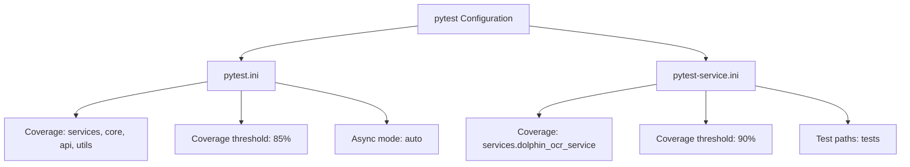
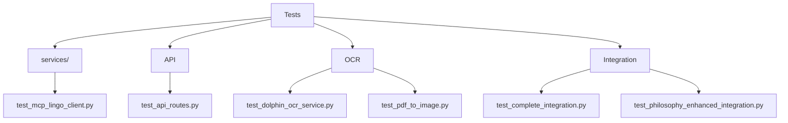
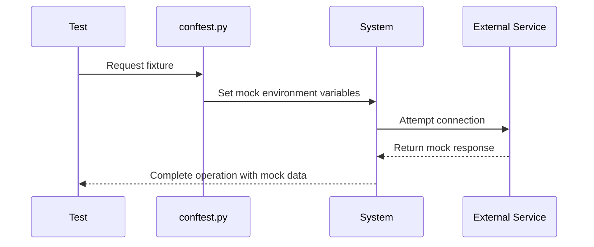
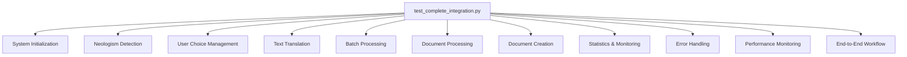
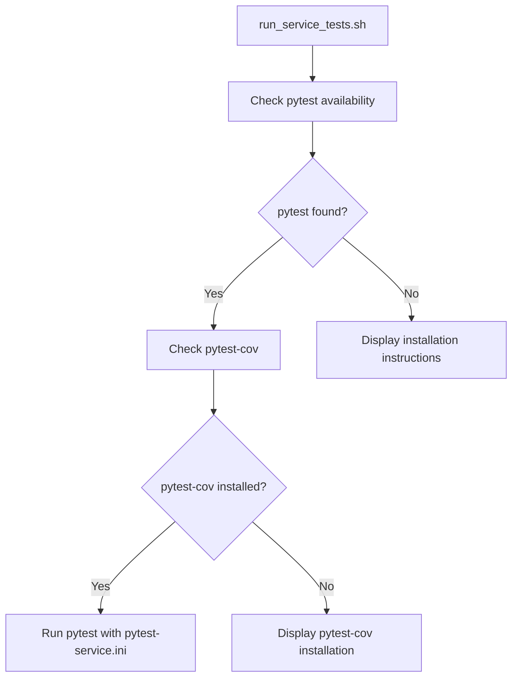

# Testing Strategy

<cite>
**Referenced Files in This Document**  
- [pytest.ini](file://pytest.ini)
- [pytest-service.ini](file://pytest-service.ini)
- [tests/conftest.py](file://tests/conftest.py)
- [tests/helpers.py](file://tests/helpers.py)
- [tests/test_complete_integration.py](file://tests/test_complete_integration.py)
- [tests/test_philosophy_enhanced_integration.py](file://tests/test_philosophy_enhanced_integration.py)
- [scripts/run_service_tests.sh](file://scripts/run_service_tests.sh)
- [scripts/run_tests_with_env.py](file://scripts/run_tests_with_env.py)
</cite>

## Table of Contents
1. [Introduction](#introduction)
2. [Test Pyramid Approach](#test-pyramid-approach)
3. [Testing Framework and Configuration](#testing-framework-and-configuration)
4. [Test Organization and Structure](#test-organization-and-structure)
5. [Testing Asynchronous Code](#testing-asynchronous-code)
6. [External Service Mocking and Database Testing](#external-service-mocking-and-database-testing)
7. [Key Integration Test Files](#key-integration-test-files)
8. [Test Execution and Environment Setup](#test-execution-and-environment-setup)
9. [Coverage Requirements and Reporting](#coverage-requirements-and-reporting)
10. [Testing Challenges and Solutions](#testing-challenges-and-solutions)
11. [Writing New Tests](#writing-new-tests)

## Introduction
The testing strategy for the PhenomenalLayout system follows a comprehensive approach to ensure reliability, performance, and correctness across all components. The test suite is designed to validate individual units, component interactions, and complete end-to-end workflows. This documentation outlines the testing methodology, framework configuration, organizational structure, and best practices for maintaining and extending the test suite.

## Test Pyramid Approach
The testing strategy follows the test pyramid model with three distinct layers:

**Unit Tests**: These tests focus on individual functions and classes in isolation, particularly in the services, core, and utils modules. They verify the correctness of basic functionality without external dependencies.

**Integration Tests**: These tests validate interactions between components, such as between the philosophy-enhanced translation service and document processor, or between the OCR service and its dependencies. They ensure that components work together as expected.

**End-to-End Tests**: These tests simulate complete user workflows, from document processing through translation to output generation. Files like test_complete_integration.py and test_philosophy_enhanced_integration.py represent this layer, testing the entire system with realistic scenarios.

The pyramid approach ensures thorough coverage while maintaining a balance between test speed and comprehensiveness, with the majority of tests at the unit level and fewer, more complex tests at the higher levels.

**Section sources**
- [tests/test_complete_integration.py](file://tests/test_complete_integration.py)
- [tests/test_philosophy_enhanced_integration.py](file://tests/test_philosophy_enhanced_integration.py)

## Testing Framework and Configuration
The test suite uses pytest as the primary testing framework, configured through two configuration files that define different testing scenarios.

**Diagram sources**
- [pytest.ini](file://pytest.ini)
- [pytest-service.ini](file://pytest-service.ini)

The main pytest.ini file configures comprehensive coverage requirements for multiple modules with a minimum coverage threshold of 85%. It enables automatic asyncio mode for handling asynchronous tests and defines custom markers for load and slow tests. The pytest-service.ini file provides a more focused configuration for service-specific testing, particularly for the OCR service, with a higher coverage threshold of 90%.

**Section sources**
- [pytest.ini](file://pytest.ini)
- [pytest-service.ini](file://pytest-service.ini)

## Test Organization and Structure
Tests are organized by component in a logical directory structure that mirrors the application architecture. The primary organization is by component type:

**Services Tests**: Located in tests/services/, these tests focus on business logic components like translation services, document processors, and OCR functionality.

**API Tests**: The test_api_routes.py file validates the web interface and endpoint behavior.

**OCR Tests**: Multiple test files in the root tests directory (e.g., test_dolphin_ocr_service.py, test_pdf_to_image.py) specifically target OCR-related functionality.

**Integration Tests**: Comprehensive integration tests like test_complete_integration.py and test_philosophy_enhanced_integration.py validate multi-component workflows.

The helpers.py file in the tests directory provides utility functions for test setup, such as creating minimal PDF files and encrypted PDFs for testing various document scenarios.

**Diagram sources**
- [tests/conftest.py](file://tests/conftest.py)
- [tests/helpers.py](file://tests/helpers.py)

**Section sources**
- [tests/conftest.py](file://tests/conftest.py)
- [tests/helpers.py](file://tests/helpers.py)

## Testing Asynchronous Code
The system extensively uses asynchronous programming, particularly in document processing and translation services. The test suite handles async code through pytest's built-in asyncio support configured in pytest.ini with asyncio_mode = auto.

Integration tests use the @pytest.mark.asyncio decorator to enable coroutine execution, allowing for realistic testing of asynchronous workflows. The test_complete_integration.py file contains multiple async test methods that validate the complete asynchronous processing pipeline, from document processing to translation and output generation.

The test suite also validates progress tracking in asynchronous operations, ensuring that progress callbacks function correctly and provide accurate status updates throughout long-running operations.

**Section sources**
- [pytest.ini](file://pytest.ini)
- [tests/test_complete_integration.py](file://tests/test_complete_integration.py)

## External Service Mocking and Database Testing
The test suite employs multiple strategies for handling external dependencies and database interactions.

Environment variables are mocked using pytest fixtures in conftest.py, which provide default values for critical configuration like HF_TOKEN and DOLPHIN_MODAL_ENDPOINT. This ensures tests can run without requiring actual external service credentials.

**Diagram sources**
- [tests/conftest.py](file://tests/conftest.py)

For more complex integration testing, the test_philosophy_enhanced_integration.py file uses unittest.mock to create MagicMock objects for services like translation_service, neologism_detector, and user_choice_manager. This allows for precise control over test scenarios and verification of method calls.

Database interactions are tested through the test_choice_database.py file, which validates the functionality of user choice persistence and retrieval.

**Section sources**
- [tests/conftest.py](file://tests/conftest.py)
- [tests/test_philosophy_enhanced_integration.py](file://tests/test_philosophy_enhanced_integration.py)

## Key Integration Test Files
Two primary integration test files serve as the cornerstone of the end-to-end testing strategy.

**test_complete_integration.py**: This comprehensive test suite validates the complete philosophy-enhanced translation system. It verifies component initialization, neologism detection, user choice management, text translation, batch processing, document processing, and document creation. The test follows a numbered sequence (test_1_basic_system_initialization through test_12_complete_end_to_end_workflow) that represents a logical progression through system capabilities.

**Diagram sources**
- [tests/test_complete_integration.py](file://tests/test_complete_integration.py)

**test_philosophy_enhanced_integration.py**: This file focuses on integration testing with mocked dependencies, allowing for isolated testing of the philosophy-enhanced components without requiring actual external services. It includes tests for service initialization, translation with neologism handling, batch translation, and document processing, as well as error handling scenarios.

Both files include end-to-end workflow tests that validate the complete user journey, from document input through translation to output generation.

**Section sources**
- [tests/test_complete_integration.py](file://tests/test_complete_integration.py)
- [tests/test_philosophy_enhanced_integration.py](file://tests/test_philosophy_enhanced_integration.py)

## Test Execution and Environment Setup
The test suite can be executed through multiple mechanisms, each designed for different scenarios.

The run_service_tests.sh script provides a targeted execution environment for service tests, particularly the OCR service. It verifies pytest availability, ensures pytest-cov is installed, and runs tests with the pytest-service.ini configuration. This script is optimized for CI/CD environments and smoke testing.

**Diagram sources**
- [scripts/run_service_tests.sh](file://scripts/run_service_tests.sh)

The run_tests_with_env.py script loads environment variables from a .env file before executing pytest, ensuring that tests have access to necessary configuration like API keys. It provides feedback on whether the LINGO_API_KEY was successfully loaded and passes all command-line arguments to pytest.

Direct pytest execution is also supported, allowing developers to run specific tests or test groups as needed.

**Section sources**
- [scripts/run_service_tests.sh](file://scripts/run_service_tests.sh)
- [scripts/run_tests_with_env.py](file://scripts/run_tests_with_env.py)

## Coverage Requirements and Reporting
The test suite enforces strict code coverage requirements through pytest-cov configuration in the pytest.ini and pytest-service.ini files.

The main pytest.ini configuration requires 85% coverage across core modules (services, core, api, utils) with branch coverage enabled. The pytest-service.ini configuration is more stringent, requiring 90% coverage specifically for the dolphin_ocr_service module.

Coverage reports are generated in the terminal with missing line information, allowing developers to identify untested code paths. The --cov-fail-under parameter ensures that the test suite fails if coverage drops below the specified threshold, enforcing consistent coverage standards.

The coverage configuration includes --cov-branch to measure branch coverage, ensuring that both conditional branches in if/else statements and other control flow structures are adequately tested.

**Section sources**
- [pytest.ini](file://pytest.ini)
- [pytest-service.ini](file://pytest-service.ini)

## Testing Challenges and Solutions
The test suite addresses several specific challenges inherent in the system's functionality.

**OCR Result Variability**: OCR output can vary between runs due to image processing differences. The test suite addresses this through focused testing of the OCR service in isolation using the pytest-service.ini configuration, which allows for targeted validation of OCR-specific functionality without interference from other test suites.

**Timing Issues in Async Processing**: Asynchronous operations can introduce timing dependencies and race conditions. The test suite handles this through comprehensive async testing with proper coroutine handling and by testing progress tracking mechanisms to ensure they function correctly under various timing scenarios.

**External Service Dependencies**: The system relies on external services like the Lingo translation API and Modal endpoints. The test suite mitigates this through environment variable mocking in conftest.py and comprehensive mocking of service dependencies in integration tests.

**Memory Management**: Long-running document processing operations can consume significant memory. The test_complete_integration.py file includes memory monitoring tests that track memory usage and enforce configurable limits through the TEST_MEMORY_LIMIT_MB environment variable.

**Section sources**
- [tests/test_complete_integration.py](file://tests/test_complete_integration.py)
- [tests/conftest.py](file://tests/conftest.py)

## Writing New Tests
When writing new tests for services, follow these guidelines:

1. **Use Appropriate Test Location**: Place new tests in the appropriate directory based on the component type (services, API, OCR, etc.).

2. **Leverage Existing Fixtures**: Utilize fixtures defined in conftest.py, such as dolphin_env_defaults and lingo_translator, to ensure consistent test environments.

3. **Follow Naming Conventions**: Use descriptive test function names that clearly indicate the functionality being tested.

4. **Include Error Handling Tests**: Ensure tests cover both success and failure scenarios, including proper error handling and graceful degradation.

5. **Validate Asynchronous Code**: For async functions, use the @pytest.mark.asyncio decorator and await the async operations.

6. **Use Mocking Appropriately**: For external dependencies, use mocking to isolate the component being tested while still validating interaction patterns.

7. **Ensure Adequate Coverage**: Verify that new code is covered by tests meeting the project's coverage requirements.

The helpers.py file provides useful utilities for test setup, such as write_minimal_pdf() for creating test PDFs, which should be leveraged when testing document processing functionality.

**Section sources**
- [tests/conftest.py](file://tests/conftest.py)
- [tests/helpers.py](file://tests/helpers.py)
