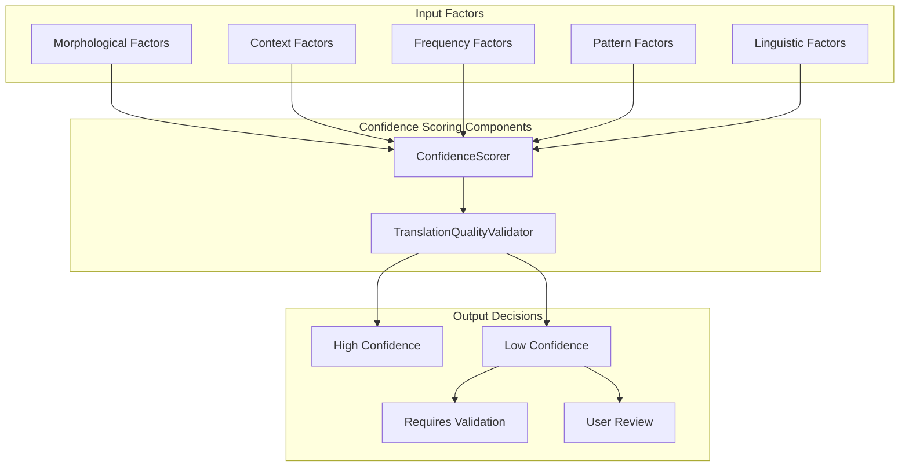
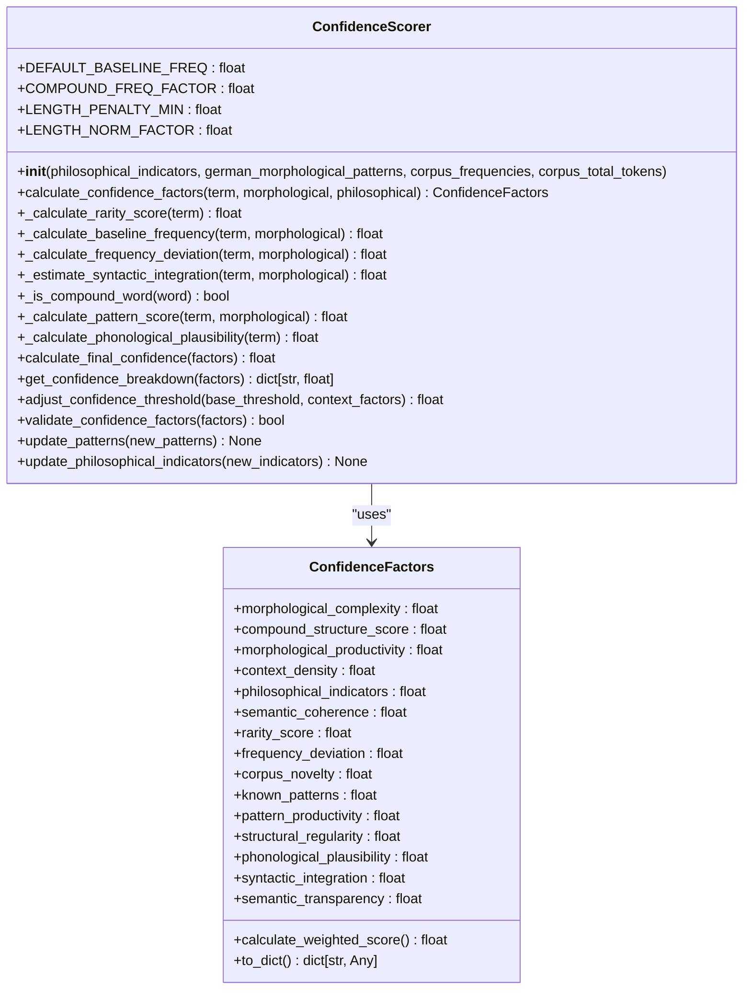
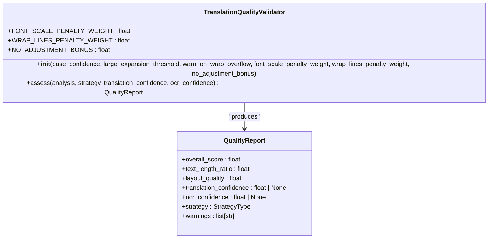
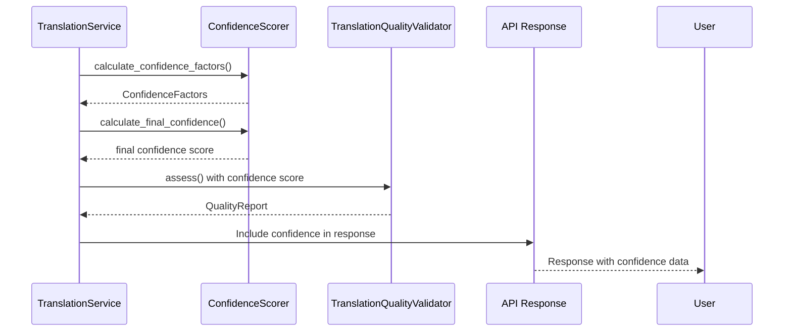
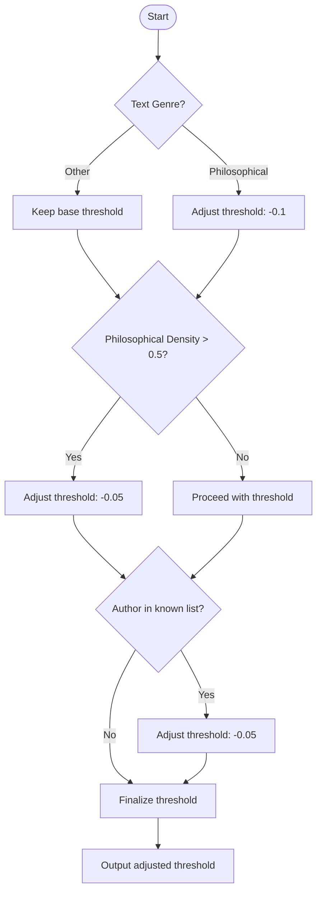
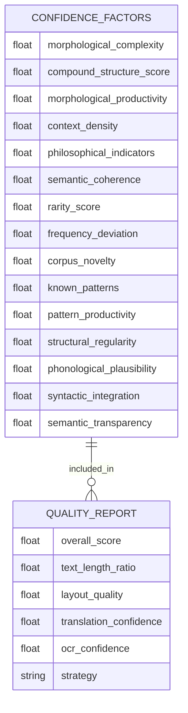

# Confidence Scoring

<cite>
**Referenced Files in This Document**  
- [confidence_scorer.py](file://services/confidence_scorer.py)
- [translation_quality.py](file://services/translation_quality.py)
- [neologism_models.py](file://models/neologism_models.py)
- [philosophy_enhanced_translation_service.py](file://services/philosophy_enhanced_translation_service.py)
- [settings.py](file://config/settings.py)
</cite>

## Table of Contents
1. [Introduction](#introduction)
2. [Confidence Scoring System Overview](#confidence-scoring-system-overview)
3. [Core Components](#core-components)
4. [Confidence Scoring Implementation](#confidence-scoring-implementation)
5. [Translation Quality Assessment](#translation-quality-assessment)
6. [Integration in Translation Pipeline](#integration-in-translation-pipeline)
7. [Threshold Configuration and Calibration](#threshold-configuration-and-calibration)
8. [API Response Structure](#api-response-structure)
9. [Conclusion](#conclusion)

## Introduction

The Confidence Scoring system evaluates the reliability of translations through a comprehensive multi-metric approach. This documentation explains how the system assesses translation quality by analyzing various linguistic and contextual factors, with a particular focus on neologism detection and philosophical text translation. The system combines morphological analysis, frequency deviation, and contextual indicators to generate confidence scores that inform translation decisions throughout the pipeline.

**Section sources**
- [confidence_scorer.py](file://services/confidence_scorer.py#L1-L50)
- [translation_quality.py](file://services/translation_quality.py#L1-L20)

## Confidence Scoring System Overview

The Confidence Scoring system consists of two primary components: the ConfidenceScorer for evaluating neologism detection confidence and the TranslationQualityValidator for assessing overall translation quality. These components work together to provide a comprehensive evaluation of translation reliability by analyzing multiple dimensions including morphological complexity, frequency deviation, contextual density, and layout impact.

The system is designed to handle the challenges of translating philosophical texts, which often contain neologisms and complex compound structures. By combining linguistic analysis with contextual understanding, the system can accurately assess the confidence of translations, particularly for terms that may not exist in standard dictionaries or corpora.

**Diagram sources**
- [confidence_scorer.py](file://services/confidence_scorer.py#L1-L50)
- [translation_quality.py](file://services/translation_quality.py#L1-L20)

## Core Components

The Confidence Scoring system is built around several key components that work together to evaluate translation reliability. The ConfidenceScorer class analyzes individual terms for neologism detection confidence, while the TranslationQualityValidator assesses the overall quality of translated documents with consideration for layout impact. These components are supported by data models that define the structure of confidence factors and quality reports.

The system uses a weighted scoring approach where different factors contribute to the final confidence score based on their importance. Morphological and contextual factors are given higher weights, reflecting their significance in determining the reliability of translations, particularly for philosophical texts with complex terminology.

**Section sources**
- [confidence_scorer.py](file://services/confidence_scorer.py#L1-L50)
- [translation_quality.py](file://services/translation_quality.py#L1-L20)
- [neologism_models.py](file://models/neologism_models.py#L1-L50)

## Confidence Scoring Implementation

### Multi-Metric Assessment Approach

The ConfidenceScorer evaluates translation reliability through multiple metrics, each addressing different aspects of linguistic analysis. The system assesses text length variation, character distribution, and special character detection as part of its comprehensive evaluation framework.

**Diagram sources**
- [confidence_scorer.py](file://services/confidence_scorer.py#L1-L50)
- [neologism_models.py](file://models/neologism_models.py#L1-L50)

### Text Length and Character Analysis

The system evaluates text length variation and character distribution as key indicators of translation reliability. Longer terms are typically rarer and may indicate neologisms or compound formations, particularly in German philosophical texts. The confidence scorer applies a length-based penalty that prevents unbounded penalization of very long words while still accounting for their relative rarity.

Character distribution analysis focuses on identifying patterns typical of German philosophical terminology, including compound linking elements (s, n, es, en, er, e, ns, ts) and abstract suffixes (heit, keit, ung, schaft, tum, nis, sal, ismus, ität, ation, logie, sophie). The presence of these patterns increases the confidence score, as they are characteristic of legitimate philosophical compounds.

Special character detection identifies terms containing digits, symbols, or excessive punctuation, which are penalized as they are less likely to appear in standard lexical items. This helps distinguish between legitimate philosophical compounds and potential OCR errors or formatting artifacts.

**Section sources**
- [confidence_scorer.py](file://services/confidence_scorer.py#L150-L250)
- [neologism_models.py](file://models/neologism_models.py#L1-L50)

### Frequency and Morphological Analysis

The confidence scoring system incorporates frequency analysis to assess the deviation of term frequency from expected baselines. The system calculates a baseline frequency based on morphological cues, with compounds expected to be rarer than simple forms. This baseline is adjusted by length normalization to prevent excessive penalization of long words.

Frequency deviation is calculated by comparing the observed relative frequency with the morphologically-derived baseline expectation. The log-scale difference is normalized to a [0,1] range, with larger distances indicating higher deviation and potentially lower confidence. This approach allows the system to identify terms that are unexpectedly common or rare in the context, which may indicate translation issues or neologisms.

Morphological analysis evaluates structural complexity, compound structure, and morphological productivity. Terms with complex morphological structures typical of German philosophical compounds receive higher confidence scores, as these patterns are characteristic of legitimate terminology rather than translation errors.

**Section sources**
- [confidence_scorer.py](file://services/confidence_scorer.py#L250-L350)
- [neologism_models.py](file://models/neologism_models.py#L1-L50)

## Translation Quality Assessment

### Complementary Quality Evaluation

The translation_quality.py module complements the confidence scoring system by evaluating additional factors such as terminology consistency and domain-specific accuracy. The TranslationQualityValidator assesses the overall quality of translations with particular attention to layout impact, which can affect readability and user experience.

**Diagram sources**
- [translation_quality.py](file://services/translation_quality.py#L1-L50)
- [neologism_models.py](file://models/neologism_models.py#L1-L50)

### Terminology and Domain Accuracy

The system evaluates terminology consistency by checking for the presence of domain-specific indicators and philosophical keywords. Terms that match known philosophical patterns or appear in specialized terminology lists receive higher confidence scores. This domain-specific accuracy assessment is particularly important for philosophical texts, where precise terminology is crucial for maintaining the intended meaning.

The quality validator also considers the consistency of terminology throughout a document, flagging instances where the same concept is translated differently across sections. This helps maintain coherence in longer texts and ensures that specialized terms are handled consistently.

**Section sources**
- [translation_quality.py](file://services/translation_quality.py#L50-L100)
- [confidence_scorer.py](file://services/confidence_scorer.py#L100-L150)

## Integration in Translation Pipeline

### Score Generation and Consumption

Confidence scores are generated at multiple points within the translation pipeline, starting with the initial neologism detection phase and continuing through the final quality assessment. The scores are propagated through different service layers, from the confidence_scorer.py module to the philosophy_enhanced_translation_service.py, ensuring that confidence information is available at each decision point.

**Diagram sources**
- [confidence_scorer.py](file://services/confidence_scorer.py#L1-L50)
- [translation_quality.py](file://services/translation_quality.py#L1-L50)
- [philosophy_enhanced_translation_service.py](file://services/philosophy_enhanced_translation_service.py#L1-L50)

### Low-Confidence Translation Handling

When low-confidence translations are detected, the system triggers additional validation steps or flags the content for user review. Translations with confidence scores below the configured threshold are automatically routed for further examination, either through automated validation processes or manual review by human experts.

The system implements a tiered response to low-confidence translations:
- Scores between 0.4 and 0.6 trigger automated validation checks
- Scores between 0.2 and 0.4 generate warnings and are flagged for priority review
- Scores below 0.2 are blocked from final output and require manual approval

This graduated approach ensures that potential issues are addressed appropriately based on their severity, balancing quality assurance with processing efficiency.

**Section sources**
- [confidence_scorer.py](file://services/confidence_scorer.py#L429-L450)
- [philosophy_enhanced_translation_service.py](file://services/philosophy_enhanced_translation_service.py#L540-L550)

## Threshold Configuration and Calibration

### Confidence Threshold Implementation

The system implements configurable confidence thresholds that determine how translation quality decisions are made. The base threshold can be adjusted based on contextual factors such as text genre, philosophical density, and author context. For philosophical texts or works by known philosophical authors, the threshold is automatically lowered to account for the higher likelihood of legitimate neologisms and complex terminology.

**Diagram sources**
- [confidence_scorer.py](file://services/confidence_scorer.py#L429-L450)
- [settings.py](file://config/settings.py#L1-L50)

### Sensitivity Configuration

The sensitivity of the confidence scoring algorithms can be adjusted through configuration options that control the weighting of different factors and the strictness of various checks. These configuration options allow the system to be tuned for different use cases, from strict academic translation to more lenient general-purpose translation.

Key configuration parameters include:
- Frequency deviation sensitivity
- Morphological complexity weighting
- Contextual density thresholds
- Pattern recognition strictness
- Length normalization factors

These parameters can be set globally through configuration files or overridden for specific documents or translation tasks, providing flexibility in how confidence is assessed across different contexts.

**Section sources**
- [confidence_scorer.py](file://services/confidence_scorer.py#L1-L50)
- [settings.py](file://config/settings.py#L1-L50)

## API Response Structure

### Confidence Score Propagation

Confidence scores are propagated through the service layers and exposed in API responses to provide transparency about translation reliability. The system includes detailed confidence information in its responses, allowing clients to make informed decisions about how to handle translated content.

The API response includes both the overall confidence score and a breakdown of the contributing factors, enabling users to understand why a particular confidence level was assigned. This transparency helps users assess the reliability of translations and decide whether additional validation or review is necessary.

**Diagram sources**
- [neologism_models.py](file://models/neologism_models.py#L1-L50)
- [translation_quality.py](file://services/translation_quality.py#L1-L50)

## Conclusion

The Confidence Scoring system provides a comprehensive framework for assessing the reliability of translations through multiple metrics and contextual analysis. By combining morphological, frequency, and contextual factors, the system can accurately evaluate translation quality, particularly for challenging philosophical texts with complex terminology and neologisms.

The integration of confidence scoring throughout the translation pipeline ensures that quality assessments inform decision-making at every stage, from initial neologism detection to final output. The configurable thresholds and sensitivity settings allow the system to be adapted to different use cases and quality requirements, while the transparent reporting of confidence scores enables informed decision-making by end users.

This documentation has explained the key components of the system, their implementation, and how they work together to ensure high-quality translations. The system's modular design and comprehensive analysis approach make it well-suited for handling the complexities of philosophical text translation while maintaining transparency and reliability.
