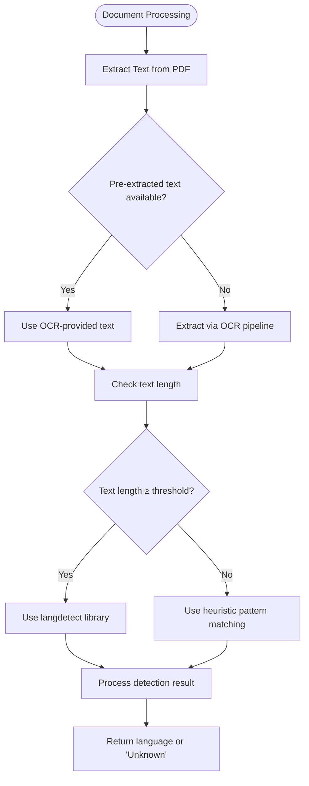
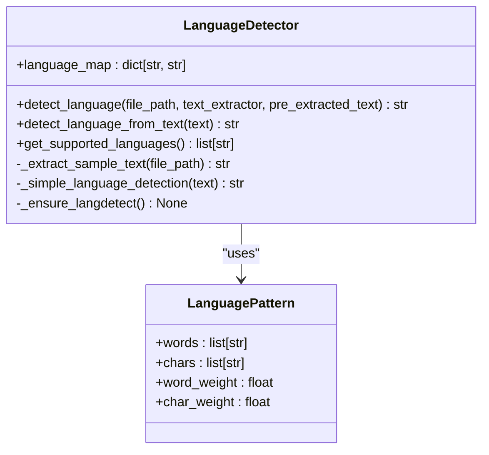
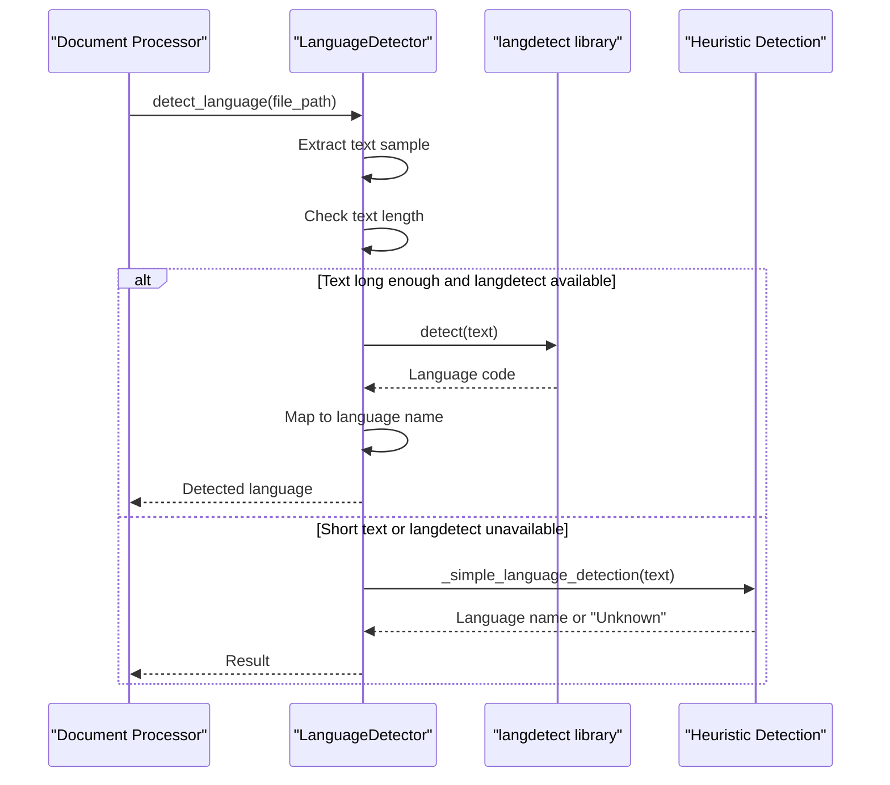
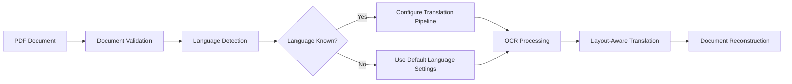

# Language Detection

<cite>
**Referenced Files in This Document**  
- [language_detector.py](file://services/language_detector.py)
- [languages.json](file://config/languages.json)
- [confidence_scorer.py](file://services/confidence_scorer.py)
- [neologism_detector.py](file://services/neologism_detector.py)
- [morphological_analyzer.py](file://services/morphological_analyzer.py)
- [philosophical_context_analyzer.py](file://services/philosophical_context_analyzer.py)
- [main_document_processor.py](file://services/main_document_processor.py)
- [enhanced_document_processor.py](file://services/enhanced_document_processor.py)
</cite>

## Table of Contents
1. [Introduction](#introduction)
2. [Core Components](#core-components)
3. [Language Detection Implementation](#language-detection-implementation)
4. [Statistical Analysis and Pattern Matching](#statistical-analysis-and-pattern-matching)
5. [Confidence Scoring and Mixed-Language Handling](#confidence-scoring-and-mixed-language-handling)
6. [External Library Integration and Fallback Mechanisms](#external-library-integration-and-fallback-mechanisms)
7. [Languages Configuration and Metadata Management](#languages-configuration-and-metadata-management)
8. [Document Processing Integration](#document-processing-integration)
9. [Edge Case Handling](#edge-case-handling)
10. [Configuration Options](#configuration-options)
11. [Performance Optimization and Caching](#performance-optimization-and-caching)
12. [Conclusion](#conclusion)

## Introduction
The Language Detection capability in the PhenomenalLayout system provides robust identification of source languages in document processing workflows. This documentation explains how the system analyzes text to determine language, with a focus on statistical methods, pattern recognition, and integration with document processing pipelines. The implementation is designed specifically for PDF-only workflows and combines multiple detection strategies to ensure accuracy across diverse text samples. The system handles various edge cases and provides confidence scoring to support downstream processing decisions.

## Core Components
The language detection system consists of several interconnected components that work together to identify source languages in documents. The primary component is the LanguageDetector class, which orchestrates the detection process and integrates with other services. Supporting components include configuration files that define language patterns and metadata, as well as auxiliary services that provide specialized analysis capabilities. The system is designed to be resilient, failing gracefully when detection is uncertain rather than propagating errors.

**Section sources**
- [language_detector.py](file://services/language_detector.py#L1-L50)
- [languages.json](file://config/languages.json#L1-L21)

## Language Detection Implementation
The language detection implementation follows a multi-tiered approach that prioritizes accuracy while maintaining performance. The system first attempts to use the external langdetect library when available, falling back to heuristic-based detection when the library is not present or when text samples are too short for reliable statistical analysis. The detection process begins with text extraction from the document, either through direct file reading or by utilizing pre-extracted text from OCR processing. The system is specifically designed for PDF-only workflows, with special handling for documents that have undergone OCR processing.

The detection algorithm evaluates text samples using both word-level and character-level patterns, combining these signals into a comprehensive confidence score. For longer text samples (50+ characters by default, or 20+ characters when OCR text is available), the system leverages statistical language models through the langdetect library. For shorter samples, it relies on heuristic pattern matching based on common function words and distinctive characters specific to each language.

**Diagram sources**
- [language_detector.py](file://services/language_detector.py#L150-L300)

**Section sources**
- [language_detector.py](file://services/language_detector.py#L150-L300)
- [enhanced_document_processor.py](file://services/enhanced_document_processor.py#L100-L200)

## Statistical Analysis and Pattern Matching
The system employs statistical analysis and language-specific pattern matching to identify source languages. For languages supported by the system, predefined patterns capture distinctive characteristics including common function words and unique characters or diacritics. These patterns are stored in the LANGUAGE_PATTERNS dictionary, which maps language names to their respective word lists, character sets, and scoring weights.

The pattern matching algorithm calculates a normalized score for each language by analyzing the frequency of pattern words in the text and the presence of distinctive characters. Word matches are weighted according to their significance in identifying the language, with character matches receiving additional weight for languages with unique diacritical marks. The scoring system combines word and character scores using a weighted formula (70% word score, 30% character score) to produce a final confidence score for each language.

For example, German text is identified by common articles like "der", "die", and "das", as well as distinctive characters like "ä", "ö", "ü", and "ß". Similarly, Spanish is recognized by function words like "el", "la", and "y", along with accented characters such as "ñ", "á", "é", "í", "ó", and "ú". The system normalizes scores based on text length to ensure consistent results across samples of different sizes.

**Diagram sources**
- [language_detector.py](file://services/language_detector.py#L50-L150)

**Section sources**
- [language_detector.py](file://services/language_detector.py#L50-L150)

## Confidence Scoring and Mixed-Language Handling
The language detection system implements a comprehensive confidence scoring mechanism to assess the reliability of its identifications. The confidence score is derived from multiple factors including pattern match frequency, text length, and the presence of distinctive linguistic features. A minimum threshold of 0.5 matches per 100 words is required for a language to be confidently identified, ensuring that results are only returned when the system has sufficient evidence.

For mixed-language content, the system identifies the dominant language based on the highest confidence score. The detection algorithm processes the entire text sample as a whole, which helps identify the primary language even when secondary languages are present. In cases where no language meets the confidence threshold, the system returns "Unknown" rather than making an uncertain determination.

The confidence scoring system is integrated with the broader document processing pipeline, allowing downstream components to make informed decisions based on detection reliability. When the confidence score is low, the system can trigger additional analysis or request human review, depending on the processing configuration.

**Section sources**
- [language_detector.py](file://services/language_detector.py#L350-L400)
- [confidence_scorer.py](file://services/confidence_scorer.py#L1-L100)

## External Library Integration and Fallback Mechanisms
The language detection system integrates with external libraries while maintaining robust fallback mechanisms for resilience. The primary external dependency is the langdetect library, which provides statistical language detection capabilities. The system checks for the availability of this library at initialization and uses it when present, but does not require it for basic functionality.

The integration with langdetect follows a lazy loading pattern, importing the library only when needed and caching the import result to avoid repeated dynamic imports. This approach ensures thread safety through double-checked locking, preventing race conditions in multi-threaded environments. When langdetect is available and the text sample is sufficiently long, the system uses it as the primary detection method, falling back to heuristic pattern matching if the library raises an exception.

For environments where external dependencies cannot be installed, the system provides complete functionality through its built-in heuristic detection algorithm. This fallback mechanism ensures that language detection remains available even in restricted environments, albeit with potentially reduced accuracy for complex cases.

**Diagram sources**
- [language_detector.py](file://services/language_detector.py#L200-L300)

**Section sources**
- [language_detector.py](file://services/language_detector.py#L200-L300)

## Languages Configuration and Metadata Management
Language support and metadata are managed through the languages.json configuration file and internal data structures. The languages.json file defines the set of supported languages and acceptable document formats, currently limited to PDF files. This configuration serves as the authoritative source for language support, ensuring consistency across the system.

The system maintains an internal LANGUAGE_MAP dictionary that maps language codes (e.g., "en", "de") to their full names (e.g., "English", "German"). This mapping is used to standardize language identifiers throughout the processing pipeline. The supported languages include major world languages such as English, Spanish, French, German, and various Asian and Middle Eastern languages.

The configuration approach allows for easy extension of language support by updating the configuration files without requiring code changes. New languages can be added by including their function words, distinctive characters, and appropriate scoring weights in the configuration, enabling the system to detect them using the same pattern matching algorithms.

**Section sources**
- [languages.json](file://config/languages.json#L1-L21)
- [language_detector.py](file://services/language_detector.py#L30-L50)

## Document Processing Integration
The language detection capability is tightly integrated into the document processing pipeline, where it plays a critical role in determining the source language for translation workflows. The detection process is triggered early in the document processing sequence, allowing subsequent stages to configure themselves appropriately based on the detected language.

In the main document processing flow, language detection occurs after initial document validation but before OCR processing and translation. The system can utilize pre-extracted text from OCR when available, or extract a text sample directly from the PDF file. This flexibility allows the detection to work with both raw PDFs and documents that have already undergone OCR processing.

The integration with the document processor is designed to be resilient, returning "Unknown" rather than raising exceptions when detection fails. This fail-closed approach ensures that document processing can continue, with appropriate handling of uncertain language identification in downstream stages.

**Diagram sources**
- [main_document_processor.py](file://services/main_document_processor.py#L1-L100)
- [language_detector.py](file://services/language_detector.py#L1-L50)

**Section sources**
- [main_document_processor.py](file://services/main_document_processor.py#L1-L100)
- [enhanced_document_processor.py](file://services/enhanced_document_processor.py#L1-L100)

## Edge Case Handling
The language detection system includes specialized handling for various edge cases that can challenge accurate identification. These include short text fragments, technical jargon, neologisms, and multilingual content. For short text fragments with fewer than 10 non-whitespace characters, the system returns "Unknown" immediately, as reliable detection is not possible with such limited context.

Technical jargon and specialized terminology are handled by focusing on function words and grammatical structures rather than content words, which makes the detection more robust to domain-specific vocabulary. The system's pattern-based approach is less susceptible to unusual content words than frequency-based methods that rely on common vocabulary.

Neologisms and newly coined terms are addressed through the integration with the neologism detection system, which can identify novel word formations while still allowing the core language detection to function based on surrounding context. The system's use of both word-level and character-level patterns provides resilience against unusual vocabulary.

For multilingual content, the system identifies the dominant language based on the overall text sample, with the confidence score reflecting the degree of language mixing. When confidence is low due to mixed languages, the system returns "Unknown" to prevent incorrect assumptions in downstream processing.

**Section sources**
- [language_detector.py](file://services/language_detector.py#L300-L350)
- [neologism_detector.py](file://services/neologism_detector.py#L1-L100)

## Configuration Options
The language detection system provides several configuration options to control its behavior and adapt to different processing requirements. Environment variables are used to configure key aspects of the detection process, allowing for runtime adjustments without code changes.

The OCR_TEXT_AVAILABLE environment flag informs the system that text has been pre-extracted via OCR, which lowers the minimum text length threshold for using statistical detection methods. This allows for more accurate detection with shorter text samples when the text quality is known to be high.

The system also respects configuration through the languages.json file, which defines the set of supported languages and document formats. Additional configuration options could be implemented through environment variables or configuration files to control sensitivity thresholds, enable or disable external library usage, or specify default languages for cases where detection fails.

The modular design allows for easy extension of configuration options to meet specific deployment requirements, such as restricting language detection to a subset of supported languages or adjusting confidence thresholds based on use case requirements.

**Section sources**
- [language_detector.py](file://services/language_detector.py#L20-L30)
- [languages.json](file://config/languages.json#L1-L21)

## Performance Optimization and Caching
The language detection system incorporates several performance optimizations to ensure efficient operation within the document processing pipeline. The most significant optimization is the lazy loading and caching of the langdetect library, which prevents repeated import operations and ensures thread-safe initialization.

Text extraction is optimized by checking for pre-extracted text in configured output directories, avoiding redundant OCR processing when text is already available. The system also caches detection results internally, though specific caching mechanisms would be implemented at the application level rather than within the detector itself.

The heuristic detection algorithm is designed for efficiency, using set operations for word matching and simple character counting for diacritical mark detection. Normalization factors are precomputed to avoid redundant calculations during scoring. The algorithm processes text in a single pass, extracting words and characters simultaneously to minimize processing time.

For high-throughput environments, the system's stateless design allows for easy parallelization, with multiple detection instances operating independently on different documents. The thread-safe initialization of external dependencies ensures reliable operation in multi-threaded processing environments.

**Section sources**
- [language_detector.py](file://services/language_detector.py#L400-L495)
- [confidence_scorer.py](file://services/confidence_scorer.py#L100-L200)

## Conclusion
The Language Detection capability in the PhenomenalLayout system provides a robust, multi-layered approach to identifying source languages in document processing workflows. By combining statistical methods with heuristic pattern matching, the system achieves reliable detection across a wide range of text samples and processing conditions. The integration with external libraries enhances accuracy when available, while built-in fallback mechanisms ensure continued operation in constrained environments.

The system's design prioritizes resilience and graceful degradation, returning "Unknown" rather than failing when confidence is insufficient. This fail-closed approach supports reliable document processing pipelines that can handle uncertain language identification appropriately. The configuration through JSON files and environment variables allows for flexible deployment in various environments, from development to production.

Future enhancements could include expanded language support, improved handling of mixed-language content, and more sophisticated confidence scoring that incorporates contextual factors from the document structure and layout. The modular architecture makes such enhancements feasible without disrupting existing functionality.
