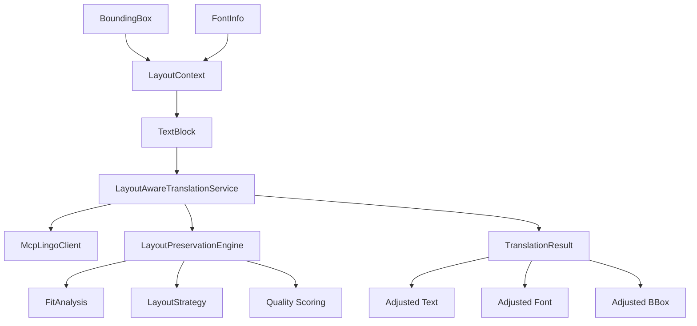
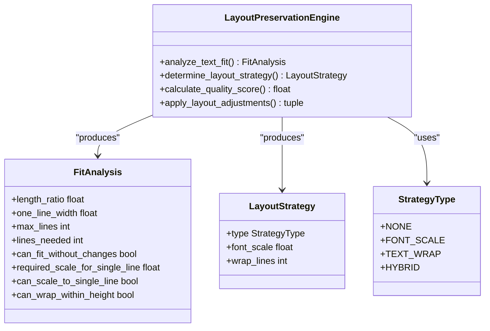
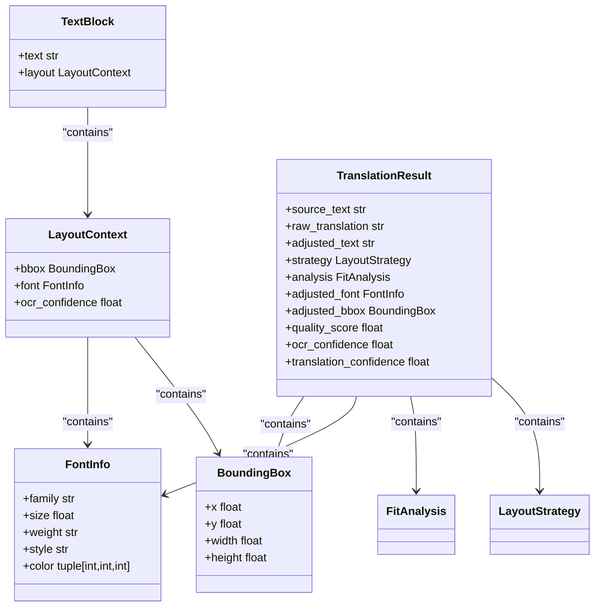
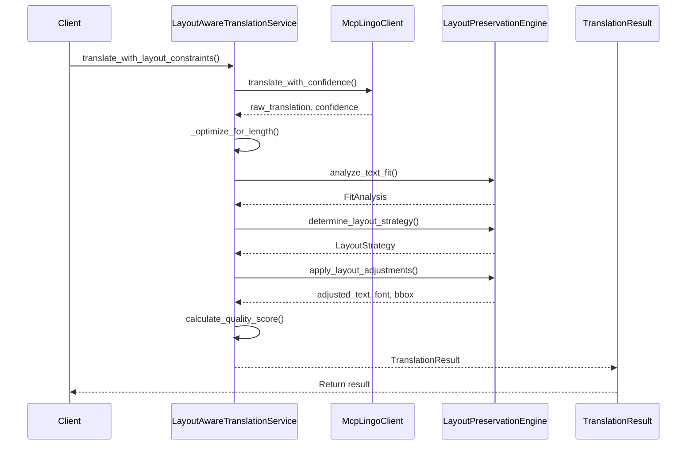
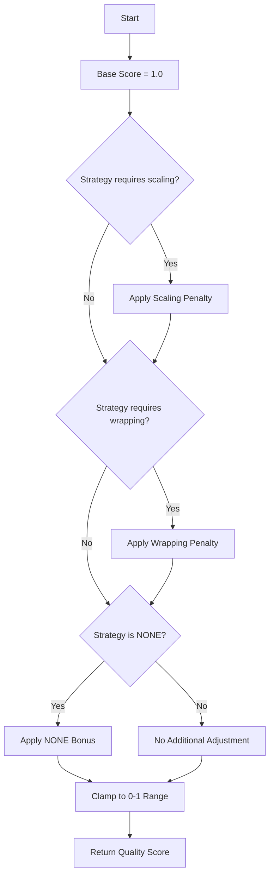
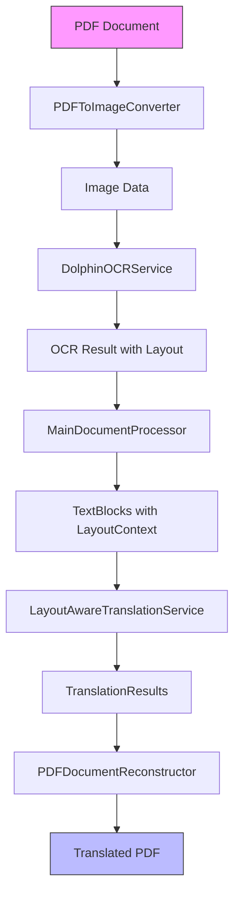

# Layout-Aware Translation

<cite>
**Referenced Files in This Document**  
- [layout_aware_translation_service.py](file://services/layout_aware_translation_service.py)
- [layout.py](file://dolphin_ocr/layout.py)
- [main_document_processor.py](file://services/main_document_processor.py)
- [pdf_document_reconstructor.py](file://services/pdf_document_reconstructor.py)
- [mcp_lingo_client.py](file://services/mcp_lingo_client.py)
- [settings.py](file://config/settings.py)
</cite>

## Table of Contents
1. [Introduction](#introduction)
2. [Core Components](#core-components)
3. [Architecture Overview](#architecture-overview)
4. [Detailed Component Analysis](#detailed-component-analysis)
5. [Process Flow](#process-flow)
6. [Quality Scoring System](#quality-scoring-system)
7. [Integration with Document Processing Pipeline](#integration-with-document-processing-pipeline)
8. [Configuration and Settings](#configuration-and-settings)
9. [Conclusion](#conclusion)

## Introduction
The Layout-Aware Translation service is a sophisticated system designed to translate text content while preserving the original document's formatting and layout. This service ensures that translated text fits within the same spatial constraints as the source text by dynamically adjusting font size and applying text wrapping strategies. The system integrates multiple components to maintain visual fidelity during translation, making it particularly valuable for documents where layout consistency is critical. The service works in conjunction with OCR data to understand the spatial arrangement of text elements and applies intelligent adjustments to ensure the translated content maintains the document's original appearance.

## Core Components
The Layout-Aware Translation service comprises several key components that work together to preserve document layout during translation. The system centers around the `LayoutAwareTranslationService` which coordinates translation with layout preservation decisions. This service integrates with the `LayoutPreservationEngine` to analyze text fit and determine appropriate adjustment strategies. Data is structured using three primary dataclasses: `LayoutContext` which contains bounding box and font information, `TextBlock` which represents text elements with their layout context, and `TranslationResult` which encapsulates the complete translation outcome including adjustments made. The service uses the `McpLingoClient` for actual text translation, enabling confidence-aware translation when available.

**Section sources**
- [layout_aware_translation_service.py](file://services/layout_aware_translation_service.py#L1-L310)
- [layout.py](file://dolphin_ocr/layout.py#L1-L410)

## Architecture Overview
The Layout-Aware Translation system follows a modular architecture where specialized components handle distinct aspects of the translation and layout preservation process. The service acts as a coordinator between the translation client and layout preservation engine, ensuring that translated text fits within the original document's spatial constraints.

**Diagram sources **
- [layout_aware_translation_service.py](file://services/layout_aware_translation_service.py#L1-L310)
- [layout.py](file://dolphin_ocr/layout.py#L1-L410)

## Detailed Component Analysis

### LayoutAwareTranslationService Analysis
The `LayoutAwareTranslationService` serves as the central coordinator for layout-aware translation operations. It implements two primary methods: `translate_with_layout_constraints` for single text elements and `translate_document_batch` for processing multiple text blocks simultaneously. The service integrates with the `McpLingoClient` for translation and the `LayoutPreservationEngine` for layout analysis and adjustment. When confidence-aware translation is available, the service captures translation confidence scores and includes them in the results. The service also implements length optimization by compacting whitespace in translated text to reduce unnecessary growth.

**Section sources**
- [layout_aware_translation_service.py](file://services/layout_aware_translation_service.py#L1-L310)

### LayoutPreservationEngine Analysis
The `LayoutPreservationEngine` is responsible for analyzing text fit and determining appropriate layout preservation strategies. It uses heuristic models to estimate text width based on character count and font size, allowing it to predict whether translated text will fit within the original bounding box. The engine implements four strategy types: NONE (no changes needed), FONT_SCALE (adjust font size), TEXT_WRAP (wrap text to multiple lines), and HYBRID (combine scaling with wrapping). The engine's analysis considers both width constraints (can the text fit on one line?) and height constraints (how many lines can fit in the bounding box?).

**Diagram sources **
- [layout.py](file://dolphin_ocr/layout.py#L1-L410)

### Data Structure Analysis
The system uses several dataclasses to structure layout and translation information. `LayoutContext` encapsulates the spatial and typographic properties of a text element, including its bounding box coordinates and font characteristics. `TextBlock` combines text content with its layout context, serving as the input unit for batch translation operations. `TranslationResult` provides a comprehensive output structure that includes the original text, raw translation, adjusted text, applied strategy, and quality metrics. These dataclasses use frozen instances to ensure immutability and thread safety.

**Diagram sources **
- [layout_aware_translation_service.py](file://services/layout_aware_translation_service.py#L1-L310)
- [layout.py](file://dolphin_ocr/layout.py#L1-L410)

## Process Flow
The layout-aware translation process follows a systematic workflow that ensures translated content fits within original constraints while maintaining readability and visual consistency.

**Diagram sources **
- [layout_aware_translation_service.py](file://services/layout_aware_translation_service.py#L1-L310)
- [layout.py](file://dolphin_ocr/layout.py#L1-L410)

### Text Translation and Optimization
The process begins with text translation via the `McpLingoClient`, which provides access to the Lingo.dev translation API. The service first attempts to use confidence-aware translation methods when available, capturing both the translated text and a confidence score. After obtaining the raw translation, the service applies length optimization by compacting whitespace - collapsing multiple spaces into single spaces and trimming leading/trailing whitespace. This optimization helps reduce unnecessary text expansion that could complicate layout preservation.

### Fit Analysis and Strategy Determination
The `LayoutPreservationEngine` performs fit analysis by estimating the width of the translated text at the original font size and comparing it to the bounding box width. It calculates the number of lines needed to fit the text when wrapped at the box width and determines the maximum number of lines that can fit vertically based on font size and line height. Based on this analysis, the engine determines the most appropriate preservation strategy: NONE if the text fits without changes, FONT_SCALE if modest scaling can make it fit, TEXT_WRAP if wrapping within the height constraints is sufficient, or HYBRID when both scaling and wrapping are needed.

### Layout Adjustment Application
Once a strategy is determined, the engine applies the necessary adjustments. For font scaling, it calculates a new font size within configurable limits (default 60-120% of original). For text wrapping, it estimates characters per line based on font size and box width, then wraps text while respecting word boundaries. In hybrid scenarios, it combines both approaches, scaling the font to reduce the number of lines needed and then wrapping the text accordingly. The adjustments ensure the translated content fits within the original spatial constraints while maintaining readability.

**Section sources**
- [layout_aware_translation_service.py](file://services/layout_aware_translation_service.py#L1-L310)
- [layout.py](file://dolphin_ocr/layout.py#L1-L410)

## Quality Scoring System
The system implements a quality scoring mechanism that evaluates the effectiveness of layout preservation on a scale from 0 to 1, where 1 represents perfect preservation. The score is calculated based on two primary factors: scaling penalty and wrapping penalty. The scaling penalty reduces the score proportionally to how much the font size deviates from the original, with a configurable weight (default 0.35). The wrapping penalty reduces the score based on the number of lines used relative to the maximum available lines, with a configurable weight (default 0.25). A small bonus is applied when no adjustments are needed (NONE strategy), slightly favoring unmodified text. The final score is clamped to ensure it remains within the 0-1 range, providing a reliable metric for output reliability.

**Diagram sources **
- [layout.py](file://dolphin_ocr/layout.py#L1-L410)

## Integration with Document Processing Pipeline
The Layout-Aware Translation service is integrated into a comprehensive document processing pipeline that handles the complete workflow from PDF input to translated PDF output. The `DocumentProcessor` orchestrates the entire process, coordinating PDF conversion, OCR processing, layout-aware translation, and document reconstruction.

**Diagram sources **
- [main_document_processor.py](file://services/main_document_processor.py#L1-L322)
- [pdf_document_reconstructor.py](file://services/pdf_document_reconstructor.py#L1-L486)

The pipeline begins by converting the PDF to images, which are then processed by OCR to extract text and layout information. The OCR results are transformed into `TextBlock` objects containing both text content and `LayoutContext`. These blocks are processed in batches by the `LayoutAwareTranslationService`, which returns `TranslationResult` objects with adjusted text and layout information. Finally, the `PDFDocumentReconstructor` uses this information to create a new PDF with the translated content, preserving the original formatting, fonts, and colors.

**Section sources**
- [main_document_processor.py](file://services/main_document_processor.py#L1-L322)
- [pdf_document_reconstructor.py](file://services/pdf_document_reconstructor.py#L1-L486)

## Configuration and Settings
The system's behavior can be configured through environment variables and settings files. Key configuration parameters include font scaling limits (minimum and maximum scale factors), average character width (used for text width estimation), and line height factor (used for vertical spacing calculations). The `Settings` class in `config/settings.py` manages these configurations, providing validation and default values. The system also supports confidence-aware translation when the underlying translation service provides confidence scores, allowing for more informed quality assessment of the translation output.

**Section sources**
- [settings.py](file://config/settings.py#L1-L548)
- [layout.py](file://dolphin_ocr/layout.py#L1-L410)

## Conclusion
The Layout-Aware Translation service provides a robust solution for translating document content while preserving the original layout and formatting. By integrating translation with intelligent layout analysis and adjustment, the system ensures that translated documents maintain their visual integrity and professional appearance. The modular architecture separates concerns between translation, layout analysis, and document reconstruction, making the system both maintainable and extensible. The quality scoring system provides valuable feedback on the effectiveness of layout preservation, helping users understand the reliability of the output. This comprehensive approach makes the service particularly valuable for translating technical documents, legal contracts, and other content where layout consistency is essential.
