# Parallel Translation

<cite>
**Referenced Files in This Document**  
- [services/parallel_translation_service.py](file://services/parallel_translation_service.py)
- [examples/parallel_translation_demo.py](file://examples/parallel_translation_demo.py)
- [tests/test_parallel_translation.py](file://tests/test_parallel_translation.py)
- [services/enhanced_translation_service.py](file://services/enhanced_translation_service.py)
</cite>

## Table of Contents
1. [Introduction](#introduction)
2. [Core Components](#core-components)
3. [Architecture Overview](#architecture-overview)
4. [Detailed Component Analysis](#detailed-component-analysis)
5. [Concurrency and Rate Limiting](#concurrency-and-rate-limiting)
6. [Error Handling and Retry Mechanisms](#error-handling-and-retry-mechanisms)
7. [Batch Processing and Progress Tracking](#batch-processing-and-progress-tracking)
8. [Document Translation Workflow](#document-translation-workflow)
9. [Performance Optimization and Configuration](#performance-optimization-and-configuration)
10. [Integration and Usage Patterns](#integration-and-usage-patterns)
11. [Conclusion](#conclusion)

## Introduction
The Parallel Translation service provides high-performance batch processing capabilities for document translation with bounded concurrency and rate limiting. This system enables efficient processing of large volumes of text by leveraging asynchronous programming patterns while maintaining strict control over API usage and resource consumption. The service is designed to handle complex document structures, preserve input order, and provide robust error handling for production environments.

**Section sources**
- [services/parallel_translation_service.py](file://services/parallel_translation_service.py#L1-L50)

## Core Components
The Parallel Translation service consists of several key components that work together to enable high-performance batch processing. The core classes include ParallelLingoTranslator for managing translation operations, RateLimiter for controlling request throughput, and various dataclasses for structuring translation tasks and results. The system uses asyncio for concurrency control and aiohttp for efficient HTTP communication with translation APIs.

**Section sources**
- [services/parallel_translation_service.py](file://services/parallel_translation_service.py#L150-L200)

## Architecture Overview

**Diagram sources**
- [services/parallel_translation_service.py](file://services/parallel_translation_service.py#L150-L300)

## Detailed Component Analysis

### ParallelLingoTranslator Analysis
The ParallelLingoTranslator class serves as the primary interface for parallel translation operations. It manages HTTP sessions, enforces rate limiting, and coordinates concurrent requests through a combination of asyncio primitives. The translator uses an async context manager pattern to ensure proper resource cleanup and provides multiple methods for different translation scenarios.

#### For Object-Oriented Components:

**Diagram sources**
- [services/parallel_translation_service.py](file://services/parallel_translation_service.py#L300-L500)

### Translation Data Structures
The service uses dataclasses to structure translation tasks and results, providing type safety and clear interfaces. The TranslationTask class encapsulates individual translation units with metadata, while TranslationResult captures the outcome of each translation attempt.

#### For Object-Oriented Components:

**Diagram sources**
- [services/parallel_translation_service.py](file://services/parallel_translation_service.py#L100-L150)

## Concurrency and Rate Limiting

### Token-Bucket RateLimiter Implementation
The RateLimiter class implements a token-bucket algorithm to control request throughput and prevent API rate limit violations. This approach allows for smooth request distribution while accommodating short bursts of activity within defined limits.

**Diagram sources**
- [services/parallel_translation_service.py](file://services/parallel_translation_service.py#L250-L300)

### Bounded Concurrency with Semaphore
The service uses asyncio.Semaphore to limit the number of concurrent requests, preventing resource exhaustion and ensuring stable performance. This mechanism works in conjunction with the RateLimiter to provide multi-layered control over request throughput.

**Diagram sources**
- [services/parallel_translation_service.py](file://services/parallel_translation_service.py#L300-L350)

## Error Handling and Retry Mechanisms

### Exponential Backoff Retry Strategy
The service implements a robust retry mechanism with exponential backoff to handle transient errors and rate limiting responses. This approach increases the delay between retries to avoid overwhelming the API during periods of high load.

**Diagram sources**
- [services/parallel_translation_service.py](file://services/parallel_translation_service.py#L500-L600)

### Retry-After Header Parsing
The service includes specialized logic for parsing Retry-After headers from API responses, allowing it to respect server-specified rate limit windows. This ensures compliance with API provider requirements and minimizes unnecessary retry attempts.

**Diagram sources**
- [services/parallel_translation_service.py](file://services/parallel_translation_service.py#L400-L450)

## Batch Processing and Progress Tracking

### translate_batch_parallel Method
The translate_batch_parallel method enables concurrent execution of multiple translation tasks while preserving the original input order. It uses asyncio.gather to coordinate parallel execution and includes comprehensive progress tracking capabilities.

**Diagram sources**
- [services/parallel_translation_service.py](file://services/parallel_translation_service.py#L600-L650)

### Progress Tracking System
The BatchProgress class provides real-time monitoring of translation batch operations, including completion percentage, elapsed time, and estimated remaining time. This enables responsive user interfaces and operational monitoring.

**Diagram sources**
- [services/parallel_translation_service.py](file://services/parallel_translation_service.py#L200-L250)

## Document Translation Workflow

### translate_document_parallel Implementation
The translate_document_parallel method extracts text blocks from structured document content, translates them in parallel, and reassembles the results while preserving the original document structure.

```mermaid
flowchart TD
Start([Document Input]) --> ExtractBlocks["Extract Text Blocks<br>_extract_text_blocks()"]
ExtractBlocks --> CreateTasks["Create TranslationTasks<br>with block IDs"]
CreateTasks --> TranslateBatch["translate_batch_parallel()"]
TranslateBatch --> ApplyResults["Apply Translations<br>_apply_translations_to_content()"]
ApplyResults --> ReconstructDoc["Reconstruct Document<br>with Translated Text"]
ReconstructDoc --> End([Translated Document])
subgraph "Text Block Extraction"
direction LR
Pages["content['pages']"] --> PageBlocks["Extract page blocks"]
Layouts["content['layouts']"] --> LayoutBlocks["Extract layout text"]
end
subgraph "Result Application"
direction LR
Results["TranslationResult[]"] --> Mapping["Create ID → Text Map"]
Mapping --> Pages["Update page blocks"]
Mapping --> Layouts["Update layout text"]
end
```

**Diagram sources**
- [services/parallel_translation_service.py](file://services/parallel_translation_service.py#L700-L750)

## Performance Optimization and Configuration

### ParallelTranslationConfig Options
The service provides extensive configuration options for tuning performance characteristics, including concurrency limits, rate limiting parameters, retry behavior, and timeout settings. These can be set via environment variables or direct instantiation.

**Diagram sources**
- [services/parallel_translation_service.py](file://services/parallel_translation_service.py#L50-L100)

## Integration and Usage Patterns

### EnhancedTranslationService Integration
The EnhancedTranslationService class integrates parallel translation capabilities into the existing translation workflow, automatically selecting between parallel and sequential processing based on document size.

**Diagram sources**
- [services/enhanced_translation_service.py](file://services/enhanced_translation_service.py#L50-L150)

## Conclusion
The Parallel Translation service provides a comprehensive solution for high-performance batch translation with robust error handling, rate limiting, and progress tracking. By combining asyncio.Semaphore for bounded concurrency and a token-bucket RateLimiter for request smoothing, the system achieves optimal throughput while respecting API limitations. The service's modular design, with clear separation of concerns between translation tasks, results, and progress tracking, makes it both powerful and accessible to developers of varying experience levels. Through its integration with the EnhancedTranslationService, it seamlessly enhances existing translation workflows with parallel processing capabilities when beneficial, providing automatic performance optimization based on document size.
