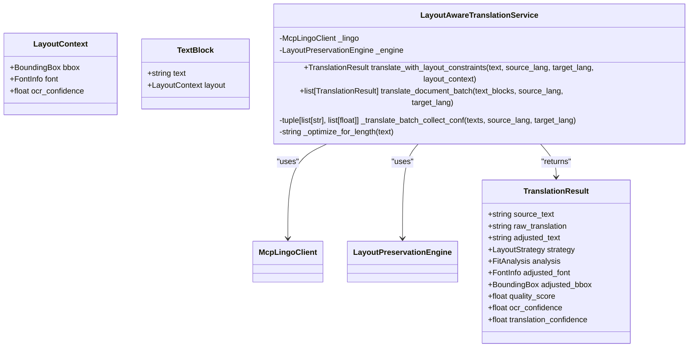
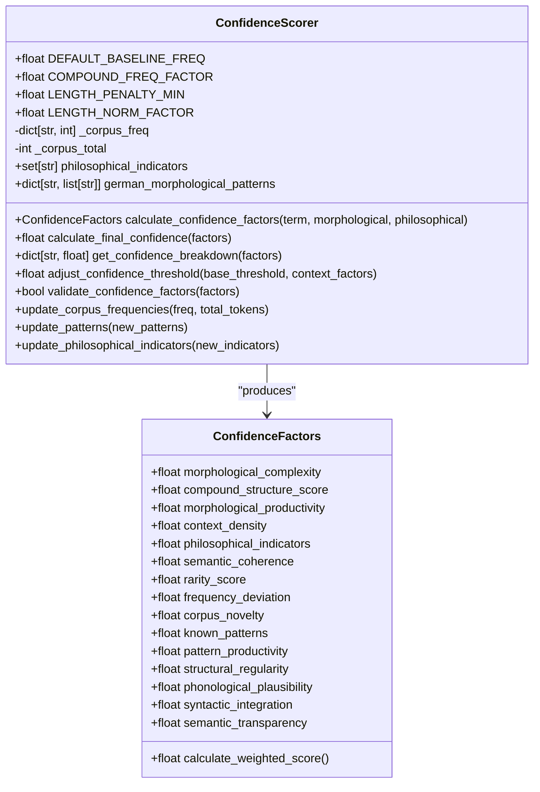

# Translation Services

<cite>
**Referenced Files in This Document**  
- [translation_service.py](file://services/translation_service.py)
- [layout_aware_translation_service.py](file://services/layout_aware_translation_service.py)
- [parallel_translation_service.py](file://services/parallel_translation_service.py)
- [language_detector.py](file://services/language_detector.py)
- [confidence_scorer.py](file://services/confidence_scorer.py)
- [mcp_lingo_client.py](file://services/mcp_lingo_client.py)
- [dolphin_client.py](file://services/dolphin_client.py)
</cite>

## Table of Contents
1. [Core Translation Architecture](#core-translation-architecture)
2. [Layout-Aware Translation](#layout-aware-translation)
3. [Parallel Translation Processing](#parallel-translation-processing)
4. [Language Detection System](#language-detection-system)
5. [Translation Quality Assessment](#translation-quality-assessment)
6. [External Provider Integration](#external-provider-integration)
7. [Text Expansion/Contraction Handling](#text-expansioncontraction-handling)
8. [Mixed Language Document Processing](#mixed-language-document-processing)
9. [Rate Limiting and Fallback Mechanisms](#rate-limiting-and-fallback-mechanisms)
10. [Customizable Translation Parameters](#customizable-translation-parameters)

## Core Translation Architecture

The PhenomenalLayout translation system is built around a modular architecture that separates concerns between translation functionality, layout preservation, and performance optimization. At its core, the `translation_service.py` module provides the foundational translation capabilities through the `TranslationService` class, which serves as the primary interface for text translation operations.

The `TranslationService` class implements a provider-based architecture that supports multiple translation backends through the `BaseTranslator` abstract base class. Currently, the system supports two primary translation providers: the `LingoTranslator` for direct REST API communication with Lingo.dev, and the `MCPLingoTranslator` for integration with MCP (Model Control Protocol) servers. The service automatically selects the appropriate provider based on environment configuration, with support for both direct API access and MCP server communication.

Translation operations are performed through three primary methods: `translate_text` for single text strings, `translate_batch` for multiple texts, and `translate_document` for structured document content. The service includes built-in support for terminology mapping, allowing specific terms to be preserved during translation through preprocessing that wraps them in `` tags. This ensures domain-specific terminology remains consistent across translations.

The translation process follows a pipeline approach: text extraction from document structures, optional terminology preprocessing, provider selection, translation execution, and document reconstruction with translated content. This architecture enables seamless integration with the document processing workflow while maintaining the integrity of the original document structure.

**Section sources**
- [translation_service.py](file://services/translation_service.py#L1-L487)

## Layout-Aware Translation

The `layout_aware_translation_service.py` module extends the core translation functionality by integrating layout preservation capabilities. This service coordinates with the `LayoutPreservationEngine` to ensure translated text fits within the original bounding boxes, maintaining the document's visual integrity. The `LayoutAwareTranslationService` class serves as the primary interface, accepting both text content and layout context to produce translations that respect spatial constraints.

The service operates by first translating the text through the underlying translation client, then analyzing the fit of the translated text within the original bounding box. The `LayoutPreservationEngine` determines the appropriate layout strategy based on the fit analysis, which may include font scaling, text wrapping, or other adjustments. The service returns a `TranslationResult` dataclass containing the source text, raw translation, adjusted text, applied strategy, and quality score.

For batch operations, the `translate_document_batch` method processes multiple text blocks while preserving their individual layout contexts. This ensures that each text element is adjusted according to its specific spatial constraints. The service implements a fallback mechanism for translation clients that don't support batch operations, falling back to individual translation requests while maintaining the same interface.

The layout-aware translation process includes several optimization steps: whitespace compaction to reduce unnecessary text growth, confidence-aware translation when supported by the underlying provider, and quality scoring to evaluate the effectiveness of layout adjustments. This comprehensive approach ensures that translated documents maintain their original appearance while accurately conveying the translated content.

**Diagram sources**
- [layout_aware_translation_service.py](file://services/layout_aware_translation_service.py#L1-L311)

## Parallel Translation Processing

The `parallel_translation_service.py` module implements concurrent translation processing to improve performance for large documents or batch operations. The `ParallelTranslationService` class provides bounded concurrency through an `asyncio.Semaphore` and implements rate limiting with a token-bucket algorithm to prevent overwhelming external translation APIs.

The service configuration is managed through the `ParallelTranslationConfig` dataclass, which defines parameters for concurrency, rate limiting, retry behavior, and timeouts. These settings can be configured through environment variables, allowing runtime adjustment without code changes. Key configuration parameters include `max_concurrent_requests` (default: 10), `max_requests_per_second` (default: 5.0), and `batch_size` (default: 50).

Translation tasks are represented by the `TranslationTask` dataclass, which includes the text to translate, source and target languages, a unique task ID, and optional metadata. The service processes tasks in batches, with each task executed as an asynchronous coroutine. The `TranslationResult` dataclass captures the outcome of each translation, including success status, error messages, retry count, and processing time.

The service implements robust error handling with exponential backoff for transient failures. Each task can be retried up to `max_retries` times (default: 3), with the delay between retries increasing by the `backoff_multiplier` (default: 2.0). The service also handles rate limiting responses from external APIs, parsing `Retry-After` headers and respecting the specified delay.

Progress tracking is provided through the `BatchProgress` dataclass, which monitors completion percentage, elapsed time, and estimated remaining time. This allows calling code to provide real-time feedback during long-running translation operations.

**Section sources**
- [parallel_translation_service.py](file://services/parallel_translation_service.py#L1-L709)

## Language Detection System

The `language_detector.py` module provides automatic language detection capabilities through the `LanguageDetector` class. The system employs a two-tiered approach, prioritizing the `langdetect` library when available and falling back to heuristic-based detection when the library is not present or when text samples are too short for reliable detection.

The detection process begins with text extraction from the input document. For PDF files, the service checks for pre-extracted OCR text in a configured output directory before attempting direct extraction. The extracted text is then analyzed using either the `langdetect` library or a heuristic algorithm based on common words and distinctive characters.

The heuristic detection algorithm uses language-specific patterns defined in the `LANGUAGE_PATTERNS` dictionary. Each language has associated common function words, distinctive characters/diacritics, and weighting factors for word and character matches. The algorithm calculates a score for each supported language based on the frequency of pattern matches, normalized by text length. A language is only returned if its score exceeds a minimum threshold, otherwise "Unknown" is returned.

The service supports both file-based and text-based detection through the `detect_language` and `detect_language_from_text` methods, respectively. The detection process is designed to fail gracefully, returning "Unknown" rather than raising exceptions when detection cannot be performed reliably. The `get_supported_languages` method returns a list of human-readable language names that can be detected by the system.

**Section sources**
- [language_detector.py](file://services/language_detector.py#L1-L495)

## Translation Quality Assessment

The `confidence_scorer.py` module implements a comprehensive system for assessing translation quality and uncertainty through the `ConfidenceScorer` class. This component evaluates multiple factors to calculate a confidence score for neologism detection and translation quality, combining morphological, contextual, frequency, pattern, and linguistic signals.

The confidence calculation is based on a weighted combination of several factors:
- **Morphological factors**: Structural complexity, compound structure, and morphological productivity
- **Context factors**: Philosophical density, presence of philosophical indicators, and semantic coherence
- **Frequency factors**: Rarity score, frequency deviation from expected baselines, and corpus novelty
- **Pattern factors**: Recognition of known morphological patterns, pattern productivity, and structural regularity
- **Linguistic factors**: Phonological plausibility, syntactic integration, and semantic transparency

The scorer uses configurable baseline constants to calculate expected frequencies and apply penalties for factors like word length. The `DEFAULT_BASELINE_FREQ` (5e-5) represents the expected frequency of common words, while the `COMPOUND_FREQ_FACTOR` (0.2) accounts for the reduced frequency of compound words. Length-based penalties are applied but capped by `LENGTH_PENALTY_MIN` (0.25) to prevent excessive penalization of long words.

The system supports dynamic updates to its knowledge base through methods like `update_corpus_frequencies`, `update_patterns`, and `update_philosophical_indicators`. This allows the confidence model to adapt to new corpora and evolving language patterns. The `adjust_confidence_threshold` method can modify the confidence threshold based on contextual factors such as text genre, philosophical density, and author context.

**Diagram sources**
- [confidence_scorer.py](file://services/confidence_scorer.py#L1-L498)

## External Provider Integration

PhenomenalLayout integrates with external translation providers through two primary clients: `mcp_lingo_client.py` for MCP (Model Control Protocol) servers and `dolphin_client.py` for the Dolphin PDF layout micro-service. These clients abstract the communication details and provide a consistent interface for external service integration.

The `McpLingoClient` class in `mcp_lingo_client.py` provides a thin wrapper around the MCP client session, launching the Lingo.dev MCP server via stdio and exposing convenience methods for translation. The client handles tool discovery, automatically detecting the appropriate translation tool from the available MCP tools. It supports both single text translation through `translate_text` and batch translation through `translate_batch`, with automatic fallback to individual requests when batch operations are not supported.

The client implements robust argument shaping to handle variations in tool schemas across different MCP server implementations. The `_build_translate_arg_attempts` method generates multiple payload permutations using common synonyms for translation parameters (e.g., "source" vs "source_lang" vs "from"), attempting each variation until one succeeds. This flexibility ensures compatibility with various MCP server configurations without requiring client-side configuration changes.

The `dolphin_client.py` module provides an async client for the Dolphin PDF layout micro-service, supporting both local deployments and Modal Labs hosting. The `get_layout` function sends PDF files to the Dolphin service and returns structured layout data, including text blocks with bounding boxes, confidence scores, and block types. The client includes comprehensive response validation through the `validate_dolphin_layout_response` function, ensuring the returned data meets expected structural and semantic requirements.

Both clients implement appropriate error handling and logging, with structured logging events for observability. The Dolphin client supports configurable endpoints through the `DOLPHIN_ENDPOINT` environment variable, defaulting to the Modal Labs deployment for better performance and scalability.

**Section sources**
- [mcp_lingo_client.py](file://services/mcp_lingo_client.py#L1-L673)
- [dolphin_client.py](file://services/dolphin_client.py#L1-L249)

## Text Expansion/Contraction Handling

PhenomenalLayout addresses the challenge of text expansion and contraction during translation through a multi-layered approach that combines layout analysis, font scaling, and text wrapping strategies. When translating between languages, text length can vary significantly—German compounds often expand when translated to English, while Asian languages may contract when translated to European languages.

The layout preservation system analyzes the fit of translated text within original bounding boxes using the `LayoutPreservationEngine`. This analysis considers both the geometric constraints (bounding box dimensions) and typographic factors (font metrics, line height). Based on this analysis, the engine determines the appropriate strategy for preserving layout integrity.

The primary strategies for handling text expansion/contraction include:
1. **Font scaling**: Adjusting the font size to fit the translated text within the original space
2. **Text wrapping**: Breaking long text into multiple lines when font scaling alone is insufficient
3. **Whitespace optimization**: Compacting whitespace in the translated text to reduce unnecessary expansion
4. **Layout reflow**: In extreme cases, adjusting the document layout to accommodate significant text length changes

The `LayoutAwareTranslationService` applies these strategies based on the fit analysis, returning a `TranslationResult` that includes the adjusted text, font, and bounding box. The quality scoring system evaluates the effectiveness of these adjustments, providing feedback on how well the original layout has been preserved.

For cases where the text cannot be adequately fitted within the original constraints, the system may apply more aggressive adjustments or flag the element for manual review. The confidence scoring system also contributes to this process by assessing the uncertainty of translations that may be particularly prone to expansion/contraction issues.

## Mixed Language Document Processing

PhenomenalLayout supports the translation of documents containing mixed languages through a combination of automatic language detection and targeted translation processing. The system can identify different languages within a single document and apply appropriate translation strategies for each language segment.

The language detection system analyzes text blocks to determine their source language, either through the `langdetect` library or heuristic pattern matching. Once the language is identified, the translation service can apply language-specific processing rules and select appropriate translation models.

For documents with multiple source languages, the system processes each text block according to its detected language, translating to a common target language. This allows for coherent multilingual documents where different sections maintain their original linguistic characteristics while being translated to a unified target language.

The system also supports documents with embedded foreign language terms or phrases. Through the terminology mapping feature, specific terms can be preserved in their original language while the surrounding text is translated. This is particularly useful for academic or technical documents that contain specialized terminology in their original language.

The parallel translation service ensures that mixed-language documents are processed efficiently, with language detection and translation operations performed concurrently where possible. The layout-aware translation system maintains consistent visual formatting across language boundaries, ensuring that the final document appears cohesive regardless of the original linguistic diversity.

## Rate Limiting and Fallback Mechanisms

PhenomenalLayout implements comprehensive rate limiting and fallback mechanisms to ensure reliable operation when integrating with external translation services. The system employs multiple layers of protection to handle API limitations, network issues, and service outages.

The parallel translation service includes a token-bucket rate limiter (`RateLimiter` class) that smooths request bursts and enforces per-second request caps. This prevents the system from exceeding API rate limits and triggering service throttling. The rate limiter works in conjunction with the concurrency semaphore to provide both burst and sustained rate control.

For handling API errors and timeouts, the system implements exponential backoff retry logic. Failed requests are retried up to a configurable maximum (`max_retries`, default: 3), with the delay between retries increasing by a configurable multiplier (`backoff_multiplier`, default: 2.0). The system parses `Retry-After` headers from HTTP responses and respects the specified delay, with a maximum cap (`MAX_RETRY_AFTER_SECONDS`, default: 60.0) to prevent excessively long waits.

The translation service includes multiple fallback mechanisms:
1. **Provider fallback**: If the primary translation provider fails, the system can fall back to alternative providers when configured
2. **Operation fallback**: If batch translation is not supported, the system falls back to individual translation requests
3. **Content fallback**: If translation fails, the original text is returned rather than leaving content untranslated
4. **Detection fallback**: If language detection fails, the system can use a default source language or attempt translation with multiple language assumptions

The MCP client implements additional fallback strategies, including multiple argument permutations for tool calls and automatic tool discovery when the configured tool name is not available. This ensures robust operation across different MCP server configurations.

## Customizable Translation Parameters

PhenomenalLayout supports customizable translation parameters through both API configuration and runtime settings. Users can adjust various aspects of the translation process to meet specific requirements for formality, domain, and style.

Translation parameters are configured through environment variables and configuration files, allowing for flexible deployment across different environments. Key parameters include:
- `LINGO_API_KEY`: Authentication key for the Lingo.dev translation service
- `LINGO_USE_MCP`: Flag to use MCP server instead of direct REST API
- `LINGO_MCP_TOOL_NAME`: Override for the MCP translation tool name
- `MAX_CONCURRENT_REQUESTS`: Maximum number of simultaneous translation requests
- `MAX_REQUESTS_PER_SECOND`: Rate limit for translation requests
- `TRANSLATION_DELAY`: Delay between batch requests to avoid rate limiting

The system also supports domain-specific terminology through the terminology mapping feature. Users can define custom terminology in JSON files (e.g., `klages_terminology.json`) that are loaded into the translation service. This ensures consistent translation of specialized terms across documents.

For advanced use cases, the API allows customization of translation behavior through parameters passed to the translation methods. These include source and target languages, provider selection, and progress callbacks for monitoring long-running operations. The enhanced translation service extends these capabilities with additional parameters for performance tuning and error handling.

The confidence scoring system also supports parameter customization, allowing users to adjust confidence thresholds based on document genre, philosophical density, or author context. This enables more nuanced control over translation quality assessment and can be particularly valuable for specialized domains like philosophical texts.
