# Troubleshooting

<cite>
**Referenced Files in This Document**  
- [errors.py](file://dolphin_ocr/errors.py)
- [logging_config.py](file://dolphin_ocr/logging_config.py)
- [debug_candidates.py](file://scripts/debug_candidates.py)
- [debug_keywords.py](file://scripts/debug_keywords.py)
- [dolphin_client.py](file://services/dolphin_client.py)
- [pdf_document_reconstructor.py](file://services/pdf_document_reconstructor.py)
- [pdf_validator.py](file://utils/pdf_validator.py)
- [dolphin_ocr_service.py](file://services/dolphin_ocr_service.py)
- [async_document_processor.py](file://services/async_document_processor.py)
</cite>

## Table of Contents
1. [Error Codes and Exceptions](#error-codes-and-exceptions)
2. [Common Issues and Solutions](#common-issues-and-solutions)
3. [Log Interpretation and Monitoring](#log-interpretation-and-monitoring)
4. [Configuration Issues](#configuration-issues)
5. [File-Specific Problems](#file-specific-problems)
6. [Debugging Workflows](#debugging-workflows)
7. [Network Issues and Retry Strategies](#network-issues-and-retry-strategies)
8. [Known Limitations and Workarounds](#known-limitations-and-workarounds)
9. [Diagnostic Information Collection](#diagnostic-information-collection)
10. [Test Suite Usage](#test-suite-usage)

## Error Codes and Exceptions

The Dolphin OCR system uses standardized error codes defined in `errors.py` to provide consistent error reporting across the application. These error codes follow the format DOLPHIN_XXX and are categorized by error type.

### API and Authentication Errors
- **DOLPHIN_001**: Rate limit exceeded - HuggingFace API quota reached
- **DOLPHIN_002**: Service unavailable - Dolphin OCR service down
- **DOLPHIN_003**: Authentication failure - Invalid HuggingFace token

### Processing Errors
- **DOLPHIN_004**: Processing timeout - Document too complex or large
- **DOLPHIN_005**: Invalid document format - Unsupported file type
- **DOLPHIN_006**: OCR processing failed - Unable to extract text
- **DOLPHIN_007**: Layout analysis failed - Complex document structure

### Translation Errors
- **DOLPHIN_008**: Translation service error - Lingo.dev API failure
- **DOLPHIN_009**: Layout preservation failed - Unable to maintain formatting
- **DOLPHIN_010**: Document reconstruction failed - Output generation error

### System Errors
- **DOLPHIN_011**: Memory exhaustion - Document too large for processing
- **DOLPHIN_012**: Storage error - Unable to save processed document
- **DOLPHIN_013**: Configuration error - Invalid system settings
- **DOLPHIN_014**: Encrypted PDFs not supported - please provide unlocked PDF

Each error code corresponds to a specific exception class that inherits from `DolphinError`. The system automatically redacts sensitive information (such as tokens, passwords, and API keys) when serializing error context to prevent information leakage.

```mermaid
classDiagram
class DolphinError {
+error_code : str
+__init__(message, context)
+to_dict() dict
}
class ApiRateLimitError {
+error_code = "DOLPHIN_001"
}
class ServiceUnavailableError {
+error_code = "DOLPHIN_002"
}
class AuthenticationError {
+error_code = "DOLPHIN_003"
}
class ProcessingTimeoutError {
+error_code = "DOLPHIN_004"
}
class InvalidDocumentFormatError {
+error_code = "DOLPHIN_005"
}
class OcrProcessingError {
+error_code = "DOLPHIN_006"
}
class LayoutAnalysisError {
+error_code = "DOLPHIN_007"
}
class TranslationServiceError {
+error_code = "DOLPHIN_008"
}
class LayoutPreservationError {
+error_code = "DOLPHIN_009"
}
class DocumentReconstructionError {
+error_code = "DOLPHIN_010"
}
class MemoryExhaustionError {
+error_code = "DOLPHIN_011"
}
class StorageError {
+error_code = "DOLPHIN_012"
}
class ConfigurationError {
+error_code = "DOLPHIN_013"
}
class EncryptedPdfError {
+error_code = "DOLPHIN_014"
}
DolphinError <|-- ApiRateLimitError
DolphinError <|-- ServiceUnavailableError
DolphinError <|-- AuthenticationError
DolphinError <|-- ProcessingTimeoutError
DolphinError <|-- InvalidDocumentFormatError
DolphinError <|-- OcrProcessingError
DolphinError <|-- LayoutAnalysisError
DolphinError <|-- TranslationServiceError
DolphinError <|-- LayoutPreservationError
DolphinError <|-- DocumentReconstructionError
DolphinError <|-- MemoryExhaustionError
DolphinError <|-- StorageError
DolphinError <|-- ConfigurationError
DolphinError <|-- EncryptedPdfError
```



**Diagram sources**
- [errors.py](file://dolphin_ocr/errors.py#L1-L340)

**Section sources**
- [errors.py](file://dolphin_ocr/errors.py#L1-L340)

## Common Issues and Solutions

### OCR Failures
OCR processing failures (DOLPHIN_006) typically occur when the system cannot extract text from document images. Common causes include:
- Poor image quality or resolution
- Unsupported image formats
- Corrupted PDF files
- Extremely large documents exceeding processing limits

**Solutions:**
1. Ensure PDFs are converted to images with sufficient DPI (300 is recommended)
2. Verify the input file is not corrupted using PDF validation tools
3. Check that the file size is within acceptable limits (5MB per image)
4. Validate that the document contains actual text content rather than being purely image-based

### Translation Timeouts
Translation timeouts (DOLPHIN_004) occur when document processing exceeds the configured timeout threshold. This typically happens with:
- Large documents with many pages
- Complex layouts requiring extensive processing
- Network latency issues with external translation services

**Solutions:**
1. Increase the timeout value via the DOLPHIN_TIMEOUT_SECONDS environment variable
2. Process large documents in smaller batches
3. Optimize document complexity by simplifying layouts
4. Ensure stable network connectivity to translation services

### Layout Distortion
Layout preservation failures (DOLPHIN_009) occur when the system cannot maintain the original document formatting. This commonly affects:
- Documents with complex multi-column layouts
- Tables and figures with precise positioning
- Documents with mixed text and image elements

**Solutions:**
1. Verify that bounding box coordinates are valid and within page dimensions
2. Check font metrics and ensure proper font availability
3. Validate that text wrapping calculations are correct
4. Use the layout validation tools to identify specific issues

### PDF Reconstruction Errors
Document reconstruction failures (DOLPHIN_010) occur during the final PDF generation phase. Common causes include:
- Missing ReportLab dependencies
- Font rendering issues
- Text overflow in bounding boxes
- Invalid page dimensions

**Solutions:**
1. Ensure ReportLab is properly installed and available
2. Verify that all required fonts are accessible
3. Check for text overflow warnings in the reconstruction logs
4. Validate page dimensions and coordinate systems

**Section sources**
- [pdf_document_reconstructor.py](file://services/pdf_document_reconstructor.py#L1-L487)
- [dolphin_ocr_service.py](file://services/dolphin_ocr_service.py#L1-L375)
- [async_document_processor.py](file://services/async_document_processor.py#L1-L390)

## Log Interpretation and Monitoring

The system uses structured logging configured through `logging_config.py` to provide detailed diagnostic information. Logs are formatted consistently across components and can be directed to both console and file outputs.

### Log Configuration
The logging system is configured with:
- Default log level controlled by LOG_LEVEL environment variable (defaults to INFO)
- Optional log file output specified by LOG_FILE environment variable
- Consistent timestamp format: [YYYY-MM-DD HH:MM:SS] LEVEL NAME: MESSAGE

### Key Log Messages
Critical log messages to monitor include:
- "error: {" - Structured error payloads with error codes and context
- "dolphin_ocr_service_request" - OCR service performance metrics
- "Rate limited (429)" - Indication of API rate limiting
- "Could not check PDF encryption" - Warnings about encryption detection issues

### Performance Metrics
The system tracks and logs performance metrics including:
- Request duration in milliseconds
- Success/failure rates
- Total request counts
- Success rate percentages

These metrics are particularly useful for identifying performance degradation or service availability issues.


**Diagram sources**
- [async_document_processor.py](file://services/async_document_processor.py#L1-L390)
- [dolphin_ocr_service.py](file://services/dolphin_ocr_service.py#L1-L375)

**Section sources**
- [logging_config.py](file://dolphin_ocr/logging_config.py#L1-L70)
- [dolphin_ocr_service.py](file://services/dolphin_ocr_service.py#L1-L375)

## Configuration Issues

### Invalid API Keys
Authentication failures (DOLPHIN_003) occur when the HuggingFace token is missing or invalid. The system requires a valid HF_TOKEN environment variable or configuration.

**Solutions:**
1. Set the HF_TOKEN environment variable with a valid HuggingFace API token
2. Verify the token has the necessary permissions for the OCR service
3. Check for whitespace or formatting issues in the token value

### Incorrect Service URLs
Configuration errors (DOLPHIN_013) occur when service endpoints are misconfigured. The system supports both Modal Labs and local endpoints.

**Solutions:**
1. Set DOLPHIN_MODAL_ENDPOINT to the correct Modal service URL
2. Validate that the endpoint URL is a valid HTTP(S) address
3. For local development, ensure the local service is running on the expected port

### Environment Variables
Key environment variables and their defaults:
- **HF_TOKEN**: Required for authentication
- **DOLPHIN_MODAL_ENDPOINT**: Defaults to Modal Labs production endpoint
- **DOLPHIN_TIMEOUT_SECONDS**: Defaults to 300 seconds
- **LOG_LEVEL**: Defaults to INFO
- **LOG_FILE**: Defaults to logs/app.log

**Section sources**
- [dolphin_ocr_service.py](file://services/dolphin_ocr_service.py#L1-L375)
- [dolphin_client.py](file://services/dolphin_client.py#L1-L249)

## File-Specific Problems

### Unsupported PDF Versions
The system validates PDF files using multiple criteria:
- File extension must be .pdf (case-insensitive)
- File must begin with %PDF- header
- Must pass basic structure validation (xref, %%EOF)

**Solutions:**
1. Ensure files have the correct .pdf extension
2. Verify the file header contains %PDF-
3. Use PDF validation tools to repair corrupted files

### Corrupted Uploads
Corrupted PDF files can cause various processing failures. The system performs multiple validation checks through `pdf_validator.py`.

**Validation Process:**
1. Extension and header validation
2. Encryption detection using pypdf
3. Structure validation (xref table, %%EOF marker)
4. Final parsing attempt with pypdf

**Solutions:**
1. Use the validate_pdf function to check file integrity
2. Repair corrupted files using PDF repair tools
3. Re-export the PDF from the original source if possible


**Diagram sources**
- [pdf_validator.py](file://utils/pdf_validator.py#L1-L290)
- [pdf_document_reconstructor.py](file://services/pdf_document_reconstructor.py#L1-L487)

**Section sources**
- [pdf_validator.py](file://utils/pdf_validator.py#L1-L290)
- [pdf_document_reconstructor.py](file://services/pdf_document_reconstructor.py#L1-L487)

## Debugging Workflows

### Using debug_candidates.py
The `debug_candidates.py` script tests neologism candidate extraction functionality. It helps debug the candidate extraction process for German philosophical texts.

**Usage:**
```bash
python scripts/debug_candidates.py
```

**Features:**
- Tests regex patterns for identifying potential neologisms
- Validates compound word detection patterns
- Supports configuration via environment variables or config file
- Provides detailed extraction results with positions and matches

### Using debug_keywords.py
The `debug_keywords.py` script tests philosophical keyword extraction functionality.

**Usage:**
```bash
python scripts/debug_keywords.py
```

**Features:**
- Tests keyword extraction on sample German philosophical text
- Verifies the presence of key philosophical terms
- Displays intermediate debugging results
- Validates the philosophical context analyzer

**Section sources**
- [debug_candidates.py](file://scripts/debug_candidates.py#L1-L365)
- [debug_keywords.py](file://scripts/debug_keywords.py#L1-L95)

## Network Issues and Retry Strategies

### Network-Related Errors
Network issues can cause service unavailability errors (DOLPHIN_002) and connection timeouts. The system implements several strategies to handle these issues.

### Retry Mechanisms
The OCR service implements a token bucket rate limiting system with exponential backoff:

- **Maximum attempts**: Configurable (default: 3)
- **Backoff base**: 0.5 seconds
- **Jitter**: Applied to prevent retry storms
- **Retry-After**: Respects server-provided retry headers

The system automatically retries on 5xx errors and 429 rate limit responses (when attempts remain).

### Connection Timeouts
Timeouts are configurable via the DOLPHIN_TIMEOUT_SECONDS environment variable. The default is 300 seconds, which can be adjusted based on network conditions and document complexity.

**Section sources**
- [dolphin_ocr_service.py](file://services/dolphin_ocr_service.py#L1-L375)
- [dolphin_client.py](file://services/dolphin_client.py#L1-L249)

## Known Limitations and Workarounds

### Encrypted PDFs
The system does not support encrypted PDFs (DOLPHIN_014). All PDFs must be unlocked before processing.

**Workaround:**
Use external tools to remove encryption from PDFs before processing.

### Large Documents
Documents that are too large may cause memory exhaustion (DOLPHIN_011) or processing timeouts (DOLPHIN_004).

**Workarounds:**
1. Split large documents into smaller sections
2. Reduce image resolution for OCR processing
3. Increase system memory or processing timeouts

### Font Limitations
The PDF reconstruction process relies on ReportLab's built-in fonts. Custom fonts may not be preserved accurately.

**Workarounds:**
1. Ensure commonly used fonts (Helvetica, Times, Courier) are available
2. Accept font fallback to standard alternatives
3. Pre-process documents to use standard fonts when possible

**Section sources**
- [pdf_document_reconstructor.py](file://services/pdf_document_reconstructor.py#L1-L487)
- [dolphin_ocr_service.py](file://services/dolphin_ocr_service.py#L1-L375)

## Diagnostic Information Collection

When reporting issues, collect the following diagnostic information:

### Log Files
- Application logs from the configured log file (default: logs/app.log)
- Error messages with full context (redacted as necessary)
- Performance metrics from service requests

### Configuration Details
- Environment variables (with sensitive values redacted)
- Version information for the application and dependencies
- Configuration file contents

### Sample Files
- A minimal example file that reproduces the issue
- The expected output vs. actual output
- Any error codes or messages received

### System Information
- Operating system and version
- Python version
- Available memory and disk space

This information helps diagnose issues more efficiently and provides context for troubleshooting.

**Section sources**
- [logging_config.py](file://dolphin_ocr/logging_config.py#L1-L70)
- [errors.py](file://dolphin_ocr/errors.py#L1-L340)

## Test Suite Usage

The test suite can be used to isolate and diagnose issues through targeted testing.

### Running Tests
Use the provided test scripts to validate specific components:

```bash
python scripts/run_single_test.py tests/test_dolphin_errors.py
python scripts/run_service_tests.sh
python scripts/test_database_enhancements.py
```

### Test Categories
Key test files for troubleshooting:
- **test_dolphin_errors.py**: Validates error handling and exception hierarchy
- **test_pdf_validator.py**: Tests PDF validation functionality
- **test_dolphin_ocr_service.py**: Tests OCR service integration
- **test_pdf_document_reconstructor.py**: Tests PDF reconstruction

### Debugging with Tests
The test suite provides a controlled environment to:
- Reproduce specific issues with minimal dependencies
- Verify fixes before deployment
- Isolate problems to specific components
- Validate configuration changes

**Section sources**
- [test_dolphin_errors.py](file://tests/test_dolphin_errors.py#L1-L50)
- [scripts/run_single_test.py](file://scripts/run_single_test.py)
- [scripts/run_service_tests.sh](file://scripts/run_service_tests.sh)
