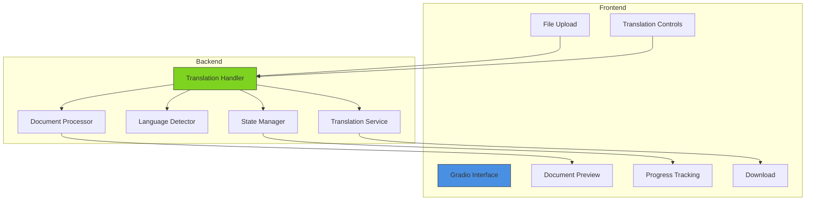
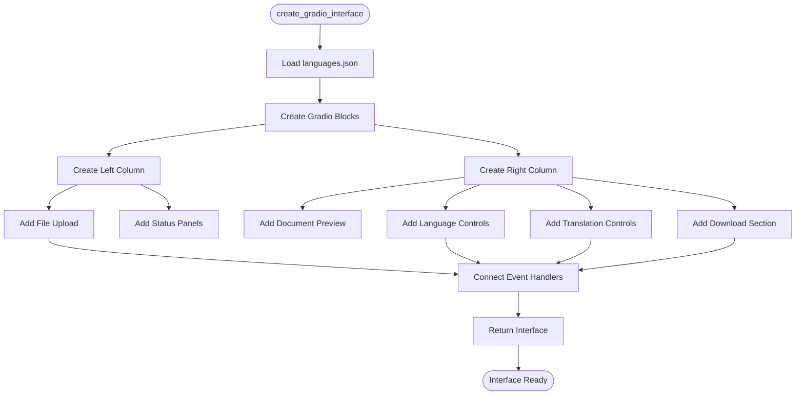
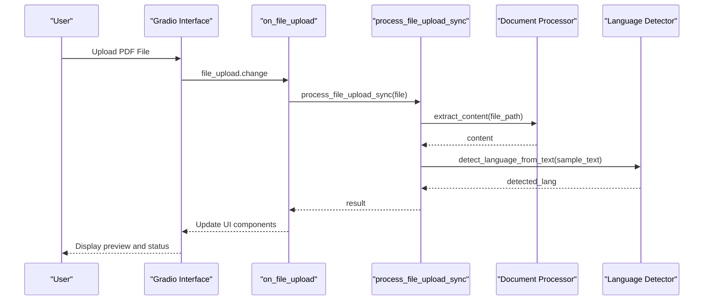
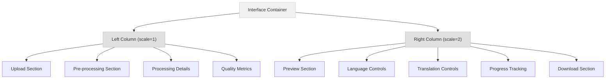
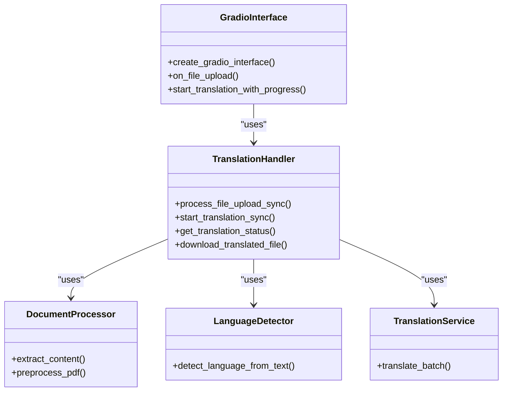
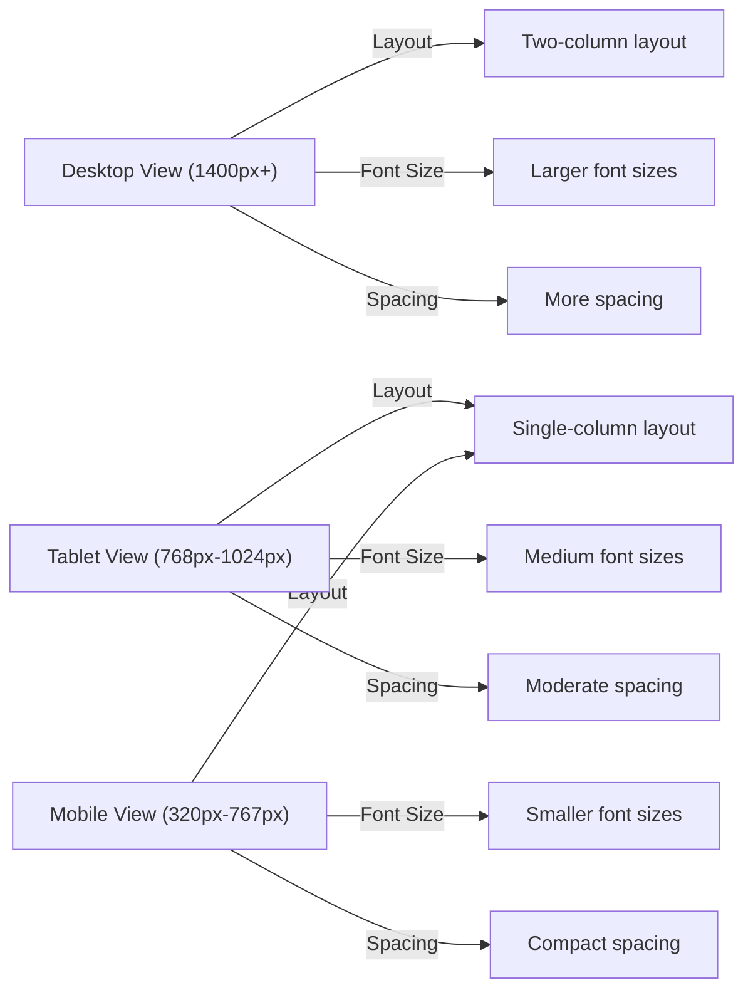

# Gradio Web Interface

<cite>
**Referenced Files in This Document**  
- [gradio_interface.py](file://ui/gradio_interface.py)
- [translation_handler.py](file://core/translation_handler.py)
- [languages.json](file://config/languages.json)
- [philosophy_interface.css](file://static/philosophy_interface.css)
- [philosophy_interface.js](file://static/philosophy_interface.js)
- [philosophy_interface.html](file://templates/philosophy_interface.html)
- [app.py](file://app.py)
</cite>

## Table of Contents
1. [Introduction](#introduction)
2. [Core Components](#core-components)
3. [Architecture Overview](#architecture-overview)
4. [Detailed Component Analysis](#detailed-component-analysis)
5. [Event Handling Chain](#event-handling-chain)
6. [UI Components](#ui-components)
7. [Layout and Styling](#layout-and-styling)
8. [Backend Integration](#backend-integration)
9. [Usage Examples](#usage-examples)
10. [Customization Options](#customization-options)
11. [Accessibility and Responsiveness](#accessibility-and-responsiveness)
12. [Error Handling](#error-handling)

## Introduction
The Gradio web interface component of PhenomenalLayout provides a user-friendly, multi-panel interface for advanced PDF document translation with layout preservation. This interface enables users to upload PDF documents, view processing details, detect source languages, select target languages, control translation parameters, and download translated documents. The interface is built using Gradio's Blocks UI framework and integrates with core translation services to provide real-time processing status and translation controls. The system supports philosophy mode for neologism detection in philosophical texts and provides comprehensive quality metrics for OCR and layout preservation.

## Core Components
The Gradio interface is implemented as a modular component within the PhenomenalLayout system, with clear separation between UI presentation and backend processing logic. The core components include the Gradio Blocks interface, event handlers for file upload and translation, progress tracking mechanisms, and integration with backend translation services. The interface is designed to be responsive and accessible, with support for various screen sizes and user interaction patterns. The system uses a state management approach to track translation jobs and processing status across user sessions.

**Section sources**
- [gradio_interface.py](file://ui/gradio_interface.py#L1-L463)
- [translation_handler.py](file://core/translation_handler.py#L1-L755)

## Architecture Overview
The Gradio web interface follows a client-server architecture with a clear separation between the frontend UI components and backend processing services. The interface is built using Gradio's Blocks framework, which allows for flexible layout design and event handling. The frontend communicates with backend services through synchronous wrapper functions that bridge the asynchronous core processing logic. The architecture includes components for file upload and validation, document preprocessing, language detection, translation processing, and result delivery.



**Diagram sources**
- [gradio_interface.py](file://ui/gradio_interface.py#L1-L463)
- [translation_handler.py](file://core/translation_handler.py#L1-L755)

## Detailed Component Analysis

### create_gradio_interface Implementation
The `create_gradio_interface()` function constructs a multi-panel Blocks UI with a responsive layout that adapts to different screen sizes. The interface is divided into two main columns with a 1:2 width ratio, providing ample space for document preview while maintaining access to controls and status information. The function initializes the interface with the application title, theme, and custom CSS styling. It loads supported languages from the configuration file and sets up the UI components with appropriate labels, default values, and interactive properties.



**Diagram sources**
- [gradio_interface.py](file://ui/gradio_interface.py#L200-L463)

**Section sources**
- [gradio_interface.py](file://ui/gradio_interface.py#L200-L463)

## Event Handling Chain
The event handling chain begins with the `file_upload.change` event, which triggers the `on_file_upload` function when a user uploads a PDF file. This function serves as the entry point for file processing and coordinates the validation, preprocessing, and analysis of the uploaded document. The event chain includes error handling at multiple levels, from file validation to processing exceptions, ensuring that users receive informative feedback about any issues encountered during upload.



**Diagram sources**
- [gradio_interface.py](file://ui/gradio_interface.py#L100-L199)
- [translation_handler.py](file://core/translation_handler.py#L215-L250)

**Section sources**
- [gradio_interface.py](file://ui/gradio_interface.py#L100-L199)
- [translation_handler.py](file://core/translation_handler.py#L215-L250)

## UI Components
The Gradio interface includes several key UI components that provide a comprehensive user experience for document translation. These components are organized into logical sections that guide the user through the translation workflow. Each component is designed with specific functionality and user interaction patterns in mind, ensuring that users can easily understand and control the translation process.

### File Upload Area
The file upload area provides a drag-and-drop interface for users to upload PDF documents. It includes validation to ensure that only PDF files are accepted and provides immediate feedback on upload status. The component is styled with a dedicated CSS class to enhance visibility and user interaction.

**Section sources**
- [gradio_interface.py](file://ui/gradio_interface.py#L220-L225)

### Document Preview
The document preview component displays a text-based representation of the uploaded document's content. This preview allows users to verify that the document has been correctly processed and provides context for the translation process. The preview is updated automatically when a new document is uploaded.

**Section sources**
- [gradio_interface.py](file://ui/gradio_interface.py#L275-L280)

### Language Detection Display
The language detection display shows the automatically detected source language of the uploaded document. This information is derived from text analysis performed by the language detection service and helps users verify that the system has correctly identified the document's language.

**Section sources**
- [gradio_interface.py](file://ui/gradio_interface.py#L290-L295)

### Target Language Dropdown
The target language dropdown allows users to select the desired output language for translation. The available options are loaded from the `languages.json` configuration file, ensuring that the interface reflects the system's supported languages. The dropdown includes a default value of "English" to provide a sensible starting point for users.

**Section sources**
- [gradio_interface.py](file://ui/gradio_interface.py#L295-L305)

### Page Limit Slider
The page limit slider enables users to control the number of pages to be translated, with a range from 1 to 2000 pages. This feature allows users to manage processing time and resource usage, particularly for large documents. The slider is initialized with a default value of 50 pages.

**Section sources**
- [gradio_interface.py](file://ui/gradio_interface.py#L307-L312)

### Philosophy Mode Toggle
The philosophy mode toggle activates neologism detection for philosophical texts. When enabled, the system performs additional analysis to identify and handle neologisms in the text, preserving their meaning during translation. This feature is particularly useful for translating philosophical works that contain specialized terminology.

**Section sources**
- [gradio_interface.py](file://ui/gradio_interface.py#L314-L318)

### Download Button
The download button becomes interactive when a translated document is ready for download. It triggers the `download_translated_file` function, which retrieves the translated document from the backend and initiates the download process. The button's state is managed by the progress tracking system, ensuring it is only enabled when a translation is complete.

**Section sources**
- [gradio_interface.py](file://ui/gradio_interface.py#L340-L345)

## Layout and Styling
The Gradio interface uses a responsive layout based on Gradio's Row/Column scaling system to create a balanced and functional user interface. The main layout consists of two columns with a 1:2 width ratio, allocating more space to the document preview and translation controls while maintaining access to processing status and quality metrics. The interface integrates custom CSS styling from an external file to enhance the visual appearance and user experience.



**Diagram sources**
- [gradio_interface.py](file://ui/gradio_interface.py#L210-L215)
- [philosophy_interface.css](file://static/philosophy_interface.css#L1-L1289)

**Section sources**
- [gradio_interface.py](file://ui/gradio_interface.py#L210-L215)
- [philosophy_interface.css](file://static/philosophy_interface.css#L1-L1289)

## Backend Integration
The Gradio interface integrates with core services through synchronous wrapper functions that bridge the asynchronous processing logic. The `process_file_upload_sync` function handles file upload and preprocessing, while the `start_translation_sync` function manages the translation process. These wrapper functions ensure compatibility with Gradio's synchronous event handling model while leveraging the underlying asynchronous architecture for efficient processing.



**Diagram sources**
- [gradio_interface.py](file://ui/gradio_interface.py#L1-L463)
- [translation_handler.py](file://core/translation_handler.py#L1-L755)

**Section sources**
- [gradio_interface.py](file://ui/gradio_interface.py#L1-L463)
- [translation_handler.py](file://core/translation_handler.py#L1-L755)

## Usage Examples
The Gradio interface supports several user workflows for document translation. A typical workflow begins with uploading a PDF document, which triggers automatic preprocessing and language detection. Users can then configure translation parameters, including target language, page limits, and philosophy mode. After initiating translation, users can monitor progress and download the translated document when complete.

### Basic Translation Workflow
1. Upload a PDF document using the file upload area
2. View document preview and detected source language
3. Select target language from the dropdown menu
4. Adjust page limit if needed
5. Click "Start Advanced Translation" button
6. Monitor progress in the status section
7. Download translated document when complete

**Section sources**
- [gradio_interface.py](file://ui/gradio_interface.py#L1-L463)

### Philosophy Mode Workflow
1. Upload a philosophical text PDF document
2. Enable "Philosophy Mode" checkbox
3. Review detected neologisms in the philosophy interface
4. Make choices for neologism handling
5. Proceed with translation
6. Download translated document with preserved philosophical terminology

**Section sources**
- [gradio_interface.py](file://ui/gradio_interface.py#L314-L318)
- [philosophy_interface.html](file://templates/philosophy_interface.html#L1-L393)

## Customization Options
The Gradio interface supports customization through configuration files and external styling. The `languages.json` file defines the supported languages for translation, allowing administrators to modify the available options without changing code. The interface also supports theming through external CSS files, enabling visual customization to match organizational branding or user preferences.

### Supported Languages Configuration
The `languages.json` file contains a list of supported languages that are loaded into the target language dropdown. This configuration allows for easy addition or removal of language options without modifying the interface code.

```json
{
  "supported_languages": [
    "English",
    "Spanish",
    "French",
    "German",
    "Italian",
    "Portuguese",
    "Russian",
    "Chinese",
    "Japanese",
    "Korean",
    "Arabic",
    "Hindi",
    "Dutch",
    "Swedish",
    "Norwegian"
  ],
  "supported_formats": ["PDF"]
}
```

**Section sources**
- [languages.json](file://config/languages.json#L1-L21)

### Theming with External CSS
The interface loads CSS styling from an external file, allowing for comprehensive visual customization. The CSS file defines color schemes, typography, spacing, and other visual properties that enhance the user experience.

**Section sources**
- [philosophy_interface.css](file://static/philosophy_interface.css#L1-L1289)

## Accessibility and Responsiveness
The Gradio interface is designed with accessibility and mobile responsiveness in mind. The layout adapts to different screen sizes using responsive design principles, ensuring that the interface remains usable on various devices. The interface includes semantic HTML elements, proper labeling, and keyboard navigation support to accommodate users with different abilities.



**Diagram sources**
- [philosophy_interface.css](file://static/philosophy_interface.css#L800-L1289)

**Section sources**
- [philosophy_interface.css](file://static/philosophy_interface.css#L800-L1289)

## Error Handling
The Gradio interface includes comprehensive error handling for various scenarios, including encrypted PDFs and validation failures. When an error occurs, the system provides user-friendly messages that explain the issue and suggest possible solutions. The error handling is implemented at multiple levels, from file validation to processing exceptions, ensuring that users receive appropriate feedback throughout the translation process.

### Encrypted PDF Handling
When users attempt to upload an encrypted PDF, the system detects this condition and displays a specific error message: "Encrypted PDFs not supported - please provide unlocked PDF". This clear message helps users understand the issue and take appropriate action.

**Section sources**
- [gradio_interface.py](file://ui/gradio_interface.py#L150-L155)

### Validation Failure Messages
The interface provides specific error messages for different validation failures, such as unsupported file formats. For example, when a non-PDF file is uploaded, the system displays: "Only PDF format supported". These targeted messages help users quickly identify and resolve issues with their documents.

**Section sources**
- [gradio_interface.py](file://ui/gradio_interface.py#L145-L150)
