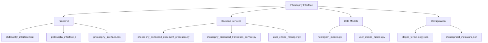
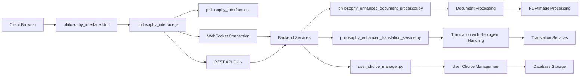
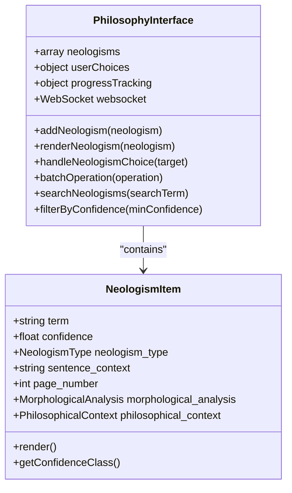
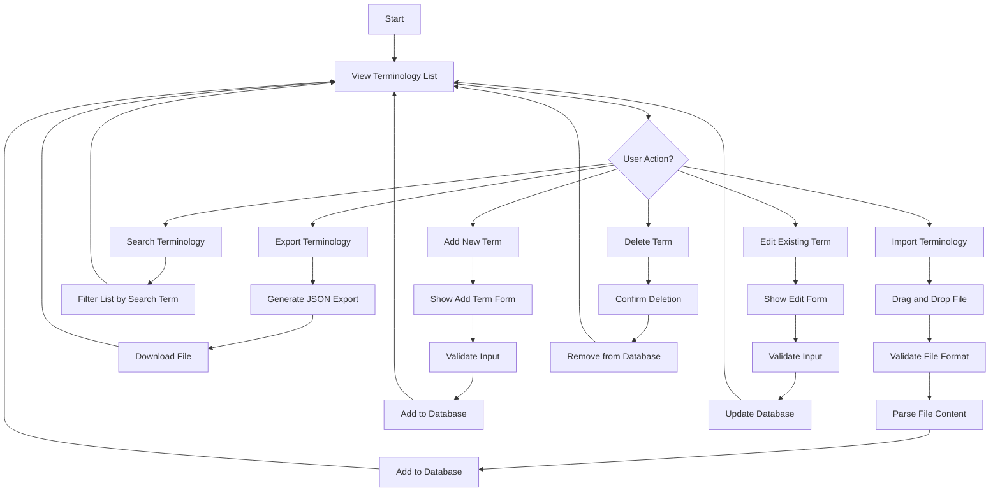
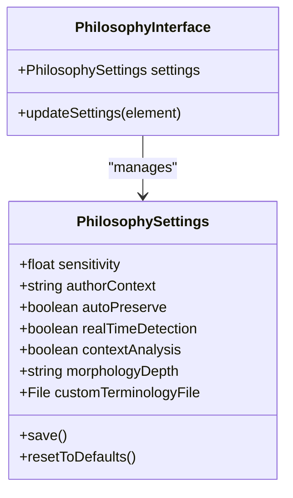
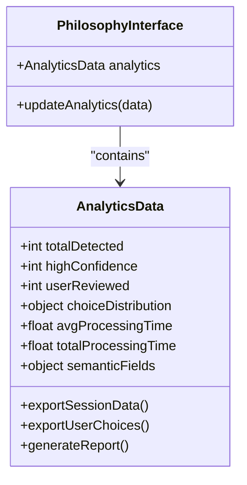
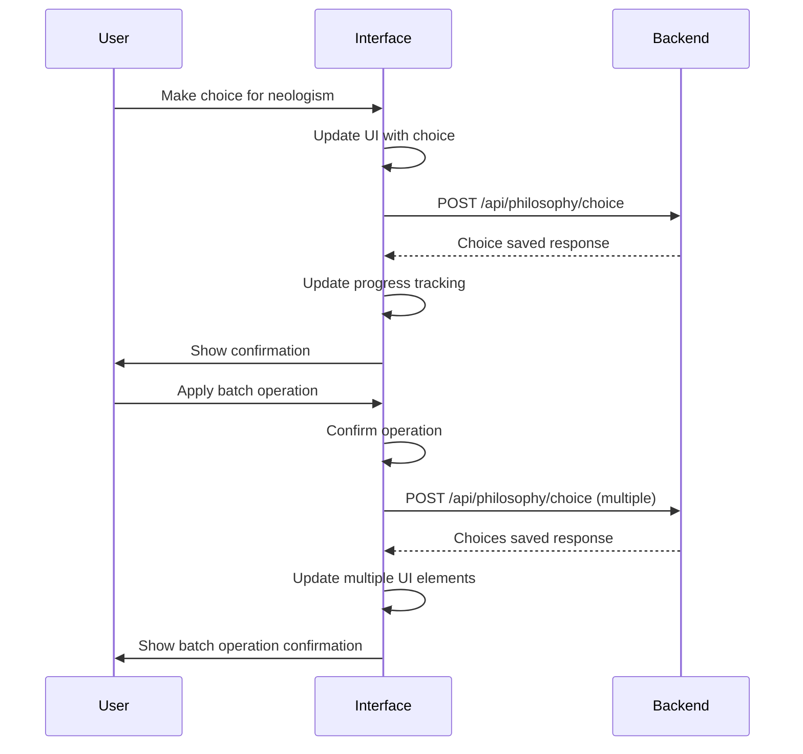
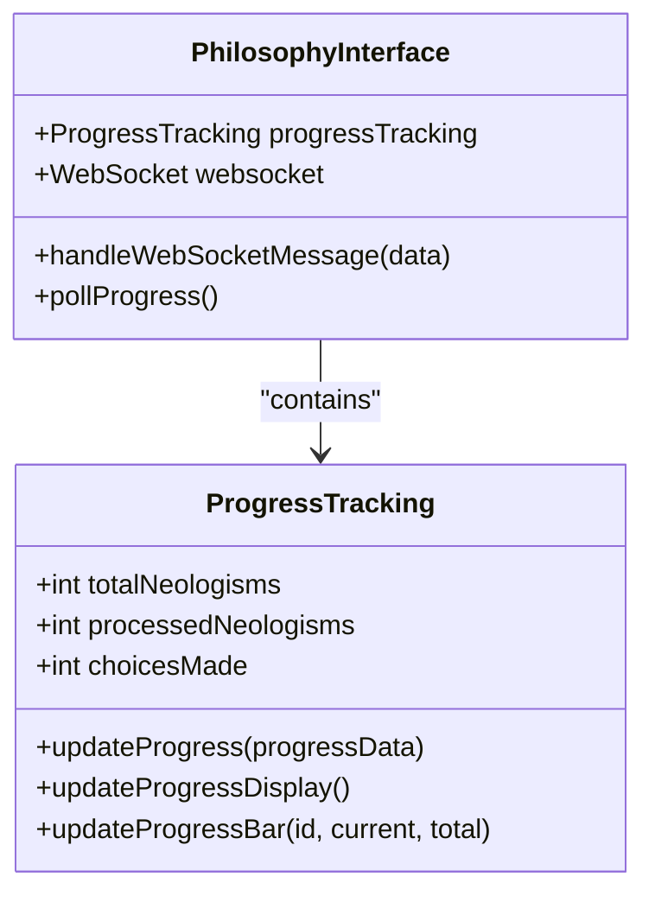
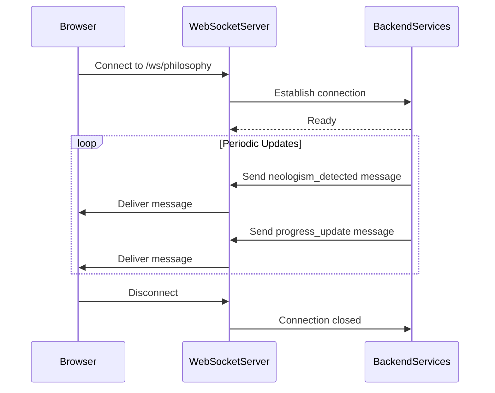
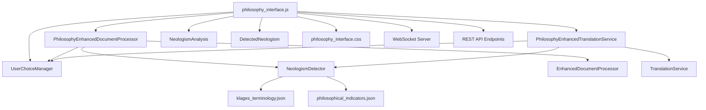

# Philosophy Interface

<cite>
**Referenced Files in This Document**  
- [philosophy_interface.html](file://templates/philosophy_interface.html)
- [philosophy_interface.js](file://static/philosophy_interface.js)
- [philosophy_interface.css](file://static/philosophy_interface.css)
- [philosophy_enhanced_document_processor.py](file://services/philosophy_enhanced_document_processor.py)
- [philosophy_enhanced_translation_service.py](file://services/philosophy_enhanced_translation_service.py)
- [neologism_models.py](file://models/neologism_models.py)
- [philosophy_interface_usage_example.py](file://examples/philosophy_interface_usage_example.py)
</cite>

## Table of Contents
1. [Introduction](#introduction)
2. [Project Structure](#project-structure)
3. [Core Components](#core-components)
4. [Architecture Overview](#architecture-overview)
5. [Detailed Component Analysis](#detailed-component-analysis)
6. [Dependency Analysis](#dependency-analysis)
7. [Performance Considerations](#performance-considerations)
8. [Troubleshooting Guide](#troubleshooting-guide)
9. [Conclusion](#conclusion)

## Introduction
The Philosophy Interface component of PhenomenalLayout provides an interactive environment for managing translation choices in philosophical texts. This specialized interface enables users to review, analyze, and make decisions about neologisms—newly coined or context-specific terms—that appear in philosophical works. The system combines sophisticated neologism detection with user choice management, allowing for preservation, translation, or custom handling of these specialized terms. The interface features a tabbed navigation system that organizes functionality into Neologism Review, Terminology Management, Philosophy Settings, and Session Analytics sections. Built with HTML, JavaScript, and CSS, the interface provides real-time updates through WebSocket connections and includes comprehensive progress tracking and analytics.

## Project Structure
The Philosophy Interface component is organized across multiple directories in the PhenomenalLayout repository. The core interface files are located in the `templates` and `static` directories, with `philosophy_interface.html` serving as the main template, and corresponding JavaScript and CSS files providing functionality and styling. The backend services that support the interface are located in the `services` directory, including the `philosophy_enhanced_document_processor.py` and `philosophy_enhanced_translation_service.py` files that handle document processing and translation with neologism awareness. The data models for neologisms are defined in `models/neologism_models.py`, while usage examples can be found in the `examples` directory. Configuration files for philosophical terminology and indicators are stored in the `config` directory.

**Diagram sources**
- [philosophy_interface.html](file://templates/philosophy_interface.html)
- [philosophy_enhanced_document_processor.py](file://services/philosophy_enhanced_document_processor.py)
- [philosophy_enhanced_translation_service.py](file://services/philosophy_enhanced_translation_service.py)
- [neologism_models.py](file://models/neologism_models.py)

**Section sources**
- [philosophy_interface.html](file://templates/philosophy_interface.html)
- [philosophy_interface.js](file://static/philosophy_interface.js)
- [philosophy_interface.css](file://static/philosophy_interface.css)

## Core Components
The Philosophy Interface consists of several core components that work together to provide a comprehensive environment for managing philosophical text translation. The main components include the tabbed navigation system, neologism rendering system, choice management system, terminology database, progress tracking system, and WebSocket integration. The interface is built around the PhilosophyInterface JavaScript class that manages state, handles user interactions, and communicates with the backend services. The system is designed to detect neologisms in philosophical texts, present them to users with detailed analysis, and allow users to make informed choices about how these terms should be handled in translation.

**Section sources**
- [philosophy_interface.html](file://templates/philosophy_interface.html)
- [philosophy_interface.js](file://static/philosophy_interface.js)
- [philosophy_interface.css](file://static/philosophy_interface.css)

## Architecture Overview
The Philosophy Interface follows a client-server architecture with a rich frontend interface communicating with backend services through API endpoints. The frontend is built with HTML, CSS, and JavaScript, using a modular approach with the PhilosophyInterface class managing the overall state and interactions. The backend services handle document processing, neologism detection, and translation, with results communicated back to the frontend through both REST API calls and WebSocket connections for real-time updates. The architecture is designed to be responsive and accessible, with support for different screen sizes and accessibility considerations.

**Diagram sources**
- [philosophy_interface.html](file://templates/philosophy_interface.html)
- [philosophy_interface.js](file://static/philosophy_interface.js)
- [philosophy_enhanced_document_processor.py](file://services/philosophy_enhanced_document_processor.py)
- [philosophy_enhanced_translation_service.py](file://services/philosophy_enhanced_translation_service.py)
- [user_choice_manager.py](file://services/user_choice_manager.py)

## Detailed Component Analysis

### Neologism Review Tab
The Neologism Review tab is the primary interface for reviewing and making decisions about detected neologisms in philosophical texts. This section displays a list of all detected neologisms, each presented with comprehensive information to support user decision-making. The interface shows the term itself with a confidence badge indicating the detection confidence level, using a color-coded system where high confidence (80%+) is green, medium confidence (60-79%) is orange, and low confidence (40-59%) is red. Each neologism is displayed with its sentence context, page number, and semantic field information.

The neologism rendering system provides detailed analysis through expandable sections that reveal morphological analysis (showing compound parts, structural complexity, and morphological productivity) and philosophical context analysis (showing philosophical density, keywords, and conceptual clusters). Users can make choices for each neologism through radio buttons offering "Preserve Original," "Allow Translation," or "Custom Translation" options. When "Custom Translation" is selected, an input field appears for entering a specific translation. Users can also add notes about their choice for future reference.

**Diagram sources**
- [philosophy_interface.html](file://templates/philosophy_interface.html)
- [philosophy_interface.js](file://static/philosophy_interface.js)
- [neologism_models.py](file://models/neologism_models.py)

**Section sources**
- [philosophy_interface.html](file://templates/philosophy_interface.html)
- [philosophy_interface.js](file://static/philosophy_interface.js)

### Terminology Management Tab
The Terminology Management tab provides a comprehensive interface for managing the philosophical terminology database. This section allows users to view, search, add, import, and export terminology entries. The interface displays existing terminology in a list format showing source terms and their translations, with edit and delete functionality for each entry. A search box enables users to quickly find specific terms within the database.

The system supports drag-and-drop functionality for importing terminology files in JSON, CSV, or TXT formats, making it easy to incorporate existing terminology databases. The import process validates the file format and content before adding the terms to the database. Export functionality allows users to download the current terminology database in JSON format for backup or sharing purposes. The interface also includes an "Add Term" button for manually entering new terminology entries.

**Diagram sources**
- [philosophy_interface.html](file://templates/philosophy_interface.html)
- [philosophy_interface.js](file://static/philosophy_interface.js)

**Section sources**
- [philosophy_interface.html](file://templates/philosophy_interface.html)
- [philosophy_interface.js](file://static/philosophy_interface.js)

### Philosophy Settings Tab
The Philosophy Settings tab provides controls for customizing the behavior of the neologism detection and translation system. Users can adjust the neologism detection sensitivity using a slider that ranges from 0.1 to 1.0, with higher values requiring stronger evidence for neologism classification. The interface allows users to select a philosophical author context from a dropdown menu, with options including Ludwig Klages, Martin Heidegger, Friedrich Nietzsche, Immanuel Kant, and Georg Wilhelm Friedrich Hegel. This context selection influences the terminology and detection patterns used by the system.

Additional settings include checkboxes for auto-preserving high-confidence neologisms, enabling real-time neologism detection, and performing enhanced context analysis. Users can also select the depth of morphological analysis (basic, standard, or advanced) and upload a custom terminology file in JSON, CSV, or TXT format. The settings can be saved or reset to defaults, with changes taking effect immediately across the interface.

**Diagram sources**
- [philosophy_interface.html](file://templates/philosophy_interface.html)
- [philosophy_interface.js](file://static/philosophy_interface.js)

**Section sources**
- [philosophy_interface.html](file://templates/philosophy_interface.html)
- [philosophy_interface.js](file://static/philosophy_interface.js)

### Session Analytics Tab
The Session Analytics tab provides comprehensive statistics and visualizations of the current translation session. The interface displays a detection summary showing the total number of neologisms detected, high-confidence detections, and user-reviewed terms. A choice distribution chart visualizes the proportion of neologisms that have been preserved, translated, or assigned custom translations. Processing time metrics show both average processing time per neologism and total processing time for the session.

The semantic fields section displays the distribution of detected neologisms across different philosophical domains, helping users understand the thematic focus of the text. Export options allow users to download session data, user choices, or a comprehensive report in JSON format. The analytics provide valuable insights into the translation process and help users track their progress and decision patterns.

**Diagram sources**
- [philosophy_interface.html](file://templates/philosophy_interface.html)
- [philosophy_interface.js](file://static/philosophy_interface.js)

**Section sources**
- [philosophy_interface.html](file://templates/philosophy_interface.html)
- [philosophy_interface.js](file://static/philosophy_interface.js)

### Choice Management System
The choice management system enables users to make decisions about how detected neologisms should be handled in translation. For each neologism, users can choose to preserve the original term, allow it to be translated, or provide a custom translation. The system supports batch operations, allowing users to apply the same choice to multiple selected neologisms at once. Batch operations include preserving selected, translating selected, applying custom translation to selected, selecting all, and clearing selection.

The interface includes quick action buttons in the sidebar for common operations such as preserving all high-confidence neologisms, translating all low-confidence neologisms, reviewing uncertain terms, and exporting the current session. When a user makes a choice, it is immediately saved to the backend database and reflected in the progress tracking system. The system also maintains a history of recent activities, showing the user's recent choices and actions.

**Diagram sources**
- [philosophy_interface.js](file://static/philosophy_interface.js)
- [philosophy_enhanced_translation_service.py](file://services/philosophy_enhanced_translation_service.py)

**Section sources**
- [philosophy_interface.js](file://static/philosophy_interface.js)

### Progress Tracking System
The progress tracking system provides visual indicators of the translation process completion. The interface displays three progress bars: neologism detection progress, user choices progress, and overall progress. Each progress bar is accompanied by text showing the current percentage and specific counts (e.g., "5/10 (50%)"). The system also displays statistical cards showing the total number of neologisms, choices made, and remaining choices.

The progress tracking is updated in real-time through WebSocket connections when available, or through periodic polling as a fallback. The system tracks progress at multiple levels, including document processing stages (extraction, neologism detection, user choice application, translation, and reconstruction) and specific metrics like processed pages, text blocks, and neologisms. This comprehensive tracking helps users understand the status of their translation session and estimate remaining work.

**Diagram sources**
- [philosophy_interface.js](file://static/philosophy_interface.js)
- [philosophy_enhanced_document_processor.py](file://services/philosophy_enhanced_document_processor.py)

**Section sources**
- [philosophy_interface.js](file://static/philosophy_interface.js)

### WebSocket Integration
The WebSocket integration provides real-time updates between the frontend interface and backend services. When the interface loads, it attempts to establish a WebSocket connection to the backend at the `/ws/philosophy` endpoint. If successful, the connection is used to receive real-time updates about neologism detection, progress updates, choice conflicts, and session completion. The connection status is displayed in the header with a colored indicator and text.

If the WebSocket connection fails or is not available, the system automatically falls back to a polling mechanism that checks for updates every 2 seconds. This ensures that users receive timely updates even in environments where WebSocket connections are restricted. The WebSocket messages are handled by the `handleWebSocketMessage` method in the PhilosophyInterface class, which routes different message types to appropriate handler functions.

**Diagram sources**
- [philosophy_interface.js](file://static/philosophy_interface.js)
- [philosophy_enhanced_document_processor.py](file://services/philosophy_enhanced_document_processor.py)

**Section sources**
- [philosophy_interface.js](file://static/philosophy_interface.js)

## Dependency Analysis
The Philosophy Interface component has dependencies on several backend services and data models. The frontend JavaScript code depends on the PhilosophyEnhancedDocumentProcessor and PhilosophyEnhancedTranslationService for document processing and translation functionality. These services in turn depend on the NeologismDetector for identifying neologisms and the UserChoiceManager for storing and retrieving user decisions. The interface also relies on the NeologismAnalysis and DetectedNeologism data models for structuring and displaying neologism information.

The system has configuration dependencies on JSON files containing philosophical terminology and indicators, particularly for specific philosophers like Ludwig Klages. The interface styling depends on CSS variables defined in the philosophy_interface.css file, which uses an academic color palette and responsive design principles. The WebSocket integration creates a dependency on the backend WebSocket server implementation, while the fallback polling mechanism depends on REST API endpoints for progress and neologism data.

**Diagram sources**
- [philosophy_interface.js](file://static/philosophy_interface.js)
- [philosophy_enhanced_document_processor.py](file://services/philosophy_enhanced_document_processor.py)
- [philosophy_enhanced_translation_service.py](file://services/philosophy_enhanced_translation_service.py)
- [neologism_models.py](file://models/neologism_models.py)
- [config/klages_terminology.json](file://config/klages_terminology.json)
- [config/philosophical_indicators.json](file://config/philosophical_indicators.json)

**Section sources**
- [philosophy_interface.js](file://static/philosophy_interface.js)
- [philosophy_enhanced_document_processor.py](file://services/philosophy_enhanced_document_processor.py)
- [philosophy_enhanced_translation_service.py](file://services/philosophy_enhanced_translation_service.py)

## Performance Considerations
The Philosophy Interface is designed with performance considerations to handle large philosophical texts efficiently. The system uses asynchronous processing and progress tracking to prevent interface blocking during intensive operations like document processing and neologism detection. The PhilosophyEnhancedDocumentProcessor implements batch processing with configurable concurrency limits to balance performance and resource usage.

The interface employs virtual scrolling and lazy loading for neologism lists to maintain responsiveness even with hundreds of detected terms. The WebSocket integration reduces the need for frequent polling, minimizing network overhead and server load. The system also implements caching for neologism detection results to avoid redundant processing when the same text is analyzed multiple times.

For large documents, the system breaks processing into stages (extraction, neologism detection, user choice application, translation, and reconstruction) with weighted progress tracking to provide accurate feedback on overall completion. The backend services are designed to run intensive operations in separate threads to prevent blocking the main event loop, ensuring the interface remains responsive.

**Section sources**
- [philosophy_enhanced_document_processor.py](file://services/philosophy_enhanced_document_processor.py)
- [philosophy_enhanced_translation_service.py](file://services/philosophy_enhanced_translation_service.py)
- [philosophy_interface.js](file://static/philosophy_interface.js)

## Troubleshooting Guide
Common issues with the Philosophy Interface typically relate to WebSocket connectivity, neologism detection accuracy, or interface responsiveness. If the connection status shows "Disconnected," users should check their network connection and ensure the backend server is running. The system automatically attempts to reconnect every 5 seconds, but users can refresh the page to force a new connection attempt.

If neologisms are not being detected, users should verify that the document has been properly uploaded and processed, and check the detection sensitivity settings. Very low sensitivity values may miss legitimate neologisms, while very high values may produce too many false positives. Users can adjust the sensitivity slider or change the philosophical author context to improve detection accuracy.

For performance issues with large documents, users can try reducing the maximum concurrent pages setting or disabling real-time detection to reduce system load. If the interface becomes unresponsive, clearing the browser cache or trying a different browser may resolve the issue. The system logs detailed information about processing steps and errors, which can be accessed through the browser's developer console for debugging purposes.

**Section sources**
- [philosophy_interface.js](file://static/philosophy_interface.js)
- [philosophy_enhanced_document_processor.py](file://services/philosophy_enhanced_document_processor.py)
- [philosophy_enhanced_translation_service.py](file://services/philosophy_enhanced_translation_service.py)

## Conclusion
The Philosophy Interface component of PhenomenalLayout provides a sophisticated environment for managing the translation of philosophical texts with a focus on neologism detection and user choice management. The interface successfully integrates complex backend processing with an intuitive frontend design, allowing users to make informed decisions about how specialized philosophical terms should be handled in translation. The system's modular architecture, with clear separation between frontend and backend components, enables extensibility and maintenance.

Key strengths of the interface include its comprehensive neologism analysis with morphological and philosophical context information, flexible choice management with batch operations, and real-time progress tracking with both WebSocket and polling fallbacks. The support for multiple philosophical traditions through configurable author contexts and custom terminology files makes the system adaptable to various philosophical texts and translation requirements.

The interface demonstrates thoughtful design in its user experience, with a clean, academic aesthetic and responsive layout that works across different device sizes. Future enhancements could include collaborative features for multiple users to review and discuss translation choices, more sophisticated visualization of semantic relationships between neologisms, and integration with external philosophical databases and ontologies.
