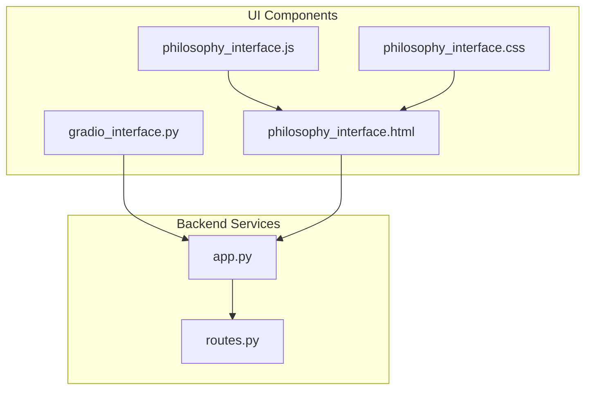
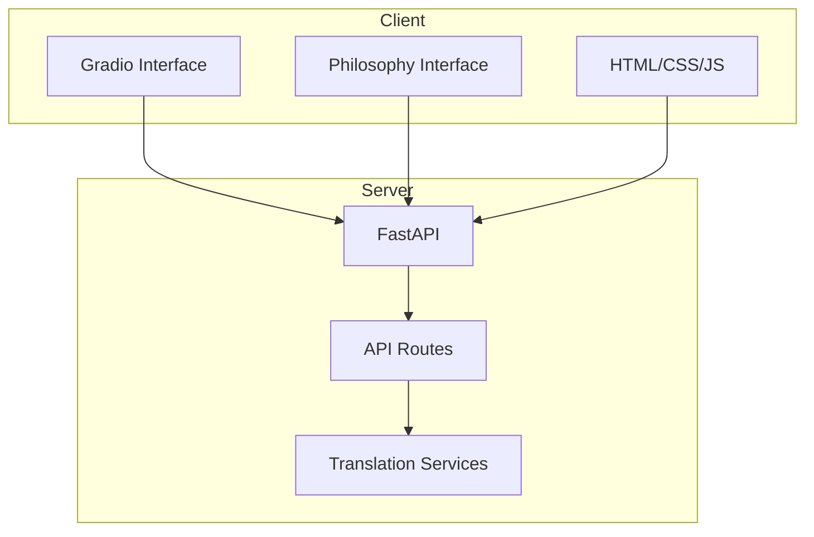
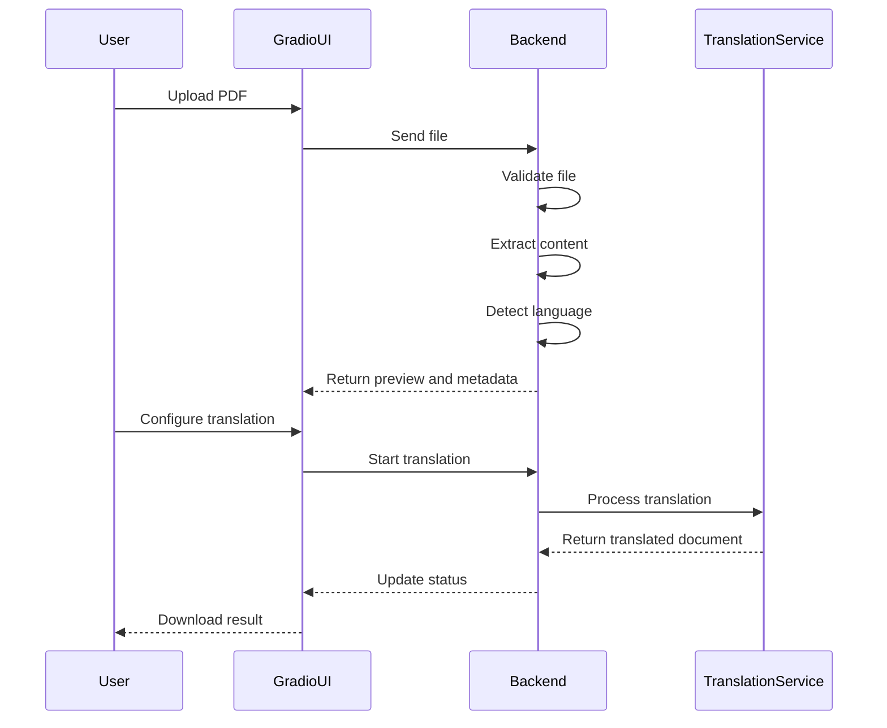
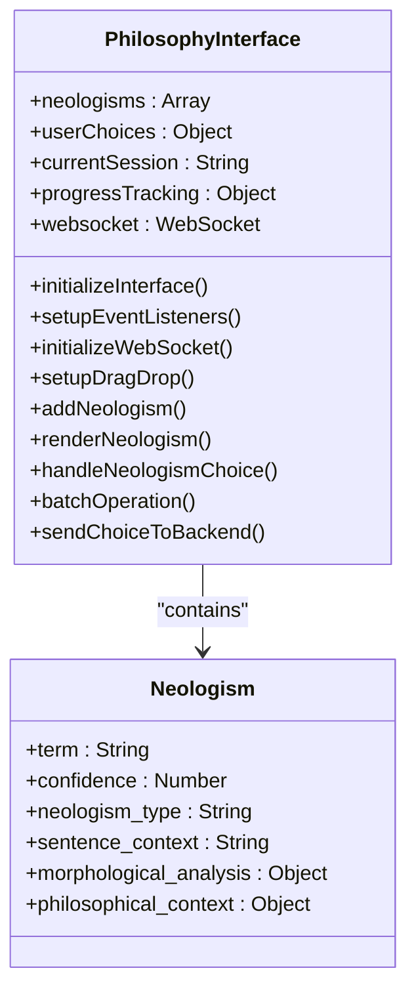
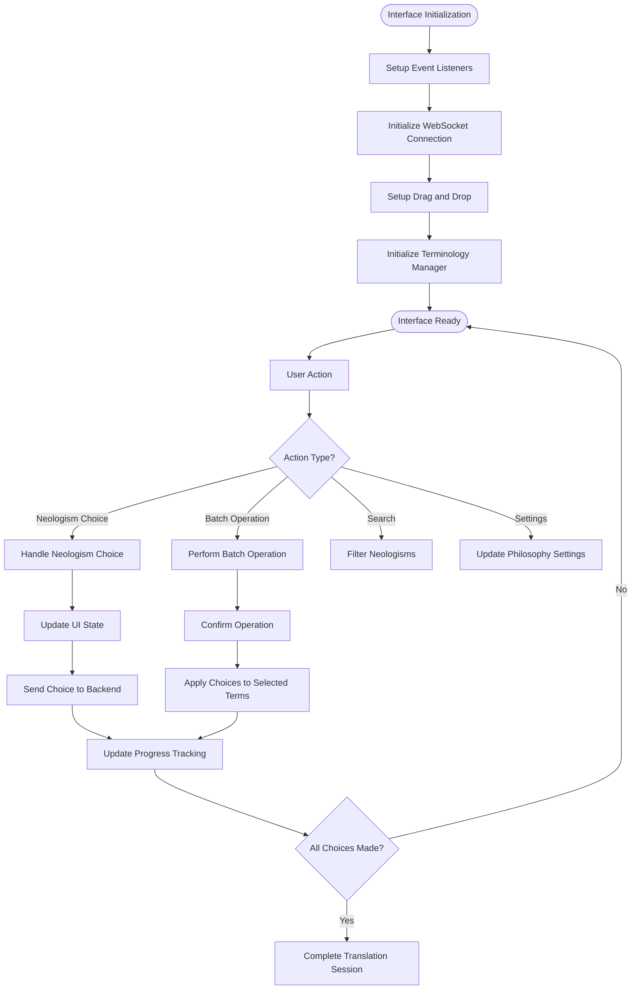
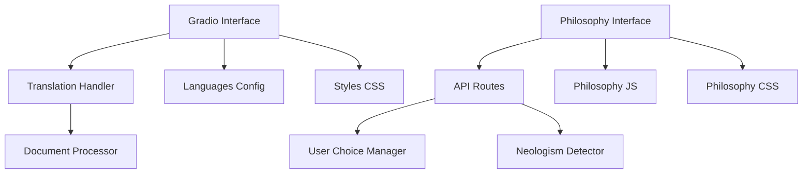

# User Interface

<cite>
**Referenced Files in This Document**  
- [gradio_interface.py](file://ui/gradio_interface.py)
- [philosophy_interface.html](file://templates/philosophy_interface.html)
- [philosophy_interface.js](file://static/philosophy_interface.js)
- [philosophy_interface.css](file://static/philosophy_interface.css)
- [app.py](file://app.py)
- [routes.py](file://api/routes.py)
- [languages.json](file://config/languages.json)
</cite>

## Table of Contents
1. [Introduction](#introduction)
2. [Project Structure](#project-structure)
3. [Core Components](#core-components)
4. [Architecture Overview](#architecture-overview)
5. [Detailed Component Analysis](#detailed-component-analysis)
6. [Dependency Analysis](#dependency-analysis)
7. [Performance Considerations](#performance-considerations)
8. [Troubleshooting Guide](#troubleshooting-guide)
9. [Conclusion](#conclusion)

## Introduction
The PhenomenalLayout system provides two distinct user interfaces for document translation: a Gradio-based interface for simple drag-and-drop functionality and a philosophy-specific interface for interactive translation choice making. The Gradio interface offers a straightforward user experience for basic translation tasks, while the philosophy interface provides advanced features for managing neologisms and philosophical terminology in academic texts. Both interfaces are designed to work seamlessly with the backend translation services and provide responsive, accessible user experiences.

## Project Structure
The user interface components are organized across multiple directories in the project structure. The Gradio interface is located in the `ui` directory, while the philosophy-specific interface components are distributed across `templates`, `static`, and related directories. This separation allows for independent development and deployment of the two interface types while maintaining shared backend services.

**Diagram sources**
- [gradio_interface.py](file://ui/gradio_interface.py)
- [philosophy_interface.html](file://templates/philosophy_interface.html)
- [philosophy_interface.js](file://static/philosophy_interface.js)
- [philosophy_interface.css](file://static/philosophy_interface.css)
- [app.py](file://app.py)
- [routes.py](file://api/routes.py)

**Section sources**
- [ui](file://ui)
- [templates](file://templates)
- [static](file://static)

## Core Components
The user interface system consists of two main components: the Gradio interface for basic document translation and the philosophy-specific interface for advanced neologism management. The Gradio interface provides a simple drag-and-drop experience with minimal configuration options, while the philosophy interface offers comprehensive tools for reviewing and managing translation choices for philosophical texts. Both interfaces integrate with the same backend services but provide different levels of control and customization for different user needs.

**Section sources**
- [gradio_interface.py](file://ui/gradio_interface.py)
- [philosophy_interface.html](file://templates/philosophy_interface.html)

## Architecture Overview
The user interface architecture follows a modular design with clear separation between presentation and business logic. The Gradio interface operates as a self-contained component within the FastAPI application, while the philosophy interface uses a traditional HTML/CSS/JavaScript stack with WebSocket connectivity for real-time updates. Both interfaces communicate with the backend through well-defined API endpoints, ensuring consistent behavior across different interface types.

**Diagram sources**
- [app.py](file://app.py)
- [routes.py](file://api/routes.py)
- [gradio_interface.py](file://ui/gradio_interface.py)
- [philosophy_interface.html](file://templates/philosophy_interface.html)

## Detailed Component Analysis

### Gradio Interface Analysis
The Gradio interface provides a simple drag-and-drop experience for document translation. It features a two-column layout with file upload controls on the left and document preview on the right. Users can select target languages from a dropdown menu, specify the number of pages to translate, and enable philosophy mode for neologism detection. The interface provides real-time feedback on upload status, preprocessing steps, OCR analysis, and quality metrics.

#### For API/Service Components:

**Diagram sources**
- [gradio_interface.py](file://ui/gradio_interface.py)
- [routes.py](file://api/routes.py)

**Section sources**
- [gradio_interface.py](file://ui/gradio_interface.py)

### Philosophy Interface Analysis
The philosophy interface is a comprehensive web application for managing translation choices in philosophical texts. It features a tabbed navigation system with sections for neologism review, terminology management, philosophy settings, and session analytics. The interface uses a main panel/sidebar layout with progress tracking and quick actions. It supports batch operations, custom terminology management, and detailed analytics for translation sessions.

#### For Object-Oriented Components:

**Diagram sources**
- [philosophy_interface.js](file://static/philosophy_interface.js)
- [philosophy_interface.html](file://templates/philosophy_interface.html)

#### For Complex Logic Components:

**Diagram sources**
- [philosophy_interface.js](file://static/philosophy_interface.js)
- [philosophy_interface.html](file://templates/philosophy_interface.html)

**Section sources**
- [philosophy_interface.html](file://templates/philosophy_interface.html)
- [philosophy_interface.js](file://static/philosophy_interface.js)
- [philosophy_interface.css](file://static/philosophy_interface.css)

## Dependency Analysis
The user interface components have well-defined dependencies on backend services and configuration files. The Gradio interface depends on the translation handler functions in the core module, while the philosophy interface relies on API routes for saving user choices and retrieving neologism data. Both interfaces use configuration files for supported languages and styling assets for visual presentation.

**Diagram sources**
- [gradio_interface.py](file://ui/gradio_interface.py)
- [philosophy_interface.html](file://templates/philosophy_interface.html)
- [routes.py](file://api/routes.py)
- [languages.json](file://config/languages.json)

**Section sources**
- [gradio_interface.py](file://ui/gradio_interface.py)
- [philosophy_interface.html](file://templates/philosophy_interface.html)
- [routes.py](file://api/routes.py)
- [languages.json](file://config/languages.json)

## Performance Considerations
Both interfaces are designed with performance in mind. The Gradio interface uses synchronous processing with progress updates to provide immediate feedback. The philosophy interface employs WebSocket connectivity for real-time updates without requiring page refreshes. The JavaScript implementation uses efficient DOM manipulation techniques and event delegation to handle large numbers of neologism items. The CSS includes responsive design breakpoints to ensure optimal performance across different device types.

## Troubleshooting Guide
Common issues with the user interfaces include file upload failures, connection problems with the philosophy interface, and missing styling assets. File upload issues are typically related to unsupported formats or encrypted PDFs, which are handled with specific error codes. The philosophy interface may experience WebSocket connection issues in environments with strict firewall rules, in which case it falls back to polling. Missing styling assets can occur if the static files are not properly mounted in the FastAPI application.

**Section sources**
- [gradio_interface.py](file://ui/gradio_interface.py)
- [philosophy_interface.js](file://static/philosophy_interface.js)
- [app.py](file://app.py)

## Conclusion
The PhenomenalLayout system provides two complementary user interfaces for document translation, catering to different user needs and use cases. The Gradio interface offers a simple, intuitive experience for basic translation tasks, while the philosophy interface provides advanced tools for managing complex translation decisions in philosophical texts. Both interfaces are well-integrated with the backend services and provide responsive, accessible user experiences. The modular design allows for independent development and deployment of the interfaces while maintaining consistent functionality across the system.
