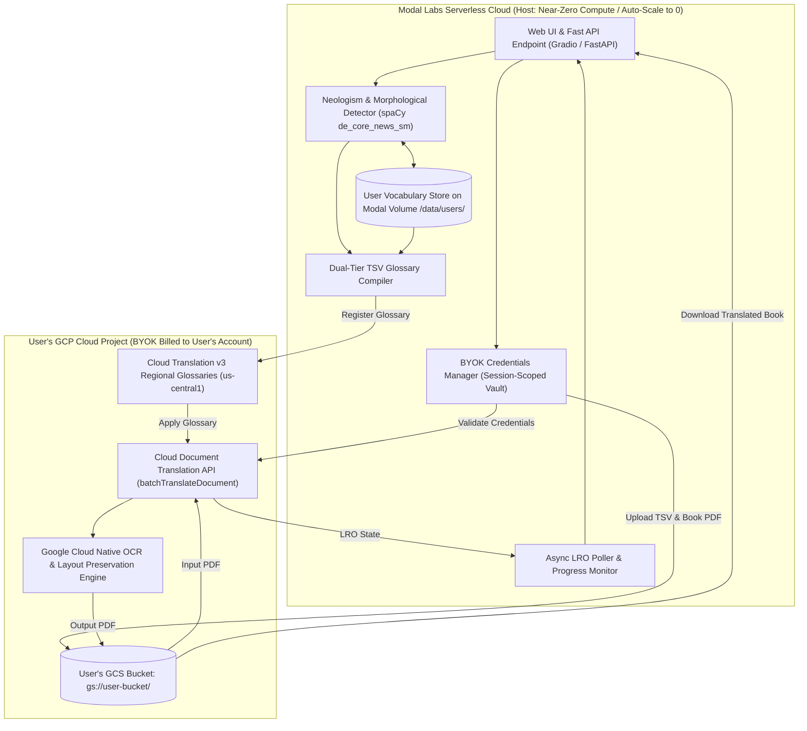
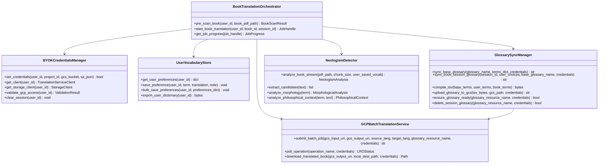
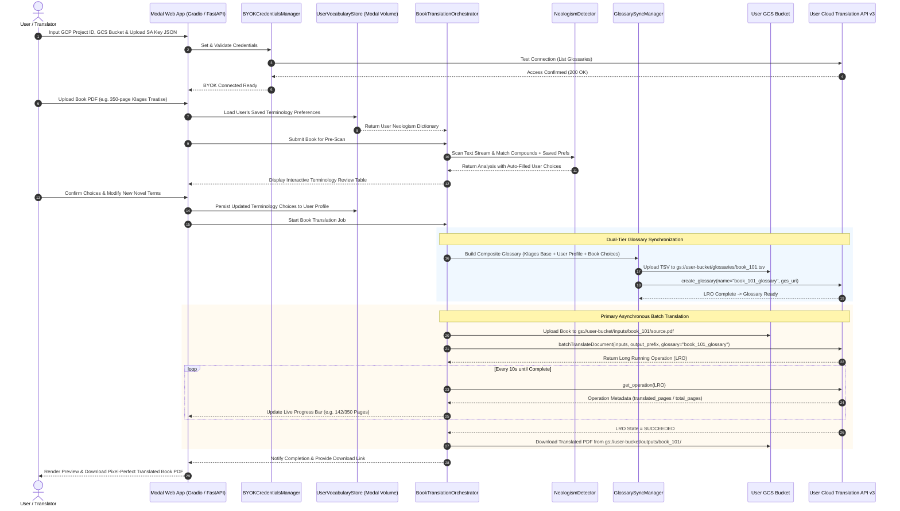

# System Design: Google Cloud Document Translation & Neologism Orchestration Engine

## 1. Executive Summary & Book-Scale Vision

**PhenomenalLayout** is engineered specifically for **full-length books and long-form philosophical treatises** (e.g., Ludwig Klages' *Der Geist als Widersacher der Seele*, Kantian critiques, Heideggerian texts).

Because books range from 50 to 1,000+ pages with complex multi-column layouts, footnotes, diagrams, and dense terminology, PhenomenalLayout establishes **Asynchronous Google Cloud Document Batch Translation (`batchTranslateDocument`) using Google Cloud Storage (GCS) buckets as the primary/default translation pipeline**.

PhenomenalLayout is deployed as a **serverless cloud application on Modal Labs** under a **Bring Your Own Key (BYOK)** model. Users provide their own Google Cloud credentials and project billing, while Modal Labs orchestrates the web interface, text streaming, German morphological analysis, dynamic glossary compilation, and persistent user-level neologism preferences.

---

## 2. Compute Topology & Division of Labor (Modal Labs vs. User GCP Project)

To maximize efficiency and operate within Modal Labs' free compute tier ($30/month) while maintaining zero cloud translation costs for the host, the compute topology is divided into two distinct zones:



### 2.1 Workload & Cost Allocation Matrix

| Workload Component | Host Layer | Resource Profile | Cost & Scaling Model |
| :--- | :--- | :--- | :--- |
| **Web Interface & API** | Modal Labs Web Endpoint | Lightweight Python FastAPI / Gradio | Auto-scales down to 0 when idle. Consumes < $2–$5/mo of Modal's $30 free compute tier. |
| **Neologism Pre-Scanning & Parsing** | Modal CPU Worker | Python streaming chunk reader + spaCy NLP | ~2–5 seconds CPU burst per chapter. Highly optimized memory footprint (< 256MB RAM). |
| **User Account & Vocabulary Store** | Modal Persistent Volume (`modal.Volume`) | SQLite / JSON store on `/data/user_profiles/` | Persistent storage across user sessions. Zero recurring compute cost when idle. |
| **Dual-Tier TSV Compilation** | Modal CPU Worker | In-memory RFC 4180 TSV generation | Instantaneous (< 100ms). |
| **Book & Glossary Storage** | User's GCS Bucket (`gs://<user_bucket>/`) | Google Cloud Storage Standard / Nearline | Billed directly to User's GCP account (~$0.02/GB/mo). Host incurs zero storage/egress fees. |
| **Document Translation & Layout Reconstruction** | User's GCP Cloud Translation API v3 | Google Cloud Tensor & Document Processing | Billed directly to User's GCP billing account ($0.08/page). Host incurs zero translation costs. |
| **LRO Progress Monitoring** | Modal Async Worker | Lightweight async polling loop (every 10s) | Near-zero CPU overhead while waiting for GCP LRO completion. |

---

## 3. Bring Your Own Key (BYOK) Architecture & Security Model

PhenomenalLayout provides a dedicated **BYOK Setup & Credentials Vault**:

1. **Credential Ingestion**:
   * Users supply their **Google Cloud Project ID**, **Target GCS Bucket Name**, and **GCP Service Account Key (JSON)** or temporary OAuth access token.
   * Service Account must have permissions: `roles/cloudtranslate.editor` and `roles/storage.objectAdmin` on the target bucket.
2. **Session-Scoped Isolation**:
   * Credentials are held strictly in memory for the active browser session (or encrypted at rest on client-side encrypted tokens).
   * Credentials are never logged, never exposed to other users, and never persisted to public storage.
3. **Instant Validation**:
   * Upon entry, the system tests connectivity by issuing a zero-cost GCP call (`projects.locations.glossaries.list`) to verify permissions and regional endpoint availability (`us-central1`).

---

## 4. User-Tied Neologism Memory & Vocabulary Persistence

Philosophical translators build specific terminology preferences over time. PhenomenalLayout introduces the **Persistent User Vocabulary Engine**:

1. **User Identity & Storage**:
   * Managed on a persistent Modal Volume: `modal.Volume.from_name("phenomenal-user-data", create_if_missing=True)`.
   * Stored under `/data/user_vocabularies/{user_id}.sqlite` or `.json`.
2. **Translation Choice Memory**:
   * Whenever a user selects a translation (e.g. `Geist` $\rightarrow$ `Spirit`, `Wirklichkeit` $\rightarrow$ `Actuality`, or `Schauung` $\rightarrow$ `[Preserve Untranslated: Schauung]`), the preference is saved to their persistent profile.
3. **Smart Auto-Populate for New Books**:
   * When the user uploads a subsequent book, the Neologism Pre-Scanner checks the user's saved vocabulary first.
   * Saved terms are automatically pre-selected in the terminology review table with high confidence, drastically reducing repetitive translator input across a multi-volume treatise.

---

## 5. Component Architecture & System Boundaries



---

## 6. Subsystem Deep-Dive

### 6.1 Subsystem 1: Book-Scale Text Ingestion & Neologism Pre-Scanning
* **Stream-Based Chunking**: Full books (100–1,000 pages) are processed in streaming chunks via `pypdf` without loading entire uncompressed page bitmaps into memory.
* **Linguistic Analysis**:
  * [`NeologismDetector`](services/neologism_detector.py) identifies German compounds, prefixes, and suffixes.
  * [`PhilosophicalContextAnalyzer`](services/philosophical_context_analyzer.py) scores term frequency, chapter distribution, and philosophical relevance.
  * Pre-populates suggestions using:
    1. User's saved preferences from `UserVocabularyStore`.
    2. Built-in domain foundation dictionary ([`config/klages_terminology.json`](config/klages_terminology.json)).
    3. Morphological root decomposition for novel coined compounds.

---

### 6.2 Subsystem 2: Dual-Tier Glossary Synchronization & Lifecycle Management
Translating books requires strict terminology consistency across thousands of paragraphs. The **Glossary Sync Manager** operates two tiers:

1. **Tier 1: Persistent Domain Glossaries (Base Tier)**
   * Static foundation dictionaries (e.g. `klages-philosophical-base-v1`) provisioned once in Google Cloud Translation in user's project (`projects/<user_proj>/locations/us-central1/glossaries/klages-philosophical-base-v1`).
   * Reused across all translations of related treatises to avoid redundant GCS uploads.

2. **Tier 2: Dynamic Book Session Glossaries (Overlay Tier)**
   * Merges Tier 1 + User Saved Vocabulary + Book-Specific Choices.
   * Compiles the mapping into a RFC 4180-compliant TSV (`source_code\ttarget_code`).
   * Stages the file in user's GCS: `gs://<user_bucket>/glossaries/sessions/<book_id>_<timestamp>.tsv`.
   * Invokes Cloud Translation v3 `create_glossary` in `us-central1` and polls until status is active.
   * Automatic TTL/cleanup policies prune transient session glossaries after job completion.

---

### 6.3 Subsystem 3: Primary Default Pipeline - Asynchronous GCS Batch Translation
Because books exceed inline API payload and timeout limits, **Asynchronous Batch Translation (`batchTranslateDocument`) is the primary, default execution engine**:

1. **Book Upload to User GCS**:
   * The source book PDF is streamed to `gs://<user_bucket>/inputs/<book_id>/source.pdf`.
2. **Batch Request Dispatch**:
   * Constructs `BatchTranslateDocumentRequest`:
     * `parent = f"projects/{user_project_id}/locations/{location}"`
     * `source_language_code = "de"`
     * `target_language_codes = ["en"]`
     * `input_configs = [{"gcs_source": {"input_uri": "gs://<user_bucket>/inputs/<book_id>/source.pdf"}, "mime_type": "application/pdf"}]`
     * `output_config = {"gcs_destination": {"output_uri_prefix": "gs://<user_bucket>/outputs/<book_id>/"}}`
     * `glossaries = {"en": {"glossary": glossary_resource_name}}`
   * Dispatches asynchronous request via `TranslationServiceClient.batch_translate_document`.
3. **Long-Running Operation (LRO) Monitoring**:
   * Tracks operation progress metadata via `BatchTranslateDocumentMetadata` (`metadata.state == SUCCEEDED`, `metadata.translated_pages / metadata.total_pages`, `metadata.failed_pages`).
   * Emits progress events to the Gradio/FastAPI interface for live chapter/page tracking.
4. **Automated Fetch & Validation**:
   * Once LRO transitions to `SUCCEEDED` (or `done == True`), downloads the translated PDF from `gs://<user_bucket>/outputs/<book_id>/` to local cache.
   * Runs validation check ensuring page count matches and PDF structure is intact.

*(Note: Synchronous `translateDocument` is retained purely as an optional rapid preview tool for single sample pages).*

---

## 7. Sequence Diagram: Modal BYOK Book Translation Lifecycle



---

## 8. Modal Labs Serverless Deployment Architecture

```python
# modal_app.py architecture outline
import modal

app = modal.App("phenomenallayout")
volume = modal.Volume.from_name("phenomenal-user-data", create_if_missing=True)

image = (
    modal.Image.debian_slim(python_version="3.11")
    .pip_install(
        "fastapi",
        "uvicorn",
        "gradio",
        "pypdf>=6.14.0",
        "google-cloud-translate>=3.15.0",
        "google-cloud-storage>=2.14.0",
        "spacy>=3.7.0",
        "pydantic>=2.10.0",
    )
    .run_commands("python -m spacy download de_core_news_sm")
)

@app.function(
    image=image,
    volumes={"/data": volume},
    timeout=3600,
    scaledown_window=300,
)
@modal.asgi_app()
def web_entrypoint():
    from app import create_app
    return create_app()
```

---

## 9. Configuration & Environment Variables

| Variable | Description | Source / Scope |
| :--- | :--- | :--- |
| `MODAL_VOLUME_PATH` | Path for persistent user profiles and vocabularies | Modal Container (`/data`) |
| `GCP_LOCATION` | Regional endpoint for Translation & Glossaries | User Config (`us-central1`) |
| `BATCH_POLL_INTERVAL_SEC`| Interval in seconds for checking batch LRO status | System Default (`10s`) |
| `MAX_INLINE_PREVIEW_PAGES`| Max pages allowed for synchronous sample previews | System Default (`3`) |
| `USER_BYOK_PROJECT_ID` | Google Cloud Project ID | User BYOK Input |
| `USER_BYOK_BUCKET` | Google Cloud Storage Bucket Name | User BYOK Input |
| `USER_BYOK_CREDENTIALS` | Google Service Account Key JSON | User BYOK Input / Vault |
