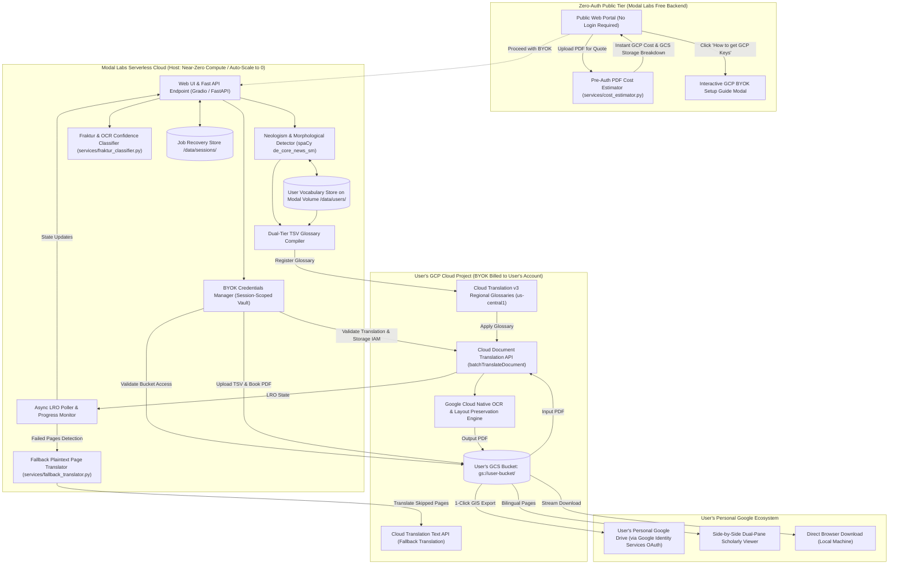

# System Design: Google Cloud Document Translation & Neologism Orchestration Engine

## 1. Executive Summary & Book-Scale Vision

**PhenomenalLayout** is engineered specifically for **full-length books and long-form philosophical treatises** (e.g., Ludwig Klages' *Der Geist als Widersacher der Seele*, Kantian critiques, Heideggerian texts).

Because books range from 50 to 1,000+ pages with complex multi-column layouts, footnotes, diagrams, and dense terminology, PhenomenalLayout establishes **Asynchronous Google Cloud Document Batch Translation (`batchTranslateDocument`) using Google Cloud Storage (GCS) buckets as the primary/default translation pipeline**.

PhenomenalLayout is deployed as a **serverless cloud application on Modal Labs** under a **Bring Your Own Key (BYOK)** model:
* **Zero Host Storage**: Modal Labs stores **zero** book PDF files. The source PDF and translated outputs reside exclusively in the **user's personal GCS bucket** or export directly to their **personal Google Drive**.
* **Zero Host API/Compute Cost**: Translation ($0.08/page) and GCS storage are billed directly to the user's personal GCP project. Modal Labs operates strictly within its $30/month free tier with automatic scale-to-zero.
* **Seamless Google Drive Export**: Uses native **Google Identity Services (GIS)** client-side OAuth (`drive.file` scope) for 1-click cloud export without requiring heavy third-party SaaS auth (no Auth0, no Clerk).
* **Pre-Auth Zero-Credential Cost Estimator**: Calculates translation costs and 7-day staging / monthly GCS retention schedules within a $\pm \$5.00$ tolerance margin before login.
* **Scholarly Resilience**: Includes **Job Resumption** for long 10–35 min batch jobs, **Fraktur / Blackletter OCR confidence rating**, **Partial Page Failure resilience with Fallback Plaintext translation** (achieving 98% layout + 100% text translation), **Glossary Quota auto-cleanup**, and a **Side-by-Side Dual-Pane Reading Mode**.

---

## 2. Compute Topology & Division of Labor (Modal Labs vs. User GCP Project)



---

## 3. Pre-Auth Zero-Credential GCP Translation & Storage Cost Estimator

### 3.1 Pricing Schedule & Google Cloud Storage (GCS) Cost Rules

Google Cloud Platform pricing for Document Translation and Storage consists of:
1. **Document Translation Rate**: Flat **$0.080 per page** for native and scanned PDF layouts.
2. **GCS "Always Free" Tier**: Google Cloud provides **5 GB-months of Standard Storage free of charge** in US regions (`us-central1`, `us-east1`, `us-west1`).
3. **GCS Staging Lifecycle (7-Day Auto-Expiration)**: Transient input staging objects (`gs://<bucket>/inputs/...`) and temporary translation runs are provisioned with a **7-day auto-delete lifecycle policy** on the bucket to prevent unbounded storage accumulation.
4. **Paid GCS Storage Tiers (Beyond 5 GB free limit)**:
   * Standard Regional Storage: **$0.020 per GB / month** (or ~$0.00067 / GB / day).
   * Archive Storage (Long-Term Archival): **$0.0012 per GB / month** (or ~$0.0144 / GB / year).

### 3.2 Estimation Formula & Monthly Retention Schedule

A 200–500 page book PDF is typically 15 MB to 50 MB in file size.

The **`GCPCostEstimator`** calculates:
$$\text{Base Translation Cost} = N_{\text{billable\_pages}} \times \$0.080$$
$$\text{7-Day Staging Overhead} = \left(\frac{\text{File Size MB} \times 2}{1024}\right) \times \$0.020 \times \left(\frac{7 \text{ days}}{30 \text{ days}}\right) \approx \$0.0001 \text{ to } \$0.0004$$
$$\text{1-Month GCS Retention Cost} = \left(\frac{\text{File Size MB} \times 2}{1024}\right) \times \$0.020 \approx \$0.0006 \text{ to } \$0.0019 / \text{month}$$
$$\text{12-Month GCS Archival Cost} = \left(\frac{\text{File Size MB} \times 2}{1024}\right) \times \$0.0012 \times 12 \approx \$0.0004 \text{ to } \$0.0014 / \text{year}$$

### 3.3 Quote Presentation & Precision ($\le \pm \$5.00$ Margin of Error)

The cost estimator outputs an itemized breakdown:
* **Translation Cost**: $N_{\text{pages}} \times \$0.080$ (e.g. 350 pages = **$28.00**).
* **Storage Cost**: **$0.00** (Covered under GCP Always Free 5 GB tier; or $< \$0.01/\text{month}$ beyond with 7-day auto-expiry on staging).
* **Total Expected GCP Budget**: **$28.00 – $28.50** (Variance strictly within $\pm \$5.00$).

---

## 4. Seamless Personal Google Drive Export Subsystem

### 4.1 Zero-SaaS Authentication Architecture (No Auth0 / No Clerk)

PhenomenalLayout implements **native client-side Google Identity Services (GIS)** OAuth 2.0 Token Flow:
1. User clicks **"📁 Save to Google Drive"**.
2. A native Google OAuth popup requests permission for scope `https://www.googleapis.com/auth/drive.file`.
3. Upon 1-click user authorization, the client receives a short-lived token.
4. The translated PDF streams directly from the user's GCS bucket to Google Drive API v3 (`files.create`).

### 4.2 Security & Privacy: Restricted `drive.file` Scope
* **Scope**: `https://www.googleapis.com/auth/drive.file`.
* **Privacy Guarantee**: This restricted scope grants access **strictly to create and manage files opened or created by PhenomenalLayout**. It cannot view, list, or read any existing documents, folders, or personal files in the user's Google Drive.
* **Zero Backend Credentials**: The Google Drive OAuth token is held strictly in the browser context for the duration of the export call and is never stored on the server.

---

## 5. Bring Your Own Key (BYOK) Architecture & Onboarding Walkthrough

### 5.1 Credential Ingestion & Dual-Service Validation Model
1. **Inputs Required**: GCP Project ID, Target GCS Bucket Name, and GCP Service Account JSON key.
2. **Session-Scoped Isolation**: Held strictly in memory for the active session; zero disk writes, zero logging.
3. **Comprehensive Dual-Service Validation (`validate_credentials`)**:
   * **Translation API Check**: Non-billable call (`projects.locations.glossaries.list`) verifies Translation API enablement and IAM roles (`roles/cloudtranslate.editor`) in `us-central1`.
   * **Storage Bucket Check**: Verifies bucket accessibility and IAM permissions (`storage_client.get_bucket(bucket_name)` and `bucket.test_iam_permissions(['storage.objects.create', 'storage.objects.get', 'storage.objects.delete'])`).
   * Only when **both** checks pass is the connection declared `VALID`.

### 5.2 Interactive GCP Onboarding Walkthrough Modal

The BYOK panel includes a **"📖 Step-by-Step GCP Setup Guide"** modal that opens directly in the browser with 6 progressive steps, direct Google Cloud Console links, and copyable `gcloud` setup commands:

```
┌─────────────────────────────────────────────────────────────────────────────┐
│ 🚀 Google Cloud Setup Guide (Step-by-Step BYOK Walkthrough)               [X]│
├─────────────────────────────────────────────────────────────────────────────┤
│ 1️⃣  Create GCP Account & Claim Free Credits                                 │
│     • Go to console.cloud.google.com (New users receive $300 in free credit)│
│                                                                             │
│ 2️⃣  Create a Project                                                       │
│     • Click Project Selector ➔ "New Project" ➔ Name it e.g. "phenomenal-book"│
│                                                                             │
│ 3️⃣  Enable Required APIs (1-Click Link)                                    │
│     • Cloud Translation API (translate.googleapis.com)                      │
│     • Cloud Storage API (storage.googleapis.com)                            │
│                                                                             │
│ 4️⃣  Create a Cloud Storage Bucket                                          │
│     • Go to Cloud Storage ➔ Create Bucket in region 'us-central1'           │
│                                                                             │
│ 5️⃣  Create Service Account & Download JSON Key                              │
│     • Go to IAM & Admin ➔ Service Accounts ➔ "Create Service Account"       │
│     • Grant Roles:                                                          │
│       - Cloud Translation API User / Editor (roles/cloudtranslate.editor)   │
│       - Storage Object Admin (roles/storage.objectAdmin)                    │
│     • Keys tab ➔ Add Key ➔ Create New Key ➔ JSON (downloads credentials.json)│
│                                                                             │
│ 6️⃣  Upload & Validate                                                       │
│     • Drag & drop credentials.json into PhenomenalLayout and click 'Connect' │
│                                                                             │
│ ⚡ Power User? Copy and execute these pinned gcloud commands:                │
│    gcloud services enable translate.googleapis.com storage.googleapis.com    │
│    gcloud storage buckets create gs://[BUCKET] --location=us-central1        │
│    gcloud iam service-accounts create phenomenal-sa                         │
│    gcloud projects add-iam-policy-binding [PROJ] \                           │
│      --member="serviceAccount:phenomenal-sa@[PROJ].iam.gserviceaccount.com" \│
│      --role="roles/cloudtranslate.editor"                                   │
│    gcloud storage buckets add-iam-policy-binding gs://[BUCKET] \             │
│      --member="serviceAccount:phenomenal-sa@[PROJ].iam.gserviceaccount.com" \│
│      --role="roles/storage.objectAdmin"                                     │
│    gcloud iam service-accounts keys create credentials.json \               │
│      --iam-account=phenomenal-sa@[PROJ].iam.gserviceaccount.com             │
└─────────────────────────────────────────────────────────────────────────────┘
```

---

## 6. Scholarly Resilience & Production Enhancements

### 6.1 Historical German OCR & Fraktur / Blackletter Confidence Engine
* **Context**: Pre-1945 philosophical editions are frequently typeset in Fraktur (Gothic / Blackletter).
* **Module**: [`services/fraktur_classifier.py`](services/fraktur_classifier.py) (`FrakturClassifier`).
* **Mechanism**:
  1. Inspects font descriptors, unicode ligature patterns (e.g. `ſ` long-s, `tz`, `ch`, `ck` Fraktur ligatures), and page bitmap histograms.
  2. Emits an **OCR Script Confidence Rating**:
     * `script_type`: `Antiqua` (Modern Latin) vs. `Fraktur` (Blackletter) vs. `Hybrid`.
     * `ocr_confidence_score`: $0.0 \text{ to } 1.0$.
     * `recommended_action`: Direct batch translation vs. 2-page sample preview recommendation for degraded scans.

---

### 6.2 Long-Running Batch Job Resilience & Session Recovery
* **Context**: 500–1,000 page batch translations take 10–35 minutes. Users may close their browser, and Modal containers scale to zero after 300s of inactivity.
* **Module**: [`services/batch_job_recovery.py`](services/batch_job_recovery.py) (`BatchJobRecoveryManager`).
* **Mechanism**:
  1. Active LRO Operation URI, user ID, book metadata, and target GCS output path are saved to `/data/sessions/{user_id}_{book_id}.json`.
  2. When the user returns to the application (or opens a bookmark with `?session_id=...`), the orchestrator re-connects directly to the GCP LRO and restores the live progress bar without restarting the job or losing state.

---

### 6.3 Partial Page Failure Resilience & Fallback Plaintext Translation Engine
* **Context**: Ancient charts, foldout plates, or damaged pages may fail complex layout preservation in GCP Document Translation (`metadata.failed_pages > 0`).
* **Module**: [`services/fallback_translator.py`](services/fallback_translator.py) (`FallbackPageTranslator`).
* **Mechanism**:
  1. When GCP batch translation finishes with `failed_pages > 0`, the monitor flags the specific failed page indices.
  2. The user is offered a 1-click option: **"Translate Failed Pages as Raw Text"**.
  3. The engine strips complex non-text vector elements, extracts raw textual content via PyPDF / Cloud Vision, translates the text using Cloud Translation Text v3 (with the session glossary applied), and compiles the translated text page into the output PDF.
  4. **Outcome**: The user receives a **98% layout-preserved, 100% fully translated book**.

---

### 6.4 Tier 2 Session Glossary Lifecycle & GCP Quota Auto-Cleanup
* **Context**: Google Cloud regional glossary quota is 1,000 glossaries per project.
* **Module**: [`services/session_glossary_lifecycle.py`](services/session_glossary_lifecycle.py) (`SessionGlossaryLifecycleManager`).
* **Mechanism**:
  1. Permanent Tier 1 foundation dictionaries (`klages-philosophical-base-v1`) remain active in `us-central1`.
  2. Dynamic Tier 2 session glossaries (`projects/.../glossaries/book_sess_xxx`) are tagged with creation timestamps.
  3. Upon job completion, downloading, or session expiration, the manager invokes non-blocking `delete_glossary` and deletes the transient GCS TSV file, keeping the user's GCP project completely clean.

---

### 6.5 Synchronized Side-by-Side Dual-Pane Reading Mode
* **Context**: Philosophers and scholars cross-reference the original German sentence against the English translation.
* **Module**: Embedded UI component with synchronized viewer controller.
* **Mechanism**:
  * **Left Pane**: Original German source page rendered at high resolution.
  * **Right Pane**: Translated English layout-preserved page.
  * **Synchronized Controls**: Dual-page flipping, synchronized zoom, jump-to-chapter, and search highlighting for neologism compounds.

---

## 7. Component Architecture & System Boundaries

```mermaid
classDiagram
    class GCPCostEstimator {
        +estimate_book_cost(pdf_path_or_bytes) CostQuote
        +calculate_storage_retention(file_size_mb) StorageRetentionSchedule
    }

    class FrakturClassifier {
        +classify_script(pdf_path_or_stream) ScriptAnalysisResult
        +get_ocr_confidence_rating(pdf_path) OCRConfidence
    }

    class BatchJobRecoveryManager {
        +save_active_job(user_id, book_id, lro_operation_name, gcs_output_uri) str
        +resume_active_job(session_id) ActiveJobState
        +list_user_jobs(user_id) list
    }

    class FallbackPageTranslator {
        +extract_failed_pages(source_pdf_path, failed_page_indices) list
        +translate_raw_pages(user_id, pages_text, glossary_name) list
        +splice_fallback_pages(layout_pdf_path, fallback_pages, output_path) Path
    }

    class SessionGlossaryLifecycleManager {
        +register_session_glossary(user_id, glossary_resource_name, gcs_tsv_uri) void
        +cleanup_completed_job_glossaries(user_id, session_id) bool
        +audit_project_glossaries(user_id) list
    }

    class GoogleDriveExporter {
        +export_stream_to_drive(access_token, file_stream, filename) DriveExportResult
    }

    class BYOKCredentialsManager {
        +set_credentials(user_id, project_id, gcs_bucket, sa_json) bool
        +get_client(user_id) TranslationServiceClient
        +get_storage_client(user_id) StorageClient
        +validate_gcp_access(user_id) ValidationResult
        +get_onboarding_guide() OnboardingGuideData
    }

    class UserVocabularyStore {
        +get_user_preferences(user_id) dict
        +save_preference(user_id, term, translation, note) void
        +bulk_save_preferences(user_id, preferences_dict) void
    }

    class BookTranslationOrchestrator {
        +pre_scan_book(user_id, book_pdf_path) BookScanResult
        +start_book_translation(user_id, book_id, session_id) JobHandle
        +handle_job_completion(job_handle) CompletionSummary
        +trigger_fallback_page_translation(job_handle) Path
    }

    BookTranslationOrchestrator --> FrakturClassifier
    BookTranslationOrchestrator --> BatchJobRecoveryManager
    BookTranslationOrchestrator --> FallbackPageTranslator
    BookTranslationOrchestrator --> SessionGlossaryLifecycleManager
    BookTranslationOrchestrator --> BYOKCredentialsManager
    BookTranslationOrchestrator --> UserVocabularyStore
    BookTranslationOrchestrator --> GoogleDriveExporter
```



---

## 8. Modal Labs Serverless Deployment Architecture

```python
# modal_app.py architecture outline
import modal

app = modal.App("phenomenallayout")
volume = modal.Volume.from_name("phenomenal-user-data", create_if_missing=True)

image = (
    modal.Image.debian_slim(python_version="3.11")
    .pip_install(
        "fastapi",
        "uvicorn",
        "gradio",
        "pypdf>=6.14.0",
        "google-cloud-translate>=3.15.0",
        "google-cloud-storage>=2.14.0",
        "google-api-python-client>=2.120.0",
        "spacy>=3.7.0",
        "pydantic>=2.10.0",
    )
    .run_commands("python -m spacy download de_core_news_sm")
)

@app.function(
    image=image,
    volumes={"/data": volume},
    timeout=3600,
    scaledown_window=300,
)
@modal.asgi_app()
def web_entrypoint():
    from app import create_app
    return create_app()
```

---

## 9. Configuration & Environment Variables

| Variable | Description | Source / Scope |
| :--- | :--- | :--- |
| `MODAL_VOLUME_PATH` | Path for persistent user profiles and session recovery | Modal Container (`/data`) |
| `GCP_DOC_TRANSLATION_PRICE_PER_PAGE` | Flat GCP Document Translation rate per page | Constant (`0.080`) |
| `GCS_STANDARD_STORAGE_PER_GB_MO` | Rate per GB per month for standard storage | Constant (`0.020`) |
| `GCS_ALWAYS_FREE_STORAGE_GB` | Monthly free storage allowance in US region | Constant (`5.0`) |
| `GCS_STAGING_EXPIRATION_DAYS` | Auto-deletion lifecycle for temporary staging files | Constant (`7`) |
| `GOOGLE_DRIVE_OAUTH_CLIENT_ID` | OAuth2 Client ID for Google Identity Services | Public Client Setting |
| `GCP_LOCATION` | Regional endpoint for Translation & Glossaries | User Config (`us-central1`) |
| `BATCH_POLL_INTERVAL_SEC`| Interval in seconds for checking batch LRO status | System Default (`10s`) |
| `MAX_INLINE_PREVIEW_PAGES`| Max pages allowed for synchronous sample previews | System Default (`3`) |
| `FRAKTUR_CONFIDENCE_THRESHOLD` | Threshold below which sample preview is recommended | System Default (`0.85`) |
| `USER_BYOK_PROJECT_ID` | Google Cloud Project ID | User BYOK Input |
| `USER_BYOK_BUCKET` | Google Cloud Storage Bucket Name | User BYOK Input |
| `USER_BYOK_CREDENTIALS` | Google Service Account Key JSON | User BYOK Input / Vault |
