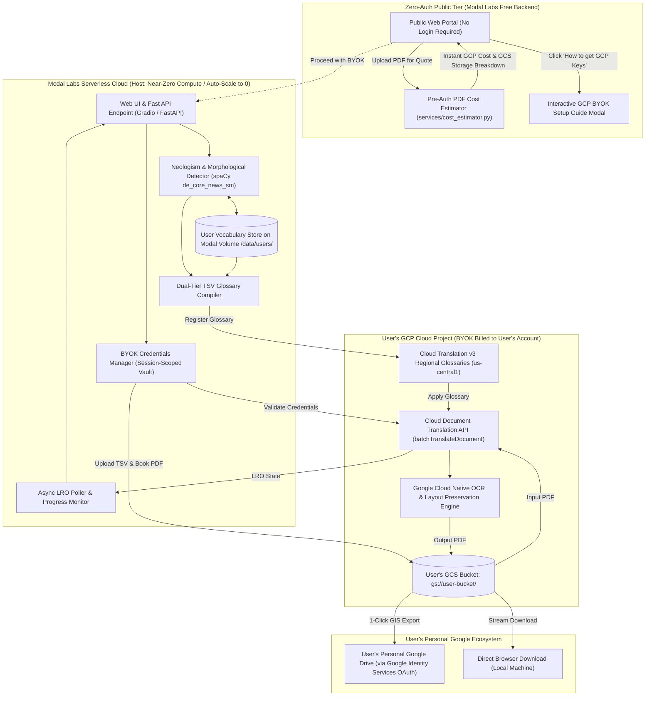
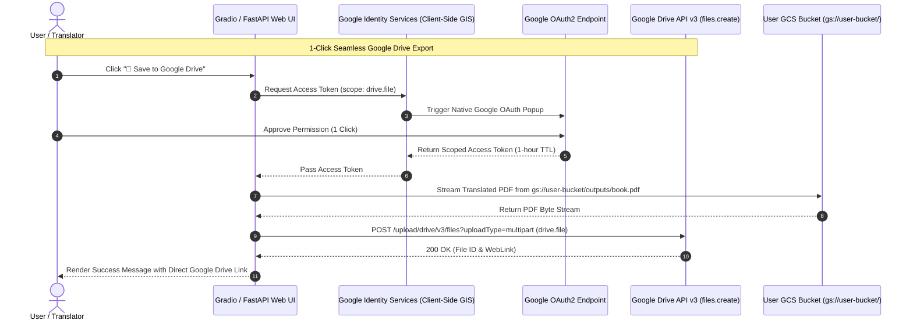

# System Design: Google Cloud Document Translation & Neologism Orchestration Engine

## 1. Executive Summary & Book-Scale Vision

**PhenomenalLayout** is engineered specifically for **full-length books and long-form philosophical treatises** (e.g., Ludwig Klages' *Der Geist als Widersacher der Seele*, Kantian critiques, Heideggerian texts).

Because books range from 50 to 1,000+ pages with complex multi-column layouts, footnotes, diagrams, and dense terminology, PhenomenalLayout establishes **Asynchronous Google Cloud Document Batch Translation (`batchTranslateDocument`) using Google Cloud Storage (GCS) buckets as the primary/default translation pipeline**.

PhenomenalLayout is deployed as a **serverless cloud application on Modal Labs** under a **Bring Your Own Key (BYOK)** model:
* **Zero Host Storage**: Modal Labs stores **zero** book PDF files. The source PDF and translated outputs reside exclusively in the **user's personal GCS bucket** or export directly to their **personal Google Drive**.
* **Zero Host API/Compute Cost**: Translation ($0.08/page) and GCS storage are billed directly to the user's personal GCP project. Modal Labs operates strictly within its $30/month free tier with automatic scale-to-zero.
* **Seamless Google Drive Export**: Uses native **Google Identity Services (GIS)** client-side OAuth (`drive.file` scope) for 1-click cloud export without requiring heavy third-party SaaS auth (no Auth0, no Clerk).
* **Pre-Auth Zero-Credential Cost Estimator**: Calculates translation costs and monthly GCS retention schedules within a $\pm \$5.00$ tolerance margin before login.

---

## 2. Compute Topology & Division of Labor (Modal Labs vs. User GCP Project)



### 2.1 Workload & Storage Allocation Matrix

| Workload Component | Host Layer | Storage Location | Cost & Scaling Model |
| :--- | :--- | :--- | :--- |
| **Pre-Auth Cost Estimator** | Modal Labs Web Endpoint | Zero storage (ephemeral in-memory inspect) | Executes in < 500ms on Modal CPU. No login or GCP key needed. |
| **BYOK Setup Walkthrough Modal** | Modal Labs Web Endpoint | Zero storage (rendered client-side) | Zero compute overhead. |
| **Web Interface & API** | Modal Labs Web Endpoint | Ephemeral container | Auto-scales down to 0 when idle (< $2–$5/mo of Modal's $30 free tier). |
| **Neologism Pre-Scanning & Parsing** | Modal CPU Worker | Ephemeral RAM (< 256MB) | ~2–5 seconds CPU burst per chapter. |
| **User Account & Vocabulary Store** | Modal Persistent Volume | Modal Volume (`/data/user_profiles/`) | Tiny SQLite/JSON store (< 5MB total). |
| **Source Book PDF & Glossaries** | User's GCP Project | User's GCS Bucket (`gs://<user_bucket>/inputs/`) | Billed directly to User's GCP account (~$0.02/GB/mo; 5GB free tier). Host stores 0 MB. |
| **Translated Book PDF** | User's GCP Project | User's GCS Bucket (`gs://<user_bucket>/outputs/`) | Billed directly to User's GCP account (~$0.02/GB/mo). Host stores 0 MB. |
| **Google Drive Delivery** | Google Drive v3 API | User's Personal Google Drive | Direct client/GCS stream to user's Drive. Zero host storage or bandwidth cost. |
| **Document Translation & OCR** | User's GCP Project | Google Cloud Document API | Billed directly to User's GCP billing account ($0.08/page). |
| **LRO Progress Monitoring** | Modal Async Worker | Ephemeral state | Near-zero CPU overhead while waiting for GCP LRO completion. |

---

## 3. Pre-Auth Zero-Credential GCP Translation & Storage Cost Estimator

### 3.1 Pricing Schedule & Google Cloud Storage (GCS) Cost Rules

Google Cloud Platform pricing for Document Translation and Storage consists of:
1. **Document Translation Rate**: Flat **$0.080 per page** for native and scanned PDF layouts.
2. **GCS "Always Free" Tier**: Google Cloud provides **5 GB-months of Standard Storage free of charge** in US multi-regions/regions (`us-central1`, `us-east1`, `us-west1`).
3. **Paid GCS Storage Tiers (Beyond 5 GB free limit)**:
   * Standard Regional Storage: **$0.020 per GB / month** (or ~$0.00067 / GB / day).
   * Archive Storage (Long-Term Archival): **$0.0012 per GB / month** (or ~$0.0144 / GB / year).

### 3.2 Estimation Formula & Monthly Retention Schedule

A 200–500 page book PDF is typically 15 MB to 50 MB in file size.

The **`GCPCostEstimator`** calculates:
$$\text{Base Translation Cost} = N_{\text{billable\_pages}} \times \$0.080$$
$$\text{1-Month GCS Retention Cost} = \left(\frac{\text{File Size MB} \times 2}{1024}\right) \times \$0.020 \approx \$0.0006 \text{ to } \$0.0019 / \text{month}$$
$$\text{12-Month GCS Archival Cost} = \left(\frac{\text{File Size MB} \times 2}{1024}\right) \times \$0.0012 \times 12 \approx \$0.0004 \text{ to } \$0.0014 / \text{year}$$

### 3.3 Quote Presentation & Precision ($\le \pm \$5.00$ Margin of Error)

The cost estimator outputs an itemized breakdown:
* **Translation Cost**: $N_{\text{pages}} \times \$0.080$ (e.g. 350 pages = **$28.00**).
* **Storage Cost**: **$0.00** (Covered under GCP Always Free 5 GB tier; or $< \$0.01/\text{month}$ beyond).
* **Total Expected GCP Budget**: **$28.00 – $28.50** (Variance strictly within $\pm \$5.00$).

---

## 4. Seamless Personal Google Drive Export Subsystem

### 4.1 Zero-SaaS Authentication Architecture (No Auth0 / No Clerk)

Rather than introducing heavy third-party authentication middleware (Auth0, Clerk, Firebase), PhenomenalLayout implements **native client-side Google Identity Services (GIS)** OAuth 2.0 Token Flow:



### 4.2 Security & Privacy: Restricted `drive.file` Scope
* **Scope**: `https://www.googleapis.com/auth/drive.file`.
* **Privacy Guarantee**: This restricted scope grants access **strictly to create and manage files opened or created by PhenomenalLayout**. It cannot view, list, or read any existing documents, folders, or personal files in the user's Google Drive.
* **Zero Backend Credentials**: The Google Drive OAuth token is held strictly in the browser context for the duration of the export call and is never stored on the server.

---

## 5. Bring Your Own Key (BYOK) Architecture & Onboarding Walkthrough

### 5.1 Credential Ingestion & Security Model
1. **Inputs Required**:
   * **Google Cloud Project ID** (e.g. `philosophy-translation-prod`).
   * **Target GCS Bucket Name** (e.g. `gs://my-klages-translations`).
   * **GCP Service Account Key (JSON)**.
2. **Session-Scoped Isolation**:
   * Credentials are held strictly in memory for the active browser session.
   * Credentials are never logged, never exposed to other users, and never persisted to public storage.
3. **Instant Validation**:
   * Tests connectivity with a zero-cost API check (`projects.locations.glossaries.list`) to verify IAM permissions and regional endpoint availability (`us-central1`).

### 5.2 Interactive GCP Onboarding Walkthrough Modal

The BYOK panel includes a **"📖 Step-by-Step GCP Setup Guide"** modal that opens directly in the browser:

```
┌─────────────────────────────────────────────────────────────────────────────┐
│ 🚀 Google Cloud Setup Guide (Step-by-Step BYOK Walkthrough)               [X]│
├─────────────────────────────────────────────────────────────────────────────┤
│ 1️⃣  Create GCP Account & Claim Free Credits                                 │
│     • Go to console.cloud.google.com (New users receive $300 in free credit)│
│                                                                             │
│ 2️⃣  Create a Project                                                       │
│     • Click Project Selector ➔ "New Project" ➔ Name it e.g. "phenomenal-book"│
│                                                                             │
│ 3️⃣  Enable Required APIs (1-Click Link)                                    │
│     • Cloud Translation API (translate.googleapis.com)                      │
│     • Cloud Storage API (storage.googleapis.com)                            │
│                                                                             │
│ 4️⃣  Create a Cloud Storage Bucket                                          │
│     • Go to Cloud Storage ➔ Create Bucket in region 'us-central1'           │
│                                                                             │
│ 5️⃣  Create Service Account & Download JSON Key                              │
│     • Go to IAM & Admin ➔ Service Accounts ➔ "Create Service Account"       │
│     • Grant Roles:                                                          │
│       - Cloud Translation API User / Editor (roles/cloudtranslate.editor)   │
│       - Storage Object Admin (roles/storage.objectAdmin)                    │
│     • Keys tab ➔ Add Key ➔ Create New Key ➔ JSON (downloads credentials.json)│
│                                                                             │
│ 6️⃣  Upload & Validate                                                       │
│     • Drag & drop credentials.json into PhenomenalLayout and click 'Connect' │
│                                                                             │
│ ⚡ Power User? Run this 1-line gcloud script:                                │
│    curl -fsSL https://phenomenal.app/scripts/setup-gcp.sh | bash             │
└─────────────────────────────────────────────────────────────────────────────┘
```

---

## 6. User-Tied Neologism Memory & Vocabulary Persistence

Philosophical translators build specific terminology preferences over time. PhenomenalLayout introduces the **Persistent User Vocabulary Engine**:

1. **User Identity & Storage**:
   * Managed on a persistent Modal Volume: `modal.Volume.from_name("phenomenal-user-data", create_if_missing=True)`.
   * Stored under `/data/user_vocabularies/{user_id}.sqlite` or `.json`.
2. **Translation Choice Memory**:
   * Whenever a user selects a translation (e.g. `Geist` $\rightarrow$ `Spirit`, `Wirklichkeit` $\rightarrow$ `Actuality`, or `Schauung` $\rightarrow$ `[Preserve Untranslated: Schauung]`), the preference is saved to their persistent profile.
3. **Smart Auto-Populate for New Books**:
   * When the user uploads a subsequent book, the Neologism Pre-Scanner checks the user's saved vocabulary first.
   * Saved terms are automatically pre-selected in the terminology review table with high confidence, drastically reducing repetitive translator input across a multi-volume treatise.

---

## 7. Component Architecture & System Boundaries

```mermaid
classDiagram
    class GCPCostEstimator {
        +estimate_book_cost(pdf_path_or_bytes) CostQuote
        +calculate_storage_retention(file_size_mb) StorageRetentionSchedule
        +calculate_page_breakdown(pdf_path) PageBreakdown
        +get_pricing_schedule() PricingSchedule
    }

    class GoogleDriveExporter {
        +initiate_gis_auth() GISAuthClient
        +export_pdf_to_drive(access_token, file_bytes, filename, folder_name) DriveFileResult
        +get_drive_status(file_id) DriveStatus
    }

    class BYOKCredentialsManager {
        +set_credentials(user_id, project_id, gcs_bucket, sa_json) bool
        +get_client(user_id) TranslationServiceClient
        +get_storage_client(user_id) StorageClient
        +validate_gcp_access(user_id) ValidationResult
        +get_onboarding_guide() OnboardingGuideData
        +clear_session(user_id) void
    }

    class UserVocabularyStore {
        +get_user_preferences(user_id) dict
        +save_preference(user_id, term, translation, note) void
        +bulk_save_preferences(user_id, preferences_dict) void
        +export_user_dictionary(user_id) bytes
    }

    class GCPBatchTranslationService {
        +submit_batch_job(gcs_input_uri, gcs_output_uri, source_lang, target_lang, glossary_resource_name, credentials) str
        +poll_operation(operation_name, credentials) LROStatus
        +download_translated_book(gcs_output_uri, local_dest_path, credentials) Path
    }

    class GlossarySyncManager {
        +sync_base_glossary(glossary_name, terms_dict, credentials) str
        +sync_book_session_glossary(session_id, user_choices, base_glossary_name, credentials) str
        +compile_tsv(base_terms, user_terms, book_terms) bytes
        +upload_glossary_to_gcs(tsv_bytes, gcs_path, credentials) str
        +ensure_glossary_ready(glossary_resource_name, credentials) bool
        +delete_session_glossary(glossary_resource_name, credentials) bool
    }

    class NeologismDetector {
        +analyze_book_stream(pdf_path, chunk_size, user_saved_vocab) NeologismAnalysis
        +extract_candidates(text) list
        +analyze_morphology(term) MorphologicalAnalysis
        +analyze_philosophical_context(term, text) PhilosophicalContext
    }

    class BookTranslationOrchestrator {
        +pre_scan_book(user_id, book_pdf_path) BookScanResult
        +start_book_translation(user_id, book_id, session_id) JobHandle
        +get_job_progress(job_handle) JobProgress
    }

    BookTranslationOrchestrator --> BYOKCredentialsManager
    BookTranslationOrchestrator --> UserVocabularyStore
    BookTranslationOrchestrator --> NeologismDetector
    BookTranslationOrchestrator --> GlossarySyncManager
    BookTranslationOrchestrator --> GCPBatchTranslationService
    GlossarySyncManager --> GCPBatchTranslationService
```



---

## 8. Subsystem Deep-Dive

### 8.1 Subsystem 1: Book-Scale Text Ingestion & Neologism Pre-Scanning
* **Stream-Based Chunking**: Full books (100–1,000 pages) are processed in streaming chunks via `pypdf` without loading entire uncompressed page bitmaps into memory.
* **Linguistic Analysis**:
  * [`NeologismDetector`](services/neologism_detector.py) identifies German compounds, prefixes, and suffixes.
  * [`PhilosophicalContextAnalyzer`](services/philosophical_context_analyzer.py) scores term frequency, chapter distribution, and philosophical relevance.
  * Pre-populates suggestions using:
    1. User's saved preferences from `UserVocabularyStore`.
    2. Built-in domain foundation dictionary ([`config/klages_terminology.json`](config/klages_terminology.json)).
    3. Morphological root decomposition for novel coined compounds.

---

### 8.2 Subsystem 2: Dual-Tier Glossary Synchronization & Lifecycle Management
Translating books requires strict terminology consistency across thousands of paragraphs. The **Glossary Sync Manager** operates two tiers:

1. **Tier 1: Persistent Domain Glossaries (Base Tier)**
   * Static foundation dictionaries (e.g. `klages-philosophical-base-v1`) provisioned once in Google Cloud Translation in user's project (`projects/<user_proj>/locations/us-central1/glossaries/klages-philosophical-base-v1`).
   * Reused across all translations of related treatises to avoid redundant GCS uploads.

2. **Tier 2: Dynamic Book Session Glossaries (Overlay Tier)**
   * Merges Tier 1 + User Saved Vocabulary + Book-Specific Choices.
   * Compiles the mapping into a RFC 4180-compliant TSV (`source_code\ttarget_code`).
   * Stages the file in user's GCS: `gs://<user_bucket>/glossaries/sessions/<book_id>_<timestamp>.tsv`.
   * Invokes Cloud Translation v3 `create_glossary` in `us-central1` and polls until status is active.
   * Automatic TTL/cleanup policies prune transient session glossaries after job completion.

---

### 8.3 Subsystem 3: Primary Default Pipeline - Asynchronous GCS Batch Translation
Because books exceed inline API payload and timeout limits, **Asynchronous Batch Translation (`batchTranslateDocument`) is the primary, default execution engine**:

1. **Book Upload to User GCS**:
   * The source book PDF is streamed to `gs://<user_bucket>/inputs/<book_id>/source.pdf`.
2. **Batch Request Dispatch**:
   * Constructs `BatchTranslateDocumentRequest`:
     * `parent = f"projects/{user_project_id}/locations/{location}"`
     * `source_language_code = "de"`
     * `target_language_codes = ["en"]`
     * `input_configs = [{"gcs_source": {"input_uri": "gs://<user_bucket>/inputs/<book_id>/source.pdf"}, "mime_type": "application/pdf"}]`
     * `output_config = {"gcs_destination": {"output_uri_prefix": "gs://<user_bucket>/outputs/<book_id>/"}}`
     * `glossaries = {"en": {"glossary": glossary_resource_name}}`
   * Dispatches asynchronous request via `TranslationServiceClient.batch_translate_document`.
3. **Long-Running Operation (LRO) Monitoring**:
   * Tracks operation progress metadata via `BatchTranslateDocumentMetadata` (`metadata.state == SUCCEEDED`, `metadata.translated_pages / metadata.total_pages`, `metadata.failed_pages`).
   * Emits progress events to the Gradio/FastAPI interface for live chapter/page tracking.
4. **Automated Delivery & Export**:
   * Once LRO transitions to `SUCCEEDED`, the translated PDF resides safely in `gs://<user_bucket>/outputs/<book_id>/`.
   * Translators can download directly or click **"Save to Google Drive"** to export via GIS OAuth without intermediate Modal server storage.

---

## 9. Sequence Diagram: Modal BYOK Book Translation & Google Drive Export

```mermaid
sequenceDiagram
    autonumber
    actor Translator as User / Translator
    participant CostUI as Zero-Auth Cost Calculator
    participant CostEst as GCPCostEstimator (Modal)
    participant UI as Modal Web App (Gradio / FastAPI)
    participant BYOK as BYOKCredentialsManager
    participant Vocab as UserVocabularyStore (Modal Volume)
    participant Orch as BookTranslationOrchestrator
    participant UserGCS as User GCS Bucket (gs://user-bucket/)
    participant UserGCP as User Cloud Translation API v3
    participant GIS as Google Identity Services (GIS)
    participant GDrive as Google Drive API v3

    rect rgb(255, 245, 238)
    Note over Translator,CostEst: Zero-Auth Cost Quote & Retention Estimate
    Translator->>CostUI: Upload PDF (No Auth / No GCP Keys)
    CostUI->>CostEst: Inspect Page Count, File Size & Density
    CostEst-->>CostUI: Return Itemized GCP Quote ($0.08/page + GCS 5GB Free Tier status)
    CostUI-->>Translator: Display Budget Estimate (e.g. 350 pages = $28.00; Storage = $0.00)
    end

    rect rgb(240, 255, 240)
    Note over Translator,BYOK: Authenticated BYOK Session Setup
    Translator->>UI: Input GCP Project ID, GCS Bucket & Upload SA Key JSON
    UI->>BYOK: Set & Validate Credentials
    BYOK->>UserGCP: Test Connection (List Glossaries)
    UserGCP-->>BYOK: Access Confirmed (200 OK)
    BYOK-->>UI: BYOK Connected Ready
    end

    Translator->>UI: Upload Book PDF for Translation
    UI->>Vocab: Load User's Saved Terminology Preferences
    Vocab-->>Orch: Return User Neologism Dictionary
    UI->>Orch: Submit Book for Pre-Scan & Translation Job
    
    rect rgb(255, 250, 240)
    Note over Orch,UserGCP: Primary Asynchronous Batch Translation (Stored in User GCS)
    Orch->>UserGCS: Upload Book to gs://user-bucket/inputs/book_101/source.pdf
    Orch->>UserGCP: batchTranslateDocument(inputs, output_prefix)
    UserGCP-->>Orch: Return LRO Operation
    
    loop Every 10s until Complete
        Orch->>UserGCP: get_operation(LRO)
        UserGCP-->>Orch: Operation Metadata (translated_pages / total_pages)
        Orch-->>UI: Update Live Progress Bar (e.g. 142/350 Pages)
    end
    
    UserGCP-->>Orch: LRO State = SUCCEEDED
    UserGCP->>UserGCS: Write output PDF to gs://user-bucket/outputs/book_101/
    end

    alt Option A: Direct Local Download
        Translator->>UI: Click "Download PDF"
        UI->>UserGCS: Stream PDF to Browser
    else Option B: Seamless Google Drive Export
        Translator->>UI: Click "📁 Save to Google Drive"
        UI->>GIS: Request OAuth Token (drive.file scope)
        Translator->>GIS: Approve 1-Click Popup
        GIS-->>UI: Token Granted
        UI->>GDrive: Stream PDF from GCS to Google Drive
        GDrive-->>Translator: File Saved in Google Drive (Direct Link)
    end
```

---

## 10. Modal Labs Serverless Deployment Architecture

```python
# modal_app.py architecture outline
import modal

app = modal.App("phenomenallayout")
volume = modal.Volume.from_name("phenomenal-user-data", create_if_missing=True)

image = (
    modal.Image.debian_slim(python_version="3.11")
    .pip_install(
        "fastapi",
        "uvicorn",
        "gradio",
        "pypdf>=6.14.0",
        "google-cloud-translate>=3.15.0",
        "google-cloud-storage>=2.14.0",
        "spacy>=3.7.0",
        "pydantic>=2.10.0",
    )
    .run_commands("python -m spacy download de_core_news_sm")
)

@app.function(
    image=image,
    volumes={"/data": volume},
    timeout=3600,
    scaledown_window=300,
)
@modal.asgi_app()
def web_entrypoint():
    from app import create_app
    return create_app()
```

---

## 11. Configuration & Environment Variables

| Variable | Description | Source / Scope |
| :--- | :--- | :--- |
| `MODAL_VOLUME_PATH` | Path for persistent user profiles and vocabularies | Modal Container (`/data`) |
| `GCP_DOC_TRANSLATION_PRICE_PER_PAGE` | Flat GCP Document Translation rate per page | Constant (`0.080`) |
| `GCS_STANDARD_STORAGE_PER_GB_MO` | Rate per GB per month for standard storage | Constant (`0.020`) |
| `GCS_ALWAYS_FREE_STORAGE_GB` | Monthly free storage allowance in US region | Constant (`5.0`) |
| `GOOGLE_DRIVE_OAUTH_CLIENT_ID` | OAuth2 Client ID for Google Identity Services | Public Client Setting |
| `GCP_LOCATION` | Regional endpoint for Translation & Glossaries | User Config (`us-central1`) |
| `BATCH_POLL_INTERVAL_SEC`| Interval in seconds for checking batch LRO status | System Default (`10s`) |
| `MAX_INLINE_PREVIEW_PAGES`| Max pages allowed for synchronous sample previews | System Default (`3`) |
| `USER_BYOK_PROJECT_ID` | Google Cloud Project ID | User BYOK Input |
| `USER_BYOK_BUCKET` | Google Cloud Storage Bucket Name | User BYOK Input |
| `USER_BYOK_CREDENTIALS` | Google Service Account Key JSON | User BYOK Input / Vault |
