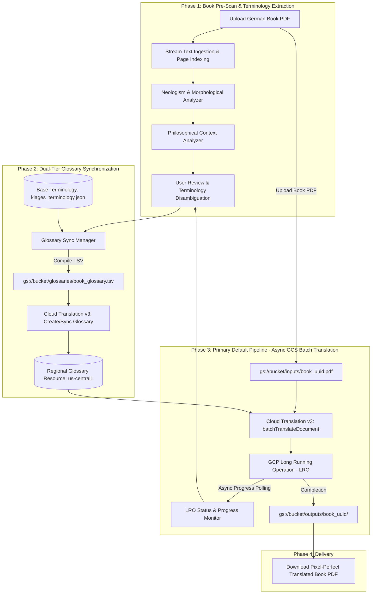
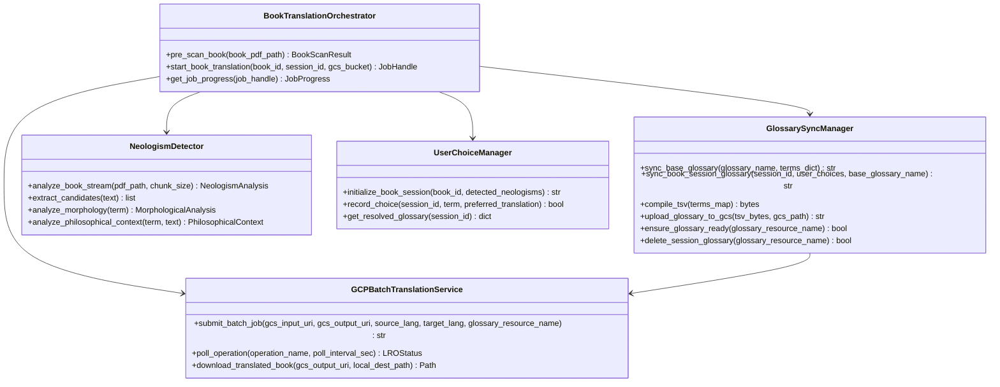
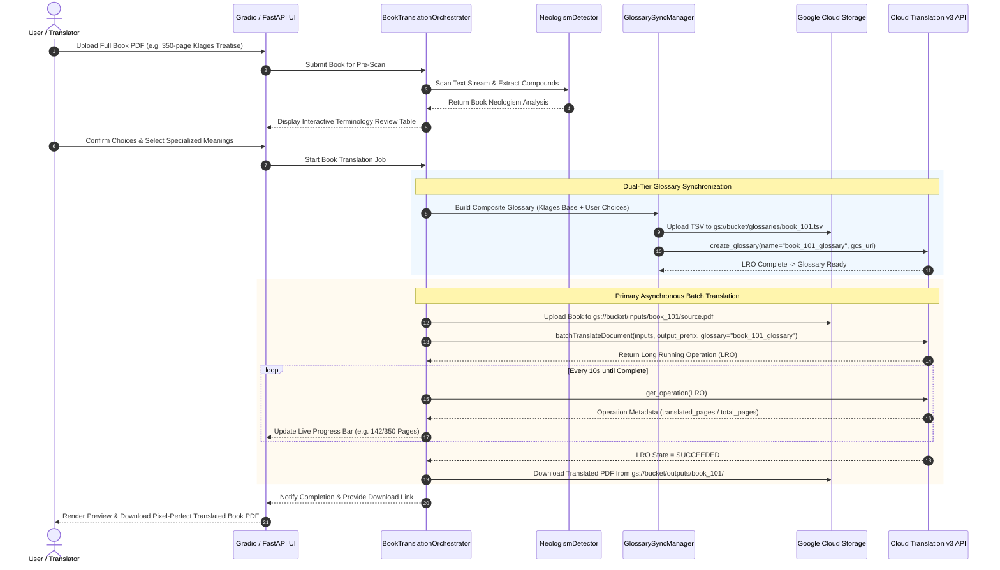

# System Design: Google Cloud Document Translation & Neologism Orchestration Engine

## 1. Executive Summary & Book-Scale Vision

**PhenomenalLayout** is engineered specifically for **full-length books and long-form philosophical treatises** (e.g., Ludwig Klages' *Der Geist als Widersacher der Seele*, Kantian critiques, Heideggerian texts).

Because books range from 50 to 1,000+ pages with complex multi-column layouts, footnotes, diagrams, and dense terminology, PhenomenalLayout establishes **Asynchronous Google Cloud Document Batch Translation (`batchTranslateDocument`) using Google Cloud Storage (GCS) buckets as the primary/default translation pipeline**.

PhenomenalLayout couples this industrial translation pipeline with a **Persistent & Dynamic Glossary Sync Subsystem** and a **German Philosophical Neologism Detection Engine** to ensure unbroken formatting, image/table preservation, and consistent terminology throughout an entire book.

---

## 2. Architectural Evolution

### 2.1 Legacy vs. Book-Scale Cloud Target



---

## 3. Component Architecture & System Boundaries



---

## 4. Subsystem Deep-Dive

### 4.1 Subsystem 1: Book-Scale Text Ingestion & Neologism Pre-Scanning
* **Stream-Based Chunking**: Full books (100–1,000 pages) are processed in streaming chunks via `pypdf` without loading entire uncompressed page bitmaps into memory.
* **Linguistic Analysis**:
  * [`NeologismDetector`](services/neologism_detector.py) identifies German compounds, prefixes, and suffixes.
  * [`PhilosophicalContextAnalyzer`](services/philosophical_context_analyzer.py) scores term frequency, chapter distribution, and philosophical relevance.
  * Terms already present in the pre-compiled domain dictionary ([`klages_terminology.json`](config/klages_terminology.json)) are flagged as standard, while novel coined compounds are surfaced for translator review.

---

### 4.2 Subsystem 2: Dual-Tier Glossary Synchronization & Lifecycle Management
Translating books requires strict terminology consistency across thousands of paragraphs. The **Glossary Sync Manager** operates two tiers:

1. **Tier 1: Persistent Domain Glossaries (Base Tier)**
   * Static foundation dictionaries (e.g. `klages-philosophical-base-v1`) provisioned once in Google Cloud Translation (e.g., `projects/<proj>/locations/us-central1/glossaries/klages-philosophical-base-v1`).
   * Reused across all translations of related treatises to avoid redundant GCS upload and glossary provisioning calls.

2. **Tier 2: Dynamic Book Session Glossaries (Overlay Tier)**
   * When a translator customizes translations for a specific book, the system creates a composite glossary merging Tier 1 with user-approved neologisms.
   * Compiles the mapping into a RFC 4180-compliant TSV (`source_code\ttarget_code`).
   * Stages the file in GCS: `gs://<gcp_glossary_bucket>/glossaries/<book_id>_<timestamp>.tsv`.
   * Invokes Cloud Translation v3 `create_glossary` in `us-central1` and polls until status is active.
   * Automatic TTL/cleanup policies prune transient book glossaries after job completion while preserving base glossaries.

---

### 4.3 Subsystem 3: Primary Default Pipeline - Asynchronous GCS Batch Translation
Because books exceed inline API payload and timeout limits, **Asynchronous Batch Translation (`batchTranslateDocument`) is the primary, default execution engine**:

1. **Book Upload to GCS**:
   * The source book PDF is streamed to `gs://<bucket>/inputs/<book_id>/source.pdf`.
2. **Batch Request Dispatch**:
   * Constructs `BatchTranslateDocumentRequest`:
     * `parent = f"projects/{project_id}/locations/{location}"`
     * `source_language_code = "de"`
     * `target_language_codes = ["en"]`
     * `input_configs = [{"gcs_source": {"input_uri": "gs://<bucket>/inputs/<book_id>/source.pdf"}, "mime_type": "application/pdf"}]`
     * `output_config = {"gcs_destination": {"output_uri_prefix": "gs://<bucket>/outputs/<book_id>/"}}`
     * `glossaries = {"en": {"glossary": glossary_resource_name}}`
   * Dispatches asynchronous request via `TranslationServiceClient.batch_translate_document`.
3. **Long-Running Operation (LRO) Monitoring**:
   * Tracks operation progress metadata via `BatchTranslateDocumentMetadata` (`metadata.state == SUCCEEDED`, `metadata.translated_pages / metadata.total_pages`, `metadata.failed_pages`).
   * Emits progress events to the Gradio/FastAPI interface for live chapter/page tracking.
4. **Automated Fetch & Validation**:
   * Once LRO transitions to `SUCCEEDED` (or `done == True`), downloads the translated PDF from `gs://<bucket>/outputs/<book_id>/` to local cache.
   * Runs validation check ensuring page count matches and PDF structure is intact.

*(Note: Synchronous `translateDocument` is retained purely as an optional rapid preview tool for single sample pages).*

---

## 5. Sequence Diagram: Book Translation Lifecycle



---

## 6. GCS Bucket Structure & Storage Lifecycle

```
gs://<GCP_TRANSLATION_BUCKET>/
├── glossaries/
│   ├── base/
│   │   └── klages_philosophical_base.tsv       <-- Persistent Tier 1
│   └── sessions/
│       └── <book_uuid>_<timestamp>.tsv         <-- Dynamic Tier 2 (TTL: 7 days)
├── inputs/
│   └── <book_uuid>/
│       └── source.pdf                          <-- Staged Book PDF (TTL: 7 days)
└── outputs/
    └── <book_uuid>/
        └── source_de_en.pdf                    <-- Completed Translation (TTL: 7 days)
```

---

## 7. Configuration & Environment Variables

| Variable | Description | Default |
| :--- | :--- | :--- |
| `GCP_PROJECT_ID` | Google Cloud Project ID | Required |
| `GCP_LOCATION` | Regional endpoint for Translation & Glossaries | `us-central1` |
| `GCP_TRANSLATION_BUCKET` | Dedicated GCS bucket for staging books & glossaries | Required |
| `GCP_BASE_GLOSSARY_ID` | Resource ID for persistent philosophical base glossary | `klages-philosophical-base-v1` |
| `BATCH_POLL_INTERVAL_SEC`| Interval in seconds for checking batch LRO status | `10` |
| `MAX_INLINE_PREVIEW_PAGES`| Max pages allowed for synchronous sample previews | `3` |
